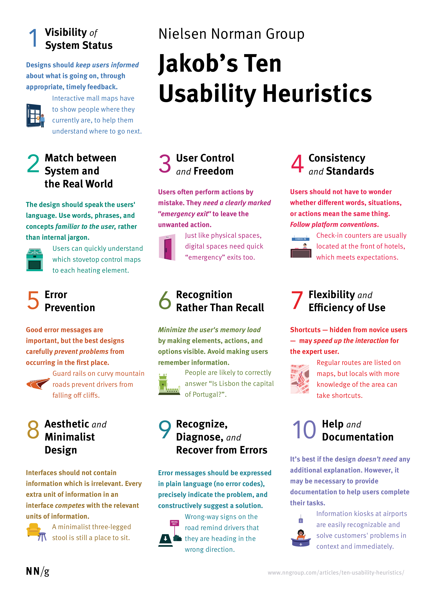
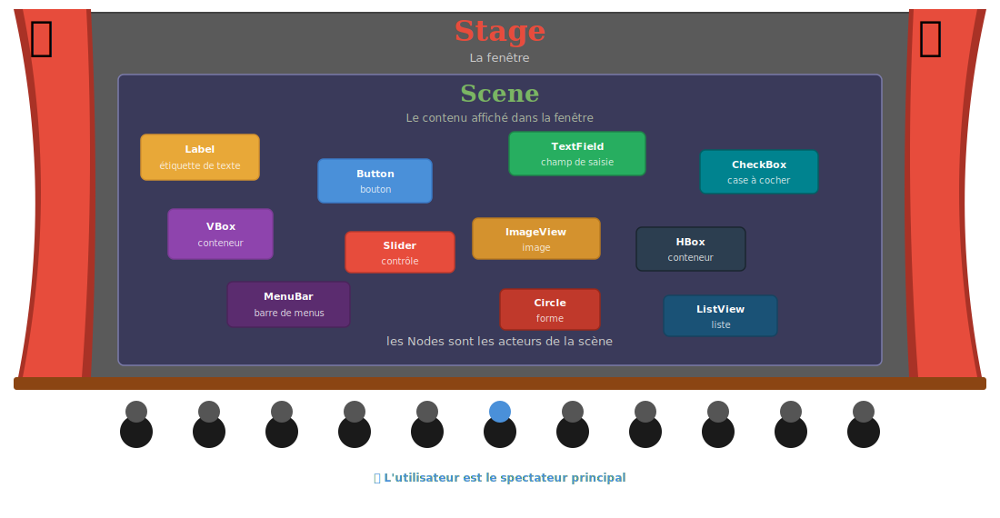
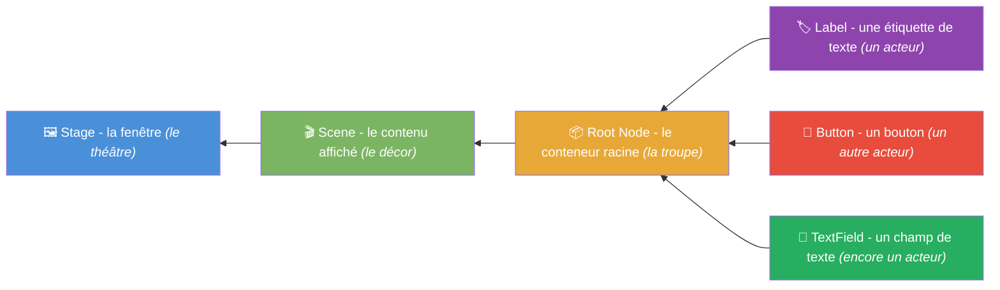
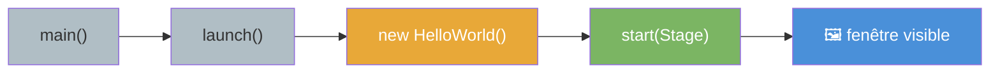
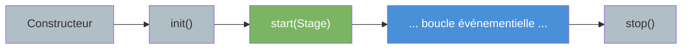
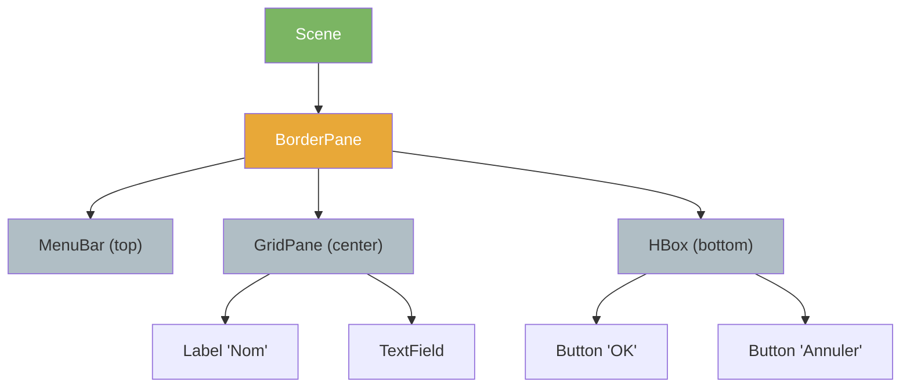
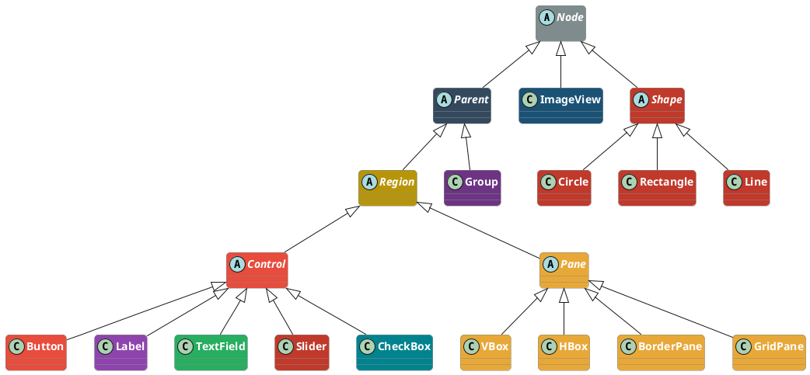
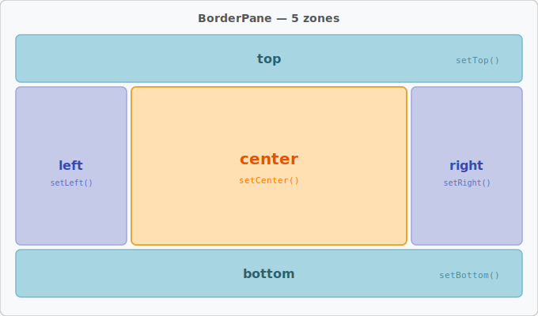

<!-- _class: lead -->
<!-- _header: "" -->

<!-- _footer: "" -->
<!-- _paginate: false -->

<style scoped>
section {
  background-image: url('assets/logo-amu.png');
  background-repeat: no-repeat;
  background-position: bottom 40px center;
  background-size: 380px;
}
</style>

# Fondations de l'IHM et première immersion JavaFX

**R2.02 - Développement d'applications avec IHM**

---

## Le module R2.02 en un coup d'oeil

<!-- _header: "" -->
<!-- _footer: "" -->

<style scoped>
blockquote { font-size: 0.92rem; }
</style>

> Apprendre à concevoir et développer des **applications avec une interface graphique** en Java (JavaFX), en intégrant les bonnes pratiques d'architecture et d'ergonomie.

<div style="display: grid; grid-template-columns: 1fr 1fr; gap: 1rem; margin-top: 1rem; font-size: 1.5rem;">
<div style="background: #4a90d9; color: white; padding: 1rem 1.2rem; border-radius: 10px;">
🖼️ <b>Composants graphiques</b><br/>Conteneurs, contrôles, graphe de scène
</div>
<div style="background: #e8a838; color: white; padding: 1rem 1.2rem; border-radius: 10px;">
⚡ <b>Modèle événementiel</b><br/>Événements, listeners, bindings
</div>
<div style="background: #27ae60; color: white; padding: 1rem 1.2rem; border-radius: 10px;">
🏗️ <b>Architecture IHM</b><br/>MVC, MVVM, séparation vue-modèle
</div>
<div style="background: #e74c3c; color: white; padding: 1rem 1.2rem; border-radius: 10px;">
📄 <b>IHM déclaratives</b><br/>FXML, CSS, SceneBuilder
</div>
<div style="background: #8e44ad; color: white; padding: 1rem 1.2rem; border-radius: 10px;">
🧠 <b>Ergonomie</b><br/>Heuristiques de Nielsen, accessibilité
</div>
<div style="background: #00838f; color: white; padding: 1rem 1.2rem; border-radius: 10px;">
💾 <b>Persistance</b><br/>JDBC, JPA, pattern DAO
</div>
</div>

---

## Organisation du module

<!-- _header: "" -->
<!-- _footer: "" -->

<div style="display: flex; gap: 0.8rem; margin-top: 1rem;">
<div style="background: #4a90d9; color: white; padding: 1.2rem; border-radius: 12px 12px 0 0; flex: 1; text-align: center;">
<div style="font-size: 1.8rem; font-weight: bold;">CM1</div>
<div style="margin-top: 0.3rem;">Fondations IHM + JavaFX</div>
</div>
<div style="background: #e8a838; color: white; padding: 1.2rem; border-radius: 12px 12px 0 0; flex: 1; text-align: center;">
<div style="font-size: 1.8rem; font-weight: bold;">CM2</div>
<div style="margin-top: 0.3rem;">Propriétés et bindings</div>
</div>
<div style="background: #27ae60; color: white; padding: 1.2rem; border-radius: 12px 12px 0 0; flex: 1; text-align: center;">
<div style="font-size: 1.8rem; font-weight: bold;">CM3</div>
<div style="margin-top: 0.3rem;">Architecture et FXML</div>
</div>
<div style="background: #8e44ad; color: white; padding: 1.2rem; border-radius: 12px 12px 0 0; flex: 1; text-align: center;">
<div style="font-size: 1.8rem; font-weight: bold;">CM4</div>
<div style="margin-top: 0.3rem;">MVVM + persistance</div>
</div>
</div>

<div style="display: flex; gap: 0.8rem; text-align: center; font-size: 1.5rem; color: #999;">
<div style="flex: 1;">↓</div>
<div style="flex: 1;">↓</div>
<div style="flex: 1;">↓</div>
<div style="flex: 1;">↓</div>
</div>

<div style="display: flex; gap: 0.8rem;">
<div style="background: #d0e2f3; color: #2c5f8a; padding: 0.8rem; border-radius: 0 0 12px 12px; flex: 1; text-align: center; font-weight: bold;">
TP1
</div>
<div style="background: #fae5c0; color: #8a6a1f; padding: 0.8rem; border-radius: 0 0 12px 12px; flex: 1; text-align: center; font-weight: bold;">
TP2
</div>
<div style="background: #c8e6c9; color: #1b5e20; padding: 0.8rem; border-radius: 0 0 12px 12px; flex: 1; text-align: center; font-weight: bold;">
TP3
</div>
<div style="background: #e1bee7; color: #5c2473; padding: 0.8rem; border-radius: 0 0 12px 12px; flex: 1; text-align: center; font-weight: bold;">
TP4 + TP5
</div>
</div>

<div style="display: flex; gap: 2rem; margin-top: 1.5rem;">
<div style="flex: 1;">

**👥 Intervenants**
- S. Nedjar, F. Flouvat, 
- S. Nabitz, S. Chtioui

</div>
<div style="flex: 1;">

**⏱️ Volume horaire** : 38h
- CM (6h) 
- TD/TP (32h)

</div>
</div>

---

## Évaluation

<!-- _header: "" -->
<!-- _footer: "" -->

Trois notes, un objectif : vérifier que vous **comprenez** ce que vous codez, pas juste que ça fonctionne.

<div style="display: flex; gap: 1.5rem; margin-top: 1rem;">
<div style="background: #4a90d9; color: white; padding: 1.8rem 1.2rem; border-radius: 12px; flex: 1; text-align: center;">
<div style="font-size: 3.5rem; margin-bottom: 0.5rem;">📝</div>
<div style="font-weight: bold; font-size: 1.5rem;">CC1</div>
<div style="margin-top: 0.5rem; opacity: 0.9;">Note d'évaluation de TP</div>
<div style="margin-top: 0.5rem; font-weight: bold; font-size: 1.2rem; background: rgba(255,255,255,0.2); border-radius: 6px; padding: 0.2rem;">coeff. 10</div>
</div>
<div style="background: #e8a838; color: white; padding: 1.8rem 1.2rem; border-radius: 12px; flex: 1; text-align: center;">
<div style="font-size: 3.5rem; margin-bottom: 0.5rem;">🤝</div>
<div style="font-weight: bold; font-size: 1.5rem;">CC2</div>
<div style="margin-top: 0.5rem; opacity: 0.9;">Participation et implication</div>
<div style="margin-top: 0.5rem; font-weight: bold; font-size: 1.2rem; background: rgba(255,255,255,0.2); border-radius: 6px; padding: 0.2rem;">coeff. 10</div>
</div>
<div style="background: #e74c3c; color: white; padding: 1.8rem 1.2rem; border-radius: 12px; flex: 1; text-align: center;">
<div style="font-size: 3.5rem; margin-bottom: 0.5rem;">💻</div>
<div style="font-weight: bold; font-size: 1.5rem;">CC3</div>
<div style="margin-top: 0.5rem; opacity: 0.9;">Mini-application JavaFX sur feuille</div>
<div style="margin-top: 0.5rem; font-weight: bold; font-size: 1.2rem; background: rgba(255,255,255,0.2); border-radius: 6px; padding: 0.2rem;">coeff. 40</div>
</div>
</div>

<div style="display: flex; height: 1.2rem; border-radius: 8px; overflow: hidden; margin-top: 1.2rem;">
<div style="background: #4a90d9; flex: 10; display: flex; align-items: center; justify-content: center; color: white; font-size: 0.7rem; font-weight: bold;">17%</div>
<div style="background: #e8a838; flex: 10; display: flex; align-items: center; justify-content: center; color: white; font-size: 0.7rem; font-weight: bold;">17%</div>
<div style="background: #e74c3c; flex: 40; display: flex; align-items: center; justify-content: center; color: white; font-size: 0.7rem; font-weight: bold;">66%</div>
</div>

---

## Environnement de travail

<!-- _header: "" -->
<!-- _footer: "" -->

Tout le module se fait sur **GitHub Codespaces** : aucune installation locale nécessaire.

<div style="display: grid; grid-template-columns: 1fr 1fr 1fr; gap: 1rem; margin-top: 1.5rem;">
<div style="background: #2c3e50; color: white; padding: 1.2rem; border-radius: 10px; text-align: center;">
<div style="font-size: 2.5rem;">☕</div>
<div style="font-weight: bold; margin-top: 0.3rem;">Java 25</div>
</div>
<div style="background: #2c3e50; color: white; padding: 1.2rem; border-radius: 10px; text-align: center;">
<div style="font-size: 2.5rem;">🎨</div>
<div style="font-weight: bold; margin-top: 0.3rem;">JavaFX 25</div>
</div>
<div style="background: #2c3e50; color: white; padding: 1.2rem; border-radius: 10px; text-align: center;">
<div style="font-size: 2.5rem;">📦</div>
<div style="font-weight: bold; margin-top: 0.3rem;">Maven</div>
</div>
<div style="background: #2c3e50; color: white; padding: 1.2rem; border-radius: 10px; text-align: center;">
<div style="font-size: 2.5rem;">🔀</div>
<div style="font-weight: bold; margin-top: 0.3rem;">Git + GitHub CLI</div>
</div>
<div style="background: #2c3e50; color: white; padding: 1.2rem; border-radius: 10px; text-align: center;">
<div style="font-size: 2.5rem;">🤖</div>
<div style="font-weight: bold; margin-top: 0.3rem;">Copilot Chat</div>
</div>
<div style="background: #2c3e50; color: white; padding: 1.2rem; border-radius: 10px; text-align: center;">
<div style="font-size: 2.5rem;">🧪</div>
<div style="font-weight: bold; margin-top: 0.3rem;">TestFX</div>
</div>
</div>

<div style="background: #2c3e50; color: white; padding: 1.2rem 2rem; border-radius: 10px; text-align: center; margin-top: 1.5rem; font-size: 1.4rem;">
🌐 Vous ouvrez un navigateur, vous codez. <b>Rien à installer, rien à configurer !</b>
</div>

---

## Workflow professionnel

<!-- _header: "" -->
<!-- _footer: "" -->

Chaque exercice suit le même cycle, identique à celui d'une équipe en entreprise :

<div style="display: flex; margin-top: 1.5rem; align-items: center;">
<div style="background: #4a90d9; color: white; padding: 1.2rem 1rem; border-radius: 12px; text-align: center; flex: 1;">
<div style="font-size: 2.5rem;">🌿</div>
<div style="font-weight: bold; font-size: 1.1rem;">Branche</div>
</div>
<div style="font-size: 2rem; color: #ccc; padding: 0 0.3rem;">→</div>
<div style="background: #2c3e50; color: white; padding: 1.2rem 1rem; border-radius: 12px; text-align: center; flex: 1;">
<div style="font-size: 2.5rem;">💻</div>
<div style="font-weight: bold; font-size: 1.1rem;">Code + Tests</div>
</div>
<div style="font-size: 2rem; color: #ccc; padding: 0 0.3rem;">→</div>
<div style="background: #e8a838; color: white; padding: 1.2rem 1rem; border-radius: 12px; text-align: center; flex: 1;">
<div style="font-size: 2.5rem;">📬</div>
<div style="font-weight: bold; font-size: 1.1rem;">Pull Request</div>
</div>
<div style="font-size: 2rem; color: #ccc; padding: 0 0.3rem;">→</div>
<div style="background: #8e44ad; color: white; padding: 1.2rem 1rem; border-radius: 12px; text-align: center; flex: 1;">
<div style="font-size: 2.5rem;">👀</div>
<div style="font-weight: bold; font-size: 1.1rem;">Review</div>
</div>
<div style="font-size: 2rem; color: #ccc; padding: 0 0.3rem;">→</div>
<div style="background: #27ae60; color: white; padding: 1.2rem 1rem; border-radius: 12px; text-align: center; flex: 1;">
<div style="font-size: 2.5rem;">✅</div>
<div style="font-weight: bold; font-size: 1.1rem;">Merge</div>
</div>
</div>

<div style="display: flex; gap: 1.5rem; margin-top: 2rem;">
<div style="flex: 1; background: #f0f4f8; padding: 1rem 1.2rem; border-radius: 10px; border-left: 4px solid #4a90d9;">
<div style="font-weight: bold;">🧩 TDD baby steps</div>
<div style="margin-top: 0.3rem;">Les tests sont livrés désactivés (<code>@Disabled</code>). Vous les activez <b>un par un</b> et implémentez le minimum pour les faire passer.</div>
</div>
<div style="flex: 1; background: #f0f4f8; padding: 1rem 1.2rem; border-radius: 10px; border-left: 4px solid #27ae60;">
<div style="font-weight: bold;">📊 Autograding</div>
<div style="margin-top: 0.3rem;">À chaque <code>push</code>, votre note est calculée automatiquement. Chaque test vert = des points en plus.</div>
</div>
</div>

---

## Lien avec la SAE 2.01

La SAE 2.01 vous demandera de créer une **interface d'extraction et manipulation de données** pour des capteurs de détection de chauve-souris.

Ce CM pose les **fondations** :
- La fenêtre (`Stage`) qui hébergera votre application
- Les conteneurs (`BorderPane`, `VBox`…) qui organiseront vos composants
- Les événements qui rendront l'interface interactive

Les CM suivants ajouteront : bindings (CM2), FXML/architecture (CM3), MVVM/persistance (CM4).

---

## Ce que vous saurez faire après ce CM

- **Expliquer** ce qu'est une IHM et pourquoi sa conception est un enjeu distinct du code
- **Décrire** le graphe de scène JavaFX (Stage, Scene, Node) et la métaphore du théâtre
- **Identifier** quel conteneur de layout utiliser selon le besoin
- **Comprendre** le modèle événementiel (pattern Observer, EventHandler)
- **Appliquer** deux heuristiques d'ergonomie (Nielsen #1 et #2) pour évaluer une interface

> *Niveau Bloom : Comprendre* - Ce CM pose les fondations conceptuelles. Le TP1 vous fera passer à la pratique.

---

<!-- _class: lead -->

# Partie 1 - Qu'est-ce qu'une IHM ?

---

## Trois interfaces, même fonctionnalité

<!-- _footer: "" -->

Trois applications qui font la même chose : **afficher la météo**.

<div style="display: flex; gap: 1.2rem; margin: 4rem 0;">
<div style="flex: 1; border: 2px solid #e74c3c; border-radius: 12px; overflow: hidden;">
<div style="background: #e74c3c; color: white; padding: 0.4rem; text-align: center; font-weight: bold;">❌ Version A</div>
<div style="padding: 1rem; background: #111; color: #0f0; font-family: monospace; font-size: 0.8rem; min-height: 100px;">
$ meteo aix<br/>
Temp: 22C<br/>
Humidite: 45%<br/>
Vent: 15km/h NW<br/>
$_
</div>
</div>
<div style="flex: 1; border: 2px solid #e8a838; border-radius: 12px; overflow: hidden;">
<div style="background: #e8a838; color: white; padding: 0.4rem; text-align: center; font-weight: bold;">⚠️ Version B</div>
<div style="padding: 1rem; background: #ff0; min-height: 100px;">
<span style="color: red; font-size: 0.7rem;">METEO</span><br/>
<button style="background: lime; border: 3px solid red; font-size: 0.6rem;">VOIR</button>
<button style="background: blue; color: blue; font-size: 0.6rem;">???</button><br/>
<span style="color: red; font-size: 0.7rem;">22° peut-être</span>
</div>
</div>
<div style="flex: 1; border: 2px solid #27ae60; border-radius: 12px; overflow: hidden;">
<div style="background: #27ae60; color: white; padding: 0.4rem; text-align: center; font-weight: bold;">✅ Version C</div>
<div style="padding: 1rem; background: #f8f9fa; min-height: 100px;">
<div style="font-size: 0.85rem; color: #333;">📍 Aix-en-Provence</div>
<div style="font-size: 1.8rem; margin: 0.3rem 0;">☀️ 22°C</div>
<div style="font-size: 0.75rem; color: #666;">💧 45% &nbsp; 💨 15 km/h</div>
</div>
</div>
</div>

<div style="margin-top: 1.5rem;">

**Question** : laquelle utiliseriez-vous au quotidien ? Pourquoi ?

</div>

→ La différence n'est pas dans le *code*, elle est dans la **conception de l'interface**.

---

## Définition

<div style="background: #2c3e50; color: white; padding: 1.2rem 1.5rem; border-radius: 12px; margin: 1rem 0; font-size: 1.15rem;">
🎯 <b>Interface Homme-Machine (IHM)</b> : le point de contact entre les capacités cognitives de <b>l'être humain</b> et la logique du <b>logiciel</b>.
</div>

Une bonne IHM ne se contente pas de "fonctionner". Elle doit être :

<div style="display: flex; gap: 1.2rem; margin: 1rem 0;">
<div style="flex: 1; background: #27ae60; color: white; padding: 1rem; border-radius: 10px; text-align: center;">
<div style="font-size: 2rem;">🎯</div>
<div style="font-weight: bold; margin-top: 0.3rem;">Efficace</div>
<div style="opacity: 0.9; margin-top: 0.2rem;">L'utilisateur atteint son objectif</div>
</div>
<div style="flex: 1; background: #4a90d9; color: white; padding: 1rem; border-radius: 10px; text-align: center;">
<div style="font-size: 2rem;">⚡</div>
<div style="font-weight: bold; margin-top: 0.3rem;">Efficiente</div>
<div style="opacity: 0.9; margin-top: 0.2rem;">Avec un effort minimal</div>
</div>
<div style="flex: 1; background: #e8a838; color: white; padding: 1rem; border-radius: 10px; text-align: center;">
<div style="font-size: 2rem;">😊</div>
<div style="font-weight: bold; margin-top: 0.3rem;">Satisfaisante</div>
<div style="opacity: 0.9; margin-top: 0.2rem;">L'expérience est agréable</div>
</div>
</div>

Ce cours ne porte pas sur **comment afficher un bouton** mais sur **comment concevoir une interface qui sert l'utilisateur**.

---

## Brève histoire des interfaces

<!-- _header: "" -->
<!-- _footer: "" -->

<style scoped>
table { font-size: 0.82rem; }
p { font-size: 0.88rem; }
</style>

| Époque | 🖥️ Paradigme | 💡 Caractéristique |
|---|---|---|
| **1970** | ⌨️ **CLI** - Ligne de commande | Efficace mais exigeant. L'utilisateur s'adapte à la machine. |
| **1984** | 🖱️ **GUI** - Interfaces graphiques | Macintosh, Windows, X11. La machine s'adapte à l'utilisateur. |
| **2007** | 📱 **Tactile** - Smartphones | iPhone, gestes multi-touch. L'interaction devient physique. |
| **2023** | 🤖 **Spatial / IA** | Vision Pro, assistants vocaux. L'interface disparaît. |

Chaque transition a été motivée par une meilleure compréhension des **besoins humains**, pas par la technologie seule.

---

## Les trois piliers d'un cours d'IHM
<!-- _header: "" -->
<!-- _footer: "" -->

<style scoped>
section { display: flex; flex-direction: column; }
section > h2 { flex: 0; }
section > p { flex: 0; }
</style>

<div style="display: flex; justify-content: center; gap: 2rem; flex: 1; margin-top: 1rem;">
<div style="background: #1a5276; color: white; padding: 2rem 1.5rem; border-radius: 16px; text-align: center; flex: 1; display: flex; flex-direction: column; justify-content: center; box-shadow: 0 4px 10px rgba(0,0,0,0.15);">
<div style="font-size: 4.5rem;">🏗️</div>
<div style="font-weight: bold; font-size: 1.6rem; margin-top: 0.8rem;">Architecture</div>
<div style="font-size: 1.1rem; opacity: 0.9; margin-top: 0.5rem;">Comment organiser le code</div>
</div>
<div style="background: #27ae60; color: white; padding: 2rem 1.5rem; border-radius: 16px; text-align: center; flex: 1; display: flex; flex-direction: column; justify-content: center; box-shadow: 0 4px 10px rgba(0,0,0,0.15);">
<div style="font-size: 4.5rem;">🧠</div>
<div style="font-weight: bold; font-size: 1.6rem; margin-top: 0.8rem;">Ergonomie</div>
<div style="font-size: 1.1rem; opacity: 0.9; margin-top: 0.5rem;">Comment servir l'utilisateur</div>
</div>
<div style="background: #e8a838; color: white; padding: 2rem 1.5rem; border-radius: 16px; text-align: center; flex: 1; display: flex; flex-direction: column; justify-content: center; box-shadow: 0 4px 10px rgba(0,0,0,0.15);">
<div style="font-size: 4.5rem;">⚡</div>
<div style="font-weight: bold; font-size: 1.6rem; margin-top: 0.8rem;">Événements</div>
<div style="font-size: 1.1rem; opacity: 0.9; margin-top: 0.5rem;">Comment réagir aux actions</div>
</div>
</div>

Ces trois piliers seront développés tout au long des 4 CM du module.

---

## Les trois piliers : déclinaison dans les CM
<!-- _header: "" -->
<!-- _footer: "" -->

| CM | 🏗️ Architecture | 🧠 Ergonomie | ⚡ Événements |
|---|---|---|---|
| **CM1** | Premières notions | Nielsen #1, #2 + Gestalt | Observer, EventHandler |
| **CM2** | Source unique de vérité | Affordance, feedback | Propagation, bindings |
| **CM3** | MVC / MVVM | Fitts, Hick, WCAG | FXML + Controller |
| **CM4** | MVVM complet | Prévention d'erreurs | Validation réactive |

<div style="background: #2c3e50; color: white; padding: 0.8rem 1.5rem; border-radius: 10px; margin-top: 1rem; text-align: center;">
💡 Chaque CM approfondit les trois piliers <b>en parallèle</b>. Les principes de conception accompagnent chaque concept technique.
</div>

---

## 🧠 Ergonomie : les heuristiques de Nielsen

<div style="display: flex; gap: 2rem; align-items: flex-start;">
<div>

Jakob Nielsen a identifié **10 heuristiques d'utilisabilité** 🔟 (1994), toujours d'actualité plus de 30 ans plus tard. Ce sont des **principes généraux**, pas des règles rigides. Ils s'appliquent à toute interface, pas seulement au logiciel.

Chaque heuristique est illustrée par un exemple de la **vie courante** 🌍 pour montrer que ces principes sont universels.

Nous allons les parcourir toutes les dix 👇.

</div>
<div style="min-width: 160px; max-width: 180px; text-align: center;">

[](https://www.nngroup.com/articles/ten-usability-heuristics/#poster)

<small>*[Posters NN/g](https://www.nngroup.com/articles/ten-usability-heuristics/#poster)*</small>

</div>
</div>

---

## 🧠 Nielsen #1 - Visibilité de l'état du système


> Le système doit toujours **informer l'utilisateur** de ce qui se passe, par un feedback approprié dans un délai raisonnable.

<div style="display: flex; gap: 2rem; align-items: flex-start; margin: 0.8rem 0;">
<div style="font-size: 3.5rem; text-align: center; min-width: 80px;">📍</div>
<div>

**Dans la vie** : le plan **"Vous êtes ici"** dans un centre commercial. Sans lui, vous êtes perdu. Avec lui, vous savez où vous êtes et où aller.

**En IHM** : barre de progression d'un checkout (étape 2/4), titre de fenêtre reflétant le document ouvert, feedback tactile quand on appuie sur un bouton de smartphone.

</div>
</div>

**✏️ Tips** : communiquer *clairement* l'état - aucune action à conséquence sans informer l'utilisateur. Présenter le feedback le plus *vite* possible. Des interactions prévisibles créent la **confiance**.

---

## 🧠 Nielsen #2 - Correspondance avec le monde réel


> Le système doit parler le **langage de l'utilisateur**, avec des mots et concepts familiers plutôt que du jargon interne.

<div style="display: flex; gap: 2rem; align-items: flex-start; margin: 0.8rem 0;">
<div style="font-size: 3.5rem; text-align: center; min-width: 80px;">🔥</div>
<div>

**Dans la vie** : les boutons d'une **plaque de cuisson** sont disposés dans le même arrangement que les plaques. Pas besoin de notice. Le mapping physique est immédiat.

**En IHM** : dire "voiture" si l'utilisateur pense "voiture", pas "automobile". Utiliser l'icône 🛒 pour un panier d'achat - c'est la même fonction que dans le monde réel.

</div>
</div>

**✏️ Tips** : ne jamais *supposer* que votre vocabulaire est celui de vos utilisateurs. La recherche utilisateur révèle leur terminologie et leur **modèle mental**.

---

## 🧠 Nielsen #3 - Liberté et contrôle de l'utilisateur


> Les utilisateurs font souvent des erreurs. Ils ont besoin d'une **"sortie de secours"** clairement identifiée pour quitter l'action non voulue.

<div style="display: flex; gap: 2rem; align-items: flex-start; margin: 0.8rem 0;">
<div style="font-size: 3.5rem; text-align: center; min-width: 80px;">🚪</div>
<div>

**Dans la vie** : les **panneaux EXIT** lumineux dans les bâtiments. Toujours visibles, toujours accessibles, et ils permettent de sortir sans procédure complexe.

**En IHM** : `Ctrl+Z` (undo/redo), bouton "Annuler" dans une boîte de dialogue, croix pour fermer. L'utilisateur ne s'engage jamais dans un processus irréversible sans le vouloir.

</div>
</div>

**✏️ Tips** : supporter *Undo* et *Redo*. Montrer clairement comment *quitter* l'interaction en cours. La sortie doit être **étiquetée** et facile à trouver.

---

## 🧠 Nielsen #4 - Cohérence et standards


> L'utilisateur ne devrait pas avoir à se demander si des mots, situations ou actions différents **signifient la même chose**.

<div style="display: flex; gap: 2rem; align-items: flex-start; margin: 0.8rem 0;">
<div style="font-size: 3.5rem; text-align: center; min-width: 80px;">🏨</div>
<div>

**Dans la vie** : dans tous les hôtels du monde, la **réception est à l'entrée**. Vous ne la cherchez jamais. C'est une convention universelle que chaque hôtel respecte.

**En IHM** : même design system pour toute une famille de produits (*cohérence interne*). Suivre les conventions de la plateforme - menu "Fichier" à gauche, liens soulignés (*cohérence externe*).

</div>
</div>

**✏️ Tips** : vos utilisateurs passent la majorité de leur temps sur *d'autres* produits que le vôtre (loi de Jakob). Rompre la cohérence augmente leur **charge cognitive**.

---

## 🧠 Nielsen #5 - Prévention des erreurs


> Mieux vaut **prévenir** les erreurs que produire de bons messages d'erreur.

<div style="display: flex; gap: 2rem; align-items: flex-start; margin: 0.8rem 0;">
<div style="font-size: 3.5rem; text-align: center; min-width: 80px;">🛡️</div>
<div>

**Dans la vie** : les **glissières de sécurité** sur les routes de montagne. Elles empêchent la voiture de tomber dans le ravin, plutôt que de mettre un panneau en bas de la falaise.

**En IHM** : page de confirmation avant paiement (relire les détails du vol). Griser les dates indisponibles dans un calendrier. Proposer des valeurs par défaut raisonnables.

</div>
</div>

**✏️ Tips** : deux types d'erreurs - les *lapsus* (inattention) et les *erreurs* (incompréhension). Prioriser la prévention des erreurs **coûteuses** en premier.

---

## 🧠 Nielsen #6 - Reconnaissance plutôt que rappel


> Rendre les éléments visibles. L'utilisateur ne devrait pas avoir à **se souvenir** d'informations d'un écran à l'autre.

<div style="display: flex; gap: 2rem; align-items: flex-start; margin: 0.8rem 0;">
<div style="font-size: 3.5rem; text-align: center; min-width: 80px;">🏰</div>
<div>

**Dans la vie** : "Lisbonne est-elle la capitale du Portugal ?" est plus facile que "Quelle est la capitale du Portugal ?". **Reconnaître** demande moins d'effort que **se rappeler**.

**En IHM** : tableaux comparatifs (on voit les différences côte à côte). Requête de recherche affichée au-dessus des résultats. Menus plutôt que lignes de commande.

</div>
</div>

**✏️ Tips** : offrir l'aide **en contexte** plutôt qu'un long tutoriel à mémoriser. Réduire la quantité d'informations que l'utilisateur doit retenir.

---

## 🧠 Nielsen #7 - Flexibilité et efficacité


> Les **raccourcis**, invisibles pour les novices, accélèrent l'interaction pour les experts. Permettre la personnalisation.

<div style="display: flex; gap: 2rem; align-items: flex-start; margin: 0.8rem 0;">
<div style="font-size: 3.5rem; text-align: center; min-width: 80px;">🗺️</div>
<div>

**Dans la vie** : un **plan de ville** montre l'itinéraire principal, mais les habitants connaissent des raccourcis. Les deux coexistent sans se gêner.

**En IHM** : débutant → menu "Édition → Copier" ; expert → `Ctrl+C`. Double-tap pour "liker" sur Instagram (raccourci tactile). Personnalisation de la barre d'outils.

</div>
</div>

**✏️ Tips** : proposer des *accélérateurs* (raccourcis clavier, gestes). Permettre la *personnalisation* pour que chaque utilisateur adapte l'outil à sa pratique.

---

## 🧠 Nielsen #8 - Design esthétique et minimaliste


> Chaque information en trop dans une interface **entre en compétition** avec les informations utiles et diminue leur visibilité.

<div style="display: flex; gap: 2rem; align-items: flex-start; margin: 0.8rem 0;">
<div style="font-size: 3.5rem; text-align: center; min-width: 80px;">🫖</div>
<div>

**Dans la vie** : une **théière ornementale** - anse inconfortable, bec impossible à nettoyer. Le superflu nuit à la fonction. Une théière simple est plus agréable à utiliser.

**En IHM** : une interface surchargée augmente le coût d'interaction. Une interface organisée le réduit. Devise : **"communiquer, pas décorer"**.

</div>
</div>

**✏️ Tips** : garder le contenu et le design focalisés sur l'**essentiel**. Ne pas laisser les éléments décoratifs distraire de l'information utile. *Prioriser* ce qui soutient l'objectif de l'utilisateur.

---

## 🧠 Nielsen #9 - Aider à reconnaître et corriger les erreurs


> Les messages d'erreur doivent être en **langage clair** (pas de codes), indiquer précisément le problème et **suggérer une solution**.

<div style="display: flex; gap: 2rem; align-items: flex-start; margin: 0.8rem 0;">
<div style="font-size: 3.5rem; text-align: center; min-width: 80px;">⛔</div>
<div>

**Dans la vie** : un panneau **"Sens interdit"** sur la route. Il vous dit clairement que vous allez dans la mauvaise direction et vous demande de vous arrêter. Pas un code cryptique.

**En IHM** : page "Pas de connexion internet" avec des étapes pour résoudre. "Aucun résultat pour 'ours en peluche' - essayez ces suggestions". Utiliser du texte rouge en gras pour attirer l'attention.

</div>
</div>

**✏️ Tips** : utiliser les codes visuels traditionnels (rouge, gras). Dire ce qui s'est passé en langage *compréhensible*. Offrir un **raccourci vers la solution**.

---

## 🧠 Nielsen #10 - Aide et documentation


> Idéalement, le système **n'a pas besoin d'explication**. Mais si nécessaire, l'aide doit être facile à trouver et orientée vers la tâche.

<div style="display: flex; gap: 2rem; align-items: flex-start; margin: 0.8rem 0;">
<div style="font-size: 3.5rem; text-align: center; min-width: 80px;">ℹ️</div>
<div>

**Dans la vie** : les **bornes d'information** dans les aéroports. Facilement repérables, placées où on en a besoin, avec des réponses concrètes - pas un manuel de 200 pages.

**En IHM** : FAQ qui anticipe les questions fréquentes. Icônes ℹ️ qui révèlent un tooltip au survol (aide contextuelle). Copilot Chat dans votre IDE - l'aide vient à vous.

</div>
</div>

**✏️ Tips** : l'aide doit être facile à *chercher*. La présenter **en contexte**, au moment où l'utilisateur en a besoin. Lister des étapes *concrètes*.

---

<!-- _class: lead -->

# Partie 2 - JavaFX : pourquoi et comment

---

## 🏗️ D'AWT à JavaFX : 25 ans d'évolution

<!-- _footer: "" -->

<style scoped>
table { font-size: 0.87rem; }
</style>

| Époque | 🖥️ Toolkit | 💡 Caractéristique |
|---|---|---|
| 1995 | **AWT** | Composants "lourds" (natifs OS). Multi-plateforme approximatif. |
| 1998 | **Swing** | Composants "légers" (dessinés par Java). Look & Feel pluggable. |
| 2014 | **JavaFX 8** | Scene graph, CSS, FXML, animations, bindings. Intégré au JDK. |
| 2018 | **OpenJFX 11+** | Séparé du JDK, projet open source indépendant. |
| 2025 | **JavaFX 25** | ⭐ **Version actuelle**, alignée sur Java 25. |

<div style="background: #4a90d9; color: white; padding: 0.8rem 1.5rem; border-radius: 10px; margin-top: 1rem; text-align: center; font-size: 1.5rem;">
🚀 <b>Pourquoi JavaFX ?</b> Séparation vue/logique (FXML) + binding réactif (propriétés) + styling (CSS)
</div>

---

## 🏗️ La métaphore du théâtre

<!-- _footer: "" -->
<!-- _header: "" -->

<div style="display: flex; justify-content: center; align-items: center; flex: 1;">



</div>

---

## 🏗️ La métaphore du théâtre : le graphe de scène

<!-- _footer: "" -->
<!-- _header: "" -->

<style scoped>
table { font-size: 0.85rem; }
</style>

En termes techniques, cette métaphore se traduit par un **arbre d'objets** :



<div style="background: #2c3e50; color: white; padding: 0.8rem 1.5rem; border-radius: 10px; margin-top: 1rem; text-align: center; font-size: 1.5rem;">
🌳 Un noeud ne peut avoir <b>qu'un seul parent</b>. Le graphe de scène est toujours un <b>arbre</b>, jamais un graphe cyclique.
</div>

---

## 🏗️ Stage, Scene, Nodes : les trois briques

<!-- _footer: "" -->
<!-- _header: "" -->

<div style="display: flex; gap: 1.5rem; margin-top: 1.5rem;">
<div style="flex: 1; background: #4a90d9; color: white; padding: 1.5rem; border-radius: 12px;">
<div><span style="font-size: 2.8rem; vertical-align: middle;">🖼️</span> <span style="font-weight: bold; font-size: 2rem; vertical-align: middle;">Stage</span></div>
<div style="margin-top: 0.5rem; opacity: 0.9;">La <b>fenêtre</b> du système d'exploitation. On la reçoit en paramètre de la méthode <code>start(Stage primaryStage)</code></div>
</div>
<div style="flex: 1; background: #7bb563; color: white; padding: 1.5rem; border-radius: 12px;">
<div><span style="font-size: 2.8rem; vertical-align: middle;">🎬</span> <span style="font-weight: bold; font-size: 2rem; vertical-align: middle;">Scene</span></div>
<div style="margin-top: 0.5rem; opacity: 0.9;">Le <b>contenu</b> visible. On la crée et on l'attache au Stage en appelant la méthode <code>primaryStage.setScene()</code></div>
</div>
<div style="flex: 1; background: #e8a838; color: white; padding: 1.5rem; border-radius: 12px;">
<div><span style="font-size: 2.8rem; vertical-align: middle;">📦</span> <span style="font-weight: bold; font-size: 2rem; vertical-align: middle;">Nodes</span></div>
<div style="margin-top: 0.5rem; opacity: 0.9;">Les <b>éléments graphiques</b> (boutons, labels, conteneurs…), organisés en un arbre qui reflète la logique de l'IHM.</div>
</div>
</div>

---

## 🏗️ Hello World JavaFX

<!-- _footer: "" -->
<!-- _header: "" -->

L'application graphique **la plus simple possible** :

```java
public class HelloWorld extends Application {
    @Override
    public void start(Stage primaryStage) {
        Label label = new Label("Bonjour, JavaFX !");
        Scene scene = new Scene(new VBox(label), 300, 200);
        primaryStage.setTitle("Hello World");
        primaryStage.setScene(scene);
        primaryStage.show();
    }
}
```

<div style="display: flex; gap: 1.5rem; margin-top: 1rem; font-size: 1.6rem;">
<div style="flex: 1; background: #f0f4f8; padding: 0.8rem 1.2rem; border-radius: 10px; border-left: 4px solid #4a90d9;">
<b>4 lignes</b> suffisent pour afficher une fenêtre avec du texte. Tout le reste est du confort.
</div>
<div style="flex: 1; background: #f0f4f8; padding: 0.8rem 1.2rem; border-radius: 10px; border-left: 4px solid #e8a838;">
On retrouve les 3 briques : <b>Stage</b> (fenêtre), <b>Scene</b> (contenu), <b>Node</b> (Label dans un VBox).
</div>
</div>

---

## 🏗️ Comment ça démarre ?

<!-- _footer: "" -->
<!-- _header: "" -->

Le point d'entrée d'une application JavaFX :

```java
public class HelloWorld extends Application {
    @Override
    public void start(Stage primaryStage) {/* ... construire l'IHM ...*/}

    public static void main(String[] args) {
        launch(args);  // JavaFX prend le relais ici
    }
}
```



---

## 🏗️ Le cycle de vie d'une application
<!-- _footer: "" -->
<!-- _header: "" -->

`launch()` déclenche un cycle de vie géré entièrement par JavaFX :



<div style="display: flex; gap: 1.5rem; margin-top: 1rem; font-size: 1.6rem;">
<div style="flex: 1; background: #f0f4f8; padding: 0.8rem 1rem; border-radius: 10px; border-left: 4px solid #7bb563;">
<b>start(Stage)</b> est la seule méthode <b>obligatoire</b>. C'est là que vous construisez l'IHM.
</div>
<div style="flex: 1; background: #f0f4f8; padding: 0.8rem 1rem; border-radius: 10px; border-left: 4px solid #4a90d9;">
La <b>boucle événementielle</b> attend les actions de l'utilisateur (clics, saisie...) et y réagit.
</div>
<div style="flex: 1; background: #f0f4f8; padding: 0.8rem 1rem; border-radius: 10px; border-left: 4px solid #b0bec5;">
<b>init()</b> et <b>stop()</b> sont optionnels. On les utilise très rarement en TP.
</div>
</div>

---

## 🏗️ En pratique : lancer et tester avec Maven

<!-- _footer: "" -->
<!-- _header: "" -->

Dans le TP, vous n'appelez jamais `java` ni `javac` à la main. Maven s'en charge :

<div style="display: flex; gap: 1.2rem; margin-top: 1rem;">
<div style="flex: 1; background: #2c3e50; color: white; padding: 1rem 1.2rem; border-radius: 10px;">
<div style="font-size: 1.6rem; margin-bottom: 0.5rem;">🚀 <b>Lancer l'application</b></div>

```
./mvnw javafx:run
```

Démarre `App.java` (le menu principal) ou l'exercice en cours.

</div>
<div style="flex: 1; background: #2c3e50; color: white; padding: 1rem 1.2rem; border-radius: 10px;">
<div style="font-size: 1.6rem; margin-bottom: 0.5rem;">🧪 <b>Lancer les tests</b></div>

```
./mvnw test
```

Exécute tous les tests. Les `@Disabled` sont ignorés.

</div>
</div>

<div style="background: #27ae60; color: white; padding: 0.8rem 1.5rem; border-radius: 10px; margin-top: 1rem; text-align: center;">
💡 Pas besoin de compiler manuellement. <b>Maven fait tout</b> : compilation, dépendances, exécution, tests.
</div>

---

<!-- _class: lead -->

# Partie 3 - Construire le graphe de scène

---

## 🏗️ Un arbre de nœuds

<!-- _footer: "" -->
<!-- _header: "" -->

Le **graphe de scène** (scene graph) est la structure de données centrale de JavaFX. C'est un arbre où chaque nœud est un élément graphique :



**Règle** : un nœud ne peut avoir **qu'un seul parent**. Pas de cycle, pas de partage.

---

## 🏗️ Trois familles de nœuds

<!-- _footer: "" -->
<!-- _header: "" -->

<p style="font-size: 1.5rem; margin: 0.3rem 0 0.6rem 0;">Trois rôles fondamentaux structurent tout le graphe de scène : <strong>organiser</strong>, <strong>interagir</strong>, <strong>dessiner</strong>.</p>

<div style="display: flex; gap: 1.2rem; margin-top: 0.6rem;">
<div style="flex: 1; background: #e8a838; color: white; padding: 1.2rem; border-radius: 12px;">
<div style="font-size: 1.6rem; margin-bottom: 0.3rem;">📦 <b>Pane</b></div>
<div style="font-size: 1.6rem; opacity: 0.9;">Organiser la mise en page</div>
<div style="margin-top: 0.8rem; display: flex; flex-wrap: wrap; gap: 0.3rem;">
<code style="background: rgba(255,255,255,0.2); padding: 0.2rem 0.5rem; border-radius: 4px;">BorderPane</code>
<code style="background: rgba(255,255,255,0.2); padding: 0.2rem 0.5rem; border-radius: 4px;">VBox</code>
<code style="background: rgba(255,255,255,0.2); padding: 0.2rem 0.5rem; border-radius: 4px;">HBox</code>
<code style="background: rgba(255,255,255,0.2); padding: 0.2rem 0.5rem; border-radius: 4px;">GridPane</code>
</div>
</div>
<div style="flex: 1; background: #e74c3c; color: white; padding: 1.2rem; border-radius: 12px;">
<div style="font-size: 1.6rem; margin-bottom: 0.3rem;">🕹️ <b>Control</b></div>
<div style="font-size: 1.6rem; opacity: 0.9;">Interagir avec l'utilisateur</div>
<div style="margin-top: 0.8rem; display: flex; flex-wrap: wrap; gap: 0.3rem;">
<code style="background: rgba(255,255,255,0.2); padding: 0.2rem 0.5rem; border-radius: 4px;">Button</code>
<code style="background: rgba(255,255,255,0.2); padding: 0.2rem 0.5rem; border-radius: 4px;">Label</code>
<code style="background: rgba(255,255,255,0.2); padding: 0.2rem 0.5rem; border-radius: 4px;">TextField</code>
<code style="background: rgba(255,255,255,0.2); padding: 0.2rem 0.5rem; border-radius: 4px;">Slider</code>
</div>
</div>
<div style="flex: 1; background: #c0392b; color: white; padding: 1.2rem; border-radius: 12px;">
<div style="font-size: 1.6rem; margin-bottom: 0.3rem;">⭕ <b>Shape</b></div>
<div style="font-size: 1.6rem; opacity: 0.9;">Dessiner des formes</div>
<div style="margin-top: 0.8rem; display: flex; flex-wrap: wrap; gap: 0.3rem;">
<code style="background: rgba(255,255,255,0.2); padding: 0.2rem 0.5rem; border-radius: 4px;">Circle</code>
<code style="background: rgba(255,255,255,0.2); padding: 0.2rem 0.5rem; border-radius: 4px;">Rectangle</code>
<code style="background: rgba(255,255,255,0.2); padding: 0.2rem 0.5rem; border-radius: 4px;">Line</code>
</div>
</div>
</div>

<div style="display: flex; gap: 1.2rem; margin-top: 1.2rem;">
<div style="flex: 1; background: #2c3e50; color: white; padding: 0.9rem 1.2rem; border-radius: 10px; border-left: 5px solid #e8a838; font-size: 1.5rem; line-height: 1.5;">
📦 Les <strong>conteneurs</strong> <em>contiennent</em> d'autres nœuds (y compris d'autres conteneurs).
</div>
<div style="flex: 1; background: #2c3e50; color: white; padding: 0.9rem 1.2rem; border-radius: 10px; border-left: 5px solid #e74c3c; font-size: 1.5rem; line-height: 1.5;">
🍃 Les <strong>contrôles</strong> et <strong>formes</strong> sont des <em>feuilles</em> de l'arbre (pas d'enfants).
</div>
</div>

---

## 🏗️ La hiérarchie des classes JavaFX

<!-- _footer: "" -->
<!-- _header: "" -->

<p style="font-size: 1.5rem;padding:0;margin:0;">Toutes les classes du graphe de scène héritent de <code>Node</code> :</p>



---

## 🏗️ BorderPane - zones distinctes

Divise l'espace en **5 zones** nommées. Idéal pour les applications classiques (menu en haut, contenu au centre, barre d'état en bas).

<div style="display: flex; gap: 2rem; margin-top: 0.5rem; align-items: center;">
<div style="flex: 1;">

```java
BorderPane root = new BorderPane();
root.setTop(menuBar);
root.setCenter(contenu);
root.setBottom(barreEtat);
```

Chaque zone est **optionnelle**. Le `center` prend tout l'espace restant.

</div>
<div style="flex: 1;">



</div>
</div>

---

## 🏗️ VBox et HBox - empiler ou aligner

<!-- _footer: "" -->

Les deux conteneurs les plus simples : l'un empile **verticalement**, l'autre aligne **horizontalement**.

<div style="display: flex; gap: 2rem; margin-top: 0.5rem;">
<div style="flex: 1;">

**VBox** - empilement vertical :

```java
VBox vbox = new VBox(10); // 10px d'espacement
vbox.getChildren().addAll(
    label, textField, button
);
```

<div style="display: flex; flex-direction: column; gap: 0.4rem; margin-top: 0.5rem;">
<div style="background: #8e44ad; color: white; padding: 0.3rem 2rem; border-radius: 4px; text-align: center;">🏷️ Label</div>
<div style="background: #27ae60; color: white; padding: 0.3rem 2rem; border-radius: 4px; text-align: center;">📝 TextField</div>
<div style="background: #e74c3c; color: white; padding: 0.3rem 2rem; border-radius: 4px; text-align: center;">🔘 Button</div>
</div>

</div>
<div style="flex: 1;">

**HBox** - alignement horizontal :

```java
HBox hbox = new HBox(10);
hbox.getChildren().addAll(
    bouton1, bouton2, bouton3
);
```

<div style="display: flex; gap: 0.4rem; margin-top: 0.5rem;">
<div style="background: #e74c3c; color: white; padding: 0.3rem 1.2rem; border-radius: 4px;">🔘 Btn 1</div>
<div style="background: #e74c3c; color: white; padding: 0.3rem 1.2rem; border-radius: 4px;">🔘 Btn 2</div>
<div style="background: #e74c3c; color: white; padding: 0.3rem 1.2rem; border-radius: 4px;">🔘 Btn 3</div>
</div>

</div>
</div>

---

## 🏗️ GridPane - grille alignée

<!-- _footer: "" -->

Organise les enfants dans une **grille** avec des lignes et colonnes alignées. Idéal pour les **formulaires**.

<div style="display: flex; gap: 2rem; margin-top: 0.5rem;">
<div style="flex: 1;">

```java
GridPane grid = new GridPane();
grid.setHgap(10);
grid.setVgap(10);

// add(node, colonne, ligne)
grid.add(new Label("Nom :"),   0, 0);
grid.add(new TextField(),      1, 0);
grid.add(new Label("Email :"), 0, 1);
grid.add(new TextField(),      1, 1);
```

</div>
<div style="flex: 1;">

<div style="display: grid; grid-template-columns: auto 1fr; gap: 0.5rem; margin-top: 1rem;">
<div style="background: #8e44ad; color: white; padding: 0.4rem 0.8rem; border-radius: 4px; text-align: right;">🏷️ Nom :</div>
<div style="background: #27ae60; color: white; padding: 0.4rem 0.8rem; border-radius: 4px;">📝 TextField</div>
<div style="background: #8e44ad; color: white; padding: 0.4rem 0.8rem; border-radius: 4px; text-align: right;">🏷️ Email :</div>
<div style="background: #27ae60; color: white; padding: 0.4rem 0.8rem; border-radius: 4px;">📝 TextField</div>
</div>

<p style="font-size: 0.8rem; color: #999; margin-top: 0.5rem;">colonne 0 (Label) / colonne 1 (TextField)</p>

</div>
</div>

---

## 🏗️ FlowPane - flux libre

<!-- _footer: "" -->

Les enfants s'enchainent et **passent à la ligne** automatiquement quand il n'y a plus de place, comme du texte.

<div style="display: flex; gap: 2rem; margin-top: 0.5rem;">
<div style="flex: 1;">

```java
FlowPane flow = new FlowPane();
flow.setHgap(10);
flow.setVgap(10);
flow.getChildren().addAll(
    new Button("Copier"),
    new Button("Coller"),
    new Button("Couper"),
    new Button("Annuler"),
    new Button("Refaire"),
    new Button("Chercher")
);
```

</div>

<div style="flex: 1;">
<div style="border: 2px dashed #e8a838; border-radius: 8px; padding: 0.8rem; margin-top: 0; max-width: 380px; background: rgba(232,168,56,0.08);">
<div style="display: flex; flex-wrap: wrap; gap: 0.5rem;">
<div style="background: #e74c3c; color: white; padding: 0.4rem 1.2rem; border-radius: 4px;">🔘 Copier</div>
<div style="background: #e74c3c; color: white; padding: 0.4rem 1.2rem; border-radius: 4px;">🔘 Coller</div>
<div style="background: #e74c3c; color: white; padding: 0.4rem 1.2rem; border-radius: 4px;">🔘 Couper</div>
<div style="background: #e74c3c; color: white; padding: 0.4rem 1.2rem; border-radius: 4px;">🔘 Annuler</div>
<div style="background: #e74c3c; color: white; padding: 0.4rem 1.2rem; border-radius: 4px;">🔘 Refaire</div>
<div style="background: #e74c3c; color: white; padding: 0.4rem 1.2rem; border-radius: 4px;">🔘 Chercher</div>
</div>
</div>

<p style="font-size: 0.8rem; color: #999; margin-top: 0.3rem;">↑ le cadre montre la largeur du FlowPane - les boutons passent à la ligne quand ils ne rentrent plus</p>

</div>
</div>

---

## 🏗️ Choisir le bon conteneur

<!-- _footer: "" -->
<!-- _header: "" -->

<p style="font-size: 1.5rem;padding:0;margin:0;">
La question n'est pas "quel conteneur connaissez-vous ?" mais <b>"quel problème de mise en page avez-vous ?"</b>
</p>

<div style="display: grid; grid-template-columns: 1fr 1fr; gap: 0.8rem; margin-top: 0.8rem;font-size: 1.5rem;">
<div style="background: #e8a838; color: white; padding: 0.8rem 1rem; border-radius: 10px;">
<div style="font-size: 1.2rem;"><b>🗺️ BorderPane</b></div>
<div style="opacity: 0.9; margin-top: 0.3rem;">Zones distinctes : top / left / <b>center</b> / right / bottom</div>
</div>
<div style="background: #e8a838; color: white; padding: 0.8rem 1rem; border-radius: 10px;">
<div style="font-size: 1.2rem;"><b>🔲 GridPane</b></div>
<div style="opacity: 0.9; margin-top: 0.3rem;">Grille avec alignement : lignes × colonnes</div>
</div>
<div style="background: #e8a838; color: white; padding: 0.8rem 1rem; border-radius: 10px;">
<div style="font-size: 1.2rem;">↕ <b>VBox</b></div>
<div style="opacity: 0.9; margin-top: 0.3rem;">Empiler les enfants verticalement</div>
</div>
<div style="background: #e8a838; color: white; padding: 0.8rem 1rem; border-radius: 10px;">
<div style="font-size: 1.2rem;">↔ <b>HBox</b></div>
<div style="opacity: 0.9; margin-top: 0.3rem;">Aligner les enfants horizontalement</div>
</div>
<div style="background: #e8a838; color: white; padding: 0.8rem 1rem; border-radius: 10px; grid-column: span 2;">
<div style="font-size: 1.2rem;">🔄 <b>FlowPane</b></div>
<div style="opacity: 0.9; margin-top: 0.3rem;">Flux libre avec retour à la ligne automatique (comme du texte)</div>
</div>
</div>

<div style="background: #2c3e50; color: white; padding: 0.6rem 1.5rem; border-radius: 10px; margin-top: 0.8rem; text-align: center; font-size: 1.5rem;">
🧠 <b>Principe de proximité</b> : les éléments proches sont perçus comme liés. Le choix du conteneur influence la perception de l'utilisateur.
</div>

---

## 🏗️ Exemple : décomposer une interface

Comment découper cette maquette en conteneurs de haut niveau ?

<div style="display: flex; gap: 2rem; margin-top: 0.5rem;">
<div style="flex: 1;">


</div>
<div style="flex: 1;">

<div style="margin-top: 1rem;">

🗺️ **BorderPane** (3 zones) :
- `setTop()` → 📋 MenuBar
- `setCenter()` → 🔲 GridPane
- `setBottom()` → ↔ HBox

</div>
</div>
</div>

<div style="background: #4a90d9; color: white; padding: 0.6rem 1rem; border-radius: 10px; margin-top: 1.5rem; text-align: center; font-size: 1.5rem;">
🎯 C'est exactement ce que vous ferez dans l'<b>exercice 4 du TP1</b>.
</div>

---

## 🧠 Principes de perception visuelle (Gestalt)

<!-- _footer: "" -->
<!-- _header: "" -->

La **Gestalt** est un courant de psychologie de la perception (Allemagne, 1920). Il décrit comment l'œil humain **organise spontanément** ce qu'il voit.

<div style="display: grid; grid-template-columns: 1fr 1fr; gap: 1rem; margin-top: 1rem;">
<div style="background: #8e44ad; color: white; padding: 1rem 1.2rem; border-radius: 10px;">
<div style="font-size: 1.3rem;">👥 <b>Proximité</b></div>
<div style="opacity: 0.9; margin-top: 0.3rem;">Les éléments proches sont perçus comme un <b>groupe</b></div>
</div>
<div style="background: #8e44ad; color: white; padding: 1rem 1.2rem; border-radius: 10px;">
<div style="font-size: 1.3rem;">📐 <b>Alignement</b></div>
<div style="opacity: 0.9; margin-top: 0.3rem;">Les éléments alignés sont perçus comme <b>ordonnés</b></div>
</div>
<div style="background: #8e44ad; color: white; padding: 1rem 1.2rem; border-radius: 10px;">
<div style="font-size: 1.3rem;">🔗 <b>Similarité</b></div>
<div style="opacity: 0.9; margin-top: 0.3rem;">Les éléments semblables sont perçus comme <b>liés</b></div>
</div>
<div style="background: #8e44ad; color: white; padding: 1rem 1.2rem; border-radius: 10px;">
<div style="font-size: 1.3rem;">🔲 <b>Clôture</b></div>
<div style="opacity: 0.9; margin-top: 0.3rem;">L'œil <b>complète</b> les formes ouvertes</div>
</div>
</div>

Ces principes ne sont pas JavaFX-spécifiques : ils s'appliquent à **toute** conception d'interface.

---

## 🧠 Gestalt appliquée aux conteneurs JavaFX

<!-- _footer: "" -->
<!-- _header: "" -->

<p style="font-size: 1.5rem; margin: 0.3rem 0 0.6rem 0;">Chaque principe Gestalt guide directement le <strong>choix du conteneur</strong> :</p>

<div style="display: grid; grid-template-columns: 1fr 1fr; gap: 1rem; margin: 4rem 0;">

<div style="background: #8e44ad; color: white; padding: 1rem 1.2rem; border-radius: 10px; box-shadow: 0 3px 8px rgba(0,0,0,0.15);">
<div style="font-size: 1.3rem; font-weight: bold; margin-bottom: 0.3rem;">👥 Proximité</div>
<div style="font-size: 1.1rem; line-height: 1.4;">Regrouper les contrôles liés dans un même conteneur (↕ VBox, ↔ HBox).</div>
</div>

<div style="background: #8e44ad; color: white; padding: 1rem 1.2rem; border-radius: 10px; box-shadow: 0 3px 8px rgba(0,0,0,0.15);">
<div style="font-size: 1.3rem; font-weight: bold; margin-bottom: 0.3rem;">📐 Alignement</div>
<div style="font-size: 1.1rem; line-height: 1.4;">Utiliser 🔲 GridPane pour aligner labels et champs de formulaire.</div>
</div>

<div style="background: #8e44ad; color: white; padding: 1rem 1.2rem; border-radius: 10px; box-shadow: 0 3px 8px rgba(0,0,0,0.15);">
<div style="font-size: 1.3rem; font-weight: bold; margin-bottom: 0.3rem;">🔗 Similarité</div>
<div style="font-size: 1.1rem; line-height: 1.4;">Donner le même style aux boutons d'action (CSS ou <code style="background: rgba(0,0,0,0.2); padding: 1px 5px; border-radius: 3px;">setStyle</code>).</div>
</div>

<div style="background: #8e44ad; color: white; padding: 1rem 1.2rem; border-radius: 10px; box-shadow: 0 3px 8px rgba(0,0,0,0.15);">
<div style="font-size: 1.3rem; font-weight: bold; margin-bottom: 0.3rem;">🔲 Clôture</div>
<div style="font-size: 1.1rem; line-height: 1.4;">Les zones du 🗺️ BorderPane créent des frontières visuelles naturelles.</div>
</div>

</div>

<div style="background: #2c3e50; color: white; padding: 0.9rem 1.3rem; border-radius: 10px; margin-top: 1rem; text-align: center; font-size: 1.5rem; line-height: 1.55;">
🧠 L'ergonomie n'est pas une opinion : ce sont des <strong>lois de la perception</strong> qui guident la conception.
</div>

---

<!-- _class: lead -->

# Partie 4 - Le modèle événementiel

---

## ⚡ Pourquoi des événements ?

<!-- _footer: "" -->
<!-- _header: "" -->

L'utilisateur peut cliquer **n'importe où**, **à n'importe quel moment**. Le programme doit **réagir**, pas dicter l'ordre des actions.

<div style="display: flex; gap: 1.5rem; margin-top: 1rem;">
<div style="flex: 1; background: #b0bec5; color: #333; padding: 1.2rem; border-radius: 12px;">
<div style="font-size: 1.5rem; margin-bottom: 0.5rem;">📟 <b>Programme console</b></div>
<div style="opacity: 0.8; margin-bottom: 0.8rem;">Séquentiel - le programme dicte l'ordre</div>
<div style="display: flex; gap: 0.3rem; align-items: center; flex-wrap: wrap;">
<div style="background: rgba(0,0,0,0.15); padding: 0.3rem 0.6rem; border-radius: 6px;">lire entrée</div>
<div>→</div>
<div style="background: rgba(0,0,0,0.15); padding: 0.3rem 0.6rem; border-radius: 6px;">traiter</div>
<div>→</div>
<div style="background: rgba(0,0,0,0.15); padding: 0.3rem 0.6rem; border-radius: 6px;">afficher</div>
<div>→</div>
<div style="background: rgba(0,0,0,0.15); padding: 0.3rem 0.6rem; border-radius: 6px;">fin</div>
</div>
</div>
<div style="flex: 1; background: #e74c3c; color: white; padding: 1.2rem; border-radius: 12px;">
<div style="font-size: 1.5rem; margin-bottom: 0.5rem;">🖱️ <b>Application graphique</b></div>
<div style="opacity: 0.9; margin-bottom: 0.8rem;">Réactive - l'utilisateur décide quand et quoi</div>
<div style="display: flex; gap: 0.3rem; align-items: center; flex-wrap: wrap;">
<div style="background: rgba(255,255,255,0.2); padding: 0.3rem 0.6rem; border-radius: 6px;">attendre</div>
<div>→</div>
<div style="background: rgba(255,255,255,0.2); padding: 0.3rem 0.6rem; border-radius: 6px;">événement</div>
<div>→</div>
<div style="background: rgba(255,255,255,0.2); padding: 0.3rem 0.6rem; border-radius: 6px;">réagir</div>
<div>→</div>
<div style="background: rgba(255,255,255,0.2); padding: 0.3rem 0.6rem; border-radius: 6px;">🔄</div>
</div>
</div>
</div>

<div style="background: #2c3e50; color: white; padding: 0.8rem 1.5rem; border-radius: 10px; margin-top: 1.5rem; text-align: center;">
💡 C'est un <b>changement de paradigme</b> par rapport à la programmation que vous avez pratiquée en R1.01 et R2.01.
</div>

---

## ⚡ Le pattern Observer

<p style="font-size: 1.5rem; margin: 0.3rem 0 0.6rem 0;">Le modèle événementiel repose sur une idée simple : <strong>« quand quelque chose se passe, préviens-moi »</strong>.</p>

<div style="display: flex; gap: 1rem; margin: 3rem 0; align-items: center;">
<div style="background: #e74c3c; color: white; padding: 1.2rem; border-radius: 12px; text-align: center; flex: 1;">
<div style="font-size: 2rem;">🔘</div>
<div style="font-weight: bold; font-size: 1.2rem; margin-top: 0.3rem;">Button</div>
<div style="opacity: 0.9; font-size: 1.2rem;">l'observable</div>
<div style="opacity: 0.9; font-size: 1.2rem;">sait qu'on l'a cliqué</div>
</div>
<div style="font-size: 2.5rem; color: #ccc;">→</div>
<div style="background: #e8a838; color: white; padding: 1.2rem; border-radius: 12px; text-align: center; flex: 1;">
<div style="font-size: 2rem;">📢</div>
<div style="font-weight: bold; font-size: 1.2rem; margin-top: 0.3rem;">notifie</div>
<div style="opacity: 0.9; font-size: 1.2rem;">envoie un</div>
<div style="opacity: 0.9; font-size: 1.2rem;">ActionEvent</div>
</div>
<div style="font-size: 2.5rem; color: #ccc;">→</div>
<div style="background: #4a90d9; color: white; padding: 1.2rem; border-radius: 12px; text-align: center; flex: 1;">
<div style="font-size: 2rem;">⚙️</div>
<div style="font-weight: bold; font-size: 1.2rem; margin-top: 0.3rem;">EventHandler</div>
<div style="opacity: 0.9; font-size: 1.2rem;">l'observateur</div>
<div style="opacity: 0.9; font-size: 1.2rem;">sait quoi faire</div>
</div>
</div>

<div style="display: flex; gap: 1.2rem; margin-top: 1.2rem;">
<div style="flex: 1; background: #7b2d26; color: white; padding: 0.9rem 1.2rem; border-radius: 10px; border-left: 5px solid #e74c3c; font-size: 1.5rem; line-height: 1.5;">
🔘 Le bouton <strong>ne sait pas</strong> ce que fera le handler. Il se contente de le prévenir.
</div>
<div style="flex: 1; background: #1a5276; color: white; padding: 0.9rem 1.2rem; border-radius: 10px; border-left: 5px solid #4a90d9; font-size: 1.5rem; line-height: 1.5;">
⚙️ Le handler <strong>ne sait pas</strong> d'où vient l'événement. Il sait juste quoi faire.
</div>
</div>

---

## ⚡ Observer : séparation des responsabilités

Le pattern Observer illustre un principe fondamental : **chaque composant a une seule responsabilité**.

<div style="display: flex; gap: 1.5rem; margin-top: 1rem;">
<div style="flex: 1; background: #e74c3c; color: white; padding: 1.2rem; border-radius: 12px;">
<div style="font-size: 1.3rem; margin-bottom: 0.5rem;">🔘 <b>Le Button</b></div>
<div>✅ Sait qu'on l'a cliqué</div>
<div>✅ Sait notifier ses observateurs</div>
<div style="margin-top: 0.5rem;">❌ Ne sait pas ce qui va se passer</div>
<div>❌ Ne connaît pas le compteur</div>
</div>
<div style="flex: 1; background: #4a90d9; color: white; padding: 1.2rem; border-radius: 12px;">
<div style="font-size: 1.3rem; margin-bottom: 0.5rem;">⚙️ <b>Le EventHandler</b></div>
<div>✅ Sait quoi faire (incrémenter)</div>
<div>✅ Sait mettre à jour le label</div>
<div style="margin-top: 0.5rem;">❌ Ne sait pas directement d'où vient le clic</div>
<div>❌ Ne connaît pas le bouton</div>
</div>
</div>

<div style="background: #2c3e50; color: white; padding: 0.8rem 1.5rem; border-radius: 10px; margin-top: 1.5rem; text-align: center;">
🏗️ Cette <b>séparation des préoccupations</b> sera poussée plus loin : bindings (CM2), MVC/MVVM (CM3-CM4).
</div>

---

## ⚡ EventHandler : brancher un écouteur

<!-- _footer: "" -->

Comment dire au bouton **quoi faire** quand on clique ? Avec `setOnAction()` :

```java
bouton.setOnAction(handler);  // handler = un objet qui implémente EventHandler
```

L'interface `EventHandler<ActionEvent>` n'a qu'**une seule méthode** : `handle(ActionEvent e)`.

Java offre **3 façons** d'écrire des objets `EventHandler`. Elles produisent toutes le même résultat :

<div style="display: flex; gap: 1rem; margin-top: 0.5rem;">
<div style="flex: 1; background: #b0bec5; color: #333; padding: 0.6rem 0.8rem; border-radius: 8px; text-align: center;">
<b>Style 1</b><br/>Classe nommée
</div>
<div style="flex: 1; background: #e8a838; color: white; padding: 0.6rem 0.8rem; border-radius: 8px; text-align: center;">
<b>Style 2</b><br/>Classe anonyme
</div>
<div style="flex: 1; background: #27ae60; color: white; padding: 0.6rem 0.8rem; border-radius: 8px; text-align: center;">
<b>Style 3</b><br/>Lambda ⭐
</div>
</div>

---

## ⚡ Style 1 : classe nommée (avant Java 8)

<!-- _footer: "" -->
<!-- _header: "" -->

L'écouteur est une **classe dédiée** dans son propre fichier :

```java
public class MonHandler implements EventHandler<ActionEvent> {
    private Compteur compteur;
    public MonHandler(Compteur compteur) {
        this.compteur = compteur;
    }
    @Override
    public void handle(ActionEvent event) {
        compteur.incrementer();
    }
}
```

```java
bouton.setOnAction(new MonHandler(compteur));
```

Le plus **verbeux**, mais le plus **explicite**. On voit clairement que le comportement est dans une classe séparée.

---

## ⚡ Style 2 : classe anonyme (intermédiaire)

<!-- _footer: "" -->

On définit la classe **sur place**, sans lui donner de nom :

```java
bouton.setOnAction(new EventHandler<ActionEvent>() {
    @Override
    public void handle(ActionEvent e) {
        compteur.incrementer();
        label.setText(compteur.getValeur() + " clics");
    }
});
```

Plus compact que le style 1, mais la syntaxe reste **lourde** (beaucoup de code pour une seule action).

---

## ⚡ Style 3 : lambda (moderne, recommandé) ⭐

<!-- _footer: "" -->

La syntaxe la plus **compacte** :

```java
bouton.setOnAction(e -> {
    compteur.incrementer();
    label.setText(compteur.getValeur() + " clics");
});
```

`EventHandler` est une **interface fonctionnelle** (une seule méthode abstraite) → le compilateur déduit tout. Si le corps tient en une ligne :

```java
bouton.setOnAction(e -> compteur.incrementer());
```

<div style="background: #27ae60; color: white; padding: 0.6rem 1.5rem; border-radius: 10px; margin-top: 1rem; text-align: center;">
⭐ C'est le style que vous utiliserez le plus souvent. Vous les pratiquerez tous les trois dans le <b>TP1 (exercice 5)</b>.
</div>

---

<!-- _class: lead -->

# Partie 5 - Les contrôles : le vocabulaire de l'interaction

---

## 🕹️ Les contrôles JavaFX

Maintenant que vous savez **comment réagir** à un événement, voici les composants qui en **produisent**.

Les contrôles sont organisés par **type d'interaction** :

<div style="display: flex; gap: 1.2rem; margin-top: 1.5rem;">
<div style="flex: 1; background: #8e44ad; color: white; padding: 1.2rem; border-radius: 12px; text-align: center;">
<div style="font-size: 2.5rem;">👁️</div>
<div style="font-weight: bold; font-size: 1.3rem; margin-top: 0.3rem;">Afficher</div>
<div style="opacity: 0.9; margin-top: 0.3rem;">Montrer de l'information</div>
</div>
<div style="flex: 1; background: #e74c3c; color: white; padding: 1.2rem; border-radius: 12px; text-align: center;">
<div style="font-size: 2.5rem;">👆</div>
<div style="font-weight: bold; font-size: 1.3rem; margin-top: 0.3rem;">Agir</div>
<div style="opacity: 0.9; margin-top: 0.3rem;">Déclencher une action</div>
</div>
<div style="flex: 1; background: #27ae60; color: white; padding: 1.2rem; border-radius: 12px; text-align: center;">
<div style="font-size: 2.5rem;">✍️</div>
<div style="font-weight: bold; font-size: 1.3rem; margin-top: 0.3rem;">Saisir</div>
<div style="opacity: 0.9; margin-top: 0.3rem;">Recueillir une entrée</div>
</div>
</div>

---

## 🕹️ Afficher : Label et ImageView

<!-- _footer: "" -->

<div style="display: flex; gap: 2rem; margin-top: 1rem;">
<div style="flex: 1;">

**🏷️ Label** - texte statique

```java
Label titre = new Label("Bienvenue !");
titre.setStyle("-fx-font-size: 18px;");
```

Affiche du texte non modifiable. Le composant le plus simple et le plus utilisé.

</div>
<div style="flex: 1;">

**🌄 ImageView** - afficher une image

```java
Image img = new Image("photo.png");
ImageView vue = new ImageView(img);
vue.setFitWidth(200);
vue.setPreserveRatio(true);
```

Affiche une image avec contrôle de la taille.

</div>
</div>

---

## 🕹️ Agir : Button

<!-- _footer: "" -->

<div style="display: flex; gap: 2rem; margin-top: 1rem;">
<div style="flex: 1;">

Le contrôle le plus fondamental. Un clic émet un `ActionEvent`.

```java
Button valider = new Button("Valider");
valider.setStyle(
    "-fx-background-color: #4a90d9;"
);
valider.setOnAction(e -> {
    System.out.println("Validé !");
});

Button supprimer = new Button("Supprimer");
supprimer.setDisable(true); // grisé
```

</div>
<div style="flex: 1;">

<div style="display: flex; flex-direction: column; gap: 0.8rem; margin-top: 1rem;">
<div style="background: #4a90d9; color: white; padding: 0.8rem 2rem; border-radius: 6px; text-align: center; font-weight: bold;">Valider</div>
<div style="background: #ddd; color: #999; padding: 0.8rem 2rem; border-radius: 6px; text-align: center; font-weight: bold;">Supprimer (disabled)</div>
</div>

<p style="font-size: 1.6rem; color: #666; margin-top: 1rem;">Le premier bouton a un style CSS personnalisé. Le second est grisé avec <code>setDisable(true)</code>.</p>

</div>
</div>

---

## 🕹️ Agir : CheckBox et MenuBar

<!-- _footer: "" -->

<div style="display: flex; gap: 2rem; margin-top: 1rem;">
<div style="flex: 1;">

**☑️ CheckBox** - choix binaire (oui/non)

```java
CheckBox cb = new CheckBox("J'accepte");
cb.setOnAction(e -> {
    if (cb.isSelected()) {
        btnValider.setDisable(false);
    }
});
```

<div style="display: flex; flex-direction: column; gap: 0.5rem; margin-top: 0.8rem;">
<div>☑️ <span style="font-weight: bold;">J'accepte</span> → <code>isSelected() = true</code></div>
<div>⬜ <span>J'accepte</span> → <code>isSelected() = false</code></div>
</div>

</div>
<div style="flex: 1;">

**📋 MenuBar** - barre de menus

```java
MenuBar bar = new MenuBar();
Menu fichier = new Menu("Fichier");
fichier.getItems().add(
    new MenuItem("Ouvrir")
);
bar.getMenus().addAll(fichier,
    new Menu("Aide"));
```

<div style="background: #e0e0e0; padding: 0.5rem; border-radius: 4px; margin-top: 0.8rem; display: flex; gap: 1.5rem;">
<span style="font-weight: bold; padding: 0.2rem 0.5rem;">Fichier</span>
<span style="font-weight: bold; padding: 0.2rem 0.5rem;">Aide</span>
</div>

</div>
</div>

---

## 🕹️ Saisir : TextField

<!-- _footer: "" -->

<div style="display: flex; gap: 2rem; margin-top: 1rem;">
<div style="flex: 1;">

L'utilisateur tape du texte. On récupère la valeur avec `getText()`.

```java
TextField champ = new TextField();
champ.setPromptText("Votre nom...");

// récupérer la saisie
String texte = champ.getText();
```

Le `promptText` est le texte grisé affiché quand le champ est vide (indication pour l'utilisateur).

</div>
<div style="flex: 1;">

<div style="display: flex; flex-direction: column; gap: 1rem; margin-top: 1rem;">
<div>
<div style="font-size: 0.8rem; color: #666; margin-bottom: 0.3rem;">Champ vide (prompt visible) :</div>
<div style="background: white; border: 2px solid #ccc; border-radius: 4px; padding: 0.6rem 0.8rem; color: #999;">Votre nom...</div>
</div>
<div>
<div style="font-size: 0.8rem; color: #666; margin-bottom: 0.3rem;">Champ rempli :</div>
<div style="background: white; border: 2px solid #4a90d9; border-radius: 4px; padding: 0.6rem 0.8rem; color: #333;">Sébastien Nedjar</div>
</div>
</div>

</div>
</div>

---

## 🕹️ Saisir : Slider

<!-- _footer: "" -->

<div style="display: flex; gap: 2rem; margin-top: 1rem;">
<div style="flex: 1;">

L'utilisateur fait glisser un curseur pour choisir une valeur numérique.

```java
Slider slider = new Slider(0, 100, 50);
// paramètres : min, max, valeur initiale

double val = slider.getValue();
```

On peut écouter les changements avec un listener sur `valueProperty()` (CM2).

</div>
<div style="flex: 1;">

<div style="margin-top: 0.5rem;">

<div style="font-size: 0.8rem; color: #666; margin-bottom: 0.2rem;">Valeur = 20 :</div>
<div style="background: #eee; border-radius: 10px; height: 8px; position: relative; margin: 1.2rem 0;">
<div style="background: #e74c3c; border-radius: 10px; height: 8px; width: 20%;"></div>
<div style="background: #e74c3c; width: 18px; height: 18px; border-radius: 50%; position: absolute; top: -5px; left: calc(20% - 9px); border: 2px solid white; box-shadow: 0 1px 3px rgba(0,0,0,0.3);"></div>
</div>

<div style="font-size: 0.8rem; color: #666; margin-bottom: 0.2rem;">Valeur = 50 :</div>
<div style="background: #eee; border-radius: 10px; height: 8px; position: relative; margin: 1.2rem 0;">
<div style="background: #4a90d9; border-radius: 10px; height: 8px; width: 50%;"></div>
<div style="background: #4a90d9; width: 18px; height: 18px; border-radius: 50%; position: absolute; top: -5px; left: calc(50% - 9px); border: 2px solid white; box-shadow: 0 1px 3px rgba(0,0,0,0.3);"></div>
</div>

<div style="font-size: 0.8rem; color: #666; margin-bottom: 0.2rem;">Valeur = 85 :</div>
<div style="background: #eee; border-radius: 10px; height: 8px; position: relative; margin: 1.2rem 0;">
<div style="background: #27ae60; border-radius: 10px; height: 8px; width: 85%;"></div>
<div style="background: #27ae60; width: 18px; height: 18px; border-radius: 50%; position: absolute; top: -5px; left: calc(85% - 9px); border: 2px solid white; box-shadow: 0 1px 3px rgba(0,0,0,0.3);"></div>
</div>

<div style="display: flex; justify-content: space-between; font-size: 0.9rem; color: #999;">
<span>0</span>
<span>100</span>
</div>
</div>

</div>
</div>

<div style="background: #2c3e50; color: white; padding: 0.6rem 1.5rem; border-radius: 10px; margin-top: 1.5rem; text-align: center; font-size: 1.5rem;">
💡 La liste complète est dans la <a href="https://openjfx.io/javadoc/25/javafx.controls/javafx/scene/control/package-summary.html" style="color: #4a90d9;">Javadoc javafx.scene.control</a>. Vous en découvrirez d'autres au fil des TP.
</div>

---

<!-- _class: lead -->

# Synthèse

---

## Ce que nous avons vu

<!-- _header: "" -->
<!-- _footer: "" -->

<div style="display: grid; grid-template-columns: 1fr 1fr; gap: 0.9rem; margin-top: 0.5rem;">

<div style="background: #1a5276; color: white; padding: 0.9rem 1.1rem; border-radius: 10px; box-shadow: 0 3px 8px rgba(0,0,0,0.15);">
<div style="font-size: 1.35rem; font-weight: bold; margin-bottom: 0.3rem;">🖼️ Stage / 🎬 Scene / Node</div>
<div style="font-size: 1.1rem; line-height: 1.4;">Métaphore du théâtre. L'affichage est un arbre de nœuds.</div>
</div>

<div style="background: #e8a838; color: white; padding: 0.9rem 1.1rem; border-radius: 10px; box-shadow: 0 3px 8px rgba(0,0,0,0.15);">
<div style="font-size: 1.35rem; font-weight: bold; margin-bottom: 0.3rem;">📦 Conteneurs</div>
<div style="font-size: 1.1rem; line-height: 1.4;">Choisir le layout selon le besoin : BorderPane, VBox, HBox, GridPane.</div>
</div>

<div style="background: #c0392b; color: white; padding: 0.9rem 1.1rem; border-radius: 10px; box-shadow: 0 3px 8px rgba(0,0,0,0.15);">
<div style="font-size: 1.35rem; font-weight: bold; margin-bottom: 0.3rem;">⚡ Événements</div>
<div style="font-size: 1.1rem; line-height: 1.4;">Les IHM sont réactives. Le pattern Observer sépare « observer » de « réagir ».</div>
</div>

<div style="background: #e74c3c; color: white; padding: 0.9rem 1.1rem; border-radius: 10px; box-shadow: 0 3px 8px rgba(0,0,0,0.15);">
<div style="font-size: 1.35rem; font-weight: bold; margin-bottom: 0.3rem;">🕹️ Contrôles</div>
<div style="font-size: 1.1rem; line-height: 1.4;">Afficher (Label), agir (Button), saisir (TextField, Slider).</div>
</div>

<div style="background: #27ae60; color: white; padding: 0.9rem 1.1rem; border-radius: 10px; box-shadow: 0 3px 8px rgba(0,0,0,0.15);">
<div style="font-size: 1.35rem; font-weight: bold; margin-bottom: 0.3rem;">🧠 Nielsen</div>
<div style="font-size: 1.1rem; line-height: 1.4;">10 heuristiques d'utilisabilité pour concevoir des interfaces qui servent l'utilisateur.</div>
</div>

<div style="background: #8e44ad; color: white; padding: 0.9rem 1.1rem; border-radius: 10px; box-shadow: 0 3px 8px rgba(0,0,0,0.15);">
<div style="font-size: 1.35rem; font-weight: bold; margin-bottom: 0.3rem;">🧠 Gestalt</div>
<div style="font-size: 1.1rem; line-height: 1.4;">Proximité, alignement, similarité, clôture : les lois de la perception visuelle.</div>
</div>

</div>

---

## Lien avec le TP1

<!-- _header: "" -->
<!-- _footer: "" -->

Le TP1 met en pratique tout ce CM en **6 exercices** progressifs :

<div style="display: flex; gap: 0.6rem; margin-top: 0.5rem; flex-wrap: wrap;">
<div style="background: #4a90d9; color: white; padding: 0.6rem 1rem; border-radius: 8px; flex: 1; min-width: 45%;">
<b>Exercice 1</b> - Première fenêtre<br/><span style="opacity: 0.9; font-size: 1.5rem;">🖼️ Stage, show()</span>
</div>
<div style="background: #4a90d9; color: white; padding: 0.6rem 1rem; border-radius: 8px; flex: 1; min-width: 45%;">
<b>Exercice 2</b> - Stage personnalisé<br/><span style="opacity: 0.9; font-size: 1.5rem;">🖼️ Propriétés du Stage</span>
</div>
<div style="background: #e8a838; color: white; padding: 0.6rem 1rem; border-radius: 8px; flex: 1; min-width: 45%;">
<b>Exercice 3</b> - Première Scene<br/><span style="opacity: 0.9; font-size: 1.5rem;">🎬 Scene, 🗺️ BorderPane, 🏷️ Label</span>
</div>
<div style="background: #e8a838; color: white; padding: 0.6rem 1rem; border-radius: 8px; flex: 1; min-width: 45%;">
<b>Exercice 4</b> - Mise en page<br/><span style="opacity: 0.9; font-size: 1.5rem;">🗺️ 🔲 ↔ Décomposition en conteneurs</span>
</div>
<div style="background: #e74c3c; color: white; padding: 0.6rem 1rem; border-radius: 8px; flex: 1; min-width: 45%;">
<b>Exercice 5</b> - Événements bouton<br/><span style="opacity: 0.9; font-size: 1.5rem;">⚡ Observer, 3 styles de handler</span>
</div>
<div style="background: #e74c3c; color: white; padding: 0.6rem 1rem; border-radius: 8px; flex: 1; min-width: 45%;">
<b>Exercice 6</b> - Palette de couleurs<br/><span style="opacity: 0.9; font-size: 1.5rem;">⚡ Synthèse : layouts + événements</span>
</div>
</div>

<div style="background: #2c3e50; color: white; padding: 0.6rem 1.5rem; border-radius: 10px; margin-top: 0.8rem; text-align: center; font-size: 1.7rem;">
🧩 TDD baby steps : les tests sont livrés désactivés, vous les activez <b>un par un</b>.
</div>

---

## En résumé

<!-- _header: "" -->
<!-- _footer: "" -->

Une application JavaFX, c'est **3 niveaux de décision** :

<div style="display: flex; gap: 1rem; margin-top: 1rem;">
<div style="flex: 1; background: #e8a838; color: white; padding: 1.2rem; border-radius: 12px; text-align: center;">
<div style="font-size: 2.5rem;">📦</div>
<div style="font-weight: bold; font-size: 1.7rem; margin-top: 0.3rem;">Comment organiser ?</div>
<div style="opacity: 0.9; margin-top: 0.5rem;">Conteneurs, graphe de scène, hiérarchie des classes</div>
</div>
<div style="flex: 1; background: #e74c3c; color: white; padding: 1.2rem; border-radius: 12px; text-align: center;">
<div style="font-size: 2.5rem;">⚡</div>
<div style="font-weight: bold; font-size: 1.7rem; margin-top: 0.3rem;">Comment réagir ?</div>
<div style="opacity: 0.9; margin-top: 0.5rem;">Événements, Observer, EventHandler, 3 styles</div>
</div>
<div style="flex: 1; background: #8e44ad; color: white; padding: 1.2rem; border-radius: 12px; text-align: center;">
<div style="font-size: 2.5rem;">🧠</div>
<div style="font-weight: bold; font-size: 1.7rem; margin-top: 0.3rem;">Comment concevoir ?</div>
<div style="opacity: 0.9; margin-top: 0.5rem;">Nielsen, Gestalt, l'utilisateur au centre</div>
</div>
</div>

<div style="background: #2c3e50; color: white; padding: 0.8rem 1.5rem; border-radius: 10px; margin-top: 1.5rem; text-align: center; font-size: 1.7rem;">
Le code qui <b>fonctionne</b> ne suffit pas. Une bonne IHM est une interface qui <b>sert l'utilisateur</b>.
</div>

---

## Pour aller plus loin

<!-- _header: "" -->
<!-- _footer: "" -->

<div style="display: flex; gap: 1.2rem; margin-top: 1rem; align-items: stretch;">
<div style="flex: 1; display: flex; flex-direction: column; gap: 1rem;">
<div style="background: #4a90d9; color: white; padding: 1rem; border-radius: 10px; flex: 1;">
<div style="font-size: 1.2rem; margin-bottom: 0.5rem;">📚 <b>Documentation</b></div>
<div>- <a href="https://openjfx.io/javadoc/25/" style="color: #d0e2f3;">JavaFX 25 API</a></div>
<div>- <a href="https://openjfx.io/openjfx-docs/" style="color: #d0e2f3;">OpenJFX Getting Started</a></div>
</div>
<div style="background: #8e44ad; color: white; padding: 1rem; border-radius: 10px; flex: 1;">
<div style="font-size: 1.2rem; margin-bottom: 0.5rem;">🧠 <b>Ergonomie</b></div>
<div>- <a href="https://www.nngroup.com/articles/ten-usability-heuristics/" style="color: #e1bee7;">10 Heuristics - Nielsen</a></div>
<div>- <a href="https://www.nngroup.com/articles/gestalt-proximity/" style="color: #e1bee7;">Gestalt Principles</a></div>
<div>- <a href="https://www.nngroup.com/books/design-everyday-things-revised/" style="color: #e1bee7;">Design of Everyday Things</a></div>
</div>
</div>
<div style="flex: 1; display: flex;">

<div style="background: #27ae60; color: white; padding: 1.2rem; border-radius: 12px; flex: 1; display: flex; flex-direction: column; justify-content: center;">
<div style="font-size: 1.5rem; margin-bottom: 0.5rem;">🔮 <b>Prochain CM</b></div>
<div>Propriétés, bindings et le modèle événementiel complet.</div>
<div style="margin-top: 0.5rem; opacity: 0.9;">Comment synchroniser automatiquement l'interface avec les données, <b>sans écrire un seul EventHandler</b>.</div>
</div>

</div>
</div>
