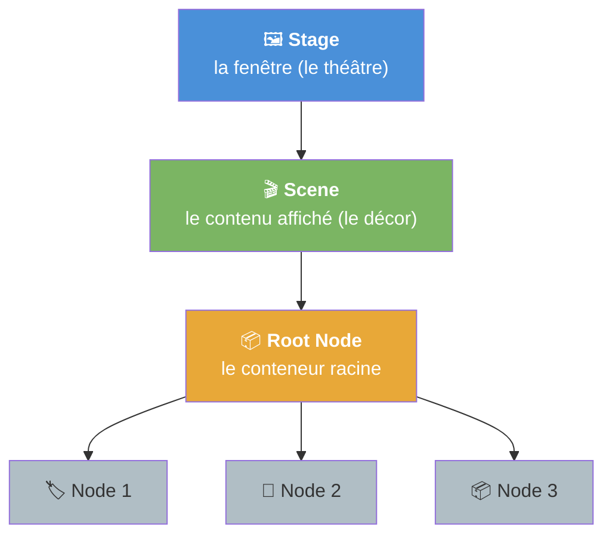
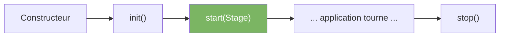
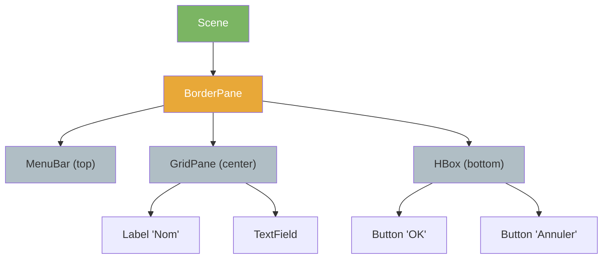
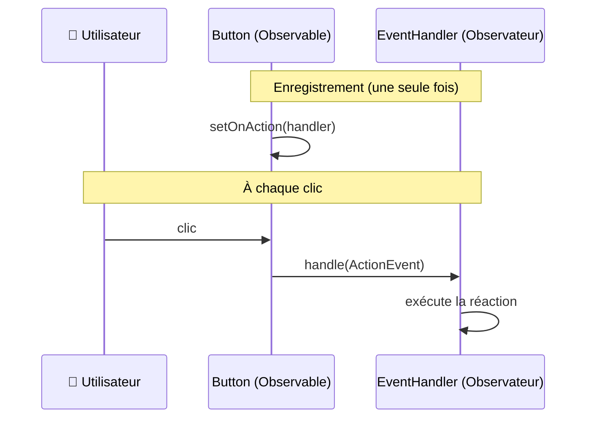

<!-- _class: lead -->

# CM1 — Fondations de l'IHM et première immersion JavaFX

**R2.02 — Développement d'applications avec IHM**
IUT d'Aix-Marseille — BUT Informatique 1re année

---

## Ce que vous saurez faire après ce CM

- **Expliquer** ce qu'est une IHM et pourquoi sa conception est un enjeu distinct du code
- **Décrire** le graphe de scène JavaFX (Stage, Scene, Node) et la métaphore du théâtre
- **Identifier** quel conteneur de layout utiliser selon le besoin
- **Comprendre** le modèle événementiel (pattern Observer, EventHandler)
- **Appliquer** deux heuristiques d'ergonomie (Nielsen #1 et #2) pour évaluer une interface

> *Niveau Bloom : Comprendre* — Ce CM pose les fondations conceptuelles. Le TP1 vous fera passer à la pratique.

---

<!-- _class: lead -->

# Partie 1 — Qu'est-ce qu'une IHM ?

---

## Trois interfaces, même fonctionnalité

Considérez trois applications qui font la même chose : afficher la météo.

| Version A | Version B | Version C |
|---|---|---|
| Texte brut, pas de feedback | Boutons mal placés, couleurs illisibles | Layout clair, icônes, feedback instantané |

**Question** : laquelle utiliseriez-vous au quotidien ? Pourquoi ?

→ La différence est avant le *code*, elle est dans la **conception de l'interface**.

---

## Définition

> **Interface Homme-Machine (IHM)** : le point de contact entre les capacités cognitives de l'être humain et la logique du logiciel.

Une bonne IHM ne se contente pas de "fonctionner". Elle doit être :
- **Efficace** : l'utilisateur atteint son objectif
- **Efficiente** : avec un effort minimal
- **Satisfaisante** : l'expérience est agréable

Ce cours ne porte pas uniquement sur **comment afficher un bouton** mais surtout sur **comment concevoir une interface qui sert l'utilisateur**.

---

## Brève histoire des interfaces

<style scoped>
table { font-size: 0.82rem; }
p { font-size: 0.88rem; }
</style>

| Époque | Paradigme | Caractéristique |
|---|---|---|
| **1970** | **CLI** — Ligne de commande | Efficace mais exigeant. L'utilisateur s'adapte à la machine. |
| **1984** | **GUI** — Interfaces graphiques | Macintosh, Windows, X11. La machine s'adapte à l'utilisateur. |
| **2007** | **Tactile** — Smartphones | iPhone, gestes multi-touch. L'interaction devient physique. |
| **2023** | **Spatial / IA** | Vision Pro, assistants vocaux. L'interface disparaît. |

Chaque transition a été motivée par une meilleure compréhension des **besoins humains**, pas par la technologie seule.

---

## Les trois piliers d'un cours d'IHM

<div style="display: flex; justify-content: center; gap: 2rem; margin: 1.5rem 0;">
<div style="background: #4a90d9; color: white; padding: 1.2rem 1.5rem; border-radius: 12px; text-align: center; flex: 1; max-width: 220px;">
<div style="font-size: 2rem;">🏗️</div>
<div style="font-weight: bold; font-size: 1.1rem;">Architecture</div>
<div style="font-size: 0.85rem; opacity: 0.9;">Comment organiser le code</div>
</div>
<div style="background: #27ae60; color: white; padding: 1.2rem 1.5rem; border-radius: 12px; text-align: center; flex: 1; max-width: 220px;">
<div style="font-size: 2rem;">🧠</div>
<div style="font-weight: bold; font-size: 1.1rem;">Ergonomie</div>
<div style="font-size: 0.85rem; opacity: 0.9;">Comment servir l'utilisateur</div>
</div>
<div style="background: #e74c3c; color: white; padding: 1.2rem 1.5rem; border-radius: 12px; text-align: center; flex: 1; max-width: 220px;">
<div style="font-size: 2rem;">⚡</div>
<div style="font-weight: bold; font-size: 1.1rem;">Événements</div>
<div style="font-size: 0.85rem; opacity: 0.9;">Comment réagir aux actions</div>
</div>
</div>

Ces trois piliers seront développés tout au long des 4 CM :

| CM | Architecture | Ergonomie | Événements |
|---|---|---|---|
| **CM1** | Premières notions | Nielsen #1, #2 + Gestalt | Observer, EventHandler |
| **CM2** | Source unique de vérité | Affordance, feedback | Propagation, bindings |
| **CM3** | MVC / MVVM | Fitts, Hick, WCAG | FXML + Controller |
| **CM4** | MVVM complet | Prévention d'erreurs | Validation réactive |

---

## Ergonomie : les heuristiques de Nielsen

Jakob Nielsen a identifié **10 heuristiques d'utilisabilité** (1994), toujours d'actualité. Aujourd'hui, nous en retenons deux :

### #1 — Visibilité de l'état du système

> Le système doit toujours informer l'utilisateur de ce qui se passe, par un feedback approprié dans un délai raisonnable.

**Exemples** : barre de progression, titre de fenêtre qui reflète le document ouvert, changement de curseur pendant un chargement.

### #2 — Correspondance entre le système et le monde réel

> Le système doit parler le langage de l'utilisateur, avec des mots, phrases et concepts familiers.

**Exemple JavaFX** : la métaphore du théâtre (Stage = scène, Scene = décor) aide à comprendre la hiérarchie d'affichage.

---

<!-- _class: lead -->

# Partie 2 — JavaFX : pourquoi et comment

---

## D'AWT à JavaFX : 25 ans d'évolution

| Époque | Toolkit | Caractéristique |
|---|---|---|
| 1995 | **AWT** | Composants "lourds" (natifs OS). Multi-plateforme approximatif. |
| 1998 | **Swing** | Composants "légers" (dessinés par Java). Look & Feel pluggable. |
| 2014 | **JavaFX 8** | Scene graph, CSS, FXML, animations, bindings. Intégré au JDK. |
| 2018 | **OpenJFX 11+** | Séparé du JDK, projet open source indépendant. |
| 2025 | **JavaFX 25 LTS** | Version actuelle, support long terme. |

**Pourquoi JavaFX ?** C'est le toolkit Java moderne : il intègre nativement la séparation vue/logique (FXML), le binding réactif (propriétés observables), et le styling (CSS).

---

## La métaphore du théâtre

JavaFX organise l'affichage comme un **spectacle** :



- **Stage** = la fenêtre du système d'exploitation. On la reçoit dans `start(Stage)`.
- **Scene** = le contenu visible. On la crée et on l'attache au Stage.
- **Nodes** = les éléments graphiques (boutons, labels, conteneurs…), organisés en **arbre**.

---

## Le cycle de vie d'une application

```java
public class MonApp extends Application {
    @Override
    public void start(Stage primaryStage) {
        // Construire l'IHM ici
        primaryStage.show();
    }
}
```

JavaFX gère le cycle de vie automatiquement :



Vous n'écrivez que `start()`. JavaFX s'occupe du reste (thread graphique, boucle événementielle, fermeture).

---

## Lien avec la SAE 2.01

La SAE 2.01 vous demandera de créer une **interface d'extraction et manipulation de données** pour des capteurs de détection de chauve-souris.

Ce CM pose les **fondations** :
- La fenêtre (`Stage`) qui hébergera votre application
- Les conteneurs (`BorderPane`, `VBox`…) qui organiseront vos composants
- Les événements qui rendront l'interface interactive

Les CM suivants ajouteront : bindings (CM2), FXML/architecture (CM3), MVVM/persistance (CM4).

---

<!-- _class: lead -->

# Partie 3 — Le graphe de scène

---

## Un arbre de nœuds

Le **graphe de scène** (scene graph) est la structure de données centrale de JavaFX. C'est un arbre où chaque nœud est un élément graphique :



**Règle** : un nœud ne peut avoir **qu'un seul parent**. Pas de cycle, pas de partage.

---

## Trois familles de nœuds

| Famille | Rôle | Exemples |
|---|---|---|
| **Pane** (conteneurs) | Organiser la mise en page | `BorderPane`, `VBox`, `HBox`, `GridPane` |
| **Control** (contrôles) | Interagir avec l'utilisateur | `Button`, `Label`, `TextField`, `Slider` |
| **Shape** (formes) | Dessiner des graphiques | `Circle`, `Rectangle`, `Line` |

Les conteneurs **contiennent** d'autres nœuds (y compris d'autres conteneurs).
Les contrôles et formes sont des **feuilles** de l'arbre (pas d'enfants).

---

## Choisir le bon conteneur

La question n'est pas "quel conteneur connaissez-vous ?" mais **"quel problème de mise en page avez-vous ?"** :

| Besoin | Conteneur | Schéma |
|---|---|---|
| Zones distinctes (menu, contenu, barre d'état) | `BorderPane` | top / left / **center** / right / bottom |
| Empiler verticalement | `VBox` | ↕ les enfants s'empilent |
| Aligner horizontalement | `HBox` | ↔ les enfants se suivent |
| Grille avec alignement | `GridPane` | lignes × colonnes |
| Flux libre (comme du texte) | `FlowPane` | retour à la ligne automatique |

> **Principe Gestalt (proximité)** : les éléments proches sont perçus comme liés. Le choix du conteneur influence directement la perception de l'utilisateur.

---

## Exemple : décomposer une interface

Comment découper cette maquette en conteneurs ?

```
┌──────────────────────────┐
│ [Fichier] [Aide]          │  ← barre de menus
├──────────────────────────┤
│ Nom :    [________]       │  ← formulaire en grille
│ Email :  [________]       │
├──────────────────────────┤
│ [Valider]  [Annuler]      │  ← boutons alignés
└──────────────────────────┘
```

**Réponse** : `BorderPane` (3 zones) → `MenuBar` (top) + `GridPane` (center) + `HBox` (bottom).

> C'est exactement ce que vous ferez dans l'exercice 4 du TP1.

---

## Principes Gestalt et mise en page

Les **lois de la Gestalt** (psychologie de la perception) expliquent comment l'œil humain organise ce qu'il voit :

| Principe | Signification | Impact sur le layout |
|---|---|---|
| **Proximité** | Les éléments proches sont perçus comme un groupe | Regrouper les contrôles liés dans un même conteneur |
| **Alignement** | Les éléments alignés sont perçus comme ordonnés | Utiliser `GridPane` pour aligner labels et champs |
| **Similarité** | Les éléments semblables sont perçus comme liés | Donner le même style aux boutons d'action |
| **Clôture** | L'œil complète les formes ouvertes | Les bordures de `BorderPane` créent des zones visuelles |

Ces principes ne sont pas JavaFX-spécifiques : ils s'appliquent à **toute** conception d'interface.

---

<!-- _class: lead -->

# Partie 4 — Le modèle événementiel

---

## Pourquoi des événements ?

Un programme console est **séquentiel** :
```
lire entrée → traiter → afficher résultat → fin
```

Une application graphique est **réactive** :
```
attendre → un événement se produit → réagir → attendre à nouveau
```

L'utilisateur peut cliquer n'importe où, à n'importe quel moment. Le programme doit **réagir**, pas dicter l'ordre des actions.

> C'est un changement de paradigme fondamental par rapport à la programmation que vous avez pratiquée en R1.01 et R2.01.

---

## Le pattern Observer

Le modèle événementiel de JavaFX repose sur le **pattern Observer** (Gang of Four, 1994) :



**Principe** : l'objet observé (le bouton) **ne sait pas** ce que fera l'observateur (le handler). Il se contente de le notifier. C'est une **séparation des préoccupations**.

---

## EventHandler : 3 styles d'écriture

Java offre 3 façons d'écrire un écouteur. Elles produisent exactement le même résultat :

### Style 1 — Classe nommée (historique, avant Java 8)
```java
bouton.setOnAction(new MonHandler(compteur));
```

### Style 2 — Classe anonyme (intermédiaire)
```java
bouton.setOnAction(new EventHandler<ActionEvent>() {
    @Override
    public void handle(ActionEvent e) { compteur.incrementer(); }
});
```

### Style 3 — Lambda (moderne, recommandé)
```java
bouton.setOnAction(e -> compteur.incrementer());
```

> Le style lambda est le plus courant dans du code JavaFX moderne. Vous les pratiquerez tous les trois dans le TP1 (exercice 5).

---

## Ce que le modèle événementiel nous apprend

Le pattern Observer illustre un principe fondamental de l'architecture logicielle :

> **Séparation des préoccupations** : chaque composant a une responsabilité unique.

- Le **bouton** sait qu'il a été cliqué → il notifie
- Le **handler** sait quoi faire → il agit
- Aucun des deux ne connaît les détails de l'autre

Ce principe sera étendu dans les CM suivants :
- **CM2** : les bindings poussent ce principe plus loin (synchronisation automatique sans écrire de handler)
- **CM3** : MVC/MVVM formalisent la séparation en couches (View, Controller, Model)

---

<!-- _class: lead -->

# Synthèse

---

## Ce que nous avons vu

| Concept | Retenir |
|---|---|
| **IHM** | Point de contact humain-logiciel. Pas juste du code, de la conception. |
| **Stage / Scene / Node** | Métaphore du théâtre. L'affichage est un arbre de nœuds. |
| **Conteneurs** | Choisir le layout selon le besoin, pas selon l'habitude. |
| **Gestalt** | Proximité et alignement guident la perception de l'utilisateur. |
| **Événements** | Les IHM sont réactives. Le pattern Observer sépare "quoi observer" de "comment réagir". |
| **Nielsen #1 et #2** | Visibilité de l'état + correspondance avec le monde réel. |

---

## Lien avec le TP1

Le TP1 met en pratique tout ce CM en **6 exercices** progressifs :

| Exercice | Concept CM1 |
|---|---|
| 1 — Première fenêtre | Stage, `show()` |
| 2 — Stage personnalisé | Propriétés du Stage |
| 3 — Première Scene | Scene, BorderPane, Label |
| 4 — Mise en page | Décomposition en conteneurs (Gestalt) |
| 5 — Événements bouton | Pattern Observer, 3 styles de handler |
| 6 — Palette de couleurs | Synthèse : layouts + événements + feedback |

Le TP utilise le **TDD baby steps** : les tests sont livrés désactivés, vous les activez un par un. C'est une méthode professionnelle (Kent Beck, XP).

---

## Pour aller plus loin

- [JavaFX 25 API Documentation](https://openjfx.io/javadoc/25/)
- [Jakob Nielsen — 10 Usability Heuristics](https://www.nngroup.com/articles/ten-usability-heuristics/)
- [Gestalt Principles in UI Design](https://www.nngroup.com/articles/gestalt-proximity/)
- [Design of Everyday Things — Don Norman](https://www.nngroup.com/books/design-everyday-things-revised/) (le livre de référence)

**Prochain CM** : propriétés, bindings et le modèle événementiel complet. Comment synchroniser automatiquement l'interface avec les données, sans écrire un seul EventHandler.
