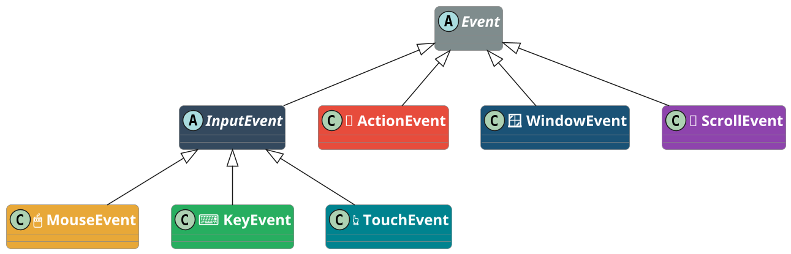
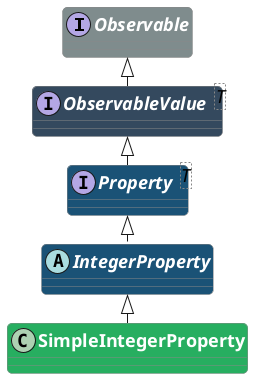

<!-- _class: lead -->
<!-- _header: "" -->
<!-- _footer: "" -->
<!-- _paginate: false -->

<style scoped>
section {
  background-image: url('assets/logo-amu.png');
  background-repeat: no-repeat;
  background-position: bottom 40px center;
  background-size: 380px;
}
</style>

# Propriétés, bindings et contrôles

**R2.02 - Développement d'applications avec IHM**

---

## Où en sommes-nous ?

<!-- _header: "" -->
<!-- _footer: "" -->

<div style="display: flex; gap: 0.8rem; margin-top: 0.5rem; margin-bottom: 0.5rem; text-align: center; font-size: 2.5rem; line-height: 1;">
<div style="flex: 1;">&nbsp;</div>
<div style="flex: 1;">👇</div>
<div style="flex: 1;">&nbsp;</div>
<div style="flex: 1;">&nbsp;</div>
</div>

<div style="display: flex; gap: 0.8rem;">
<div style="background: #4a90d9; color: white; padding: 1.2rem; border-radius: 12px 12px 0 0; flex: 1; text-align: center;">
<div style="font-size: 1.8rem; font-weight: bold;">CM1 ✅</div>
<div style="margin-top: 0.3rem;">Fondations IHM + JavaFX</div>
</div>
<div style="background: #e8a838; color: white; padding: 1.2rem; border-radius: 12px 12px 0 0; flex: 1; text-align: center; box-shadow: 0 4px 12px rgba(232,168,56,0.4);">
<div style="font-size: 1.8rem; font-weight: bold;">CM2</div>
<div style="margin-top: 0.3rem;">Propriétés et bindings</div>
</div>
<div style="background: #27ae60; color: white; padding: 1.2rem; border-radius: 12px 12px 0 0; flex: 1; text-align: center;">
<div style="font-size: 1.8rem; font-weight: bold;">CM3</div>
<div style="margin-top: 0.3rem;">Architecture et FXML</div>
</div>
<div style="background: #8e44ad; color: white; padding: 1.2rem; border-radius: 12px 12px 0 0; flex: 1; text-align: center;">
<div style="font-size: 1.8rem; font-weight: bold;">CM4</div>
<div style="margin-top: 0.3rem;">MVVM + persistance</div>
</div>
</div>

<div style="display: flex; gap: 0.8rem; text-align: center; font-size: 1.5rem; color: #999;">
<div style="flex: 1;">↓</div>
<div style="flex: 1;">↓</div>
<div style="flex: 1;">↓</div>
<div style="flex: 1;">↓</div>
</div>

<div style="display: flex; gap: 0.8rem;">
<div style="background: #d0e2f3; color: #2c5f8a; padding: 0.8rem; border-radius: 0 0 12px 12px; flex: 1; text-align: center; font-weight: bold;">
TP1 ✅
</div>
<div style="background: #fae5c0; color: #8a6a1f; padding: 0.8rem; border-radius: 0 0 12px 12px; flex: 1; text-align: center; font-weight: bold;">
TP2
</div>
<div style="background: #c8e6c9; color: #1b5e20; padding: 0.8rem; border-radius: 0 0 12px 12px; flex: 1; text-align: center; font-weight: bold;">
TP3
</div>
<div style="background: #e1bee7; color: #5c2473; padding: 0.8rem; border-radius: 0 0 12px 12px; flex: 1; text-align: center; font-weight: bold;">
TP4 + TP5
</div>
</div>

<div style="display: flex; gap: 0.8rem; margin-top: 0.5rem; text-align: center; font-size: 2.5rem; line-height: 1;">
<div style="flex: 1;">&nbsp;</div>
<div style="flex: 1;">👆</div>
<div style="flex: 1;">&nbsp;</div>
<div style="flex: 1;">&nbsp;</div>
</div>

---

## Rappel CM1 - Ce que vous savez déjà

<!-- _header: "" -->
<!-- _footer: "" -->

<div style="display: grid; grid-template-columns: 1fr 1fr 1fr; gap: 1.2rem; margin-top: 1.5rem;">
<div style="background: #4a90d9; color: white; padding: 1.2rem; border-radius: 10px;">
<div style="font-size: 1.7rem; margin-bottom: 0.5rem; font-weight: bold;">🎭 Le graphe de scène</div>
<div style="margin-top: 0.5rem; font-size: 1.5rem; opacity: 0.9;">
<b>Stage</b> = la fenêtre, <b>Scene</b> = le contenu, <b>Node</b> = chaque élément.<br/>
L'arbre de nœuds organise l'interface en hiérarchie parent/enfant.
</div>
</div>
<div style="background: #e8a838; color: white; padding: 1.2rem; border-radius: 10px;">
<div style="font-size: 1.7rem; margin-bottom: 0.5rem; font-weight: bold;">📦 Les conteneurs</div>
<div style="margin-top: 0.5rem; font-size: 1.5rem; opacity: 0.9;">
<b>BorderPane</b> (5 zones), <b>VBox/HBox</b> (empilements), <b>GridPane</b> (grille).<br/>
Les principes Gestalt guident le choix du conteneur.
</div>
</div>
<div style="background: #27ae60; color: white; padding: 1.2rem; border-radius: 10px;">
<div style="font-size: 1.7rem; margin-bottom: 0.5rem; font-weight: bold;">⚡ Les événements</div>
<div style="margin-top: 0.5rem; font-size: 1.5rem; opacity: 0.9;">
Le <b>pattern Observer</b> : le bouton notifie, le handler réagit.<br/>
3 styles d'écriture : classe nommée, anonyme, lambda.
</div>
</div>
</div>

<div style="background: #2c3e50; color: white; padding: 1.2rem 2rem; border-radius: 10px; margin-top: 1.5rem; font-size: 1.7rem; text-align: center;">
Aujourd'hui : rendre l'interface <b>réactive</b> sans écrire d'EventHandler pour chaque mise à jour.
</div>

---

<!-- _class: lead -->
<!-- _header: "" -->
<!-- _footer: "" -->

# Partie 1 - Le problème

---

## TP1 : la Palette, version naïve ❌

<!-- _header: "" -->
<!-- _footer: "" -->

<style scoped>
pre { font-size: 0.78rem; }
</style>

<p style="font-size:1.6rem">
Dans `Palette.java` (TP1, exercice 6), mettre à jour le label demande du code répété à chaque handler :
</p>

```java
int[] compteurs = {0, 0, 0};

btnRouge.setOnAction(e -> {
    compteurs[0]++;
    zone.setStyle("-fx-background-color: red;");
    labelCompteurs.setText(
        "Rouge: " + compteurs[0]
        + "  Vert: " + compteurs[1]
        + "  Bleu: " + compteurs[2]);
}); // même code dans btnVert et btnBleu...
```

<div style="background: #c0392b; color: white; padding: 0.8rem 1.5rem; border-radius: 10px; margin-top: 0.8rem;">
⚠️ <b>3 problèmes</b> : <code>setText()</code> copié-collé 3 fois - ajouter un bouton = oublier une mise à jour - le label n'est jamais la "source de vérité"
</div>

---

## TP2 : la PaletteReactive, version bindings ✅

<!-- _header: "" -->
<!-- _footer: "" -->

<style scoped>
pre { font-size: 0.78rem; }
</style>

<p style="font-size:1.6rem">
Dans <code>PaletteReactive.java</code> (TP2, exercice 3), un seul binding remplace les 3 <code>setText()</code> :
</p>

```java
StringExpression texte = Bindings.concat(
    "Rouge: ", btnRouge.nbClicsProperty().asString(),
    "  Vert: ", btnVert.nbClicsProperty().asString(),
    "  Bleu: ", btnBleu.nbClicsProperty().asString()
    );

labelCompteurs.textProperty().bind(texte);
```

<div style="background: #1e8449; color: white; padding: 0.8rem 1.5rem; border-radius: 10px; margin-top: 0.8rem;">
✅ <b>Résultat</b> :<br/>
&bull; Le label se met à jour <b>automatiquement</b> à chaque clic<br/>
&bull; Aucun <code>setText()</code> dans les handlers<br/>
&bull; Ajouter un bouton = allonger la concaténation
</div>

---

## La puissance des bindings - demo

Sans écrire un seul EventHandler, on peut synchroniser :

<div style="display: grid; grid-template-columns: 1fr 1fr; gap: 1.5rem; margin-top: 1rem;">
<div style="background: #f0f4f8; padding: 1.2rem; border-radius: 10px; border-left: 4px solid #4a90d9;">
<div style="font-weight: bold; margin-bottom: 0.5rem; font-size: 1.3rem;">⚙️ Avant (TP1)</div>
<div>Slider → clic → EventHandler → lire valeur → appeler <code>setText()</code> → appeler <code>setStyle()</code> → ...</div>
<div style="margin-top: 0.5rem; color: #e74c3c; font-weight: bold; font-size: 1.3rem;">5 lignes de code impératif</div>
</div>
<div style="background: #f0fff4; padding: 1.2rem; border-radius: 10px; border-left: 4px solid #27ae60;">
<div style="font-weight: bold; margin-bottom: 0.5rem; font-size: 1.3rem;">✅ Après (TP2)</div>
<div><code>label.textProperty().bind(<br/>  slider.valueProperty().asString())</code></div>
<div style="margin-top: 0.5rem; color: #27ae60; font-weight: bold; font-size: 1.3rem;">1 ligne déclarative</div>
</div>
</div>

<div style="background: #2c3e50; color: white; padding: 1rem 2rem; border-radius: 10px; margin-top: 1.5rem; text-align: center;">
Vous pratiquerez cette transformation dans les exercices 2 à 5 du TP2.
</div>

---

<!-- _transition: fade -->

## La liaison de données - approche impérative ❌
<!-- _header: "" -->
<!-- _footer: "" -->

<style scoped>h2 { view-transition-name: titre-liaison; }</style>

<svg viewBox="0 0 900 220" xmlns="http://www.w3.org/2000/svg" style="width:100%; display:block; margin:0.3rem auto;">
  <defs>
    <marker id="a1" markerWidth="8" markerHeight="6" refX="8" refY="3" orient="auto"><path d="M0,0 L8,3 L0,6" fill="#555"/></marker>
  </defs>
  <rect x="5" y="5" width="890" height="210" rx="12" fill="#fdf2f2" stroke="#e74c3c" stroke-width="2"/>
  <text x="450" y="32" text-anchor="middle" font-family="Arial" font-size="17" font-weight="bold" fill="#c0392b">❌ Approche impérative (TP1)</text>
  <!-- Nœuds - étalés sur toute la largeur -->
  <rect x="30" y="85" width="140" height="50" rx="10" fill="#f5f5f5" stroke="#ccc" stroke-width="1.5"/>
  <text x="100" y="115" text-anchor="middle" font-family="Arial" font-size="14" fill="#333">👤 Utilisateur</text>
  <rect x="250" y="85" width="130" height="50" rx="10" fill="#e74c3c"/>
  <text x="315" y="115" text-anchor="middle" font-family="Arial" font-size="14" fill="white">🔘 Button</text>
  <rect x="470" y="72" width="150" height="76" rx="10" fill="#c0392b"/>
  <text x="545" y="100" text-anchor="middle" font-family="Arial" font-size="14" fill="white">📝 Handler</text>
  <text x="545" y="120" text-anchor="middle" font-family="Arial" font-size="11" fill="rgba(255,255,255,0.8)">setText()</text>
  <text x="545" y="136" text-anchor="middle" font-family="Arial" font-size="11" fill="rgba(255,255,255,0.8)">setStyle()</text>
  <rect x="720" y="55" width="120" height="42" rx="10" fill="#8e44ad"/>
  <text x="780" y="81" text-anchor="middle" font-family="Arial" font-size="13" fill="white">🏷️ Label</text>
  <rect x="720" y="125" width="120" height="42" rx="10" fill="#8e44ad"/>
  <text x="780" y="151" text-anchor="middle" font-family="Arial" font-size="13" fill="white">📦 Pane</text>
  <!-- Flèches -->
  <line x1="170" y1="110" x2="248" y2="110" stroke="#555" stroke-width="2" marker-end="url(#a1)"/>
  <text x="209" y="103" text-anchor="middle" font-family="Arial" font-size="11" fill="#555">clic</text>
  <line x1="380" y1="110" x2="468" y2="110" stroke="#555" stroke-width="2" marker-end="url(#a1)"/>
  <text x="424" y="103" text-anchor="middle" font-family="Arial" font-size="10" fill="#555">EventHandler</text>
  <line x1="620" y1="92" x2="718" y2="78" stroke="#555" stroke-width="2" marker-end="url(#a1)"/>
  <text x="669" y="68" font-family="Arial" font-size="10" fill="#555">setText()</text>
  <line x1="620" y1="130" x2="718" y2="144" stroke="#555" stroke-width="2" marker-end="url(#a1)"/>
  <text x="669" y="160" font-family="Arial" font-size="10" fill="#555">setStyle()</text>
  <!-- Bilan -->
  <text x="450" y="198" text-anchor="middle" font-family="Arial" font-size="14" font-weight="bold" fill="#c0392b">Le handler fait TOUT manuellement</text>
</svg>

<div style="background: #c0392b; color: white; padding: 0.8rem 1.5rem; border-radius: 10px; margin-top: 0.8rem; text-align: center;">
⚠️ Chaque mise à jour visuelle demande du code <b>impératif</b> dans le handler. Plus l'interface est riche, plus le handler grossit.
</div>

---

<!-- _transition: fade -->

## La liaison de données - approche déclarative ✅
<!-- _header: "" -->
<!-- _footer: "" -->

<style scoped>h2 { view-transition-name: titre-liaison; }</style>

<svg viewBox="0 0 900 220" xmlns="http://www.w3.org/2000/svg" style="width:100%; display:block; margin:0.3rem auto;">
  <defs>
    <marker id="a2" markerWidth="8" markerHeight="6" refX="8" refY="3" orient="auto"><path d="M0,0 L8,3 L0,6" fill="#555"/></marker>
    <marker id="a2g" markerWidth="8" markerHeight="6" refX="8" refY="3" orient="auto"><path d="M0,0 L8,3 L0,6" fill="#27ae60"/></marker>
  </defs>
  <rect x="5" y="5" width="890" height="210" rx="12" fill="#f0faf0" stroke="#27ae60" stroke-width="2"/>
  <text x="450" y="32" text-anchor="middle" font-family="Arial" font-size="17" font-weight="bold" fill="#1e8449">✅ Approche déclarative (TP2)</text>
  <!-- Nœuds - étalés sur toute la largeur -->
  <rect x="30" y="85" width="140" height="50" rx="10" fill="#f5f5f5" stroke="#ccc" stroke-width="1.5"/>
  <text x="100" y="115" text-anchor="middle" font-family="Arial" font-size="14" fill="#333">👤 Utilisateur</text>
  <rect x="250" y="85" width="130" height="50" rx="10" fill="#e74c3c"/>
  <text x="315" y="115" text-anchor="middle" font-family="Arial" font-size="14" fill="white">🔘 Button</text>
  <rect x="470" y="72" width="150" height="76" rx="10" fill="#e8a838"/>
  <text x="545" y="100" text-anchor="middle" font-family="Arial" font-size="14" fill="white">⚡ Property</text>
  <text x="545" y="122" text-anchor="middle" font-family="Arial" font-size="11" fill="rgba(255,255,255,0.8)">nbClics</text>
  <rect x="720" y="55" width="120" height="42" rx="10" fill="#8e44ad"/>
  <text x="780" y="81" text-anchor="middle" font-family="Arial" font-size="13" fill="white">🏷️ Label</text>
  <rect x="720" y="125" width="120" height="42" rx="10" fill="#8e44ad"/>
  <text x="780" y="151" text-anchor="middle" font-family="Arial" font-size="13" fill="white">📦 Pane</text>
  <!-- Flèches pleines -->
  <line x1="170" y1="110" x2="248" y2="110" stroke="#555" stroke-width="2" marker-end="url(#a2)"/>
  <text x="209" y="103" text-anchor="middle" font-family="Arial" font-size="11" fill="#555">clic</text>
  <line x1="380" y1="110" x2="468" y2="110" stroke="#555" stroke-width="2" marker-end="url(#a2)"/>
  <text x="424" y="103" text-anchor="middle" font-family="Arial" font-size="11" fill="#555">+1</text>
  <!-- Flèches pointillées (bind) -->
  <line x1="620" y1="92" x2="718" y2="78" stroke="#27ae60" stroke-width="2.5" stroke-dasharray="6,4" marker-end="url(#a2g)"/>
  <text x="675" y="72" font-family="Arial" font-size="11" fill="#27ae60" font-weight="bold">bind</text>
  <line x1="620" y1="128" x2="718" y2="144" stroke="#27ae60" stroke-width="2.5" stroke-dasharray="6,4" marker-end="url(#a2g)"/>
  <text x="675" y="158" font-family="Arial" font-size="11" fill="#27ae60" font-weight="bold">bind</text>
  <!-- Bilan -->
  <text x="450" y="198" text-anchor="middle" font-family="Arial" font-size="14" font-weight="bold" fill="#1e8449">La propriété notifie AUTOMATIQUEMENT</text>
</svg>

<div style="background: #1e8449; color: white; padding: 0.8rem 1.5rem; border-radius: 10px; margin-top: 0.8rem; text-align: center;">
✅ Ajouter un composant visuel = ajouter <b>un bind()</b>. Le handler ne change pas. La propriété est la source unique de vérité.
</div>

---

<!-- _transition: fade -->

## La liaison de données - comparaison

<!-- _header: "" -->
<!-- _footer: "" -->

<style scoped>h2 { view-transition-name: titre-liaison; }</style>

<div style="display: flex; gap: 0.8rem; margin-top: 0.5rem;">

<svg viewBox="0 0 520 340" xmlns="http://www.w3.org/2000/svg" style="flex:1;">
  <defs><marker id="a3" markerWidth="6" markerHeight="5" refX="6" refY="2.5" orient="auto"><path d="M0,0 L6,2.5 L0,5" fill="#555"/></marker></defs>
  <rect x="3" y="3" width="514" height="334" rx="10" fill="#fdf2f2" stroke="#e74c3c" stroke-width="1.5"/>
  <text x="260" y="35" text-anchor="middle" font-family="Arial" font-size="18" font-weight="bold" fill="#c0392b">❌ Impératif (TP1)</text>
  <rect x="15" y="130" width="95" height="50" rx="7" fill="#f5f5f5" stroke="#ccc"/>
  <text x="62" y="160" text-anchor="middle" font-family="Arial" font-size="14" fill="#333">👤 User</text>
  <rect x="150" y="130" width="90" height="50" rx="7" fill="#e74c3c"/>
  <text x="195" y="160" text-anchor="middle" font-family="Arial" font-size="14" fill="white">🔘 Button</text>
  <rect x="280" y="110" width="100" height="90" rx="7" fill="#c0392b"/>
  <text x="330" y="145" text-anchor="middle" font-family="Arial" font-size="14" fill="white">📝 Handler</text>
  <text x="330" y="167" text-anchor="middle" font-family="Arial" font-size="12" fill="rgba(255,255,255,0.7)">setText()</text>
  <text x="330" y="184" text-anchor="middle" font-family="Arial" font-size="12" fill="rgba(255,255,255,0.7)">setStyle()</text>
  <rect x="425" y="70" width="75" height="45" rx="7" fill="#8e44ad"/>
  <text x="462" y="98" text-anchor="middle" font-family="Arial" font-size="14" fill="white">🏷️ Label</text>
  <rect x="425" y="195" width="75" height="45" rx="7" fill="#8e44ad"/>
  <text x="462" y="223" text-anchor="middle" font-family="Arial" font-size="14" fill="white">📦 Pane</text>
  <line x1="110" y1="155" x2="148" y2="155" stroke="#555" stroke-width="1.5" marker-end="url(#a3)"/>
  <line x1="240" y1="155" x2="278" y2="155" stroke="#555" stroke-width="1.5" marker-end="url(#a3)"/>
  <line x1="380" y1="130" x2="423" y2="98" stroke="#555" stroke-width="1.5" marker-end="url(#a3)"/>
  <line x1="380" y1="178" x2="423" y2="210" stroke="#555" stroke-width="1.5" marker-end="url(#a3)"/>
  <text x="260" y="310" text-anchor="middle" font-family="Arial" font-size="16" font-weight="bold" fill="#c0392b">Le handler fait tout</text>
</svg>

<svg viewBox="0 0 520 340" xmlns="http://www.w3.org/2000/svg" style="flex:1;">
  <defs>
    <marker id="a4" markerWidth="6" markerHeight="5" refX="6" refY="2.5" orient="auto"><path d="M0,0 L6,2.5 L0,5" fill="#555"/></marker>
    <marker id="a4g" markerWidth="6" markerHeight="5" refX="6" refY="2.5" orient="auto"><path d="M0,0 L6,2.5 L0,5" fill="#27ae60"/></marker>
  </defs>
  <rect x="3" y="3" width="514" height="334" rx="10" fill="#f0faf0" stroke="#27ae60" stroke-width="1.5"/>
  <text x="260" y="35" text-anchor="middle" font-family="Arial" font-size="18" font-weight="bold" fill="#1e8449">✅ Déclaratif (TP2)</text>
  <rect x="15" y="130" width="95" height="50" rx="7" fill="#f5f5f5" stroke="#ccc"/>
  <text x="62" y="160" text-anchor="middle" font-family="Arial" font-size="14" fill="#333">👤 User</text>
  <rect x="150" y="130" width="90" height="50" rx="7" fill="#e74c3c"/>
  <text x="195" y="160" text-anchor="middle" font-family="Arial" font-size="14" fill="white">🔘 Button</text>
  <rect x="280" y="110" width="100" height="90" rx="7" fill="#e8a838"/>
  <text x="330" y="145" text-anchor="middle" font-family="Arial" font-size="14" fill="white">⚡ Property</text>
  <text x="330" y="167" text-anchor="middle" font-family="Arial" font-size="12" fill="rgba(255,255,255,0.7)">nbClics</text>
  <rect x="425" y="70" width="75" height="45" rx="7" fill="#8e44ad"/>
  <text x="462" y="98" text-anchor="middle" font-family="Arial" font-size="14" fill="white">🏷️ Label</text>
  <rect x="425" y="195" width="75" height="45" rx="7" fill="#8e44ad"/>
  <text x="462" y="223" text-anchor="middle" font-family="Arial" font-size="14" fill="white">📦 Pane</text>
  <line x1="110" y1="155" x2="148" y2="155" stroke="#555" stroke-width="1.5" marker-end="url(#a4)"/>
  <line x1="240" y1="155" x2="278" y2="155" stroke="#555" stroke-width="1.5" marker-end="url(#a4)"/>
  <line x1="380" y1="130" x2="423" y2="98" stroke="#27ae60" stroke-width="2" stroke-dasharray="5,3" marker-end="url(#a4g)"/>
  <line x1="380" y1="178" x2="423" y2="210" stroke="#27ae60" stroke-width="2" stroke-dasharray="5,3" marker-end="url(#a4g)"/>
  <text x="260" y="310" text-anchor="middle" font-family="Arial" font-size="16" font-weight="bold" fill="#1e8449">La propriété notifie auto.</text>
</svg>

</div>

<div style="background: #2c3e50; color: white; padding: 0.8rem 1.5rem; border-radius: 10px; margin-top: 0.8rem; text-align: center;">
💡 La <b>propriété</b> devient le point central : elle stocke la donnée ET notifie automatiquement tous les composants liés.
</div>

---

<!-- _class: lead -->
<!-- _header: "" -->
<!-- _footer: "" -->

# Partie 2 - ⚡ Modèle événementiel complet

---

## Rappel : les 3 styles d'EventHandler

<!-- _header: "" -->
<!-- _footer: "" -->

<style scoped>
pre { min-height: 4rem; }
</style>

Trois façons d'écrire le même comportement, revus dans le TP1 (exercice 5) :

<div style="display: grid; grid-template-columns: 1fr 1fr 1fr; gap: 1rem; margin-top: 1rem;">

<div style="background: #8e44ad; color: white; padding: 1rem; border-radius: 10px;">
<div style="font-size: 2rem; text-align: center;">📝 Classe nommée</div>

```java
class MonEcouteur
  implements EventHandler<ActionEvent> {
  public void handle(ActionEvent e) {
    /* ... */
  }
}
btn.setOnAction(new MonEcouteur());
```

<div style="margin-top: 0.5rem; font-size: 1.5rem; text-align: center; background: rgba(255,255,255,0.2); padding: 0.3rem; border-radius: 6px;">Réutilisable, testable</div>
</div>

<div style="background: #e8a838; color: white; padding: 1rem; border-radius: 10px;">
<div style="font-size: 2rem; text-align: center;">⚙️ Classe anonyme</div>


```java
btn.setOnAction(
  new EventHandler<ActionEvent>() {
    public void handle(ActionEvent e) {
      /* ... */
    }
  });
```

<div style="margin-top: 0.5rem; font-size: 1.5rem; text-align: center; background: rgba(255,255,255,0.2); padding: 0.3rem; border-radius: 6px;">Inline, verbeux</div>
</div>

<div style="background: #27ae60; color: white; padding: 1rem; border-radius: 10px;">
<div style="font-size: 2rem; text-align: center;">🎯 Lambda</div>

```java
// Syntaxe Java 8+ (expression lambda).
btn.setOnAction((ActionEvent e) -> {
  /* traitement à effectuer ... */
});
```

<div style="margin-top: 0.5rem; font-size: 1.5rem; text-align: center; background: rgba(255,255,255,0.2); padding: 0.3rem; border-radius: 6px;">Concis, recommandé ✅</div>
</div>

</div>

<div style="background: #2c3e50; color: white; padding: 0.8rem 1.5rem; border-radius: 10px; margin-top: 1rem; text-align: center;">
👉 Regardons <b>comment les <code>EventHandler</code> fonctionnent en profondeur</b> : leur parcours dans l'arbre de scène, et le mécanisme qui permet à un conteneur d'intercepter un événement avant ses enfants.
</div>

---

## La propagation - phase de capture (1/2)

<!-- _header: "" -->
<!-- _footer: "" -->

<p style="font-size: 1.6rem;">
Quand vous cliquez sur un bouton, l'événement <b>ne naît pas dans le bouton</b>. Il commence à la racine de la scène et descend jusqu'à la cible.
</p>
<svg viewBox="0 0 1200 260" xmlns="http://www.w3.org/2000/svg" style="width:100%; display:block; margin:0.3rem auto;">
  <defs>
    <marker id="capArr" markerWidth="6" markerHeight="6" refX="6" refY="3" orient="auto"><path d="M0,0 L6,3 L0,6" fill="#e74c3c"/></marker>
  </defs>

  <!-- Étage 1 : Scene (bord gauche) -->
  <rect x="0" y="20" width="260" height="55" rx="10" fill="#7bb563" stroke="#5a9e45" stroke-width="2"/>
  <text x="130" y="55" text-anchor="middle" font-family="Arial" font-size="20" fill="white" font-weight="bold">🎬 Scene</text>

  <!-- Étage 2 : BorderPane -->
  <rect x="313" y="85" width="260" height="55" rx="10" fill="#e8a838" stroke="#c87d10" stroke-width="2"/>
  <text x="443" y="120" text-anchor="middle" font-family="Arial" font-size="20" fill="white" font-weight="bold">🗺️ BorderPane</text>

  <!-- Étage 3 : HBox -->
  <rect x="627" y="150" width="260" height="55" rx="10" fill="#e8a838" stroke="#c87d10" stroke-width="2"/>
  <text x="757" y="185" text-anchor="middle" font-family="Arial" font-size="20" fill="white" font-weight="bold">↔ HBox</text>

  <!-- Étage 4 : Button (cible) (bord droit) -->
  <rect x="940" y="205" width="260" height="55" rx="10" fill="#e74c3c" stroke="#c0392b" stroke-width="2"/>
  <text x="1070" y="240" text-anchor="middle" font-family="Arial" font-size="20" fill="white" font-weight="bold">🔘 Button (cible)</text>

  <!-- Flèches orthogonales (descente en L : ↓ puis →) avec annotations -->
  <!-- De Scene vers BorderPane -->
  <polyline points="130,75 130,112 311,112" stroke="#e74c3c" stroke-width="3" fill="none" marker-end="url(#capArr)"/>
  <text x="145" y="102" font-family="Arial" font-size="14" fill="#c0392b" font-style="italic">1. reçoit en premier</text>
  <!-- De BorderPane vers HBox -->
  <polyline points="443,140 443,177 625,177" stroke="#e74c3c" stroke-width="3" fill="none" marker-end="url(#capArr)"/>
  <text x="458" y="167" font-family="Arial" font-size="14" fill="#c0392b" font-style="italic">2. puis transmet</text>
  <!-- De HBox vers Button -->
  <polyline points="757,205 757,232 938,232" stroke="#e74c3c" stroke-width="3" fill="none" marker-end="url(#capArr)"/>
  <text x="772" y="222" font-family="Arial" font-size="14" fill="#c0392b" font-style="italic">3. arrive à la cible</text>
</svg>

<div style="background: #e74c3c; color: white; padding: 0.6rem 1.5rem; border-radius: 10px; margin-top: 2rem; font-size: 1.6rem;">
⬇️ <b>Phase de CAPTURE</b> : la racine peut <b>intercepter</b> l'événement avant la cible via <code>addEventFilter()</code>. Utile pour filtrer, logger ou bloquer (<code>event.consume()</code>).
</div>

---

## La propagation - phase de bubbling (2/2)

<!-- _header: "" -->
<!-- _footer: "" -->

<p style="font-size: 1.6rem;">
Après la phase de capture, l'événement <b>remonte</b> de la cible vers la racine : c'est la phase qui déclenche vos <code>setOnAction()</code> habituels.
</p>
<svg viewBox="0 0 1200 260" xmlns="http://www.w3.org/2000/svg" style="width:100%; display:block; margin:0.3rem auto;">
  <defs>
    <marker id="bubArr" markerWidth="6" markerHeight="6" refX="6" refY="3" orient="auto"><path d="M0,0 L6,3 L0,6" fill="#27ae60"/></marker>
  </defs>

  <!-- Étage 1 : Scene (bord gauche) -->
  <rect x="0" y="20" width="260" height="55" rx="10" fill="#7bb563" stroke="#5a9e45" stroke-width="2"/>
  <text x="130" y="55" text-anchor="middle" font-family="Arial" font-size="20" fill="white" font-weight="bold">🎬 Scene</text>

  <!-- Étage 2 : BorderPane -->
  <rect x="313" y="85" width="260" height="55" rx="10" fill="#e8a838" stroke="#c87d10" stroke-width="2"/>
  <text x="443" y="120" text-anchor="middle" font-family="Arial" font-size="20" fill="white" font-weight="bold">🗺️ BorderPane</text>

  <!-- Étage 3 : HBox -->
  <rect x="627" y="150" width="260" height="55" rx="10" fill="#e8a838" stroke="#c87d10" stroke-width="2"/>
  <text x="757" y="185" text-anchor="middle" font-family="Arial" font-size="20" fill="white" font-weight="bold">↔ HBox</text>

  <!-- Étage 4 : Button (cible - bord droit) -->
  <rect x="940" y="205" width="260" height="55" rx="10" fill="#e74c3c" stroke="#c0392b" stroke-width="2"/>
  <text x="1070" y="240" text-anchor="middle" font-family="Arial" font-size="20" fill="white" font-weight="bold">🔘 Button (cible)</text>

  <!-- Flèches orthogonales inversées (remontée en L : ← puis ↑) avec annotations -->
  <!-- De Button (départ bord gauche, centre vertical) vers HBox (centre horizontal, bas) -->
  <polyline points="940,232 757,232 757,205" stroke="#27ae60" stroke-width="3" fill="none" marker-end="url(#bubArr)"/>
  <text x="773" y="222" font-family="Arial" font-size="14" fill="#1e8449" font-style="italic">1. traitement ici</text>
  <!-- De HBox (départ bord gauche, centre vertical) vers BorderPane (centre horizontal, bas) -->
  <polyline points="627,177 443,177 443,140" stroke="#27ae60" stroke-width="3" fill="none" marker-end="url(#bubArr)"/>
  <text x="459" y="167" font-family="Arial" font-size="14" fill="#1e8449" font-style="italic">2. puis remonte</text>
  <!-- De BorderPane (départ bord gauche, centre vertical) vers Scene (centre horizontal, bas) -->
  <polyline points="313,112 130,112 130,75" stroke="#27ae60" stroke-width="3" fill="none" marker-end="url(#bubArr)"/>
  <text x="146" y="102" font-family="Arial" font-size="14" fill="#1e8449" font-style="italic">3. termine à la racine</text>
</svg>

<div style="background: #1e8449; color: white; padding: 0.6rem 1.5rem; border-radius: 10px; margin-top: 2rem; font-size: 1.6rem;">
⬆️ <b>Phase de BUBBLING</b> : la cible est traitée en premier. Se configure avec <code>addEventHandler()</code>. <code>setOnAction()</code> est un raccourci pour <code>addEventHandler(ActionEvent.ACTION, ...)</code>.
</div>

---

## EventFilter vs EventHandler

<!-- _header: "" -->
<!-- _footer: "" -->

<div style="display: grid; grid-template-columns: 1fr 1fr; gap: 1.5rem; margin-top: 0.5rem;">

<div style="background: #c0392b; color: white; padding: 1.2rem; border-radius: 10px;">
<div style="font-size: 1.8rem; font-weight: bold; text-align: center; margin-bottom: 0.8rem;">⬇️ addEventFilter()</div>
<div style="font-size: 1.5rem; line-height: 1.6;">
&bull; Phase de <b>capture</b> (descente)<br/>
&bull; Enregistré sur un <b>parent</b><br/>
&bull; Peut <b>bloquer</b> avant la cible<br/>
&bull; Usage : validation globale, log
</div>
<div style="background: rgba(0,0,0,0.25); padding: 0.6rem; border-radius: 6px; margin-top: 0.8rem; font-family: monospace; font-size: 1rem;">
panneau.addEventFilter(<br/>
&nbsp;&nbsp;MouseEvent.MOUSE_CLICKED,<br/>
&nbsp;&nbsp;e -> e.consume());
</div>
</div>

<div style="background: #1e8449; color: white; padding: 1.2rem; border-radius: 10px;">
<div style="font-size: 1.8rem; font-weight: bold; text-align: center; margin-bottom: 0.8rem;">⬆️ addEventHandler()</div>
<div style="font-size: 1.5rem; line-height: 1.6;">
&bull; Phase de <b>bubbling</b> (remontée)<br/>
&bull; Enregistré sur la cible ou un parent<br/>
&bull; Traitement normal<br/>
&bull; Usage : 99% des cas ✅
</div>
<div style="background: rgba(0,0,0,0.25); padding: 0.6rem; border-radius: 6px; margin-top: 0.8rem; font-family: monospace; font-size: 1rem;">
btn.addEventHandler(<br/>
&nbsp;&nbsp;ActionEvent.ACTION,<br/>
&nbsp;&nbsp;e -> traiter());&nbsp;&nbsp;<i>// ≡ setOnAction()</i>
</div>
</div>

</div>

<div style="background: #2c3e50; color: white; padding: 0.6rem 1.5rem; border-radius: 10px; margin-top: 1rem; text-align: center; font-size: 1.5rem;">
💡 <b>Règle pratique</b> : utilisez <code>setOnAction()</code> dans 99% des cas. Les filters sont réservés à l'interception globale (logging, validation, désactivation).
</div>

---

## Arrêter la propagation : event.consume()

<!-- _header: "" -->
<!-- _footer: "" -->

<p style="font-size:1.6rem">
Un handler peut décider qu'il a <b>traité l'événement</b> : les handlers suivants sur le chemin ne seront pas appelés.
</p>

<svg viewBox="0 0 1200 200" xmlns="http://www.w3.org/2000/svg" style="width:100%; display:block; margin:0.3rem auto;">
  <defs>
    <marker id="consArr" markerWidth="7" markerHeight="7" refX="7" refY="3.5" orient="auto"><path d="M0,0 L7,3.5 L0,7" fill="#27ae60"/></marker>
    <marker id="consArrRed" markerWidth="7" markerHeight="7" refX="7" refY="3.5" orient="auto"><path d="M0,0 L7,3.5 L0,7" fill="#c0392b"/></marker>
  </defs>

  <!-- Chaîne de propagation, tous les nœuds -->
  <!-- Button : reçoit ET consume (conserve sa couleur de convention rouge) -->
  <rect x="20" y="70" width="260" height="60" rx="10" fill="#e74c3c" stroke="#c0392b" stroke-width="3"/>
  <text x="150" y="95" text-anchor="middle" font-family="Arial" font-size="18" fill="white" font-weight="bold">🔘 Button</text>
  <text x="150" y="115" text-anchor="middle" font-family="Arial" font-size="12" fill="rgba(255,255,255,0.95)">handler ✅ + e.consume()</text>

  <!-- HBox : jamais atteint -->
  <rect x="400" y="70" width="200" height="60" rx="10" fill="#f0f0f0" stroke="#ccc" stroke-width="2" stroke-dasharray="5,3"/>
  <text x="500" y="95" text-anchor="middle" font-family="Arial" font-size="18" fill="#bbb" font-weight="bold">↔ HBox</text>
  <text x="500" y="115" text-anchor="middle" font-family="Arial" font-size="11" fill="#bbb" font-style="italic">jamais notifié</text>

  <!-- BorderPane : jamais atteint -->
  <rect x="680" y="70" width="220" height="60" rx="10" fill="#f0f0f0" stroke="#ccc" stroke-width="2" stroke-dasharray="5,3"/>
  <text x="790" y="95" text-anchor="middle" font-family="Arial" font-size="18" fill="#bbb" font-weight="bold">🗺️ BorderPane</text>
  <text x="790" y="115" text-anchor="middle" font-family="Arial" font-size="11" fill="#bbb" font-style="italic">jamais notifié</text>

  <!-- Scene : jamais atteint -->
  <rect x="980" y="70" width="200" height="60" rx="10" fill="#f0f0f0" stroke="#ccc" stroke-width="2" stroke-dasharray="5,3"/>
  <text x="1080" y="95" text-anchor="middle" font-family="Arial" font-size="18" fill="#bbb" font-weight="bold">🎬 Scene</text>
  <text x="1080" y="115" text-anchor="middle" font-family="Arial" font-size="11" fill="#bbb" font-style="italic">jamais notifié</text>

  <!-- Entre Button et HBox : barre de STOP rouge -->
  <line x1="300" y1="60" x2="380" y2="140" stroke="#c0392b" stroke-width="5" stroke-linecap="round"/>
  <line x1="380" y1="60" x2="300" y2="140" stroke="#c0392b" stroke-width="5" stroke-linecap="round"/>
  <text x="340" y="42" text-anchor="middle" font-family="Arial" font-size="14" fill="#c0392b" font-weight="bold">🛑 STOP</text>
  <text x="340" y="175" text-anchor="middle" font-family="Arial" font-size="13" fill="#c0392b" font-style="italic">la propagation s'arrête ici</text>
</svg>

<style scoped>
.code-card { background: #f5f5f5; border: 3px solid #1e8449; border-radius: 8px; overflow: hidden; }
.code-card pre { margin: 0 !important; border: none !important; border-radius: 0 !important; }
</style>

<div style="display: grid; grid-template-columns: 2fr 1fr; gap: 1rem; margin-top: 0.8rem;">

<div class="code-card">

```java
bouton.addEventHandler(MouseEvent.MOUSE_CLICKED, e -> {
    if (e.getClickCount() == 2) {
        traiterDoubleClic();
        e.consume();  // 🛑 stoppe la propagation
    }
});
```

</div>

<div style="background: #2c3e50; color: white; padding: 0.8rem; border-radius: 8px; font-size: 1rem;">
💡 <b>Cas d'usage</b> : éviter qu'un parent intercepte aussi l'événement (ex. double-clic traité localement, drag-and-drop, raccourci clavier).
</div>

</div>

---

## Hiérarchie des types d'événement



<div style="background: #2c3e50; color: white; padding: 0.8rem 1.5rem; border-radius: 10px; margin-top: 0.5rem; text-align: center; font-size: 1.6rem;">
💡 Chaque type porte des <b>données spécifiques</b> : <code>MouseEvent</code> → coordonnées (<code>getX()</code>, <code>getY()</code>), <code>KeyEvent</code> → code de touche (<code>getCode()</code>), <code>ActionEvent</code> → source du clic.
</div>

---

## 🖱️ MouseEvent - les événements souris

<!-- _header: "" -->
<!-- _footer: "" -->

<div style="display: grid; grid-template-columns: 1fr 1fr; gap: 1rem; margin-top: 0.5rem;">

<div style="background: #e8a838; color: white; padding: 1rem; border-radius: 10px;">
<div style="font-size: 1.4rem; font-weight: bold; margin-bottom: 0.5rem;">🖱️ setOnMouseClicked</div>
<div style="font-size: 1.3rem; margin-bottom: 0.5rem;">Déclenché sur un clic complet (press + release au même endroit).</div>
<div style="background: rgba(0,0,0,0.25); padding: 0.5rem; border-radius: 6px; font-family: monospace; font-size: 1.2rem;">
zone.setOnMouseClicked(e -><br/>
&nbsp;&nbsp;afficher(e.getX(), e.getY()));
</div>
</div>

<div style="background: #e8a838; color: white; padding: 1rem; border-radius: 10px;">
<div style="font-size: 1.4rem; font-weight: bold; margin-bottom: 0.5rem;">👆 setOnMouseEntered / Exited</div>
<div style="font-size: 1.3rem; margin-bottom: 0.5rem;">Quand la souris survole ou quitte une zone. Utile pour le feedback visuel (hover).</div>
<div style="background: rgba(0,0,0,0.25); padding: 0.5rem; border-radius: 6px; font-family: monospace; font-size: 1.2rem;">
zone.setOnMouseEntered(e -><br/>
&nbsp;&nbsp;zone.setStyle("-fx-background: yellow;"));
</div>
</div>

<div style="background: #e8a838; color: white; padding: 1rem; border-radius: 10px;">
<div style="font-size: 1.4rem; font-weight: bold; margin-bottom: 0.5rem;">✋ setOnMouseDragged</div>
<div style="font-size: 1.3rem; margin-bottom: 0.5rem;">Déplacement avec le bouton maintenu enfoncé. Base du drag-and-drop (TP2 bonus Pong).</div>
<div style="background: rgba(0,0,0,0.25); padding: 0.5rem; border-radius: 6px; font-family: monospace; font-size: 1.2rem;">
zone.setOnMouseDragged(e -> {<br/>
&nbsp;&nbsp;cercle.setCenterX(e.getX());<br/>
&nbsp;&nbsp;cercle.setCenterY(e.getY()); });
</div>
</div>

<div style="background: #2c3e50; color: white; padding: 1rem; border-radius: 10px;">
<div style="font-size: 1.4rem; font-weight: bold; margin-bottom: 0.5rem;">📐 Coordonnées</div>
<div style="font-size: 1.2rem;">
&bull; <code>e.getX()</code> / <code>e.getY()</code> : <b>locales</b> au nœud<br/>
&bull; <code>e.getSceneX()</code> / <code>e.getSceneY()</code> : dans la <b>Scene</b> entière<br/>
&bull; <code>e.getScreenX()</code> / <code>e.getScreenY()</code> : à l'<b>écran</b>
</div>
</div>

</div>

---

## ⌨️ KeyEvent - les événements clavier

<!-- _header: "" -->
<!-- _footer: "" -->

<div style="display: grid; grid-template-columns: 1fr 1fr; gap: 1rem; margin-top: 0.5rem;">

<div style="background: #27ae60; color: white; padding: 1rem; border-radius: 10px;">
<div style="font-size: 1.4rem; font-weight: bold; margin-bottom: 0.5rem;">🔽 setOnKeyPressed</div>
<div style="font-size: 1.5rem; margin-bottom: 0.5rem;">Une touche <b>physique</b> est enfoncée. Utile pour détecter les touches spéciales (Entrée, flèches, Escape). </div>
<div style="background: rgba(0,0,0,0.25); padding: 0.5rem; border-radius: 6px; font-family: monospace; font-size: 1.15rem;">
tf.setOnKeyPressed(e -> {<br/>
&nbsp;&nbsp;if (e.getCode() == KeyCode.ENTER)<br/>
&nbsp;&nbsp;&nbsp;&nbsp;valider(); });
</div>
</div>

<div style="background: #27ae60; color: white; padding: 1rem; border-radius: 10px;">
<div style="font-size: 1.4rem; font-weight: bold; margin-bottom: 0.5rem;">⌨️ setOnKeyTyped</div>
<div style="font-size: 1.5rem; margin-bottom: 0.5rem;">Un <b>caractère</b> Unicode a été produit (après combinaison de touches). Plus adapté pour la saisie de texte.</div>
<div style="background: rgba(0,0,0,0.25); padding: 0.5rem; border-radius: 6px; font-family: monospace; font-size: 1.15rem;">
tf.setOnKeyTyped(e -><br/>
&nbsp;&nbsp;afficher(e.getCharacter()));
</div>
</div>

<div style="background: #27ae60; color: white; padding: 1rem; border-radius: 10px;">
<div style="font-size: 1.4rem; font-weight: bold; margin-bottom: 0.5rem;">🎹 Raccourcis</div>
<div style="font-size: 1.5rem; margin-bottom: 0.5rem;">Les modificateurs (<code>Ctrl</code>, <code>Shift</code>, <code>Alt</code>) se testent avec <code>isXxxDown()</code>.</div>
<div style="background: rgba(0,0,0,0.25); padding: 0.5rem; border-radius: 6px; font-family: monospace; font-size: 1.15rem;">
if (e.isControlDown() &&<br/>
&nbsp;&nbsp;e.getCode() == KeyCode.Z)<br/>
&nbsp;&nbsp;&nbsp;&nbsp;annuler();
</div>
</div>

<div style="background: #2c3e50; color: white; padding: 1rem; border-radius: 10px;">
<div style="font-size: 1.4rem; font-weight: bold; margin-bottom: 0.5rem;">💡 Pressed vs Typed</div>
<div style="font-size: 1.4rem;">
&bull; <b>PRESSED</b> : touche physique (F1, flèches, Shift seul)<br/>
&bull; <b>TYPED</b> : caractère produit (lettres, chiffres)<br/>
&bull; <b>RELEASED</b> : touche relâchée
</div>
</div>

</div>

---

## 🎯 ActionEvent - le plus courant

<!-- _header: "" -->
<!-- _footer: "" -->

<p style="font-size:1.6rem">
<code>ActionEvent</code> est l'événement <b>applicatif</b> : il signale une action utilisateur <i>sémantique</i> (clic validé, valeur choisie), indépendamment du périphérique (souris, clavier, tactile).
</p>

<div style="display: grid; grid-template-columns: 1fr 1fr; gap: 1rem; margin-top: 0.5rem;">

<div style="background: #e74c3c; color: white; padding: 1rem; border-radius: 10px;">
<div style="font-size: 1.5rem; font-weight: bold; margin-bottom: 0.5rem;">🔘 Sources d'ActionEvent</div>
<div style="font-size: 1.5rem;">
&bull; <code>Button</code> cliqué<br/>
&bull; <code>MenuItem</code> sélectionné<br/>
&bull; <code>TextField</code> + Entrée<br/>
&bull; <code>CheckBox</code> cochée / décochée
</div>
</div>

<div style="background: #e74c3c; color: white; padding: 1rem; border-radius: 10px;">
<div style="font-size: 1.5rem; font-weight: bold; margin-bottom: 0.5rem;">⚡ setOnAction() = raccourci</div>
<div style="font-size: 1.5rem; margin-bottom: 0.5rem;">Ces deux lignes sont <b>équivalentes</b> :</div>
<div style="background: rgba(0,0,0,0.25); padding: 0.5rem; border-radius: 6px; font-family: monospace; font-size: 1.5rem;">
btn.setOnAction(e -> traiter());<br/>
btn.addEventHandler(<br/>
&nbsp;&nbsp;ActionEvent.ACTION,<br/>
&nbsp;&nbsp;e -> traiter());
</div>
</div>

</div>

<div style="background: #2c3e50; color: white; padding: 0.8rem 1.5rem; border-radius: 10px; margin-top: 1rem; font-size: 1.5rem;">
💡 Dans le TP2 et tous les TP suivants, vous utiliserez quasi exclusivement <code>ActionEvent</code> via <code>setOnAction()</code>.
</div>

---

## 🌐 Les autres événements

<!-- _header: "" -->
<!-- _footer: "" -->

<p style="font-size:1.6rem">
JavaFX propose de nombreux autres types d'événements pour couvrir tous les cas d'interaction. Vous les rencontrerez selon vos besoins.
</p>

<div style="display: grid; grid-template-columns: 1fr 1fr 1fr; gap: 1rem; margin-top: 0.5rem;">

<div style="background: #1a5276; color: white; padding: 1rem; border-radius: 10px;">
<div style="font-size: 1.5rem; font-weight: bold; margin-bottom: 0.5rem;">🪟 WindowEvent</div>
<div style="font-size: 1.4rem; margin-bottom: 0.5rem;">Cycle de vie d'une fenêtre (Stage).</div>
<div style="background: rgba(0,0,0,0.25); padding: 0.5rem; border-radius: 6px; font-family: monospace; font-size: 1.3rem;">
stage.setOnCloseRequest(<br/>
&nbsp;&nbsp;e -> sauvegarder());
</div>
<div style="font-size: 1.4rem; margin-top: 0.5rem; font-style: italic;">WINDOW_SHOWN, HIDING, CLOSE_REQUEST</div>
</div>

<div style="background: #8e44ad; color: white; padding: 1rem; border-radius: 10px;">
<div style="font-size: 1.5rem; font-weight: bold; margin-bottom: 0.5rem;">🎢 ScrollEvent</div>
<div style="font-size: 1.4rem; margin-bottom: 0.5rem;">Molette ou trackpad à deux doigts.</div>
<div style="background: rgba(0,0,0,0.25); padding: 0.5rem; border-radius: 6px; font-family: monospace; font-size: 1.3rem;">
zone.setOnScroll(e -><br/>
&nbsp;&nbsp;zoomer(e.getDeltaY()));
</div>
<div style="font-size: 1.4rem; margin-top: 0.5rem; font-style: italic;">getDeltaX() / getDeltaY()</div>
</div>

<div style="background: #00838f; color: white; padding: 1rem; border-radius: 10px;">
<div style="font-size: 1.5rem; font-weight: bold; margin-bottom: 0.5rem;">👆 TouchEvent</div>
<div style="font-size: 1.4rem; margin-bottom: 0.5rem;">Écrans tactiles multi-touch.</div>
<div style="background: rgba(0,0,0,0.25); padding: 0.5rem; border-radius: 6px; font-family: monospace; font-size: 1.3rem;">
zone.setOnTouchPressed(<br/>
&nbsp;&nbsp;e -> traiter(<br/>
&nbsp;&nbsp;&nbsp;&nbsp;e.getTouchPoints()));
</div>
<div style="font-size: 1.4rem; margin-top: 0.5rem; font-style: italic;">TOUCH_PRESSED, MOVED, RELEASED</div>
</div>

</div>

<div style="background: #2c3e50; color: white; padding: 0.8rem 1.5rem; border-radius: 10px; margin-top: 1rem; font-size: 1.6rem;">
💡 Et aussi : <code>DragEvent</code> (glisser-déposer entre applications), <code>InputMethodEvent</code> (saisie de caractères composés, émojis), <code>GestureEvent</code> (pincer, pivoter, balayer).
</div>

---

## 🧠 Nielsen #1 approfondi : feedback et temps de réponse

<!-- _header: "" -->
<!-- _footer: "" -->

<p style="font-size:1.5rem; font-style: italic; background: #f5f5f5; padding: 0.8rem 1.2rem; border-left: 4px solid #8e44ad; border-radius: 6px;">
« Le système doit toujours informer l'utilisateur de ce qui se passe, par un retour approprié dans un délai raisonnable. »<br/>
<span style="font-size: 1.1rem; color: #666;">Jakob Nielsen, <i>10 Usability Heuristics</i> (1994)</span>
</p>

<div style="display: grid; grid-template-columns: 1fr 1fr 1fr; gap: 1rem; margin-top: 0.8rem;">

<div style="background: #27ae60; color: white; padding: 1rem; border-radius: 8px;">
<div style="font-size: 2rem; font-weight: bold; text-align: center;">&lt; 500 ms</div>
<div style="font-size: 1.3rem; font-weight: bold; text-align: center; margin-top: 0.3rem;">Instantané</div>
<div style="font-size: 1.15rem; margin-top: 0.6rem;">Perçu comme une conséquence directe de l'action.</div>
<div style="font-size: 1.05rem; font-style: italic; margin-top: 0.5rem; background: rgba(0,0,0,0.2); padding: 0.4rem; border-radius: 6px;">Clic de bouton, survol, changement de couleur, binding.</div>
</div>

<div style="background: #e8a838; color: white; padding: 1rem; border-radius: 8px;">
<div style="font-size: 2rem; font-weight: bold; text-align: center;">&lt; 3 s</div>
<div style="font-size: 1.3rem; font-weight: bold; text-align: center; margin-top: 0.3rem;">Acceptable</div>
<div style="font-size: 1.15rem; margin-top: 0.6rem;">L'utilisateur reste concentré, un indicateur visuel suffit.</div>
<div style="font-size: 1.05rem; font-style: italic; margin-top: 0.5rem; background: rgba(0,0,0,0.2); padding: 0.4rem; border-radius: 6px;">Curseur "sablier", spinner, tri d'une liste, calcul local.</div>
</div>

<div style="background: #e74c3c; color: white; padding: 1rem; border-radius: 8px;">
<div style="font-size: 2rem; font-weight: bold; text-align: center;">&gt; 3 s</div>
<div style="font-size: 1.3rem; font-weight: bold; text-align: center; margin-top: 0.3rem;">Trop long</div>
<div style="font-size: 1.15rem; margin-top: 0.6rem;">L'attention s'échappe : barre de progression <b>obligatoire</b>.</div>
<div style="font-size: 1.05rem; font-style: italic; margin-top: 0.5rem; background: rgba(0,0,0,0.2); padding: 0.4rem; border-radius: 6px;">Export PDF, requête réseau, traitement par lot.</div>
</div>

</div>

<div style="background: #2c3e50; color: white; padding: 0.8rem 1.5rem; border-radius: 10px; margin-top: 1rem; text-align: center; font-size: 1.3rem;">
⚡ Les <b>bindings</b> transforment la mise à jour en une <b>réaction en chaîne</b> : dès que les ingrédients (les propriétés sources) sont en présence, la propagation démarre automatiquement - sans attendre qu'un handler soit appelé.
</div>

---

## ⚡ Les bindings comme feedback automatique

<!-- _header: "" -->
<!-- _footer: "" -->

<p style="font-size:1.5rem">
Relier une propriété à un composant visuel, c'est <b>déléguer la responsabilité du feedback</b> au framework. Impossible d'oublier une mise à jour.
</p>

<div style="display: grid; grid-template-columns: 1fr 1fr; gap: 1.2rem; margin-top: 0.5rem;">

<div style="background: #fdf2f2; color: #c0392b; padding: 1rem; border-radius: 10px; border: 2px solid #e74c3c;">
<div style="font-size: 1.5rem; font-weight: bold; margin-bottom: 0.5rem;">❌ Sans binding</div>
<div style="font-size: 1.2rem; margin-bottom: 0.5rem; color: #333;">Le développeur doit penser à <b>chaque mise à jour</b> manuellement.</div>
<div style="background: rgba(0,0,0,0.08); padding: 0.5rem; border-radius: 6px; font-family: monospace; font-size: 1.1rem; color: #222;">
btn.setOnAction(e -> {<br/>
&nbsp;&nbsp;compteur++;<br/>
&nbsp;&nbsp;label.setText("" + compteur);<br/>
&nbsp;&nbsp;<i>// oubli possible...</i><br/>
});
</div>
<div style="font-size: 1.3rem; margin-top: 0.5rem; font-style: italic; color: #c0392b; font-weight: bold;">⚠️ Fragile : un oubli = l'interface peut mentir</div>
</div>

<div style="background: #f0faf0; color: #1e8449; padding: 1rem; border-radius: 10px; border: 2px solid #27ae60;">
<div style="font-size: 1.5rem; font-weight: bold; margin-bottom: 0.5rem;">✅ Avec binding</div>
<div style="font-size: 1.2rem; margin-bottom: 0.5rem; color: #333;">Le lien est <b>déclaré une seule fois</b>, au démarrage (souvent dans le constructeur).</div>
<div style="background: rgba(0,0,0,0.08); padding: 0.5rem; border-radius: 6px; font-family: monospace; font-size: 1.1rem; color: #222;">
label.textProperty().bind(<br/>
&nbsp;&nbsp;compteur.asString());<br/>
<i>// puis, n'importe où :</i><br/>
compteur.set(compteur.get() + 1);<br/>
<i>// le label se met à jour sans y penser</i>
</div>
<div style="font-size: 1.3rem; margin-top: 0.5rem; font-style: italic; color: #1e8449; font-weight: bold;">✅ Robuste : le label est <b>toujours</b> à jour.</div>
</div>

</div>

<div style="background: #2c3e50; color: white; padding: 0.8rem 1.5rem; border-radius: 10px; margin-top: 1rem; text-align: center; font-size: 1.5rem;">
💡 Le binding n'est pas juste un raccourci d'écriture : c'est une <b>promesse</b> que l'interface reflétera <b>toujours</b> la réalité.
</div>

---

<!-- _class: lead -->
<!-- _header: "" -->
<!-- _footer: "" -->

# Partie 3 - ⚡ Propriétés JavaFX

---

## Avant les propriétés : la convention JavaBeans

<!-- _header: "" -->
<!-- _footer: "" -->

<p style="font-size:1.6rem">
Depuis 1996, Java utilise la <b>convention JavaBeans</b> pour encapsuler les données d'un objet : un champ privé, un getter et un setter publics.
</p>

<div style="display: grid; grid-template-columns: 1fr 1fr; gap: 1.2rem; margin-top: 0.5rem;">

<div style="background: #4a90d9; color: white; padding: 1rem; border-radius: 10px;">
<div style="font-size: 1.6rem; font-weight: bold; margin-bottom: 0.5rem;">📦 Le triplet classique</div>
<div style="font-size: 1.5rem; margin-bottom: 0.5rem;">Pour chaque donnée <code>foo</code> :</div>
<div style="background: rgba(0,0,0,0.25); padding: 0.5rem; border-radius: 6px; font-family: monospace; font-size: 1.4rem;">
<b>private</b> Type foo;<br/>
<b>public</b> Type getFoo() { ... }<br/>
<b>public</b> void setFoo(Type v) { ... }
</div>
<div style="font-size: 1.5rem; margin-top: 0.5rem;">Un champ, deux accesseurs.</div>
</div>

<div style="background: #27ae60; color: white; padding: 1rem; border-radius: 10px;">
<div style="font-size: 1.6rem; font-weight: bold; margin-bottom: 0.5rem;">🎯 Exemple : un compteur</div>
<div style="background: rgba(0,0,0,0.25); padding: 0.5rem; border-radius: 6px; font-family: monospace; font-size: 1.4rem;">
<b>public class</b> Compteur {<br/>
&nbsp;&nbsp;<b>private int</b> valeur = 0;<br/>
&nbsp;&nbsp;<b>public int</b> getValeur() {<br/>
&nbsp;&nbsp;&nbsp;&nbsp;<b>return</b> valeur; }<br/>
&nbsp;&nbsp;<b>public void</b> setValeur(<b>int</b> v) {<br/>
&nbsp;&nbsp;&nbsp;&nbsp;valeur = v; }<br/>
}
</div>
</div>

</div>

<div style="background: #2c3e50; color: white; padding: 0.8rem 1.5rem; border-radius: 10px; margin-top: 1rem; text-align: center; font-size: 1.6rem;">
✅ Un <b>standard Java universel</b> : IDE, frameworks (Spring, JPA), sérialisation, tout en profite.
</div>

---

## Les limites du modèle classique

<!-- _header: "" -->
<!-- _footer: "" -->

<p style="font-size:1.6rem">
Pour une IHM, JavaBeans pose un problème majeur : <b>rien ne prévient</b> quand la valeur change.
</p>

<div style="display: grid; grid-template-columns: 1fr 1fr 1fr; gap: 1rem; margin-top: 0.5rem;">

<div style="background: #fdf2f2; color: #c0392b; padding: 1rem; border-radius: 10px; border: 2px solid #e74c3c;">
<div style="font-size: 1.5rem; font-weight: bold; margin-bottom: 0.5rem;">🔇 Pas d'observation</div>
<div style="font-size: 1.4rem; color: #333;">Impossible de <b>s'abonner</b> aux changements : on doit interroger régulièrement via <code>getValeur()</code> (<i>polling</i>).</div>
</div>

<div style="background: #fdf2f2; color: #c0392b; padding: 1rem; border-radius: 10px; border: 2px solid #e74c3c;">
<div style="font-size: 1.5rem; font-weight: bold; margin-bottom: 0.5rem;">📢 Pas de notification</div>
<div style="font-size: 1.4rem; color: #333;">Le <code>setValeur()</code> modifie le champ en silence. L'interface ne sait pas qu'elle doit se redessiner.</div>
</div>

<div style="background: #fdf2f2; color: #c0392b; padding: 1rem; border-radius: 10px; border: 2px solid #e74c3c;">
<div style="font-size: 1.5rem; font-weight: bold; margin-bottom: 0.5rem;">🔗 Câblage manuel</div>
<div style="font-size: 1.4rem; color: #333;">Pour chaque dépendance UI ↔ modèle, il faut écrire un handler et appeler <code>setText()</code>. Fragile.</div>
</div>

</div>

<div style="background: rgba(0,0,0,0.08); padding: 0.8rem; border-radius: 8px; margin-top: 1rem; font-family: monospace; font-size: 1.4rem; color: #222;">
compteur.setValeur(42);<br/>
<i>// ... et le label qui affiche la valeur ? Personne ne le met à jour.</i>
</div>

<div style="background: #c0392b; color: white; padding: 0.8rem 1.5rem; border-radius: 10px; margin-top: 1rem; text-align: center; font-size: 1.6rem;">
⚠️ JavaBeans décrit <b>comment stocker</b> une valeur, pas <b>comment réagir</b> à ses changements.
</div>

---

## La réponse JavaFX : les propriétés observables

<!-- _header: "" -->
<!-- _footer: "" -->

<p style="font-size:1.6rem">
JavaFX <b>étend</b> la convention JavaBeans avec une troisième méthode qui expose la propriété comme un objet <b>observable</b>.
</p>

<div style="display: grid; grid-template-columns: 1fr 1fr; gap: 1.2rem; margin-top: 0.5rem;">

<div style="background: #e8a838; color: white; padding: 1rem; border-radius: 10px;">
<div style="font-size: 1.6rem; font-weight: bold; margin-bottom: 0.5rem;">✨ Le triplet enrichi</div>
<div style="font-size: 1.4rem; margin-bottom: 0.5rem;">Pour chaque propriété <code>foo</code> :</div>
<div style="background: rgba(0,0,0,0.25); padding: 0.5rem; border-radius: 6px; font-family: monospace; font-size: 1.4rem;">
<b>public</b> Type getFoo() { ... }<br/>
<b>public</b> void setFoo(Type v) { ... }<br/>
<b>public</b> Property&lt;Type&gt; <b>fooProperty</b>()<br/>
&nbsp;&nbsp;{ ... }&nbsp;&nbsp;<i>// ← nouveau</i>
</div>
<div style="font-size: 1.4rem; margin-top: 0.5rem;">La propriété expose sa valeur <b>ET</b> ses observateurs.</div>
</div>

<div style="background: #8e44ad; color: white; padding: 1rem; border-radius: 10px;">
<div style="font-size: 1.6rem; font-weight: bold; margin-bottom: 0.5rem;">🧱 Propriété = valeur + observateurs</div>
<div style="font-size: 1.4rem;">Une <code>Property</code> est un objet qui :</div>
<div style="font-size: 1.4rem; margin-top: 0.4rem;">
&bull; encapsule une <b>valeur</b> (comme un champ)<br/>
&bull; maintient une <b>liste d'observateurs</b><br/>
&bull; les <b>notifie</b> quand la valeur change<br/>
&bull; peut être <b>liée</b> à d'autres propriétés
</div>
</div>

</div>

<div style="background: #1e8449; color: white; padding: 0.8rem 1.5rem; border-radius: 10px; margin-top: 1rem; text-align: center; font-size: 1.6rem;">
💡 Le pattern <b>Observer</b> (vu en CM1) est <b>intégré au modèle de données</b>.
</div>

---

## La propriété, pierre angulaire du data binding

<!-- _header: "" -->
<!-- _footer: "" -->

<p style="font-size:1.5rem">
Rappelez-vous la démo du début : un seul binding remplaçait trois <code>setText()</code>. Ce qui rend cette magie possible, c'est <b>précisément</b> la méthode <code>fooProperty()</code>.
</p>

<div style="display: grid; grid-template-columns: 1fr 1fr; gap: 1.2rem; margin-top: 0.5rem;">

<div style="background: #4a90d9; color: white; padding: 1rem; border-radius: 10px;">
<div style="font-size: 1.5rem; font-weight: bold; margin-bottom: 0.5rem;">🎬 Ce qu'on a vu en Partie 1</div>
<div style="font-size: 1.2rem; margin-bottom: 0.5rem;">Le code de la PaletteReactive :</div>
<div style="background: rgba(0,0,0,0.25); padding: 0.5rem; border-radius: 6px; font-family: monospace; font-size: 1.05rem;">
label.textProperty().bind(<br/>
&nbsp;&nbsp;Bindings.concat(<br/>
&nbsp;&nbsp;&nbsp;&nbsp;"Rouge: ",<br/>
&nbsp;&nbsp;&nbsp;&nbsp;btn.<b>nbClicsProperty()</b>.asString()));
</div>
<div style="font-size: 1.1rem; margin-top: 0.5rem;">Le <code>nbClicsProperty()</code> du <code>BoutonCouleur</code> est le <b>pivot</b> de toute la réactivité.</div>
</div>

<div style="background: #e8a838; color: white; padding: 1rem; border-radius: 10px;">
<div style="font-size: 1.5rem; font-weight: bold; margin-bottom: 0.5rem;">🧩 Pourquoi ça fonctionne</div>
<div style="font-size: 1.2rem;">La méthode <code>fooProperty()</code> retourne l'<b>objet Property lui-même</b>, pas sa valeur.</div>
<div style="font-size: 1.15rem; margin-top: 0.5rem;">
&bull; <code>getFoo()</code> → <b>une valeur figée</b> (snapshot)<br/>
&bull; <code>fooProperty()</code> → <b>un objet vivant</b> observable :<br/>
&nbsp;&nbsp;- on peut l'écouter (<code>addListener</code>)<br/>
&nbsp;&nbsp;- et le lier à une autre (<code>bind</code>)
</div>
</div>

</div>

<div style="background: #2c3e50; color: white; padding: 0.8rem 1.5rem; border-radius: 10px; margin-top: 1rem; font-size: 1.5rem;">
🔗 Partie 4 : on verra toutes les opérations possibles sur une propriété (<code>bind</code>, <code>bindBidirectional</code>, API fluente, bindings calculés).
</div>

---

## Exemple concret : BoutonCouleur (TP2, ex. 3)

<!-- _header: "" -->
<!-- _footer: "" -->

<style scoped>
pre { font-size: 0.78rem; }
</style>

`BoutonCouleur` respecte exactement le triplet pour son compteur de clics :

```java
public class BoutonCouleur extends Button {
    private final IntegerProperty nbClics = new SimpleIntegerProperty(0);

    public BoutonCouleur(String texte, String couleur) {
        super(texte);
        setOnAction(e -> nbClics.set(nbClics.get() + 1));
    }

    public int getNbClics()           { return nbClics.get(); }
    public IntegerProperty nbClicsProperty() { return nbClics; }
}
```

Grâce à `nbClicsProperty()`, n'importe quel autre composant peut observer ou se lier au compteur.

---

## Les types de propriétés

<!-- _header: "" -->
<!-- _footer: "" -->

<div style="display: grid; grid-template-columns: repeat(3, 1fr); gap: 0.9rem; margin-top: 0.6rem;">

<div style="background: #1a5276; color: white; padding: 1rem; border-radius: 10px;">
<div style="font-size: 1.7rem; font-weight: bold; margin-bottom: 0.5rem;">🔢 IntegerProperty</div>
<div style="font-size: 1.4rem; opacity: 0.9; margin-bottom: 0.7rem;">Encapsule un <code style="background: rgba(255,255,255,0.2); padding: 1px 4px; border-radius: 3px;">int</code></div>
<div style="font-size: 1rem; background: rgba(0,0,0,0.25); padding: 0.5rem 0.7rem; border-radius: 5px; font-family: monospace;">new SimpleIntegerProperty()</div>
</div>

<div style="background: #16a085; color: white; padding: 1rem; border-radius: 10px;">
<div style="font-size: 1.7rem; font-weight: bold; margin-bottom: 0.5rem;">📏 DoubleProperty</div>
<div style="font-size: 1.4rem; opacity: 0.9; margin-bottom: 0.7rem;">Encapsule un <code style="background: rgba(255,255,255,0.2); padding: 1px 4px; border-radius: 3px;">double</code></div>
<div style="font-size: 1rem; background: rgba(0,0,0,0.25); padding: 0.5rem 0.7rem; border-radius: 5px; font-family: monospace;">new SimpleDoubleProperty()</div>
</div>

<div style="background: #c0392b; color: white; padding: 1rem; border-radius: 10px;">
<div style="font-size: 1.7rem; font-weight: bold; margin-bottom: 0.5rem;">✓ BooleanProperty</div>
<div style="font-size: 1.4rem; opacity: 0.9; margin-bottom: 0.7rem;">Encapsule un <code style="background: rgba(255,255,255,0.2); padding: 1px 4px; border-radius: 3px;">boolean</code></div>
<div style="font-size: 1rem; background: rgba(0,0,0,0.25); padding: 0.5rem 0.7rem; border-radius: 5px; font-family: monospace;">new SimpleBooleanProperty()</div>
</div>

<div style="background: #8e44ad; color: white; padding: 1rem; border-radius: 10px;">
<div style="font-size: 1.7rem; font-weight: bold; margin-bottom: 0.5rem;">🔤 StringProperty</div>
<div style="font-size: 1.4rem; opacity: 0.9; margin-bottom: 0.7rem;">Encapsule une <code style="background: rgba(255,255,255,0.2); padding: 1px 4px; border-radius: 3px;">String</code></div>
<div style="font-size: 1rem; background: rgba(0,0,0,0.25); padding: 0.5rem 0.7rem; border-radius: 5px; font-family: monospace;">new SimpleStringProperty()</div>
</div>

<div style="background: #34495e; color: white; padding: 1rem; border-radius: 10px;">
<div style="font-size: 1.7rem; font-weight: bold; margin-bottom: 0.5rem;">📦 ObjectProperty&lt;T&gt;</div>
<div style="font-size: 1.4rem; opacity: 0.9; margin-bottom: 0.7rem;">Encapsule n'importe quel <code style="background: rgba(255,255,255,0.2); padding: 1px 4px; border-radius: 3px;">T</code></div>
<div style="font-size: 1rem; background: rgba(0,0,0,0.25); padding: 0.5rem 0.7rem; border-radius: 5px; font-family: monospace;">new SimpleObjectProperty&lt;Color&gt;()</div>
</div>

<div style="background: #e67e22; color: white; padding: 1rem; border-radius: 10px;">
<div style="font-size: 1.7rem; font-weight: bold; margin-bottom: 0.5rem;">📜 ListProperty&lt;T&gt;</div>
<div style="font-size: 1.4rem; opacity: 0.9; margin-bottom: 0.7rem;">Encapsule une <code style="background: rgba(255,255,255,0.2); padding: 1px 4px; border-radius: 3px;">ObservableList&lt;T&gt;</code></div>
<div style="font-size: 1rem; background: rgba(0,0,0,0.25); padding: 0.5rem 0.7rem; border-radius: 5px; font-family: monospace;">new SimpleListProperty&lt;String&gt;()</div>
</div>

</div>

<div style="background: #2c3e50; color: white; padding: 1.1rem 1.4rem; border-radius: 10px; margin-top: 1.4rem; font-size: 1.6rem;">
💡 <strong>Règle d'or</strong> : préférer <code style="background: rgba(255,255,255,0.15); padding: 2px 6px; border-radius: 3px;">IntegerProperty</code> à <code style="background: rgba(255,255,255,0.15); padding: 2px 6px; border-radius: 3px;">ObjectProperty&lt;Integer&gt;</code> pour les nombres - évite l'auto-boxing.
</div>

---

## SimpleXxxProperty - l'implémentation concrète

<style scoped>
pre { font-size: 0.82rem; }
</style>

Dans `ProprieteSimple.java` (TP2, exercice 1), vous manipulez directement `SimpleIntegerProperty` :

```java
private IntegerProperty anIntProperty;

void creerPropriete() {
    anIntProperty = new SimpleIntegerProperty(); // valeur par défaut 0
    System.out.println("anIntProperty = " + anIntProperty);
    System.out.println("anIntProperty.get() = " + anIntProperty.get());
    System.out.println("anIntProperty.getValue() = " + anIntProperty.getValue());
}
```

`get()` et `getValue()` sont équivalents. `toString()` affiche `IntegerProperty [value: 0]`.

---

## Pourquoi observer une propriété ?

<!-- _header: "" -->
<!-- _footer: "" -->

<p style="font-size: 1.6rem; margin-top: 0.4rem;">Une propriété observable ouvre <strong>deux usages complémentaires</strong> :</p>

<div style="display: grid; grid-template-columns: 1fr 1fr; gap: 1.2rem; margin-top: 0.8rem;">

<div style="background: #e8a838; color: white; padding: 1.3rem; border-radius: 12px; box-shadow: 0 4px 12px rgba(0,0,0,0.15);">
<div style="font-size: 1.9rem; font-weight: bold; margin-bottom: 0.6rem;">⚡ Réagir</div>
<div style="font-size: 1.2rem; line-height: 1.45; margin-bottom: 0.8rem;">Exécuter du <strong>code</strong> chaque fois que la valeur de la propriété change.</div>
<div style="background: rgba(0,0,0,0.28); padding: 0.75rem 0.9rem; border-radius: 6px; font-size: 1.1rem; font-family: monospace; margin-bottom: 0.8rem; line-height: 1.45;">x.addListener((o, ov, nv) -><br/>&nbsp;&nbsp;log("x: " + nv));</div>
<div style="font-size: 1.2rem; line-height: 1.55; opacity: 0.95;">📊 maj graphique<br/>🌐 appel réseau<br/>📝 logs, audit</div>
<div style="background: rgba(0,0,0,0.3); padding: 0.6rem; border-radius: 8px; font-size: 1.35rem; font-weight: bold; text-align: center; margin-top: 0.8rem;">→ Listener</div>
</div>

<div style="background: #27ae60; color: white; padding: 1.3rem; border-radius: 12px; box-shadow: 0 4px 12px rgba(0,0,0,0.15);">
<div style="font-size: 1.9rem; font-weight: bold; margin-bottom: 0.6rem;">🔗 Synchroniser</div>
<div style="font-size: 1.2rem; line-height: 1.45; margin-bottom: 0.8rem;">Maintenir une <strong>propriété</strong> cible synchronisée avec la valeur de la proriété source.</div>
<div style="background: rgba(0,0,0,0.28); padding: 0.75rem 0.9rem; border-radius: 6px; font-size: 1.1rem; font-family: monospace; margin-bottom: 0.8rem; line-height: 1.45;">label.textProperty()<br/>&nbsp;&nbsp;.bind(x.asString());</div>
<div style="font-size: 1.2rem; line-height: 1.55; opacity: 0.95;">🏷️ label ↔ slider<br/>🪟 titre fenêtre<br/>🎨 couleur dynamique</div>
<div style="background: rgba(0,0,0,0.3); padding: 0.6rem; border-radius: 8px; font-size: 1.35rem; font-weight: bold; text-align: center; margin-top: 0.8rem;">→ Binding</div>
</div>

</div>

<div style="background: #2c3e50; color: white; padding: 0.9rem 1.3rem; border-radius: 10px; margin-top: 1rem; font-size: 1.6rem; text-align: center;">
👉 <strong>Listeners</strong> déclenchent du <em>code</em>, <strong>bindings</strong> synchronisent des <em>valeurs</em>.
</div>

---

## InvalidationListener - le listener paresseux

<!-- _header: "" -->
<!-- _footer: "" -->

<style scoped>
pre { font-size: 0.78rem; }
</style>

<p style="font-size : 1.6rem;">
L'<code>InvalidationListener</code> est déclenché quand la propriété passe de l'état <b>valide</b> à <b>invalide</b>. Exercice 1 du TP2 :
</p>

```java
anIntProperty.addListener(observable ->
    System.out.println("The observable has been invalidated."));

anIntProperty.setValue(1024); // même valeur - pas de déclenchement
anIntProperty.set(2105);      // valeur différente - déclenché une fois
anIntProperty.setValue(5012); // PAS redéclenché (lazy : pas de get() depuis)
```

<div style="display: grid; grid-template-columns: 1.1fr 1fr; gap: 0.9rem; margin-top: 0.8rem;">

<div style="background: #2c3e50; color: white; padding: 0.9rem 1.1rem; border-radius: 10px; font-size: 1.3rem;">
<strong>💡 Règle de l'invalidation</strong><br/>
Propriété <em>valide</em> au départ. Le premier <code style="background: rgba(255,255,255,0.15); padding: 1px 5px; border-radius: 3px;">set()</code> la passe à <em>invalide</em> et déclenche le listener. Une lecture <code style="background: rgba(255,255,255,0.15); padding: 1px 5px; border-radius: 3px;">get()</code> la revalide. Tant qu'elle reste invalide, les <code style="background: rgba(255,255,255,0.15); padding: 1px 5px; border-radius: 3px;">set()</code> suivants sont silencieux.
</div>

<div style="background: #fff3cd; border-left: 5px solid #e8a838; padding: 0.9rem 1.1rem; border-radius: 6px; font-size: 1.3rem;">
<strong style="color: #7e5109;">🎯 Quand l'utiliser ?</strong>
<ul style="margin: 0.3rem 0 0 0; padding-left: 1.2rem;">
<li>Savoir <em>qu'il y a eu un changement</em>, pas lequel</li>
<li>Calculer la nouvelle valeur est coûteux</li>
<li>Bindings internes JavaFX (optimisation)</li>
</ul>
</div>

</div>

---

## ChangeListener - le listener exhaustif

<!-- _header: "" -->
<!-- _footer: "" -->

<style scoped>
pre { font-size: 0.78rem; }
</style>

<p style="font-size : 1.6rem;">
Le <code>ChangeListener</code> reçoit <b>l'ancienne et la nouvelle valeur</b> à chaque changement. Exercice 1 du TP2 :
</p>

```java
anIntProperty.addListener((observable, oldValue, newValue) ->
    System.out.println(
        "Changed: oldValue=" + oldValue + ", newValue=" + newValue));

anIntProperty.setValue(1024); // même valeur - pas de déclenchement
anIntProperty.set(2105);      // déclenché : old=1024, new=2105
anIntProperty.setValue(5012); // déclenché : old=2105, new=5012
```

<div style="display: grid; grid-template-columns: 1.1fr 1fr; gap: 0.9rem; margin-top: 0.8rem;">

<div style="background: #2c3e50; color: white; padding: 0.9rem 1.1rem; border-radius: 10px; font-size: 1.3rem;">
<strong>💡 Règle du changement effectif</strong><br/>
Le listener reçoit <code style="background: rgba(255,255,255,0.15); padding: 1px 5px; border-radius: 3px;">(observable, oldValue, newValue)</code>. Pas de paresse : <strong>chaque</strong> <code style="background: rgba(255,255,255,0.15); padding: 1px 5px; border-radius: 3px;">set()</code> qui modifie la valeur déclenche, indépendamment des lectures.
</div>

<div style="background: #d6eaf8; border-left: 5px solid #2980b9; padding: 0.9rem 1.1rem; border-radius: 6px; font-size: 1.3rem;">
<strong style="color: #1b4f72;">🎯 Quand l'utiliser ?</strong>
<ul style="margin: 0.3rem 0 0 0; padding-left: 1.2rem;">
<li>Vous avez besoin de la <em>nouvelle</em> ou de l'<em>ancienne</em> valeur</li>
<li>Mettre à jour l'interface (label, graphique)</li>
<li>Logique conditionnelle sur les valeurs</li>
</ul>
</div>

</div>

---

## InvalidationListener vs ChangeListener

<!-- _header: "" -->
<!-- _footer: "" -->

<div style="display: grid; grid-template-columns: 1fr 1fr; gap: 1.2rem; margin-top: 0.6rem;">

<div style="background: #e8a838; color: white; padding: 1.4rem; border-radius: 12px; box-shadow: 0 4px 12px rgba(0,0,0,0.15);">
<div style="font-size: 2rem; font-weight: bold; margin-bottom: 0.8rem;">⚡ InvalidationListener</div>
<div style="font-size: 1.5rem; line-height: 1.7;">
✅ Plus léger (pas de calcul)<br/>
✅ Optimal pour bindings internes<br/>
⚠️ Paresseux : ne reprend qu'après un <code style="background: rgba(0,0,0,0.2); padding: 1px 6px; border-radius: 3px;">get()</code><br/>
⚠️ Pas d'accès à <code style="background: rgba(0,0,0,0.2); padding: 1px 6px; border-radius: 3px;">oldValue</code>
</div>
</div>

<div style="background: #2980b9; color: white; padding: 1.4rem; border-radius: 12px; box-shadow: 0 4px 12px rgba(0,0,0,0.15);">
<div style="font-size: 2rem; font-weight: bold; margin-bottom: 0.8rem;">🎯 ChangeListener</div>
<div style="font-size: 1.5rem; line-height: 1.7;">
✅ Déclenché à chaque changement<br/>
✅ Donne <code style="background: rgba(0,0,0,0.2); padding: 1px 6px; border-radius: 3px;">oldValue</code> et <code style="background: rgba(0,0,0,0.2); padding: 1px 6px; border-radius: 3px;">newValue</code><br/>
✅ Comportement intuitif et prévisible<br/>
⚠️ Légèrement plus coûteux
</div>
</div>

</div>

<div style="background: #2c3e50; color: white; padding: 1.1rem 1.4rem; border-radius: 10px; margin-top: 1.3rem; font-size: 1.5rem; line-height: 1.55;">
<strong>💡 Règle pratique</strong> : dans <strong>95% des cas</strong>, utilisez le <strong>ChangeListener</strong>. L'<code style="background: rgba(255,255,255,0.15); padding: 1px 6px; border-radius: 3px;">InvalidationListener</code> n'apparaît que pour des bindings personnalisés ou des contraintes de performance - JavaFX l'utilise en interne, vous n'avez pas à y penser.
</div>

---

## ReadOnlyWrapper - exposer en lecture seule

<!-- _header: "" -->
<!-- _footer: "" -->

<style scoped>
pre { font-size: 0.82rem; }
</style>
<p style="font-size : 1.6rem;">
Pour qu'un composant expose une propriété sans que l'extérieur puisse l'écrire :
</p>

```java
private final ReadOnlyIntegerWrapper score = new ReadOnlyIntegerWrapper(0);

// Méthode publique : lecture seule
public ReadOnlyIntegerProperty scoreProperty() {
    return score.getReadOnlyProperty();
}

// En interne, on peut écrire via le wrapper
private void incrementerScore() {
    score.set(score.get() + 1);
}
```

<div style="background: #2c3e50; color: white; padding: 1rem 1.3rem; border-radius: 10px; margin-top: 1rem; font-size: 1.6rem;">
💡 <strong>Cas d'usage typique</strong> : une propriété <em>calculée</em> qu'un modèle veut exposer à ses observateurs <strong>sans</strong> permettre de l'écrire depuis l'extérieur (score, état courant, résultat dérivé...).
</div>

---

## Lien avec le pattern Observer (CM1)

<!-- _header: "" -->
<!-- _footer: "" -->

<p style="font-size: 1.6rem; margin-top: 0.4rem;">Le système de propriétés JavaFX est une <strong>implémentation concrète</strong> du pattern Observer :</p>

<div style="display: grid; grid-template-columns: 1fr 1fr; gap: 1.2rem; margin-top: 0.8rem;">

<div style="background: #1a5276; color: white; padding: 1.3rem; border-radius: 12px; box-shadow: 0 4px 12px rgba(0,0,0,0.15);">
<div style="font-size: 1.1rem; opacity: 0.85; margin-bottom: 0.1rem;">Général</div>
<div style="font-size: 1.8rem; font-weight: bold; margin-bottom: 0.5rem;">👁️ Pattern Observer</div>
<div style="font-size: 1.3rem; line-height: 1.5; margin-bottom: 0.7rem;">Notifie d'un <strong>changement d'état</strong> quelconque du sujet (sans valeur imposée).</div>
<div style="font-size: 1.4rem; line-height: 1.6;">
• <strong>Subject</strong> = source observable<br/>
• <strong>Observer</strong> = listener<br/>
• <code style="background: rgba(0,0,0,0.25); padding: 1px 6px; border-radius: 3px;">notify()</code> déclenche les listeners<br/>
• <code style="background: rgba(0,0,0,0.25); padding: 1px 6px; border-radius: 3px;">subscribe</code> / <code style="background: rgba(0,0,0,0.25); padding: 1px 6px; border-radius: 3px;">unsubscribe</code>
</div>
</div>

<div style="background: #27ae60; color: white; padding: 1.3rem; border-radius: 12px; box-shadow: 0 4px 12px rgba(0,0,0,0.15);">
<div style="font-size: 1.1rem; opacity: 0.85; margin-bottom: 0.1rem;">Spécialisé</div>
<div style="font-size: 1.8rem; font-weight: bold; margin-bottom: 0.5rem;">📡 Propriété JavaFX</div>
<div style="font-size: 1.3rem; line-height: 1.5; margin-bottom: 0.7rem;">Notifie d'un <strong>changement de valeur</strong> (la valeur transportée est le cœur du contrat).</div>
<div style="font-size: 1.4rem; line-height: 1.6;">
• <code style="background: rgba(0,0,0,0.25); padding: 1px 6px; border-radius: 3px;">Property</code> = subject + valeur<br/>
• <code style="background: rgba(0,0,0,0.25); padding: 1px 6px; border-radius: 3px;">ChangeListener</code> = observer<br/>
• <code style="background: rgba(0,0,0,0.25); padding: 1px 6px; border-radius: 3px;">set()</code> déclenche automatiquement<br/>
• <code style="background: rgba(0,0,0,0.25); padding: 1px 6px; border-radius: 3px;">addListener</code> / <code style="background: rgba(0,0,0,0.25); padding: 1px 6px; border-radius: 3px;">removeListener</code>
</div>
</div>

</div>

<div style="background: #2c3e50; color: white; padding: 1rem 1.3rem; border-radius: 10px; margin-top: 1.1rem; font-size: 1.6rem; line-height: 1.5;">
👉 Une propriété est un <strong>Observer spécialisé pour les valeurs</strong> : là où le pattern général notifie <em>« quelque chose a changé »</em>, la propriété notifie <em>« la valeur est passée de X à Y »</em>.
</div>

---

## Les propriétés SONT des observables spécialisés

<!-- _header: "" -->
<!-- _footer: "" -->

<p style="font-size: 1.6rem; padding: 0; margin: 0;">La hiérarchie JavaFX reflète cette spécialisation progressive :</p>

<div style="display: grid; grid-template-columns: 1.2fr 1fr; gap: 1.2rem; align-items: center; margin-top: 0.6rem;">

<div>



</div>

<div style="display: flex; flex-direction: column; gap: 0.7rem;">

<div style="background: #7f8c8d; color: white; padding: 0.9rem 1.1rem; border-radius: 8px; font-size: 1.3rem;">
<strong>Observable</strong><br/>
<span style="font-size: 1.1rem; opacity: 0.95;">accepte des <code style="background: rgba(0,0,0,0.2); padding: 1px 5px; border-radius: 3px;">InvalidationListener</code></span>
</div>

<div style="background: #34495e; color: white; padding: 0.9rem 1.1rem; border-radius: 8px; font-size: 1.3rem;">
<strong>ObservableValue&lt;T&gt;</strong><br/>
<span style="font-size: 1.1rem; opacity: 0.95;">ajoute <code style="background: rgba(0,0,0,0.25); padding: 1px 5px; border-radius: 3px;">ChangeListener</code> + <code style="background: rgba(0,0,0,0.25); padding: 1px 5px; border-radius: 3px;">getValue()</code></span>
</div>

<div style="background: #1a5276; color: white; padding: 0.9rem 1.1rem; border-radius: 8px; font-size: 1.3rem;">
<strong>Property&lt;T&gt;</strong><br/>
<span style="font-size: 1.1rem; opacity: 0.95;">ajoute <code style="background: rgba(0,0,0,0.25); padding: 1px 5px; border-radius: 3px;">bind()</code>, <code style="background: rgba(0,0,0,0.25); padding: 1px 5px; border-radius: 3px;">bindBidirectional()</code></span>
</div>

<div style="background: #27ae60; color: white; padding: 0.9rem 1.1rem; border-radius: 8px; font-size: 1.3rem;">
<strong>SimpleIntegerProperty</strong><br/>
<span style="font-size: 1.1rem; opacity: 0.95;">implémentation concrète instanciable</span>
</div>

</div>

</div>

---

## La propriété, le cœur réactif de JavaFX

<!-- _header: "" -->
<!-- _footer: "" -->

<div style="display: grid; grid-template-columns: 1fr 1fr; gap: 1.4rem; align-items: stretch; margin-top: 0.8rem;">

<div style="display: flex; align-items: stretch; justify-content: center;">
<svg viewBox="0 0 460 440" xmlns="http://www.w3.org/2000/svg" preserveAspectRatio="xMidYMid meet" style="width: 100%; height: 100%;">
  <defs>
    <marker id="arr" viewBox="0 0 10 10" refX="9" refY="5" markerWidth="4.5" markerHeight="4.5" orient="auto">
      <path d="M0,0 L10,5 L0,10 z" fill="#34495e"/>
    </marker>
    <marker id="arrg" viewBox="0 0 10 10" refX="9" refY="5" markerWidth="4.5" markerHeight="4.5" orient="auto">
      <path d="M0,0 L10,5 L0,10 z" fill="#27ae60"/>
    </marker>
    <marker id="arrgs" viewBox="0 0 10 10" refX="1" refY="5" markerWidth="4.5" markerHeight="4.5" orient="auto">
      <path d="M10,0 L0,5 L10,10 z" fill="#27ae60"/>
    </marker>
  </defs>

  <!-- Property centrale -->
  <circle cx="230" cy="220" r="100" fill="#1a5276" stroke="#0e3c5a" stroke-width="3"/>
  <text x="230" y="200" text-anchor="middle" fill="white" font-size="22" font-weight="bold">Property</text>
  <rect x="180" y="218" width="100" height="44" rx="6" fill="rgba(255,255,255,0.22)"/>
  <text x="230" y="250" text-anchor="middle" fill="white" font-size="28" font-weight="bold">42</text>
  <text x="230" y="290" text-anchor="middle" fill="white" font-size="14" opacity="0.85">value</text>

  <!-- Observer 1 : Label -->
  <line x1="166" y1="143" x2="104" y2="68" stroke="#34495e" stroke-width="2.5" marker-end="url(#arr)"/>
  <rect x="15" y="10" width="130" height="58" rx="8" fill="#8e44ad"/>
  <text x="80" y="36" text-anchor="middle" fill="white" font-size="18" font-weight="bold">🏷️ Label</text>
  <text x="80" y="56" text-anchor="middle" fill="white" font-size="13" opacity="0.9">Listener</text>

  <!-- Observer 2 : Logger -->
  <line x1="294" y1="143" x2="356" y2="68" stroke="#34495e" stroke-width="2.5" marker-end="url(#arr)"/>
  <rect x="315" y="10" width="130" height="58" rx="8" fill="#e8a838"/>
  <text x="380" y="36" text-anchor="middle" fill="white" font-size="18" font-weight="bold">📝 Logger</text>
  <text x="380" y="56" text-anchor="middle" fill="white" font-size="13" opacity="0.9">Listener</text>

  <!-- Observer 3 : Graph -->
  <line x1="166" y1="297" x2="104" y2="372" stroke="#34495e" stroke-width="2.5" marker-end="url(#arr)"/>
  <rect x="15" y="372" width="130" height="58" rx="8" fill="#c0392b"/>
  <text x="80" y="398" text-anchor="middle" fill="white" font-size="18" font-weight="bold">📊 Graph</text>
  <text x="80" y="418" text-anchor="middle" fill="white" font-size="13" opacity="0.9">Listener</text>

  <!-- Autre propriété liée (binding) -->
  <line x1="293" y1="298" x2="353" y2="372" stroke="#27ae60" stroke-width="3" marker-start="url(#arrgs)" marker-end="url(#arrg)"/>
  <rect x="310" y="372" width="140" height="66" rx="8" fill="#27ae60"/>
  <text x="380" y="400" text-anchor="middle" fill="white" font-size="18" font-weight="bold">🔗 Property</text>
  <text x="380" y="422" text-anchor="middle" fill="white" font-size="13" opacity="0.95">bindBidirectional</text>
</svg>
</div>

<div style="background: #2c3e50; color: white; padding: 1.8rem 1.9rem; border-radius: 12px; font-size: 1.3rem; line-height: 1.6; display: flex; flex-direction: column; justify-content: center; gap: 1.2rem;">

<p style="margin: 0;">Une propriété JavaFX est bien plus qu'un entier ou une chaîne.</p>

<p style="margin: 0;">C'est un <b>objet vivant</b> : il connaît sa valeur, notifie ses observateurs quand elle change, et peut se synchroniser automatiquement avec d'autres propriétés.</p>

<div style="background: rgba(255,255,255,0.12); padding: 1rem; border-radius: 8px; text-align: center; font-size: 1.55rem; font-weight: bold;">propriété = valeur + observateurs</div>

</div>

</div>

---

<!-- _class: lead -->
<!-- _header: "" -->
<!-- _footer: "" -->

# Partie 4 - 🏗️ Bindings

---

## La liaison unidirectionnelle avec bind()

<!-- _header: "" -->
<!-- _footer: "" -->

<style scoped>
pre { font-size: 0.82rem; }
</style>

<p style="font-size: 1.5rem; margin: 0.3rem 0 0.8rem 0;">Après <code>cible.bind(source)</code>, la valeur de la cible est en permanence égale à celle de la source : toute modification de la source se propage instantanément vers la cible.</p>

<div style="display: flex; flex-direction: column; align-items: center; gap: 0.3rem; margin: 0.6rem 0 1rem 0;">
<div style="display: flex; justify-content: center; align-items: center; gap: 1.2rem;">
<div style="background: #1a5276; color: white; padding: 0.9rem 1.6rem; border-radius: 10px; font-size: 1.3rem; font-weight: bold; box-shadow: 0 3px 8px rgba(0,0,0,0.15);">📡 source</div>
<svg viewBox="0 0 120 40" xmlns="http://www.w3.org/2000/svg" style="width: 130px; height: 40px;">
<defs>
<marker id="arrb" viewBox="0 0 10 10" refX="9" refY="5" markerWidth="5" markerHeight="5" orient="auto">
<path d="M0,0 L10,5 L0,10 z" fill="#2c3e50"/>
</marker>
</defs>
<text x="60" y="12" text-anchor="middle" fill="#2c3e50" font-size="11" font-weight="bold">valeur</text>
<line x1="5" y1="25" x2="110" y2="25" stroke="#2c3e50" stroke-width="3" marker-end="url(#arrb)"/>
</svg>
<div style="background: #27ae60; color: white; padding: 0.9rem 1.6rem; border-radius: 10px; font-size: 1.3rem; font-weight: bold; box-shadow: 0 3px 8px rgba(0,0,0,0.15);">🎯 cible</div>
</div>
<div style="font-size: 1.05rem; color: #2c3e50; margin-top: 0.3rem;">
mise en place par <code style="background: #ecf0f1; padding: 2px 6px; border-radius: 3px; font-family: monospace;">cible.bind(source)</code>
</div>
</div>

```java
IntegerProperty source = new SimpleIntegerProperty(10);
IntegerProperty cible = new SimpleIntegerProperty(0);

cible.bind(source);
System.out.println(cible.get()); // 10 - la cible a suivi

source.set(42);
System.out.println(cible.get()); // 42 - mise à jour automatique
```

<div style="background: #2c3e50; color: white; padding: 0.8rem 1.2rem; border-radius: 10px; margin-top: 0.8rem; font-size: 1.5rem;">
💡 Dans <code style="background: rgba(255,255,255,0.15); padding: 1px 5px; border-radius: 3px;">LiaisonProprietes.java</code> (TP2, exercice 2), vous explorez ce comportement en détail.
</div>

---

## Propriété liée = propriété non modifiable

<!-- _header: "" -->
<!-- _footer: "" -->

<style scoped>
pre { font-size: 0.82rem; }
</style>

<p style="font-size: 1.6rem; margin: 0.3rem 0 0.8rem 0;"><strong>Contrainte importante</strong> : tant qu'une propriété est liée, elle ne peut pas être modifiée directement.</p>

<div style="display: grid; grid-template-columns: 1fr 1fr; gap: 1.2rem; margin-top: 0.6rem;">

<div style="background: #c0392b; color: white; padding: 1rem 1.2rem; border-radius: 12px; box-shadow: 0 3px 8px rgba(0,0,0,0.15);">
<div style="font-size: 1.6rem; font-weight: bold; margin-bottom: 0.4rem;">🔒 Propriété liée</div>

```java
cible.bind(source);
cible.set(99);
// RuntimeException :
// "A bound value cannot be set."
```

</div>

<div style="background: #27ae60; color: white; padding: 1rem 1.2rem; border-radius: 12px; box-shadow: 0 3px 8px rgba(0,0,0,0.15);">
<div style="font-size: 1.6rem; font-weight: bold; margin-bottom: 0.4rem;">🔓 Propriété déliée</div>

```java
cible.unbind();
cible.set(99);
// OK - la cible est
// à nouveau modifiable
```

</div>

</div>

<div style="background: #2c3e50; color: white; padding: 1rem 1.3rem; border-radius: 10px; margin-top: 1rem; font-size: 1.15rem; line-height: 1.55;">
<div style="font-size: 1.35rem; font-weight: bold; margin-bottom: 0.5rem;">💭 À retenir</div>
<div style="margin-bottom: 0.4rem;">• <strong>Pourquoi cette contrainte ?</strong> Si un <code style="background: rgba(255,255,255,0.15); padding: 1px 5px; border-radius: 3px;">set()</code> était permis, la source écraserait la valeur manuelle au prochain changement - le binding perdrait sa garantie d'égalité.</div>
<div style="margin-bottom: 0.4rem;">• <strong>Piège</strong> : <code style="background: rgba(255,255,255,0.15); padding: 1px 5px; border-radius: 3px;">cible.bind(autreSource)</code> alors que <code style="background: rgba(255,255,255,0.15); padding: 1px 5px; border-radius: 3px;">cible</code> est déjà liée <strong>remplace silencieusement</strong> la liaison (pas d'erreur).</div>
<div>• <code style="background: rgba(255,255,255,0.15); padding: 1px 5px; border-radius: 3px;">isBound()</code> permet de tester l'état avant d'agir <em>(Exercice 2 du TP2)</em>.</div>
</div>

---

## La liaison bidirectionnelle avec bindBidirectional()

<!-- _header: "" -->
<!-- _footer: "" -->

<style scoped>
pre { font-size: 0.6rem; }
</style>

<p style="font-size: 1.3rem; margin: 0.3rem 0 0.8rem 0;">Les deux propriétés restent <strong>modifiables</strong> et se synchronisent dans les deux sens : une modification de l'une déclenche immédiatement la mise à jour de l'autre.</p>

<div style="display: flex; flex-direction: column; align-items: center; gap: 0.3rem; margin: 0.6rem 0 1rem 0;">
<div style="display: flex; justify-content: center; align-items: center; gap: 1.2rem;">
<div style="background: #c0392b; color: white; padding: 0.9rem 1.4rem; border-radius: 10px; font-size: 1.3rem; font-weight: bold; box-shadow: 0 3px 8px rgba(0,0,0,0.15); text-align: center;">🎚️ Slider<br/><span style="font-size: 0.9rem; font-weight: normal; opacity: 0.9;">valueProperty</span></div>
<svg viewBox="0 0 120 40" xmlns="http://www.w3.org/2000/svg" style="width: 130px; height: 40px;">
<defs>
<marker id="arrbi" viewBox="0 0 10 10" refX="9" refY="5" markerWidth="5" markerHeight="5" orient="auto">
<path d="M0,0 L10,5 L0,10 z" fill="#2c3e50"/>
</marker>
<marker id="arrbis" viewBox="0 0 10 10" refX="1" refY="5" markerWidth="5" markerHeight="5" orient="auto">
<path d="M10,0 L0,5 L10,10 z" fill="#2c3e50"/>
</marker>
</defs>
<text x="60" y="12" text-anchor="middle" fill="#2c3e50" font-size="11" font-weight="bold">valeur</text>
<line x1="10" y1="25" x2="110" y2="25" stroke="#2c3e50" stroke-width="3" marker-start="url(#arrbis)" marker-end="url(#arrbi)"/>
</svg>
<div style="background: #c0392b; color: white; padding: 0.9rem 1.4rem; border-radius: 10px; font-size: 1.3rem; font-weight: bold; box-shadow: 0 3px 8px rgba(0,0,0,0.15); text-align: center;">⭕ Cercle<br/><span style="font-size: 0.9rem; font-weight: normal; opacity: 0.9;">radiusProperty</span></div>
</div>
<div style="font-size: 1.05rem; color: #2c3e50; margin-top: 0.3rem;">
mise en place par <code style="background: #ecf0f1; padding: 2px 6px; border-radius: 3px; font-family: monospace;">slider.valueProperty().bindBidirectional(cercle.radiusProperty())</code>
</div>
</div>

```java
Slider slider = new Slider(0, 200, 50);
Circle cercle = new Circle(50);

slider.valueProperty().bindBidirectional(cercle.radiusProperty());

cercle.setRadius(120);            // l'utilisateur tape dans le code
System.out.println(slider.getValue()); // 120 - le slider a suivi

slider.setValue(80);              // ou l'utilisateur bouge le slider
System.out.println(cercle.getRadius()); // 80 - le cercle a suivi
```

<div style="background: #2c3e50; color: white; padding: 0.9rem 1.2rem; border-radius: 10px; margin-top: 0.8rem; font-size: 1.1rem; line-height: 1.55;">
💡 <strong>Cas d'usage typique</strong> : synchroniser un <code style="background: rgba(255,255,255,0.15); padding: 1px 5px; border-radius: 3px;">Slider</code> et un <code style="background: rgba(255,255,255,0.15); padding: 1px 5px; border-radius: 3px;">TextField</code> qui représentent la même valeur. L'utilisateur peut modifier via l'un ou l'autre, les deux contrôles restent toujours cohérents.
</div>

---

## Lier des types différents : NumberStringConverter

<!-- _header: "" -->
<!-- _footer: "" -->

<style scoped>
pre { font-size: 0.75rem; }
</style>

<p style="font-size: 1.5rem; margin: 0.3rem 0 0.8rem 0;">Problème : <code>TextField.textProperty()</code> est une <code>StringProperty</code>, mais <code>Slider.valueProperty()</code> est une <code>DoubleProperty</code>. Un <strong>convertisseur</strong> fait le pont.</p>

```java
// Ne compile pas : types incompatibles
textField.textProperty().bindBidirectional(slider.valueProperty());

// Avec NumberStringConverter : le converter traduit dans les 2 sens
Bindings.bindBidirectional(
    textField.textProperty(),
    slider.valueProperty(),
    new NumberStringConverter());
```

<div style="display: flex; justify-content: center; align-items: center; gap: 0.6rem; margin: 1rem 0;">
<div style="background: #c0392b; color: white; padding: 1.4rem 2.6rem; border-radius: 14px; font-size: 1.55rem; font-weight: bold; text-align: center; box-shadow: 0 4px 10px rgba(0,0,0,0.15);">⭕ Cercle<br/><span style="font-size: 1.1rem; font-weight: normal; opacity: 0.9;">radiusProperty</span></div>
<div style="flex: 1; height: 12px; background: #2c3e50; position: relative; margin: 0 14px;">
<span style="position: absolute; left: -14px; top: 50%; transform: translateY(-50%); border: 14px solid transparent; border-right-color: #2c3e50; border-left: 0;"></span>
<span style="position: absolute; right: -14px; top: 50%; transform: translateY(-50%); border: 14px solid transparent; border-left-color: #2c3e50; border-right: 0;"></span>
</div>
<div style="background: #c0392b; color: white; padding: 1.4rem 2.6rem; border-radius: 14px; font-size: 1.55rem; font-weight: bold; text-align: center; box-shadow: 0 4px 10px rgba(0,0,0,0.15);">🎚️ Slider<br/><span style="font-size: 1.1rem; font-weight: normal; opacity: 0.9;">valueProperty</span></div>
<div style="flex: 1; height: 12px; background: #2c3e50; position: relative; margin: 0 14px;">
<span style="position: absolute; left: -14px; top: 50%; transform: translateY(-50%); border: 14px solid transparent; border-right-color: #2c3e50; border-left: 0;"></span>
<span style="position: absolute; right: -14px; top: 50%; transform: translateY(-50%); border: 14px solid transparent; border-left-color: #2c3e50; border-right: 0;"></span>
</div>
<div style="background: #27ae60; color: white; padding: 1.4rem 2.6rem; border-radius: 14px; font-size: 1.55rem; font-weight: bold; text-align: center; box-shadow: 0 4px 10px rgba(0,0,0,0.15);">📝 TextField<br/><span style="font-size: 1.1rem; font-weight: normal; opacity: 0.9;">textProperty</span></div>
</div>

<div style="background: #2c3e50; color: white; padding: 0.9rem 1.2rem; border-radius: 10px; margin-top: 0.6rem; font-size: 1.5rem; line-height: 1.55;">
💡 D'autres convertisseurs existent : <code style="background: rgba(255,255,255,0.15); padding: 1px 5px; border-radius: 3px;">IntegerStringConverter</code>, <code style="background: rgba(255,255,255,0.15); padding: 1px 5px; border-radius: 3px;">LocalDateStringConverter</code>...
</div>

---

## Créer un binding : l'API classique

<!-- _header: "" -->
<!-- _footer: "" -->

<style scoped>
pre { font-size: 0.75rem; }
h2 { view-transition-name: titre-api; }
</style>

<p style="font-size: 1.5rem; margin: 0.3rem 0 0.6rem 0;">Pour qu'un résultat se recalcule automatiquement quand <code>a</code> ou <code>b</code> change, on construit un <code>DoubleBinding</code> qui déclare <strong>explicitement ses dépendances</strong>.</p>

```java
IntegerProperty a = new SimpleIntegerProperty(3);
IntegerProperty b = new SimpleIntegerProperty(4);

// Binding manuel : on fournit le calcul ET la liste des dépendances
DoubleBinding sommeCarres = Bindings.createDoubleBinding(
    () -> (double) (a.get() * a.get() + b.get() * b.get()),
    a, b);                       // ← dépendances : re-calcul si a ou b change

// Un label lié au résultat
label.textProperty().bind(sommeCarres.asString("a²+b² = %.0f"));
```

<div style="background: #2c3e50; color: white; padding: 0.9rem 1.2rem; border-radius: 10px; margin-top: 0.8rem; font-size: 1.5rem; line-height: 1.55;">
💡 Ça fonctionne, mais c'est verbeux : lambda <strong>+</strong> liste des dépendances à maintenir à la main. Oublier une dépendance = binding qui ne se met pas à jour. Peut-on faire mieux ?
</div>

---

<!-- _transition: fade -->

## API statique : Bindings.multiply, add, subtract, divide

<!-- _header: "" -->
<!-- _footer: "" -->

<style scoped>
pre { font-size: 0.75rem; }
h2 { view-transition-name: titre-api; }
</style>

<p style="font-size: 1.5rem; margin: 0.3rem 0 0.6rem 0;">La classe <code>Bindings</code> expose des <strong>méthodes statiques</strong> qui composent les opérations et déduisent seules les dépendances.</p>

<div style="display: flex; justify-content: center; gap: 0.8rem; margin: 0.6rem 0 1rem 0;">
<div style="background: #6c3483; color: white; padding: 0.6rem 1.3rem; border-radius: 10px; font-family: monospace; font-size: 1.15rem; font-weight: bold;">Bindings.multiply()</div>
<div style="background: #6c3483; color: white; padding: 0.6rem 1.3rem; border-radius: 10px; font-family: monospace; font-size: 1.15rem; font-weight: bold;">Bindings.add()</div>
<div style="background: #6c3483; color: white; padding: 0.6rem 1.3rem; border-radius: 10px; font-family: monospace; font-size: 1.15rem; font-weight: bold;">Bindings.subtract()</div>
<div style="background: #6c3483; color: white; padding: 0.6rem 1.3rem; border-radius: 10px; font-family: monospace; font-size: 1.15rem; font-weight: bold;">Bindings.divide()</div>
</div>

```java
IntegerProperty a = new SimpleIntegerProperty(3);
IntegerProperty b = new SimpleIntegerProperty(4);

// Expression en notation préfixe : dépendances déduites automatiquement
NumberBinding sommeCarres = Bindings.add(
    Bindings.multiply(a, a),
    Bindings.multiply(b, b));

label.textProperty().bind(sommeCarres.asString("a²+b² = %.0f"));
```

<div style="background: #2c3e50; color: white; padding: 0.9rem 1.2rem; border-radius: 10px; margin-top: 0.8rem; font-size: 1.5rem; line-height: 1.55;">
💡 Plus besoin de lister les dépendances à la main. Mais la notation préfixe imbriquée reste moins lisible qu'une expression arithmétique. Peut-on encore simplifier ?
</div>

---

## API fluente : multiply, add, subtract, divide

<!-- _header: "" -->
<!-- _footer: "" -->

<style scoped>
pre { font-size: 0.75rem; }
h2 { view-transition-name: titre-api; }
</style>

<p style="font-size: 1.5rem; margin: 0.3rem 0 0.6rem 0;">Les propriétés numériques exposent une <strong>API fluente</strong> qui compose les expressions et déduit les dépendances toute seule.</p>

<div style="display: flex; justify-content: center; gap: 0.8rem; margin: 0.6rem 0 1rem 0;">
<div style="background: #1a5276; color: white; padding: 0.6rem 1.3rem; border-radius: 10px; font-family: monospace; font-size: 1.15rem; font-weight: bold;">multiply()</div>
<div style="background: #1a5276; color: white; padding: 0.6rem 1.3rem; border-radius: 10px; font-family: monospace; font-size: 1.15rem; font-weight: bold;">add()</div>
<div style="background: #1a5276; color: white; padding: 0.6rem 1.3rem; border-radius: 10px; font-family: monospace; font-size: 1.15rem; font-weight: bold;">subtract()</div>
<div style="background: #1a5276; color: white; padding: 0.6rem 1.3rem; border-radius: 10px; font-family: monospace; font-size: 1.15rem; font-weight: bold;">divide()</div>
</div>

```java
IntegerProperty a = new SimpleIntegerProperty(3);
IntegerProperty b = new SimpleIntegerProperty(4);

// Expression composée : a*a + b*b
NumberBinding sommeCarres = a.multiply(a).add(b.multiply(b));


// Un label lié au résultat formaté
label.textProperty().bind(sommeCarres.asString("a²+b² = %.0f"));
```

<div style="background: #2c3e50; color: white; padding: 0.9rem 1.2rem; border-radius: 10px; margin-top: 0.8rem; font-size: 1.5rem; line-height: 1.55;">
💡 <code style="background: rgba(255,255,255,0.15); padding: 1px 5px; border-radius: 3px;">multiply()</code> / <code style="background: rgba(255,255,255,0.15); padding: 1px 5px; border-radius: 3px;">add()</code> / <code style="background: rgba(255,255,255,0.15); padding: 1px 5px; border-radius: 3px;">subtract()</code> / <code style="background: rgba(255,255,255,0.15); padding: 1px 5px; border-radius: 3px;">divide()</code> retournent un <strong>NumberBinding</strong>, pas un nombre : la valeur est <strong>recalculée automatiquement</strong> dès qu'<code>a</code> ou <code>b</code> change.
</div>

---

<!-- _transition: fade -->

## Exemple : formule de l'aire d'un triangle

<!-- _header: "" -->
<!-- _footer: "" -->

<style scoped>
h2 { view-transition-name: titre-aire-triangle; }
.intro-aire { view-transition-name: intro-aire-triangle; }
.formule-aire { view-transition-name: formule-aire-triangle; }
.hidden { visibility: hidden; }
</style>

<p class="intro-aire" style="font-size: 1.5rem; margin: 0.3rem 0 0.4rem 0;">Dans <code>AireTriangle.java</code>, l'aire se recalcule automatiquement à partir des 6 coordonnées - aucun <code>setArea()</code> manuel.</p>

<div class="formule-aire" style="background: #f4f6f8; border-left: 5px solid #2980b9; padding: 0.3rem 0 0.1rem 0; border-radius: 6px; margin: 0.5rem 0; text-align: center; font-size: 0.75em;">

$$\text{aire} = \frac{1}{2} \; \bigl|\, x_1(y_2 - y_3) + x_2(y_3 - y_1) + x_3(y_1 - y_2) \,\bigr|$$

</div>

<div style="display: flex; justify-content: center; align-items: center; gap: 0.6rem; margin: 7.7rem 0;">
<div style="background: #1a5276; color: white; padding: 0.9rem 1.3rem; border-radius: 10px; font-family: monospace; font-size: 1.2rem; font-weight: bold;">x1, y1, x2, y2, x3, y3</div>
<div style="flex: 1; height: 12px; background: #2c3e50; position: relative; margin: 0 14px;">
<span style="position: absolute; right: -14px; top: 50%; transform: translateY(-50%); border: 14px solid transparent; border-left-color: #2c3e50; border-right: 0;"></span>
</div>
<div style="background: #6c3483; color: white; padding: 0.9rem 1.3rem; border-radius: 10px; font-family: monospace; font-size: 1.2rem; font-weight: bold;">determinant</div>
<div style="flex: 1; height: 12px; background: #2c3e50; position: relative; margin: 0 14px;">
<span style="position: absolute; right: -14px; top: 50%; transform: translateY(-50%); border: 14px solid transparent; border-left-color: #2c3e50; border-right: 0;"></span>
</div>
<div style="background: #27ae60; color: white; padding: 0.9rem 1.3rem; border-radius: 10px; font-family: monospace; font-size: 1.2rem; font-weight: bold;">area</div>
</div>

<div class="hidden" style="background: #2c3e50; color: white; padding: 0.9rem 1.2rem; border-radius: 10px; margin-top: 0.6rem; font-size: 1.3rem; line-height: 1.55;">
💡 <code style="background: rgba(255,255,255,0.15); padding: 1px 5px; border-radius: 3px;">x1.set(5)</code> propage automatiquement : <code style="background: rgba(255,255,255,0.15); padding: 1px 5px; border-radius: 3px;">determinant</code> se recalcule, puis <code style="background: rgba(255,255,255,0.15); padding: 1px 5px; border-radius: 3px;">area</code>. Un <strong>graphe de dépendances</strong> implicite remplace tous les <code style="background: rgba(255,255,255,0.15); padding: 1px 5px; border-radius: 3px;">setArea()</code> manuels.
</div>

---

## Exemple : formule de l'aire d'un triangle

<!-- _header: "" -->
<!-- _footer: "" -->

<style scoped>
pre { font-size: 0.82rem; }
h2 { view-transition-name: titre-aire-triangle; }
.intro-aire { view-transition-name: intro-aire-triangle; }
.formule-aire { view-transition-name: formule-aire-triangle; }
</style>

<p class="intro-aire" style="font-size: 1.5rem; margin: 0.3rem 0 0.4rem 0;">Dans <code>AireTriangle.java</code>, l'aire se recalcule automatiquement à partir des 6 coordonnées - aucun <code>setArea()</code> manuel.</p>

<div class="formule-aire" style="background: #f4f6f8; border-left: 5px solid #2980b9; padding: 0.3rem 0 0.1rem 0; border-radius: 6px; margin: 0.5rem 0; text-align: center; font-size: 0.75em;">

$$\text{aire} = \frac{1}{2} \; \bigl|\, x_1(y_2 - y_3) + x_2(y_3 - y_1) + x_3(y_1 - y_2) \,\bigr|$$

</div>

```java
NumberBinding determinant =
    x1.multiply(y2).subtract(x1.multiply(y3))
      .add(x2.multiply(y3)).subtract(x2.multiply(y1))
      .add(x3.multiply(y1)).subtract(x3.multiply(y2));

area.bind(
    Bindings.when(determinant.greaterThanOrEqualTo(0))
        .then(determinant.divide(2.0))
        .otherwise(determinant.negate().divide(2.0)));
```

<div style="background: #2c3e50; color: white; padding: 0.9rem 1.2rem; border-radius: 10px; margin-top: 0.6rem; font-size: 1.3rem; line-height: 1.55;">
💡 <code style="background: rgba(255,255,255,0.15); padding: 1px 5px; border-radius: 3px;">x1.set(5)</code> propage automatiquement : <code style="background: rgba(255,255,255,0.15); padding: 1px 5px; border-radius: 3px;">determinant</code> se recalcule, puis <code style="background: rgba(255,255,255,0.15); padding: 1px 5px; border-radius: 3px;">area</code>. Un <strong>graphe de dépendances</strong> implicite remplace tous les <code style="background: rgba(255,255,255,0.15); padding: 1px 5px; border-radius: 3px;">setArea()</code> manuels.
</div>

---

<!-- _transition: fade -->

## Bindings.concat() - composer du texte

<!-- _header: "" -->
<!-- _footer: "" -->

<style scoped>
pre { font-size: 0.75rem; }
.hidden { visibility: hidden; }
</style>

<p style="font-size: 1.5rem; margin: 0.3rem 0 0.6rem 0;"><code>Bindings.concat()</code> assemble des <strong>littéraux</strong> et des <strong>valeurs observables</strong> en une <code>StringExpression</code> toujours synchronisée.</p>

<div style="display: flex; justify-content: center; align-items: center; gap: 0.6rem; margin: 1rem 0;">
<div style="background: #1a5276; color: white; padding: 0.8rem 1.2rem; border-radius: 10px; font-family: monospace; font-size: 1.1rem; font-weight: bold;">"P1(", x1, ",", y1, ") P2(", x2, ",", y2, ") => aire = ", area ...</div>
<div style="flex: 1; height: 10px; background: #2c3e50; position: relative; margin: 0 12px;">
<span style="position: absolute; right: -12px; top: 50%; transform: translateY(-50%); border: 12px solid transparent; border-left-color: #2c3e50; border-right: 0;"></span>
</div>
<div style="background: #27ae60; color: white; padding: 0.8rem 1.2rem; border-radius: 10px; font-family: monospace; font-size: 1.1rem; font-weight: bold;">StringExpression</div>
</div>

<div class="hidden">

```java
StringExpression texte = Bindings.concat(
    "P1(", x1, ",", y1, ") ",
    "P2(", x2, ",", y2, ") ",
    "=> aire = ", area);

label.textProperty().bind(texte);
```

</div>

<div class="hidden" style="background: #2c3e50; color: white; padding: 0.9rem 1.2rem; border-radius: 10px; margin-top: 0.8rem; font-size: 1.5rem; line-height: 1.55;">
💡 Quand <code style="background: rgba(255,255,255,0.15); padding: 1px 5px; border-radius: 3px;">x1</code> change, le label se met à jour <strong>sans aucun</strong> <code style="background: rgba(255,255,255,0.15); padding: 1px 5px; border-radius: 3px;">setText()</code>. <br/> <strong>TP2, exercice 4</strong> : <code style="background: rgba(255,255,255,0.15); padding: 1px 5px; border-radius: 3px;">AireTriangle.createBinding()</code> utilise <code style="background: rgba(255,255,255,0.15); padding: 1px 5px; border-radius: 3px;">Bindings.format()</code> pour le même résultat avec un format <code style="background: rgba(255,255,255,0.15); padding: 1px 5px; border-radius: 3px;">printf</code>.
</div>

---

## Bindings.concat() - composer du texte

<!-- _header: "" -->
<!-- _footer: "" -->

<style scoped>
pre { font-size: 0.75rem; }
</style>

<p style="font-size: 1.5rem; margin: 0.3rem 0 0.6rem 0;"><code>Bindings.concat()</code> assemble des <strong>littéraux</strong> et des <strong>valeurs observables</strong> en une <code>StringExpression</code> toujours synchronisée.</p>

<div style="display: flex; justify-content: center; align-items: center; gap: 0.6rem; margin: 1rem 0;">
<div style="background: #1a5276; color: white; padding: 0.8rem 1.2rem; border-radius: 10px; font-family: monospace; font-size: 1.1rem; font-weight: bold;">"P1(", x1, ",", y1, ") P2(", x2, ",", y2, ") => aire = ", area ...</div>
<div style="flex: 1; height: 10px; background: #2c3e50; position: relative; margin: 0 12px;">
<span style="position: absolute; right: -12px; top: 50%; transform: translateY(-50%); border: 12px solid transparent; border-left-color: #2c3e50; border-right: 0;"></span>
</div>
<div style="background: #27ae60; color: white; padding: 0.8rem 1.2rem; border-radius: 10px; font-family: monospace; font-size: 1.1rem; font-weight: bold;">StringExpression</div>
</div>

```java
StringExpression texte = Bindings.concat(
    "P1(", x1, ",", y1, ") ",
    "P2(", x2, ",", y2, ") ",
    "=> aire = ", area);

label.textProperty().bind(texte);
```

<div style="background: #2c3e50; color: white; padding: 0.9rem 1.2rem; border-radius: 10px; margin-top: 0.8rem; font-size: 1.5rem; line-height: 1.55;">
💡 Quand <code style="background: rgba(255,255,255,0.15); padding: 1px 5px; border-radius: 3px;">x1</code> change, le label se met à jour <strong>sans aucun</strong> <code style="background: rgba(255,255,255,0.15); padding: 1px 5px; border-radius: 3px;">setText()</code>. <br/> <strong>TP2, exercice 4</strong> : <code style="background: rgba(255,255,255,0.15); padding: 1px 5px; border-radius: 3px;">AireTriangle.createBinding()</code> utilise <code style="background: rgba(255,255,255,0.15); padding: 1px 5px; border-radius: 3px;">Bindings.format()</code> pour le même résultat avec un format <code style="background: rgba(255,255,255,0.15); padding: 1px 5px; border-radius: 3px;">printf</code>.
</div>

---

## Bindings.when().then().otherwise()

<!-- _header: "" -->
<!-- _footer: "" -->

<style scoped>
pre { font-size: 0.75rem; }
</style>

<p style="font-size: 1.5rem; margin: 0.3rem 0 0.6rem 0;">L'expression <strong>conditionnelle observable</strong> : l'équivalent du <code>? :</code> ternaire, mais qui se recalcule automatiquement quand la condition change.</p>

<div style="display: flex; justify-content: center; align-items: center; gap: 0.6rem; margin: 1rem 0;">
<div style="background: #e8a838; color: white; padding: 0.8rem 1.2rem; border-radius: 10px; font-family: monospace; font-size: 1.1rem; font-weight: bold;">when(condition)</div>
<div style="font-size: 1.8rem; color: #2c3e50; font-weight: bold;">→</div>
<div style="background: #27ae60; color: white; padding: 0.8rem 1.2rem; border-radius: 10px; font-family: monospace; font-size: 1.1rem; font-weight: bold;">.then(valeurSiVrai)</div>
<div style="font-size: 1.8rem; color: #2c3e50; font-weight: bold;">/</div>
<div style="background: #c0392b; color: white; padding: 0.8rem 1.2rem; border-radius: 10px; font-family: monospace; font-size: 1.1rem; font-weight: bold;">.otherwise(valeurSiFaux)</div>
</div>

```java
StringExpression affichage = Bindings.when(
        btnRouge.nbClicsProperty()
            .add(btnVert.nbClicsProperty())
            .add(btnBleu.nbClicsProperty())
            .isEqualTo(0))
    .then("Bienvenue !")
    .otherwise(texteCompteurs);

label.textProperty().bind(affichage);
```

<div style="background: #2c3e50; color: white; padding: 0.9rem 1.2rem; border-radius: 10px; margin-top: 0.8rem; font-size: 1.5rem; line-height: 1.55;">
💡 Tant qu'aucun bouton n'est cliqué, le label affiche <em>« Bienvenue ! »</em>. Au premier clic, il bascule sur les compteurs <strong>sans aucun listener</strong>. 
</div>

---

## Conditions booléennes : comparaisons et combinaisons

<!-- _header: "" -->
<!-- _footer: "" -->

<style scoped>
pre { font-size: 0.75rem; }
</style>

<p style="font-size: 1.4rem; margin: 0.3rem 0 0.6rem 0;">Les <code>Property</code> exposent des méthodes qui renvoient un <code>BooleanBinding</code> - observable et composable.</p>

<div style="display: grid; grid-template-columns: 1fr 1fr; gap: 1.2rem; margin: 0.6rem 0 0.8rem 0;">

<div style="background: #1a5276; color: white; padding: 1rem 1.2rem; border-radius: 12px; box-shadow: 0 3px 8px rgba(0,0,0,0.15);">
<div style="font-size: 1.3rem; font-weight: bold; margin-bottom: 0.5rem;">🔍 Comparaisons</div>
<div style="font-family: monospace; font-size: 1rem; line-height: 1.7;">
.isEqualTo() / .isNotEqualTo()<br/>
.greaterThan() / .lessThan()<br/>
.greaterThanOrEqualTo() / .lessThanOrEqualTo()<br/>
.isNull() / .isNotNull()
</div>
</div>

<div style="background: #27ae60; color: white; padding: 1rem 1.2rem; border-radius: 12px; box-shadow: 0 3px 8px rgba(0,0,0,0.15);">
<div style="font-size: 1.3rem; font-weight: bold; margin-bottom: 0.5rem;">🪢 Combinaisons</div>
<div style="font-family: monospace; font-size: 1rem; line-height: 1.7;">
.and(autreBooleanBinding)<br/>
.or(autreBooleanBinding)<br/>
.not()
</div>
</div>

</div>

```java
// Formulaire rempli = nom non vide ET âge >= 18
BooleanBinding formulaireValide =
    nom.textProperty().isNotEmpty()
       .and(age.valueProperty().greaterThanOrEqualTo(18));

okBtn.disableProperty().bind(formulaireValide.not());
```

<div style="background: #2c3e50; color: white; padding: 0.9rem 1.2rem; border-radius: 10px; margin-top: 0.6rem; font-size: 1.4rem; line-height: 1.55;">
💡 Ces expressions booléennes alimentent tout ce qui réagit à une condition : <code style="background: rgba(255,255,255,0.15); padding: 1px 5px; border-radius: 3px;">Bindings.when()</code>, <code style="background: rgba(255,255,255,0.15); padding: 1px 5px; border-radius: 3px;">disableProperty().bind()</code>, <code style="background: rgba(255,255,255,0.15); padding: 1px 5px; border-radius: 3px;">visibleProperty().bind()</code>...
</div>

---

<!-- _transition: fade -->

## Low-level binding : BooleanBinding avec computeValue()

<!-- _header: "" -->
<!-- _footer: "" -->

<style scoped>
pre { font-size: 0.75rem; }
h2 { view-transition-name: titre-low-level; }
.intro-low { view-transition-name: intro-low-level; }
.hidden { visibility: hidden; }
</style>

<p class="intro-low" style="font-size: 1.5rem; margin: 0.3rem 0 0.6rem 0;">Quand la logique dépasse ce que l'API fluente peut exprimer (parcours de <code>String</code>, regex, appel externe), on descend au <strong>bas niveau</strong> avec une classe anonyme.</p>

<div style="display: flex; justify-content: center; align-items: center; gap: 1.5rem; margin: 7rem 0;">
<div style="background: #c0392b; color: white; padding: 1.2rem 1.8rem; border-radius: 12px; font-size: 1.3rem; text-align: center; box-shadow: 0 3px 8px rgba(0,0,0,0.15);"><strong>❌ API fluente</strong><br/><span style="font-size: 1rem; opacity: 0.9;">parfois trop limitée</span></div>
<div style="font-size: 2.5rem; color: #2c3e50; font-weight: bold;">→</div>
<div style="background: #27ae60; color: white; padding: 1.2rem 1.8rem; border-radius: 12px; font-size: 1.3rem; text-align: center; box-shadow: 0 3px 8px rgba(0,0,0,0.15);"><strong>✅ BooleanBinding manuel</strong><br/><span style="font-size: 1rem; opacity: 0.9;">computeValue() custom</span></div>
</div>

<div class="hidden" style="background: #2c3e50; color: white; padding: 0.9rem 1.2rem; border-radius: 10px; margin-top: 0.6rem; font-size: 1.15rem; line-height: 1.55;">
💡 <code style="background: rgba(255,255,255,0.15); padding: 1px 5px; border-radius: 3px;">computeValue()</code> est appelé <strong>automatiquement</strong> dès que <code style="background: rgba(255,255,255,0.15); padding: 1px 5px; border-radius: 3px;">pwd.textProperty()</code> change, grâce à <code style="background: rgba(255,255,255,0.15); padding: 1px 5px; border-radius: 3px;">super.bind(...)</code> qui enregistre la dépendance. Oubliez ce <code style="background: rgba(255,255,255,0.15); padding: 1px 5px; border-radius: 3px;">super.bind</code>, et le binding ne se met jamais à jour.
</div>

---

<!-- _transition: fade -->

## Low-level binding : BooleanBinding avec computeValue()

<!-- _header: "" -->
<!-- _footer: "" -->

<style scoped>
pre { font-size: 0.75rem; }
h2 { view-transition-name: titre-low-level; }
.intro-low { view-transition-name: intro-low-level; }
</style>

<p class="intro-low" style="font-size: 1.5rem; margin: 0.3rem 0 0.6rem 0;">Quand la logique dépasse ce que l'API fluente peut exprimer (parcours de <code>String</code>, regex, appel externe), on descend au <strong>bas niveau</strong> avec une classe anonyme.</p>

```java
BooleanBinding motDePasseInvalide = new BooleanBinding() {
    {
        super.bind(pwd.textProperty()); // déclarer la dépendance
    }

    @Override
    protected boolean computeValue() {
        String text = pwd.getText();
        return text.length() < 8 || text.chars().noneMatch(Character::isUpperCase)
            || text.chars().noneMatch(Character::isDigit);
    }
};
okBtn.disableProperty().bind(motDePasseInvalide);
```

<div style="background: #2c3e50; color: white; padding: 0.9rem 1.2rem; border-radius: 10px; margin-top: 0.6rem; font-size: 1.15rem; line-height: 1.55;">
💡 <code style="background: rgba(255,255,255,0.15); padding: 1px 5px; border-radius: 3px;">computeValue()</code> est appelé <strong>automatiquement</strong> dès que <code style="background: rgba(255,255,255,0.15); padding: 1px 5px; border-radius: 3px;">pwd.textProperty()</code> change, grâce à <code style="background: rgba(255,255,255,0.15); padding: 1px 5px; border-radius: 3px;">super.bind(...)</code> qui enregistre la dépendance. Oubliez ce <code style="background: rgba(255,255,255,0.15); padding: 1px 5px; border-radius: 3px;">super.bind</code>, et le binding ne se met jamais à jour.
</div>

---

## Exemple : validation login

<!-- _header: "" -->
<!-- _footer: "" -->

<style scoped>
pre { font-size: 0.75rem; }
</style>

<p style="font-size: 1.5rem; margin: 0.3rem 0 0.6rem 0;">Dans <code>FormulaireConnexion.java</code>, <strong>aucun EventHandler</strong> ne modifie les états <code>disabled</code> ou <code>editable</code> : ils se déduisent automatiquement des données saisies.</p>

```java
// Le champ pwd n'est éditable que si userId >= 6 chars
pwd.editableProperty().bind(
    Bindings.greaterThanOrEqual(
        userId.textProperty().length(), 6));

// Annuler désactivé si les deux champs sont vides
cancelBtn.disableProperty().bind(
    Bindings.and(
        Bindings.equal(0, pwd.textProperty().length()),
        Bindings.equal(0, userId.textProperty().length())));
```

<div style="background: #2c3e50; color: white; padding: 0.9rem 1.2rem; border-radius: 10px; margin-top: 0.8rem; font-size: 1.5rem; line-height: 1.55;">
💡 L'état de l'interface est une <strong>conséquence</strong> de l'état des données, jamais la conséquence d'un événement. Le modèle événementiel disparaît au profit d'un modèle <strong>déclaratif</strong>.
</div>

---

## Et ça marche pour tous les types...

<!-- _header: "" -->
<!-- _footer: "" -->

<style scoped>
pre { font-size: 0.9rem; }
</style>

<p style="font-size: 1.5rem; margin: 0.3rem 0 0.6rem 0;">La technique ne se limite pas aux <code>BooleanProperty</code> : <strong>toute propriété observable</strong> peut piloter l'interface.</p>

<div style="display: grid; grid-template-columns: 1fr 1fr 1fr; gap: 0.9rem; margin: 2rem 0;">

<div style="background: #1a5276; color: white; padding: 1rem 1.1rem; border-radius: 12px; box-shadow: 0 3px 8px rgba(0,0,0,0.15);">
<div style="font-size: 1.5rem; font-weight: bold; margin-bottom: 0.5rem;">🔢 Numérique</div>
<div style="font-size: 1.4rem; opacity: 0.9; margin-bottom: 0.5rem;">opacité pilotée par un slider</div>
<div style="background: rgba(0,0,0,0.28); padding: 0.55rem 0.7rem; border-radius: 6px; font-family: monospace; font-size: 1.1rem; line-height: 1.45;">cercle.opacityProperty()<br/>&nbsp;&nbsp;.bind(slider.valueProperty()<br/>&nbsp;&nbsp;&nbsp;&nbsp;.divide(100));</div>
</div>

<div style="background: #c0392b; color: white; padding: 1rem 1.1rem; border-radius: 12px; box-shadow: 0 3px 8px rgba(0,0,0,0.15);">
<div style="font-size: 1.5rem; font-weight: bold; margin-bottom: 0.5rem;">🎨 Couleur / Objet</div>
<div style="font-size: 1.4rem; opacity: 0.9; margin-bottom: 0.5rem;">remplissage conditionnel</div>
<div style="background: rgba(0,0,0,0.28); padding: 0.55rem 0.7rem; border-radius: 6px; font-family: monospace; font-size: 1.1rem; line-height: 1.45;">cercle.fillProperty().bind(<br/>&nbsp;&nbsp;Bindings.when(active)<br/>&nbsp;&nbsp;&nbsp;&nbsp;.then(Color.RED)<br/>&nbsp;&nbsp;&nbsp;&nbsp;.otherwise(Color.GRAY));</div>
</div>

<div style="background: #8e44ad; color: white; padding: 1rem 1.1rem; border-radius: 12px; box-shadow: 0 3px 8px rgba(0,0,0,0.15);">
<div style="font-size: 1.5rem; font-weight: bold; margin-bottom: 0.5rem;">🔤 Texte</div>
<div style="font-size: 1.4rem; opacity: 0.9; margin-bottom: 0.5rem;">titre de fenêtre dynamique</div>
<div style="background: rgba(0,0,0,0.28); padding: 0.55rem 0.7rem; border-radius: 6px; font-family: monospace; font-size: 1.1rem; line-height: 1.45;">fenetre.titleProperty().bind(<br/>&nbsp;&nbsp;Bindings.concat(<br/>&nbsp;&nbsp;&nbsp;&nbsp;"Mon app - ",<br/>&nbsp;&nbsp;&nbsp;&nbsp;nbFichiers));</div>
</div>

</div>

<div style="background: #2c3e50; color: white; padding: 0.9rem 1.2rem; border-radius: 10px; margin-top: 0.6rem; font-size: 1.5rem; line-height: 1.55;">
💡 <strong>Toute propriété JavaFX</strong> (d'un contrôle ou d'un modèle) peut être la cible d'un <code style="background: rgba(255,255,255,0.15); padding: 1px 5px; border-radius: 3px;">bind()</code> ou <code style="background: rgba(255,255,255,0.15); padding: 1px 5px; border-radius: 3px;">bindBidirectional()</code>. Le modèle déclaratif fonctionne <strong>partout</strong>.
</div>

---

## 🏗️ Source unique de vérité

<!-- _header: "" -->
<!-- _footer: "" -->

<p style="font-size: 1.5rem; margin: 0.3rem 0 0.8rem 0;">La donnée vit à <strong>un seul endroit</strong>. Tous les éléments qui l'affichent <em>dépendent</em> de cette source - ils ne peuvent pas diverger.</p>

<div style="display: grid; grid-template-columns: 1fr 1fr; gap: 1.2rem; margin: 3.6rem 0;">

<div style="background: #c0392b; color: white; padding: 1.2rem 1.4rem; border-radius: 12px; box-shadow: 0 4px 10px rgba(0,0,0,0.15);">
<div style="font-size: 1.5rem; font-weight: bold; margin-bottom: 0.8rem;">❌ Sans propriétés</div>
<div style="display: flex; justify-content: center; gap: 0.5rem; margin-bottom: 0.8rem;">
<div style="background: rgba(0,0,0,0.28); padding: 0.5rem 0.7rem; border-radius: 6px; font-family: monospace; font-size: 0.95rem;">label<br/><strong>42</strong></div>
<div style="background: rgba(0,0,0,0.28); padding: 0.5rem 0.7rem; border-radius: 6px; font-family: monospace; font-size: 0.95rem;">textField<br/><strong>42</strong></div>
<div style="background: rgba(0,0,0,0.28); padding: 0.5rem 0.7rem; border-radius: 6px; font-family: monospace; font-size: 0.95rem;">progress<br/><strong>0.42</strong></div>
</div>
<div style="font-size: 1.05rem; line-height: 1.5;">La valeur est <strong>dupliquée</strong>. Chaque <code style="background: rgba(0,0,0,0.2); padding: 1px 5px; border-radius: 3px;">setX()</code> manuel est une source de divergence.</div>
</div>

<div style="background: #27ae60; color: white; padding: 1.2rem 1.4rem; border-radius: 12px; box-shadow: 0 4px 10px rgba(0,0,0,0.15);">
<div style="font-size: 1.5rem; font-weight: bold; margin-bottom: 0.8rem;">✅ Avec propriétés + bindings</div>
<div style="display: flex; justify-content: center; align-items: center; gap: 0.5rem; margin-bottom: 0.8rem;">
<div style="background: rgba(0,0,0,0.35); padding: 0.6rem 1rem; border-radius: 8px; font-family: monospace; font-size: 1.05rem; font-weight: bold;">Property<br/>42</div>
<div style="font-size: 1.5rem;">→</div>
<div style="display: flex; flex-direction: column; gap: 0.2rem; font-family: monospace; font-size: 0.85rem;">
<div style="background: rgba(0,0,0,0.2); padding: 2px 6px; border-radius: 4px;">label</div>
<div style="background: rgba(0,0,0,0.2); padding: 2px 6px; border-radius: 4px;">textField</div>
<div style="background: rgba(0,0,0,0.2); padding: 2px 6px; border-radius: 4px;">progress</div>
</div>
</div>
<div style="font-size: 1.05rem; line-height: 1.5;">La valeur vit <strong>une fois</strong>. Chaque consommateur s'y <em>abonne</em> - synchronisation garantie.</div>
</div>

</div>

<div style="background: #2c3e50; color: white; padding: 1rem 1.3rem; border-radius: 10px; margin-top: 1rem; text-align: center; font-size: 1.35rem; font-weight: bold;">
💡 Un binding remplace un EventHandler + un setText()
</div>

---

## 🏗️ De la Palette impérative à la PaletteReactive

<!-- _header: "" -->
<!-- _footer: "" -->

<style scoped>
pre { font-size: 0.78rem; }
</style>

<p style="font-size: 1.5rem; margin: 0.3rem 0 0.6rem 0;">Vous avez vécu les deux versions : la <strong>Palette</strong> du TP1 et la <strong>PaletteReactive</strong> du TP2.</p>

<div style="display: grid; grid-template-columns: 1fr 1fr; gap: 1rem; margin: 3.6rem 0;">

<div style="background: #fdecea; padding: 1rem; border-radius: 10px; border-left: 5px solid #c0392b;">
<div style="font-weight: bold; color: #c0392b; margin-bottom: 0.4rem; font-size: 1.15rem;">TP1 - impératif</div>

```java
int[] nbClics = {0, 0, 0};

rouge.setOnAction(e -> {
    nbClics[0]++;
    labelRouge.setText("R: " + nbClics[0]);
    total.setText("Total: " + somme());
});
```

</div>

<div style="background: #eaf7ee; padding: 1rem; border-radius: 10px; border-left: 5px solid #27ae60;">
<div style="font-weight: bold; color: #1e7e34; margin-bottom: 0.4rem; font-size: 1.15rem;">TP2 - déclaratif</div>

```java
BoutonCouleur rouge = new BoutonCouleur("R");

labelRouge.textProperty().bind(
    Bindings.concat("R: ", rouge.nbClicsProperty()));
total.textProperty().bind(
    Bindings.concat("Total: ", totalBinding));
```

</div>

</div>

<div style="background: #2c3e50; color: white; padding: 0.9rem 1.2rem; border-radius: 10px; margin-top: 0.8rem; font-size: 1.5rem; line-height: 1.55;">
🎯 Ce principe fonde le pattern <strong>MVVM</strong> (Model-View-ViewModel) que l'on étudiera en <strong>CM3</strong>. Les propriétés du modèle sont les seules sources de vérité ; la vue n'en est qu'un reflet.
</div>

---

<!-- _class: lead -->
<!-- _header: "" -->
<!-- _footer: "" -->

# Partie 5 - 🧠 Contrôles et affordance

---

## Taxonomie des contrôles JavaFX

<!-- _header: "" -->
<!-- _footer: "" -->

<p style="font-size: 1.5rem; margin: 0.3rem 0 0.6rem 0;">Deux grandes familles, distinguées par leur <strong>rôle</strong> dans l'interaction avec l'utilisateur.</p>

<div style="display: grid; grid-template-columns: 1fr 1fr; gap: 1.2rem; margin-top: 0.8rem;">

<div style="background: #1a5276; color: white; padding: 1.3rem 1.5rem; border-radius: 12px; box-shadow: 0 4px 10px rgba(0,0,0,0.15);">
<div style="font-size: 1.6rem; font-weight: bold; margin-bottom: 0.8rem;">📺 Affichage</div>
<div style="font-size: 1.2rem; opacity: 0.85; margin-bottom: 0.7rem;">lecture seule - reflète un état</div>
<div style="font-size: 1.2rem; line-height: 1.9;">
🏷️ <code style="background: rgba(0,0,0,0.2); padding: 1px 6px; border-radius: 3px;">Label</code> - texte<br/>
🌄 <code style="background: rgba(0,0,0,0.2); padding: 1px 6px; border-radius: 3px;">ImageView</code> - image<br/>
📊 <code style="background: rgba(0,0,0,0.2); padding: 1px 6px; border-radius: 3px;">ProgressBar</code> - progression<br/>
⏳ <code style="background: rgba(0,0,0,0.2); padding: 1px 6px; border-radius: 3px;">ProgressIndicator</code> - spinner
</div>
</div>

<div style="background: #c0392b; color: white; padding: 1.3rem 1.5rem; border-radius: 12px; box-shadow: 0 4px 10px rgba(0,0,0,0.15);">
<div style="font-size: 1.6rem; font-weight: bold; margin-bottom: 0.8rem;">🕹️ Interaction</div>
<div style="font-size: 1.2rem; opacity: 0.85; margin-bottom: 0.7rem;">lecture-écriture - l'utilisateur agit</div>
<div style="font-size: 1.2rem; line-height: 1.9;">
🔘 <code style="background: rgba(0,0,0,0.2); padding: 1px 6px; border-radius: 3px;">Button</code> - action ponctuelle<br/>
📝 <code style="background: rgba(0,0,0,0.2); padding: 1px 6px; border-radius: 3px;">TextField</code> / <code style="background: rgba(0,0,0,0.2); padding: 1px 6px; border-radius: 3px;">PasswordField</code><br/>
🎚️ <code style="background: rgba(0,0,0,0.2); padding: 1px 6px; border-radius: 3px;">Slider</code> - valeur continue<br/>
☑️ <code style="background: rgba(0,0,0,0.2); padding: 1px 6px; border-radius: 3px;">CheckBox</code> - option booléenne<br/>
📋 <code style="background: rgba(0,0,0,0.2); padding: 1px 6px; border-radius: 3px;">ComboBox</code> - choix dans liste
</div>
</div>

</div>

<div style="background: #2c3e50; color: white; padding: 0.9rem 1.2rem; border-radius: 10px; margin-top: 1rem; font-size: 1.5rem; line-height: 1.55;">
💡 Chaque contrôle suit le <strong>triplet JavaBeans</strong> : pour chaque état, un <code style="background: rgba(255,255,255,0.15); padding: 1px 5px; border-radius: 3px;">getXxx()</code>, un <code style="background: rgba(255,255,255,0.15); padding: 1px 5px; border-radius: 3px;">setXxx()</code>, et un <code style="background: rgba(255,255,255,0.15); padding: 1px 5px; border-radius: 3px;">xxxProperty()</code> observable.
</div>

---

## Contrôles d'affichage - propriétés clés

<!-- _header: "" -->
<!-- _footer: "" -->

<style scoped>
pre { font-size: 0.75rem; }
</style>

<p style="font-size: 1.5rem; margin: 0.3rem 0 0.6rem 0;">Les contrôles d'<strong>affichage</strong> sont des <em>cibles</em> naturelles pour <code>bind()</code> - leur rôle est de refléter une donnée.</p>

```java
Label label = new Label();
ProgressBar barre = new ProgressBar();

// Le label affiche toujours la valeur du slider
label.textProperty().bind(slider.valueProperty().asString("%.0f%%"));

// La barre reflète la progression (valeur entre 0 et 1)
barre.progressProperty().bind(slider.valueProperty().divide(100));
```

<div style="background: #2c3e50; color: white; padding: 0.9rem 1.2rem; border-radius: 10px; margin-top: 0.8rem; font-size: 1.5rem; line-height: 1.55;">
💡 Pas de <code style="background: rgba(255,255,255,0.15); padding: 1px 5px; border-radius: 3px;">setText()</code>, pas de <code style="background: rgba(255,255,255,0.15); padding: 1px 5px; border-radius: 3px;">setProgress()</code>. Les contrôles d'affichage deviennent des <strong>vues déclaratives</strong> sur les données.
</div>

---

## Contrôles d'action et de saisie - propriétés clés

<!-- _header: "" -->
<!-- _footer: "" -->

<style scoped>
pre { font-size: 0.75rem; }
</style>

<p style="font-size: 1.5rem; margin: 0.3rem 0 0.6rem 0;">Les contrôles <strong>interactifs</strong> sont des <em>sources</em> : ils exposent ce que saisit l'utilisateur sous forme de propriétés observables.</p>

```java
TextField champ = new TextField();
Button btn = new Button("Valider");
CheckBox option = new CheckBox("Se souvenir de moi");

// Lire l'état actuel
String texte = champ.getText();          // = champ.textProperty().get()
boolean coche = option.isSelected();     // = option.selectedProperty().get()

// Observer les changements
champ.textProperty().addListener(
    (obs, old, nouveau) -> System.out.println("Saisie : " + nouveau));
```

<div style="background: #2c3e50; color: white; padding: 0.9rem 1.2rem; border-radius: 10px; margin-top: 0.8rem; font-size: 1.5rem; line-height: 1.55;">
💡 <strong>Sources</strong> (contrôles interactifs) + <strong>cibles</strong> (contrôles d'affichage) = l'IHM devient un graphe de flux de données entre propriétés observables.
</div>

---

## 🧠 Affordance - Don Norman

<!-- _header: "" -->
<!-- _footer: "" -->

<p style="font-size: 1.5rem; margin: 0.3rem 0 0.6rem 0;"><strong>Affordance</strong> (Don Norman, <em>The Design of Everyday Things</em>, 1988) : les propriétés perceptibles d'un objet qui <strong>suggèrent</strong> son usage sans nécessiter d'explication. Une poignée de porte <em>appelle</em> à être tournée ; un bouton en relief <em>appelle</em> à être appuyé.</p>

<div style="display: grid; grid-template-columns: 1fr 1fr 1fr; gap: 0.6rem; margin-top: 0.8rem;">

<div style="background: #e74c3c; color: white; padding: 1rem; border-radius: 10px; text-align: center; box-shadow: 0 3px 8px rgba(0,0,0,0.15);">
<div style="font-size: 2.2rem; margin-bottom: 0.3rem;">🔘</div>
<div style="font-size: 1.1rem; line-height: 1.4;">Un bouton en <strong>relief</strong> dit « appuyez sur moi ».</div>
</div>

<div style="background: #27ae60; color: white; padding: 1rem; border-radius: 10px; text-align: center; box-shadow: 0 3px 8px rgba(0,0,0,0.15);">
<div style="font-size: 2.2rem; margin-bottom: 0.3rem;">📝</div>
<div style="font-size: 1.1rem; line-height: 1.4;">Un champ avec <strong>curseur</strong> dit « tapez ici ».</div>
</div>

<div style="background: #c0392b; color: white; padding: 1rem; border-radius: 10px; text-align: center; box-shadow: 0 3px 8px rgba(0,0,0,0.15);">
<div style="font-size: 2.2rem; margin-bottom: 0.3rem;">🎚️</div>
<div style="font-size: 1.1rem; line-height: 1.4;">Un slider avec <strong>encoche</strong> dit « faites-moi glisser ».</div>
</div>

<div style="background: #00838f; color: white; padding: 1rem; border-radius: 10px; text-align: center; box-shadow: 0 3px 8px rgba(0,0,0,0.15);">
<div style="font-size: 2.2rem; margin-bottom: 0.3rem;">☑️</div>
<div style="font-size: 1.1rem; line-height: 1.4;">Une case <strong>carrée</strong> dit « cochez pour activer ».</div>
</div>

<div style="background: #8e44ad; color: white; padding: 1rem; border-radius: 10px; text-align: center; box-shadow: 0 3px 8px rgba(0,0,0,0.15);">
<div style="font-size: 2.2rem; margin-bottom: 0.3rem;">📋</div>
<div style="font-size: 1.1rem; line-height: 1.4;">Une <strong>flèche ▾</strong> dit «&nbsp;déroulez pour choisir&nbsp;».</div>
</div>

<div style="background: #1a5276; color: white; padding: 1rem; border-radius: 10px; text-align: center; box-shadow: 0 3px 8px rgba(0,0,0,0.15);">
<div style="font-size: 2.2rem; margin-bottom: 0.3rem;">🔗</div>
<div style="font-size: 1.1rem; line-height: 1.4;">Un texte <u>souligné</u> dit « cliquez pour naviguer ».</div>
</div>

</div>

<div style="background: #2c3e50; color: white; padding: 0.9rem 1.2rem; border-radius: 10px; margin-top: 1rem; font-size: 1.5rem; line-height: 1.55;">
💡 <strong>Affordance programmatique</strong> : l'état visuel d'un contrôle (grisé, cliquable, surligné...) communique <em>ce qui est possible</em> à un instant donné.
</div>

---

## disableProperty().bind() - affordance automatique

<!-- _header: "" -->
<!-- _footer: "" -->

<style scoped>
pre { font-size: 0.82rem; }
</style>

<p style="font-size: 1.5rem; margin: 0.3rem 0 0.6rem 0;">Dans <code>FormulaireConnexion.java</code> (<strong>TP2, ex. 6</strong>), l'affordance est <em>calculée</em> à partir de l'état des données, jamais codée à la main.</p>

```java
// Le bouton OK est grisé tant que le mot de passe est invalide
okBtn.disableProperty().bind(motDePasseInvalide);

// Le champ mot de passe est non éditable tant que userId est trop court
pwd.editableProperty().bind(
    Bindings.greaterThanOrEqual(
        userId.textProperty().length(), 6));
```

<div style="background: #2c3e50; color: white; padding: 0.9rem 1.2rem; border-radius: 10px; margin-top: 0.8rem; font-size: 1.2rem; line-height: 1.55;">
💡 L'utilisateur comprend immédiatement les contraintes <strong>sans lire de documentation</strong> ni recevoir de message d'erreur. L'interface est <strong>auto-explicative</strong>.
</div>

---

## L'affordance rend l'interface auto-explicative

<!-- _header: "" -->
<!-- _footer: "" -->

<p style="font-size: 1.5rem; margin: 0.3rem 0 0.8rem 0;">Le même formulaire de connexion, deux expériences radicalement différentes.</p>

<div style="display: grid; grid-template-columns: 1fr 1fr; gap: 1.2rem; margin-top: 0.6rem;">

<div style="background: #fdecea; border: 2px solid #c0392b; border-radius: 12px; padding: 1.2rem;">
<div style="font-size: 1.3rem; font-weight: bold; color: #c0392b; margin-bottom: 0.7rem; text-align: center;">❌ Sans affordance</div>

<div style="background: white; border-radius: 8px; padding: 1rem; box-shadow: inset 0 0 0 1px #ddd;">
<div style="margin-bottom: 0.6rem;">
<div style="font-size: 0.85rem; color: #555;">Identifiant</div>
<div style="background: white; border: 1px solid #999; border-radius: 4px; padding: 0.4rem 0.6rem; font-family: monospace; font-size: 0.95rem; height: 1.4rem;">&nbsp;</div>
</div>
<div style="margin-bottom: 0.6rem;">
<div style="font-size: 0.85rem; color: #555;">Mot de passe</div>
<div style="background: white; border: 1px solid #999; border-radius: 4px; padding: 0.4rem 0.6rem; font-family: monospace; font-size: 0.95rem; height: 1.4rem;">&nbsp;</div>
</div>
<div style="text-align: right; margin-top: 0.7rem;">
<span style="background: #3498db; color: white; padding: 0.45rem 1rem; border-radius: 5px; font-size: 0.9rem; font-weight: bold;">OK</span>
</div>
<div style="background: #e74c3c; color: white; border-radius: 6px; padding: 0.5rem 0.8rem; margin-top: 0.8rem; font-size: 0.85rem; text-align: center;">⚠ « Mot de passe trop court ! »</div>
</div>

<div style="margin-top: 0.7rem; font-size: 0.95rem; color: #7e2a24; line-height: 1.4;">Tout paraît autorisé, on apprend les contraintes après coup par des <strong>messages d'erreur</strong>.</div>
</div>

<div style="background: #eaf7ee; border: 2px solid #27ae60; border-radius: 12px; padding: 1.2rem;">
<div style="font-size: 1.3rem; font-weight: bold; color: #1e7e34; margin-bottom: 0.7rem; text-align: center;">✅ Avec affordance</div>

<div style="background: white; border-radius: 8px; padding: 1rem; box-shadow: inset 0 0 0 1px #ddd;">
<div style="margin-bottom: 0.6rem;">
<div style="font-size: 0.85rem; color: #555;">Identifiant</div>
<div style="background: white; border: 1px solid #27ae60; border-radius: 4px; padding: 0.4rem 0.6rem; font-family: monospace; font-size: 0.95rem;">dupont</div>
</div>
<div style="margin-bottom: 0.6rem;">
<div style="font-size: 0.85rem; color: #aaa;">Mot de passe</div>
<div style="background: #f0f0f0; border: 1px solid #ccc; border-radius: 4px; padding: 0.4rem 0.6rem; font-family: monospace; font-size: 0.95rem; color: #bbb; height: 1.4rem;">🔒 verrouillé</div>
</div>
<div style="text-align: right; margin-top: 0.7rem;">
<span style="background: #d5d5d5; color: #888; padding: 0.45rem 1rem; border-radius: 5px; font-size: 0.9rem; font-weight: bold;">OK</span>
</div>
<div style="color: #888; font-size: 0.8rem; margin-top: 0.8rem; text-align: center; font-style: italic;">(aucune popup d'erreur)</div>
</div>

<div style="margin-top: 0.7rem; font-size: 0.95rem; color: #1e4d2e; line-height: 1.4;">L'interface montre d'elle-même ce qui est <strong>possible maintenant</strong> et ce qui <strong>ne l'est pas encore</strong>.</div>
</div>

</div>

<div style="background: #2c3e50; color: white; padding: 0.9rem 1.2rem; border-radius: 10px; margin-top: 0.8rem; font-size: 1.5rem; line-height: 1.5; text-align: center;">
💡 <strong>L'affordance, c'est de l'ergonomie encodée dans le code</strong> - à pratiquer dans le TP2.
</div>

---

<!-- _class: lead -->
<!-- _header: "" -->
<!-- _footer: "" -->

# Synthèse

---

## Les 3 piliers revisités

<!-- _header: "" -->
<!-- _footer: "" -->

<p style="font-size: 1.5rem; margin: 0.3rem 0 0.8rem 0;">Le CM2 a enrichi les trois piliers du module avec des outils concrets, utilisables dès le TP2.</p>

<div style="display: grid; grid-template-columns: 1fr 1fr 1fr; gap: 1.2rem; margin: 3.8rem 0;">

<div style="background: #e8a838; color: white; padding: 1.4rem 1.2rem; border-radius: 12px; text-align: center; box-shadow: 0 4px 10px rgba(0,0,0,0.15);">
<div style="font-size: 2.5rem; margin-bottom: 0.4rem;">⚡</div>
<div style="font-weight: bold; font-size: 1.4rem; margin-bottom: 0.5rem;">Événements</div>
<div style="font-size: 1.3rem; line-height: 1.5; opacity: 0.95;">Propagation capture/bubbling, <code style="background: rgba(0,0,0,0.2); padding: 1px 5px; border-radius: 3px;">EventFilter</code> vs <code style="background: rgba(0,0,0,0.2); padding: 1px 5px; border-radius: 3px;">EventHandler</code>, <code style="background: rgba(0,0,0,0.2); padding: 1px 5px; border-radius: 3px;">consume()</code>, hiérarchie des types.</div>
</div>

<div style="background: #1a5276; color: white; padding: 1.4rem 1.2rem; border-radius: 12px; text-align: center; box-shadow: 0 4px 10px rgba(0,0,0,0.15);">
<div style="font-size: 2.5rem; margin-bottom: 0.4rem;">🏗️</div>
<div style="font-weight: bold; font-size: 1.4rem; margin-bottom: 0.5rem;">Architecture</div>
<div style="font-size: 1.3rem; line-height: 1.5; opacity: 0.95;">Propriétés observables, <code style="background: rgba(0,0,0,0.2); padding: 1px 5px; border-radius: 3px;">bind()</code> / <code style="background: rgba(0,0,0,0.2); padding: 1px 5px; border-radius: 3px;">bindBidirectional()</code>, API fluente, source unique de vérité.</div>
</div>

<div style="background: #27ae60; color: white; padding: 1.4rem 1.2rem; border-radius: 12px; text-align: center; box-shadow: 0 4px 10px rgba(0,0,0,0.15);">
<div style="font-size: 2.5rem; margin-bottom: 0.4rem;">🧠</div>
<div style="font-weight: bold; font-size: 1.4rem; margin-bottom: 0.5rem;">Ergonomie</div>
<div style="font-size: 1.3rem; line-height: 1.5; opacity: 0.95;">Feedback Nielsen, affordance de Don Norman, interface auto-explicative via <code style="background: rgba(0,0,0,0.2); padding: 1px 5px; border-radius: 3px;">disableProperty</code>.</div>
</div>

</div>

<div style="background: #2c3e50; color: white; padding: 0.9rem 1.2rem; border-radius: 10px; margin-top: 1rem; font-size: 1.5rem; line-height: 1.55; text-align: center;">
💡 Les trois piliers se rejoignent : un <strong>binding</strong> est à la fois un outil d'<strong>architecture</strong> (source unique), un <strong>événement déclaratif</strong> et un mécanisme d'<strong>ergonomie</strong> (affordance automatique).
</div>

---

## Lien avec le TP2 - tableau exercices et concepts

<!-- _header: "" -->
<!-- _footer: "" -->

<style scoped>
section table { font-size: 0.75rem !important; width: 100%; border-collapse: collapse; }
section th { background: #1a5276 !important; color: white !important; padding: 0.3rem 0.6rem !important; text-align: left !important; font-size: 0.8rem !important; }
section td { padding: 0.25rem 0.6rem !important; border-bottom: 1px solid #e0e0e0 !important; font-size: 0.75rem !important; }
section tr:nth-child(even) td { background: #f4f6f8 !important; }
section table code { font-size: 0.72rem !important; padding: 1px 4px !important; }
</style>

<p style="font-size: 1.5rem; margin: 0.2rem 0 0.4rem 0;">Chaque exercice du TP2 met en pratique des concepts introduits dans ce CM.</p>

| Exercice | Classe | Concepts |
|---|---|---|
| 1 | `ProprieteSimple` | InvalidationListener, ChangeListener |
| 2 | `LiaisonProprietes` | bind(), unbind(), isBound() |
| 3 | `BoutonCouleur` + `PaletteReactive` | Triplet JavaBeans, Bindings.concat() |
| 4 | `AireTriangle` | API fluente, Bindings.when() |
| 5 | `CalculatriceTriangle` | Binding modèle ↔ vue (Slider → Property) |
| 6 | `FormulaireConnexion` | BooleanBinding, disableProperty, affordance |
| 7 | `CercleInteractif` | bindBidirectional(), NumberStringConverter |
| 8 | `ConvertisseurTemperatures` | ChangeListener + binding bidirectionnel |

---

## Teaser CM3 - Architecture des IHM et FXML

Dans le CM3, vous apprendrez à **séparer** la vue du comportement :

<div style="display: grid; grid-template-columns: 1fr 1fr; gap: 1.2rem; margin-top: 1rem;">
<div style="background: #f0f4f8; padding: 1.2rem; border-radius: 10px; border-top: 4px solid #e74c3c;">
<div style="font-weight: bold; margin-bottom: 0.5rem;">Aujourd'hui (CM2)</div>
<div style="font-size: 0.9rem;">La vue est construite en Java. Layout et comportement dans le même fichier.</div>
</div>
<div style="background: #f0fff4; padding: 1.2rem; border-radius: 10px; border-top: 4px solid #27ae60;">
<div style="font-weight: bold; margin-bottom: 0.5rem;">CM3 : FXML + MVC</div>
<div style="font-size: 0.9rem;">La vue est décrite en XML (FXML). Le contrôleur gère le comportement. SceneBuilder permet de dessiner la vue visuellement.</div>
</div>
</div>

Les propriétés et bindings que vous apprenez aujourd'hui seront **la colle** entre la vue FXML et le modèle.

---

## Pour aller plus loin

**Documentation officielle JavaFX 25** :
- [Properties and Bindings](https://openjfx.io/javadoc/25/javafx.base/javafx/beans/property/package-summary.html) - javadoc complète
- [Using JavaFX Properties and Binding](https://docs.oracle.com/javase/8/javafx/properties-binding-tutorial/binding.htm) - tutoriel Oracle

**Concepts connexes** :
- `StringConverter<T>` : convertir entre types pour bindBidirectional
- `Bindings.createDoubleBinding()` : binding personnalisé sans sous-classer
- `ObservableList<T>` : liste observable pour `ListView` et `TableView` (CM4)

**Pour les curieux** :
- Source OpenJFX de `SimpleIntegerProperty` : voir comment `fireValueChangedEvent()` est appelé dans `set()`

---

<!-- _class: lead -->
<!-- _header: "" -->
<!-- _footer: "" -->
<!-- _paginate: false -->

## À vous de jouer !

**TP2 - Propriétés, bindings et contrôles**

8 exercices progressifs : des propriétés les plus simples (`ProprieteSimple`) jusqu'au formulaire de connexion avec validation complète (`FormulaireConnexion`).

> Activez les tests un par un. Chaque test vert = un concept maîtrisé.

`./mvnw javafx:run` pour explorer les exercices interactifs.
