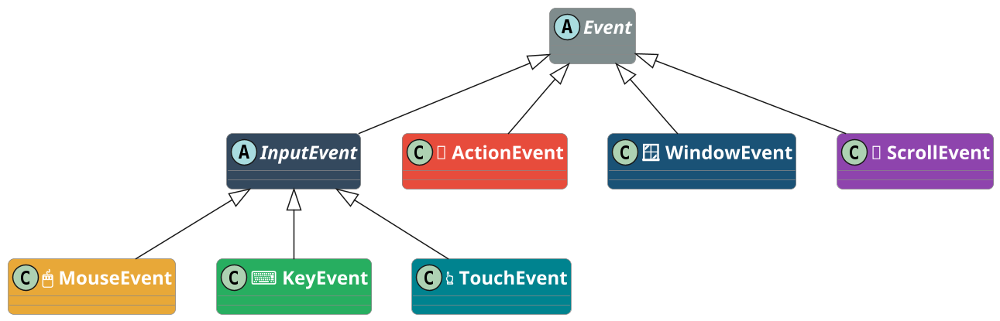

<!-- _class: lead -->
<!-- _header: "" -->
<!-- _footer: "" -->
<!-- _paginate: false -->

<style scoped>
section {
  background-image: url('assets/logo-amu.png');
  background-repeat: no-repeat;
  background-position: bottom 40px center;
  background-size: 380px;
}
</style>

# Propriétés, bindings et contrôles

**R2.02 - Développement d'applications avec IHM**

---

## Où en sommes-nous ?

<!-- _header: "" -->
<!-- _footer: "" -->

<div style="display: flex; gap: 0.8rem; margin-top: 0.5rem; margin-bottom: 0.5rem; text-align: center; font-size: 2.5rem; line-height: 1;">
<div style="flex: 1;">&nbsp;</div>
<div style="flex: 1;">👇</div>
<div style="flex: 1;">&nbsp;</div>
<div style="flex: 1;">&nbsp;</div>
</div>

<div style="display: flex; gap: 0.8rem;">
<div style="background: #4a90d9; color: white; padding: 1.2rem; border-radius: 12px 12px 0 0; flex: 1; text-align: center;">
<div style="font-size: 1.8rem; font-weight: bold;">CM1 ✅</div>
<div style="margin-top: 0.3rem;">Fondations IHM + JavaFX</div>
</div>
<div style="background: #e8a838; color: white; padding: 1.2rem; border-radius: 12px 12px 0 0; flex: 1; text-align: center; box-shadow: 0 4px 12px rgba(232,168,56,0.4);">
<div style="font-size: 1.8rem; font-weight: bold;">CM2</div>
<div style="margin-top: 0.3rem;">Propriétés et bindings</div>
</div>
<div style="background: #27ae60; color: white; padding: 1.2rem; border-radius: 12px 12px 0 0; flex: 1; text-align: center;">
<div style="font-size: 1.8rem; font-weight: bold;">CM3</div>
<div style="margin-top: 0.3rem;">Architecture et FXML</div>
</div>
<div style="background: #8e44ad; color: white; padding: 1.2rem; border-radius: 12px 12px 0 0; flex: 1; text-align: center;">
<div style="font-size: 1.8rem; font-weight: bold;">CM4</div>
<div style="margin-top: 0.3rem;">MVVM + persistance</div>
</div>
</div>

<div style="display: flex; gap: 0.8rem; text-align: center; font-size: 1.5rem; color: #999;">
<div style="flex: 1;">↓</div>
<div style="flex: 1;">↓</div>
<div style="flex: 1;">↓</div>
<div style="flex: 1;">↓</div>
</div>

<div style="display: flex; gap: 0.8rem;">
<div style="background: #d0e2f3; color: #2c5f8a; padding: 0.8rem; border-radius: 0 0 12px 12px; flex: 1; text-align: center; font-weight: bold;">
TP1 ✅
</div>
<div style="background: #fae5c0; color: #8a6a1f; padding: 0.8rem; border-radius: 0 0 12px 12px; flex: 1; text-align: center; font-weight: bold;">
TP2
</div>
<div style="background: #c8e6c9; color: #1b5e20; padding: 0.8rem; border-radius: 0 0 12px 12px; flex: 1; text-align: center; font-weight: bold;">
TP3
</div>
<div style="background: #e1bee7; color: #5c2473; padding: 0.8rem; border-radius: 0 0 12px 12px; flex: 1; text-align: center; font-weight: bold;">
TP4 + TP5
</div>
</div>

<div style="display: flex; gap: 0.8rem; margin-top: 0.5rem; text-align: center; font-size: 2.5rem; line-height: 1;">
<div style="flex: 1;">&nbsp;</div>
<div style="flex: 1;">👆</div>
<div style="flex: 1;">&nbsp;</div>
<div style="flex: 1;">&nbsp;</div>
</div>

---

## Rappel CM1 - Ce que vous savez déjà

<!-- _header: "" -->
<!-- _footer: "" -->

<div style="display: grid; grid-template-columns: 1fr 1fr 1fr; gap: 1.2rem; margin-top: 1.5rem;">
<div style="background: #4a90d9; color: white; padding: 1.2rem; border-radius: 10px;">
<div style="font-size: 1.7rem; margin-bottom: 0.5rem; font-weight: bold;">🎭 Le graphe de scène</div>
<div style="margin-top: 0.5rem; font-size: 1.5rem; opacity: 0.9;">
<b>Stage</b> = la fenêtre, <b>Scene</b> = le contenu, <b>Node</b> = chaque élément.<br/>
L'arbre de nœuds organise l'interface en hiérarchie parent/enfant.
</div>
</div>
<div style="background: #e8a838; color: white; padding: 1.2rem; border-radius: 10px;">
<div style="font-size: 1.7rem; margin-bottom: 0.5rem; font-weight: bold;">📦 Les conteneurs</div>
<div style="margin-top: 0.5rem; font-size: 1.5rem; opacity: 0.9;">
<b>BorderPane</b> (5 zones), <b>VBox/HBox</b> (empilements), <b>GridPane</b> (grille).<br/>
Les principes Gestalt guident le choix du conteneur.
</div>
</div>
<div style="background: #27ae60; color: white; padding: 1.2rem; border-radius: 10px;">
<div style="font-size: 1.7rem; margin-bottom: 0.5rem; font-weight: bold;">⚡ Les événements</div>
<div style="margin-top: 0.5rem; font-size: 1.5rem; opacity: 0.9;">
Le <b>pattern Observer</b> : le bouton notifie, le handler réagit.<br/>
3 styles d'écriture : classe nommée, anonyme, lambda.
</div>
</div>
</div>

<div style="background: #2c3e50; color: white; padding: 1.2rem 2rem; border-radius: 10px; margin-top: 1.5rem; font-size: 1.7rem; text-align: center;">
Aujourd'hui : rendre l'interface <b>réactive</b> sans écrire d'EventHandler pour chaque mise à jour.
</div>

---

<!-- _class: lead -->
<!-- _header: "" -->
<!-- _footer: "" -->

# Partie 1 - Le problème

---

## TP1 : la Palette, version naïve ❌

<!-- _header: "" -->
<!-- _footer: "" -->

<style scoped>
pre { font-size: 0.78rem; }
</style>

<p style="font-size:1.6rem">
Dans `Palette.java` (TP1, exercice 6), mettre à jour le label demande du code répété à chaque handler :
</p>

```java
int[] compteurs = {0, 0, 0};

btnRouge.setOnAction(e -> {
    compteurs[0]++;
    zone.setStyle("-fx-background-color: red;");
    labelCompteurs.setText(
        "Rouge: " + compteurs[0]
        + "  Vert: " + compteurs[1]
        + "  Bleu: " + compteurs[2]);
}); // même code dans btnVert et btnBleu...
```

<div style="background: #c0392b; color: white; padding: 0.8rem 1.5rem; border-radius: 10px; margin-top: 0.8rem;">
⚠️ <b>3 problèmes</b> : <code>setText()</code> copié-collé 3 fois - ajouter un bouton = oublier une mise à jour - le label n'est jamais la "source de vérité"
</div>

---

## TP2 : la PaletteReactive, version bindings ✅

<!-- _header: "" -->
<!-- _footer: "" -->

<style scoped>
pre { font-size: 0.78rem; }
</style>

<p style="font-size:1.6rem">
Dans <code>PaletteReactive.java</code> (TP2, exercice 3), un seul binding remplace les 3 <code>setText()</code> :
</p>

```java
StringExpression texte = Bindings.concat(
    "Rouge: ", btnRouge.nbClicsProperty().asString(),
    "  Vert: ", btnVert.nbClicsProperty().asString(),
    "  Bleu: ", btnBleu.nbClicsProperty().asString()
    );

labelCompteurs.textProperty().bind(texte);
```

<div style="background: #1e8449; color: white; padding: 0.8rem 1.5rem; border-radius: 10px; margin-top: 0.8rem;">
✅ <b>Résultat</b> :<br/>
&bull; Le label se met à jour <b>automatiquement</b> à chaque clic<br/>
&bull; Aucun <code>setText()</code> dans les handlers<br/>
&bull; Ajouter un bouton = allonger la concaténation
</div>

---

## La puissance des bindings - demo

Sans écrire un seul EventHandler, on peut synchroniser :

<div style="display: grid; grid-template-columns: 1fr 1fr; gap: 1.5rem; margin-top: 1rem;">
<div style="background: #f0f4f8; padding: 1.2rem; border-radius: 10px; border-left: 4px solid #4a90d9;">
<div style="font-weight: bold; margin-bottom: 0.5rem; font-size: 1.3rem;">⚙️ Avant (TP1)</div>
<div>Slider → clic → EventHandler → lire valeur → appeler <code>setText()</code> → appeler <code>setStyle()</code> → ...</div>
<div style="margin-top: 0.5rem; color: #e74c3c; font-weight: bold; font-size: 1.3rem;">5 lignes de code impératif</div>
</div>
<div style="background: #f0fff4; padding: 1.2rem; border-radius: 10px; border-left: 4px solid #27ae60;">
<div style="font-weight: bold; margin-bottom: 0.5rem; font-size: 1.3rem;">✅ Après (TP2)</div>
<div><code>label.textProperty().bind(<br/>  slider.valueProperty().asString())</code></div>
<div style="margin-top: 0.5rem; color: #27ae60; font-weight: bold; font-size: 1.3rem;">1 ligne déclarative</div>
</div>
</div>

<div style="background: #2c3e50; color: white; padding: 1rem 2rem; border-radius: 10px; margin-top: 1.5rem; text-align: center;">
Vous pratiquerez cette transformation dans les exercices 2 à 5 du TP2.
</div>

---

<!-- _transition: fade -->

## La liaison de données - approche impérative ❌
<!-- _header: "" -->
<!-- _footer: "" -->

<style scoped>h2 { view-transition-name: titre-liaison; }</style>

<svg viewBox="0 0 900 220" xmlns="http://www.w3.org/2000/svg" style="width:100%; display:block; margin:0.3rem auto;">
  <defs>
    <marker id="a1" markerWidth="8" markerHeight="6" refX="8" refY="3" orient="auto"><path d="M0,0 L8,3 L0,6" fill="#555"/></marker>
  </defs>
  <rect x="5" y="5" width="890" height="210" rx="12" fill="#fdf2f2" stroke="#e74c3c" stroke-width="2"/>
  <text x="450" y="32" text-anchor="middle" font-family="Arial" font-size="17" font-weight="bold" fill="#c0392b">❌ Approche impérative (TP1)</text>
  <!-- Nœuds - étalés sur toute la largeur -->
  <rect x="30" y="85" width="140" height="50" rx="10" fill="#f5f5f5" stroke="#ccc" stroke-width="1.5"/>
  <text x="100" y="115" text-anchor="middle" font-family="Arial" font-size="14" fill="#333">👤 Utilisateur</text>
  <rect x="250" y="85" width="130" height="50" rx="10" fill="#e74c3c"/>
  <text x="315" y="115" text-anchor="middle" font-family="Arial" font-size="14" fill="white">🔘 Button</text>
  <rect x="470" y="72" width="150" height="76" rx="10" fill="#c0392b"/>
  <text x="545" y="100" text-anchor="middle" font-family="Arial" font-size="14" fill="white">📝 Handler</text>
  <text x="545" y="120" text-anchor="middle" font-family="Arial" font-size="11" fill="rgba(255,255,255,0.8)">setText()</text>
  <text x="545" y="136" text-anchor="middle" font-family="Arial" font-size="11" fill="rgba(255,255,255,0.8)">setStyle()</text>
  <rect x="720" y="55" width="120" height="42" rx="10" fill="#8e44ad"/>
  <text x="780" y="81" text-anchor="middle" font-family="Arial" font-size="13" fill="white">🏷️ Label</text>
  <rect x="720" y="125" width="120" height="42" rx="10" fill="#8e44ad"/>
  <text x="780" y="151" text-anchor="middle" font-family="Arial" font-size="13" fill="white">📦 Pane</text>
  <!-- Flèches -->
  <line x1="170" y1="110" x2="248" y2="110" stroke="#555" stroke-width="2" marker-end="url(#a1)"/>
  <text x="209" y="103" text-anchor="middle" font-family="Arial" font-size="11" fill="#555">clic</text>
  <line x1="380" y1="110" x2="468" y2="110" stroke="#555" stroke-width="2" marker-end="url(#a1)"/>
  <text x="424" y="103" text-anchor="middle" font-family="Arial" font-size="10" fill="#555">EventHandler</text>
  <line x1="620" y1="92" x2="718" y2="78" stroke="#555" stroke-width="2" marker-end="url(#a1)"/>
  <text x="669" y="68" font-family="Arial" font-size="10" fill="#555">setText()</text>
  <line x1="620" y1="130" x2="718" y2="144" stroke="#555" stroke-width="2" marker-end="url(#a1)"/>
  <text x="669" y="160" font-family="Arial" font-size="10" fill="#555">setStyle()</text>
  <!-- Bilan -->
  <text x="450" y="198" text-anchor="middle" font-family="Arial" font-size="14" font-weight="bold" fill="#c0392b">Le handler fait TOUT manuellement</text>
</svg>

<div style="background: #c0392b; color: white; padding: 0.8rem 1.5rem; border-radius: 10px; margin-top: 0.8rem; text-align: center;">
⚠️ Chaque mise à jour visuelle demande du code <b>impératif</b> dans le handler. Plus l'interface est riche, plus le handler grossit.
</div>

---

<!-- _transition: fade -->

## La liaison de données - approche déclarative ✅
<!-- _header: "" -->
<!-- _footer: "" -->

<style scoped>h2 { view-transition-name: titre-liaison; }</style>

<svg viewBox="0 0 900 220" xmlns="http://www.w3.org/2000/svg" style="width:100%; display:block; margin:0.3rem auto;">
  <defs>
    <marker id="a2" markerWidth="8" markerHeight="6" refX="8" refY="3" orient="auto"><path d="M0,0 L8,3 L0,6" fill="#555"/></marker>
    <marker id="a2g" markerWidth="8" markerHeight="6" refX="8" refY="3" orient="auto"><path d="M0,0 L8,3 L0,6" fill="#27ae60"/></marker>
  </defs>
  <rect x="5" y="5" width="890" height="210" rx="12" fill="#f0faf0" stroke="#27ae60" stroke-width="2"/>
  <text x="450" y="32" text-anchor="middle" font-family="Arial" font-size="17" font-weight="bold" fill="#1e8449">✅ Approche déclarative (TP2)</text>
  <!-- Nœuds - étalés sur toute la largeur -->
  <rect x="30" y="85" width="140" height="50" rx="10" fill="#f5f5f5" stroke="#ccc" stroke-width="1.5"/>
  <text x="100" y="115" text-anchor="middle" font-family="Arial" font-size="14" fill="#333">👤 Utilisateur</text>
  <rect x="250" y="85" width="130" height="50" rx="10" fill="#e74c3c"/>
  <text x="315" y="115" text-anchor="middle" font-family="Arial" font-size="14" fill="white">🔘 Button</text>
  <rect x="470" y="72" width="150" height="76" rx="10" fill="#e8a838"/>
  <text x="545" y="100" text-anchor="middle" font-family="Arial" font-size="14" fill="white">⚡ Property</text>
  <text x="545" y="122" text-anchor="middle" font-family="Arial" font-size="11" fill="rgba(255,255,255,0.8)">nbClics</text>
  <rect x="720" y="55" width="120" height="42" rx="10" fill="#8e44ad"/>
  <text x="780" y="81" text-anchor="middle" font-family="Arial" font-size="13" fill="white">🏷️ Label</text>
  <rect x="720" y="125" width="120" height="42" rx="10" fill="#8e44ad"/>
  <text x="780" y="151" text-anchor="middle" font-family="Arial" font-size="13" fill="white">📦 Pane</text>
  <!-- Flèches pleines -->
  <line x1="170" y1="110" x2="248" y2="110" stroke="#555" stroke-width="2" marker-end="url(#a2)"/>
  <text x="209" y="103" text-anchor="middle" font-family="Arial" font-size="11" fill="#555">clic</text>
  <line x1="380" y1="110" x2="468" y2="110" stroke="#555" stroke-width="2" marker-end="url(#a2)"/>
  <text x="424" y="103" text-anchor="middle" font-family="Arial" font-size="11" fill="#555">+1</text>
  <!-- Flèches pointillées (bind) -->
  <line x1="620" y1="92" x2="718" y2="78" stroke="#27ae60" stroke-width="2.5" stroke-dasharray="6,4" marker-end="url(#a2g)"/>
  <text x="675" y="72" font-family="Arial" font-size="11" fill="#27ae60" font-weight="bold">bind</text>
  <line x1="620" y1="128" x2="718" y2="144" stroke="#27ae60" stroke-width="2.5" stroke-dasharray="6,4" marker-end="url(#a2g)"/>
  <text x="675" y="158" font-family="Arial" font-size="11" fill="#27ae60" font-weight="bold">bind</text>
  <!-- Bilan -->
  <text x="450" y="198" text-anchor="middle" font-family="Arial" font-size="14" font-weight="bold" fill="#1e8449">La propriété notifie AUTOMATIQUEMENT</text>
</svg>

<div style="background: #1e8449; color: white; padding: 0.8rem 1.5rem; border-radius: 10px; margin-top: 0.8rem; text-align: center;">
✅ Ajouter un composant visuel = ajouter <b>un bind()</b>. Le handler ne change pas. La propriété est la source unique de vérité.
</div>

---

<!-- _transition: fade -->

## La liaison de données - comparaison

<!-- _header: "" -->
<!-- _footer: "" -->

<style scoped>h2 { view-transition-name: titre-liaison; }</style>

<div style="display: flex; gap: 0.8rem; margin-top: 0.5rem;">

<svg viewBox="0 0 520 340" xmlns="http://www.w3.org/2000/svg" style="flex:1;">
  <defs><marker id="a3" markerWidth="6" markerHeight="5" refX="6" refY="2.5" orient="auto"><path d="M0,0 L6,2.5 L0,5" fill="#555"/></marker></defs>
  <rect x="3" y="3" width="514" height="334" rx="10" fill="#fdf2f2" stroke="#e74c3c" stroke-width="1.5"/>
  <text x="260" y="35" text-anchor="middle" font-family="Arial" font-size="18" font-weight="bold" fill="#c0392b">❌ Impératif (TP1)</text>
  <rect x="15" y="130" width="95" height="50" rx="7" fill="#f5f5f5" stroke="#ccc"/>
  <text x="62" y="160" text-anchor="middle" font-family="Arial" font-size="14" fill="#333">👤 User</text>
  <rect x="150" y="130" width="90" height="50" rx="7" fill="#e74c3c"/>
  <text x="195" y="160" text-anchor="middle" font-family="Arial" font-size="14" fill="white">🔘 Button</text>
  <rect x="280" y="110" width="100" height="90" rx="7" fill="#c0392b"/>
  <text x="330" y="145" text-anchor="middle" font-family="Arial" font-size="14" fill="white">📝 Handler</text>
  <text x="330" y="167" text-anchor="middle" font-family="Arial" font-size="12" fill="rgba(255,255,255,0.7)">setText()</text>
  <text x="330" y="184" text-anchor="middle" font-family="Arial" font-size="12" fill="rgba(255,255,255,0.7)">setStyle()</text>
  <rect x="425" y="70" width="75" height="45" rx="7" fill="#8e44ad"/>
  <text x="462" y="98" text-anchor="middle" font-family="Arial" font-size="14" fill="white">🏷️ Label</text>
  <rect x="425" y="195" width="75" height="45" rx="7" fill="#8e44ad"/>
  <text x="462" y="223" text-anchor="middle" font-family="Arial" font-size="14" fill="white">📦 Pane</text>
  <line x1="110" y1="155" x2="148" y2="155" stroke="#555" stroke-width="1.5" marker-end="url(#a3)"/>
  <line x1="240" y1="155" x2="278" y2="155" stroke="#555" stroke-width="1.5" marker-end="url(#a3)"/>
  <line x1="380" y1="130" x2="423" y2="98" stroke="#555" stroke-width="1.5" marker-end="url(#a3)"/>
  <line x1="380" y1="178" x2="423" y2="210" stroke="#555" stroke-width="1.5" marker-end="url(#a3)"/>
  <text x="260" y="310" text-anchor="middle" font-family="Arial" font-size="16" font-weight="bold" fill="#c0392b">Le handler fait tout</text>
</svg>

<svg viewBox="0 0 520 340" xmlns="http://www.w3.org/2000/svg" style="flex:1;">
  <defs>
    <marker id="a4" markerWidth="6" markerHeight="5" refX="6" refY="2.5" orient="auto"><path d="M0,0 L6,2.5 L0,5" fill="#555"/></marker>
    <marker id="a4g" markerWidth="6" markerHeight="5" refX="6" refY="2.5" orient="auto"><path d="M0,0 L6,2.5 L0,5" fill="#27ae60"/></marker>
  </defs>
  <rect x="3" y="3" width="514" height="334" rx="10" fill="#f0faf0" stroke="#27ae60" stroke-width="1.5"/>
  <text x="260" y="35" text-anchor="middle" font-family="Arial" font-size="18" font-weight="bold" fill="#1e8449">✅ Déclaratif (TP2)</text>
  <rect x="15" y="130" width="95" height="50" rx="7" fill="#f5f5f5" stroke="#ccc"/>
  <text x="62" y="160" text-anchor="middle" font-family="Arial" font-size="14" fill="#333">👤 User</text>
  <rect x="150" y="130" width="90" height="50" rx="7" fill="#e74c3c"/>
  <text x="195" y="160" text-anchor="middle" font-family="Arial" font-size="14" fill="white">🔘 Button</text>
  <rect x="280" y="110" width="100" height="90" rx="7" fill="#e8a838"/>
  <text x="330" y="145" text-anchor="middle" font-family="Arial" font-size="14" fill="white">⚡ Property</text>
  <text x="330" y="167" text-anchor="middle" font-family="Arial" font-size="12" fill="rgba(255,255,255,0.7)">nbClics</text>
  <rect x="425" y="70" width="75" height="45" rx="7" fill="#8e44ad"/>
  <text x="462" y="98" text-anchor="middle" font-family="Arial" font-size="14" fill="white">🏷️ Label</text>
  <rect x="425" y="195" width="75" height="45" rx="7" fill="#8e44ad"/>
  <text x="462" y="223" text-anchor="middle" font-family="Arial" font-size="14" fill="white">📦 Pane</text>
  <line x1="110" y1="155" x2="148" y2="155" stroke="#555" stroke-width="1.5" marker-end="url(#a4)"/>
  <line x1="240" y1="155" x2="278" y2="155" stroke="#555" stroke-width="1.5" marker-end="url(#a4)"/>
  <line x1="380" y1="130" x2="423" y2="98" stroke="#27ae60" stroke-width="2" stroke-dasharray="5,3" marker-end="url(#a4g)"/>
  <line x1="380" y1="178" x2="423" y2="210" stroke="#27ae60" stroke-width="2" stroke-dasharray="5,3" marker-end="url(#a4g)"/>
  <text x="260" y="310" text-anchor="middle" font-family="Arial" font-size="16" font-weight="bold" fill="#1e8449">La propriété notifie auto.</text>
</svg>

</div>

<div style="background: #2c3e50; color: white; padding: 0.8rem 1.5rem; border-radius: 10px; margin-top: 0.8rem; text-align: center;">
💡 La <b>propriété</b> devient le point central : elle stocke la donnée ET notifie automatiquement tous les composants liés.
</div>

---

<!-- _class: lead -->
<!-- _header: "" -->
<!-- _footer: "" -->

# Partie 2 - ⚡ Modèle événementiel complet

---

## Rappel : les 3 styles d'EventHandler

<!-- _header: "" -->
<!-- _footer: "" -->

<style scoped>
pre { min-height: 4rem; }
</style>

Trois façons d'écrire le même comportement, revus dans le TP1 (exercice 5) :

<div style="display: grid; grid-template-columns: 1fr 1fr 1fr; gap: 1rem; margin-top: 1rem;">

<div style="background: #8e44ad; color: white; padding: 1rem; border-radius: 10px;">
<div style="font-size: 2rem; text-align: center;">📝 Classe nommée</div>

```java
class MonEcouteur
  implements EventHandler<ActionEvent> {
  public void handle(ActionEvent e) {
    /* ... */
  }
}
btn.setOnAction(new MonEcouteur());
```

<div style="margin-top: 0.5rem; font-size: 1.5rem; text-align: center; background: rgba(255,255,255,0.2); padding: 0.3rem; border-radius: 6px;">Réutilisable, testable</div>
</div>

<div style="background: #e8a838; color: white; padding: 1rem; border-radius: 10px;">
<div style="font-size: 2rem; text-align: center;">⚙️ Classe anonyme</div>


```java
btn.setOnAction(
  new EventHandler<ActionEvent>() {
    public void handle(ActionEvent e) {
      /* ... */
    }
  });
```

<div style="margin-top: 0.5rem; font-size: 1.5rem; text-align: center; background: rgba(255,255,255,0.2); padding: 0.3rem; border-radius: 6px;">Inline, verbeux</div>
</div>

<div style="background: #27ae60; color: white; padding: 1rem; border-radius: 10px;">
<div style="font-size: 2rem; text-align: center;">🎯 Lambda</div>

```java
// Syntaxe Java 8+ (expression lambda).
btn.setOnAction((ActionEvent e) -> {
  /* traitement à effectuer ... */
});
```

<div style="margin-top: 0.5rem; font-size: 1.5rem; text-align: center; background: rgba(255,255,255,0.2); padding: 0.3rem; border-radius: 6px;">Concis, recommandé ✅</div>
</div>

</div>

<div style="background: #2c3e50; color: white; padding: 0.8rem 1.5rem; border-radius: 10px; margin-top: 1rem; text-align: center;">
👉 Regardons <b>comment les <code>EventHandler</code> fonctionnent en profondeur</b> : leur parcours dans l'arbre de scène, et le mécanisme qui permet à un conteneur d'intercepter un événement avant ses enfants.
</div>

---

## La propagation - phase de capture (1/2)

<!-- _header: "" -->
<!-- _footer: "" -->

<p style="font-size: 1.6rem;">
Quand vous cliquez sur un bouton, l'événement <b>ne naît pas dans le bouton</b>. Il commence à la racine de la scène et descend jusqu'à la cible.
</p>
<svg viewBox="0 0 1200 260" xmlns="http://www.w3.org/2000/svg" style="width:100%; display:block; margin:0.3rem auto;">
  <defs>
    <marker id="capArr" markerWidth="6" markerHeight="6" refX="6" refY="3" orient="auto"><path d="M0,0 L6,3 L0,6" fill="#e74c3c"/></marker>
  </defs>

  <!-- Étage 1 : Scene (bord gauche) -->
  <rect x="0" y="20" width="260" height="55" rx="10" fill="#7bb563" stroke="#5a9e45" stroke-width="2"/>
  <text x="130" y="55" text-anchor="middle" font-family="Arial" font-size="20" fill="white" font-weight="bold">🎬 Scene</text>

  <!-- Étage 2 : BorderPane -->
  <rect x="313" y="85" width="260" height="55" rx="10" fill="#e8a838" stroke="#c87d10" stroke-width="2"/>
  <text x="443" y="120" text-anchor="middle" font-family="Arial" font-size="20" fill="white" font-weight="bold">🗺️ BorderPane</text>

  <!-- Étage 3 : HBox -->
  <rect x="627" y="150" width="260" height="55" rx="10" fill="#e8a838" stroke="#c87d10" stroke-width="2"/>
  <text x="757" y="185" text-anchor="middle" font-family="Arial" font-size="20" fill="white" font-weight="bold">↔ HBox</text>

  <!-- Étage 4 : Button (cible) (bord droit) -->
  <rect x="940" y="205" width="260" height="55" rx="10" fill="#e74c3c" stroke="#c0392b" stroke-width="2"/>
  <text x="1070" y="240" text-anchor="middle" font-family="Arial" font-size="20" fill="white" font-weight="bold">🔘 Button (cible)</text>

  <!-- Flèches orthogonales (descente en L : ↓ puis →) avec annotations -->
  <!-- De Scene vers BorderPane -->
  <polyline points="130,75 130,112 311,112" stroke="#e74c3c" stroke-width="3" fill="none" marker-end="url(#capArr)"/>
  <text x="145" y="102" font-family="Arial" font-size="14" fill="#c0392b" font-style="italic">1. reçoit en premier</text>
  <!-- De BorderPane vers HBox -->
  <polyline points="443,140 443,177 625,177" stroke="#e74c3c" stroke-width="3" fill="none" marker-end="url(#capArr)"/>
  <text x="458" y="167" font-family="Arial" font-size="14" fill="#c0392b" font-style="italic">2. puis transmet</text>
  <!-- De HBox vers Button -->
  <polyline points="757,205 757,232 938,232" stroke="#e74c3c" stroke-width="3" fill="none" marker-end="url(#capArr)"/>
  <text x="772" y="222" font-family="Arial" font-size="14" fill="#c0392b" font-style="italic">3. arrive à la cible</text>
</svg>

<div style="background: #e74c3c; color: white; padding: 0.6rem 1.5rem; border-radius: 10px; margin-top: 2rem; font-size: 1.6rem;">
⬇️ <b>Phase de CAPTURE</b> : la racine peut <b>intercepter</b> l'événement avant la cible via <code>addEventFilter()</code>. Utile pour filtrer, logger ou bloquer (<code>event.consume()</code>).
</div>

---

## La propagation - phase de bubbling (2/2)

<!-- _header: "" -->
<!-- _footer: "" -->

<p style="font-size: 1.6rem;">
Après la phase de capture, l'événement <b>remonte</b> de la cible vers la racine : c'est la phase qui déclenche vos <code>setOnAction()</code> habituels.
</p>
<svg viewBox="0 0 1200 260" xmlns="http://www.w3.org/2000/svg" style="width:100%; display:block; margin:0.3rem auto;">
  <defs>
    <marker id="bubArr" markerWidth="6" markerHeight="6" refX="6" refY="3" orient="auto"><path d="M0,0 L6,3 L0,6" fill="#27ae60"/></marker>
  </defs>

  <!-- Étage 1 : Scene (bord gauche) -->
  <rect x="0" y="20" width="260" height="55" rx="10" fill="#7bb563" stroke="#5a9e45" stroke-width="2"/>
  <text x="130" y="55" text-anchor="middle" font-family="Arial" font-size="20" fill="white" font-weight="bold">🎬 Scene</text>

  <!-- Étage 2 : BorderPane -->
  <rect x="313" y="85" width="260" height="55" rx="10" fill="#e8a838" stroke="#c87d10" stroke-width="2"/>
  <text x="443" y="120" text-anchor="middle" font-family="Arial" font-size="20" fill="white" font-weight="bold">🗺️ BorderPane</text>

  <!-- Étage 3 : HBox -->
  <rect x="627" y="150" width="260" height="55" rx="10" fill="#e8a838" stroke="#c87d10" stroke-width="2"/>
  <text x="757" y="185" text-anchor="middle" font-family="Arial" font-size="20" fill="white" font-weight="bold">↔ HBox</text>

  <!-- Étage 4 : Button (cible - bord droit) -->
  <rect x="940" y="205" width="260" height="55" rx="10" fill="#e74c3c" stroke="#c0392b" stroke-width="2"/>
  <text x="1070" y="240" text-anchor="middle" font-family="Arial" font-size="20" fill="white" font-weight="bold">🔘 Button (cible)</text>

  <!-- Flèches orthogonales inversées (remontée en L : ← puis ↑) avec annotations -->
  <!-- De Button (départ bord gauche, centre vertical) vers HBox (centre horizontal, bas) -->
  <polyline points="940,232 757,232 757,205" stroke="#27ae60" stroke-width="3" fill="none" marker-end="url(#bubArr)"/>
  <text x="773" y="222" font-family="Arial" font-size="14" fill="#1e8449" font-style="italic">1. traitement ici</text>
  <!-- De HBox (départ bord gauche, centre vertical) vers BorderPane (centre horizontal, bas) -->
  <polyline points="627,177 443,177 443,140" stroke="#27ae60" stroke-width="3" fill="none" marker-end="url(#bubArr)"/>
  <text x="459" y="167" font-family="Arial" font-size="14" fill="#1e8449" font-style="italic">2. puis remonte</text>
  <!-- De BorderPane (départ bord gauche, centre vertical) vers Scene (centre horizontal, bas) -->
  <polyline points="313,112 130,112 130,75" stroke="#27ae60" stroke-width="3" fill="none" marker-end="url(#bubArr)"/>
  <text x="146" y="102" font-family="Arial" font-size="14" fill="#1e8449" font-style="italic">3. termine à la racine</text>
</svg>

<div style="background: #1e8449; color: white; padding: 0.6rem 1.5rem; border-radius: 10px; margin-top: 2rem; font-size: 1.6rem;">
⬆️ <b>Phase de BUBBLING</b> : la cible est traitée en premier. Se configure avec <code>addEventHandler()</code>. <code>setOnAction()</code> est un raccourci pour <code>addEventHandler(ActionEvent.ACTION, ...)</code>.
</div>

---

## EventFilter vs EventHandler

<!-- _header: "" -->
<!-- _footer: "" -->

<div style="display: grid; grid-template-columns: 1fr 1fr; gap: 1.5rem; margin-top: 0.5rem;">

<div style="background: #c0392b; color: white; padding: 1.2rem; border-radius: 10px;">
<div style="font-size: 1.8rem; font-weight: bold; text-align: center; margin-bottom: 0.8rem;">⬇️ addEventFilter()</div>
<div style="font-size: 1.5rem; line-height: 1.6;">
&bull; Phase de <b>capture</b> (descente)<br/>
&bull; Enregistré sur un <b>parent</b><br/>
&bull; Peut <b>bloquer</b> avant la cible<br/>
&bull; Usage : validation globale, log
</div>
<div style="background: rgba(0,0,0,0.25); padding: 0.6rem; border-radius: 6px; margin-top: 0.8rem; font-family: monospace; font-size: 1rem;">
panneau.addEventFilter(<br/>
&nbsp;&nbsp;MouseEvent.MOUSE_CLICKED,<br/>
&nbsp;&nbsp;e -> e.consume());
</div>
</div>

<div style="background: #1e8449; color: white; padding: 1.2rem; border-radius: 10px;">
<div style="font-size: 1.8rem; font-weight: bold; text-align: center; margin-bottom: 0.8rem;">⬆️ addEventHandler()</div>
<div style="font-size: 1.5rem; line-height: 1.6;">
&bull; Phase de <b>bubbling</b> (remontée)<br/>
&bull; Enregistré sur la cible ou un parent<br/>
&bull; Traitement normal<br/>
&bull; Usage : 99% des cas ✅
</div>
<div style="background: rgba(0,0,0,0.25); padding: 0.6rem; border-radius: 6px; margin-top: 0.8rem; font-family: monospace; font-size: 1rem;">
btn.addEventHandler(<br/>
&nbsp;&nbsp;ActionEvent.ACTION,<br/>
&nbsp;&nbsp;e -> traiter());&nbsp;&nbsp;<i>// ≡ setOnAction()</i>
</div>
</div>

</div>

<div style="background: #2c3e50; color: white; padding: 0.6rem 1.5rem; border-radius: 10px; margin-top: 1rem; text-align: center; font-size: 1.5rem;">
💡 <b>Règle pratique</b> : utilisez <code>setOnAction()</code> dans 99% des cas. Les filters sont réservés à l'interception globale (logging, validation, désactivation).
</div>

---

## Arrêter la propagation : event.consume()

<!-- _header: "" -->
<!-- _footer: "" -->

<p style="font-size:1.6rem">
Un handler peut décider qu'il a <b>traité l'événement</b> : les handlers suivants sur le chemin ne seront pas appelés.
</p>

<svg viewBox="0 0 1200 200" xmlns="http://www.w3.org/2000/svg" style="width:100%; display:block; margin:0.3rem auto;">
  <defs>
    <marker id="consArr" markerWidth="7" markerHeight="7" refX="7" refY="3.5" orient="auto"><path d="M0,0 L7,3.5 L0,7" fill="#27ae60"/></marker>
    <marker id="consArrRed" markerWidth="7" markerHeight="7" refX="7" refY="3.5" orient="auto"><path d="M0,0 L7,3.5 L0,7" fill="#c0392b"/></marker>
  </defs>

  <!-- Chaîne de propagation, tous les nœuds -->
  <!-- Button : reçoit ET consume (conserve sa couleur de convention rouge) -->
  <rect x="20" y="70" width="260" height="60" rx="10" fill="#e74c3c" stroke="#c0392b" stroke-width="3"/>
  <text x="150" y="95" text-anchor="middle" font-family="Arial" font-size="18" fill="white" font-weight="bold">🔘 Button</text>
  <text x="150" y="115" text-anchor="middle" font-family="Arial" font-size="12" fill="rgba(255,255,255,0.95)">handler ✅ + e.consume()</text>

  <!-- HBox : jamais atteint -->
  <rect x="400" y="70" width="200" height="60" rx="10" fill="#f0f0f0" stroke="#ccc" stroke-width="2" stroke-dasharray="5,3"/>
  <text x="500" y="95" text-anchor="middle" font-family="Arial" font-size="18" fill="#bbb" font-weight="bold">↔ HBox</text>
  <text x="500" y="115" text-anchor="middle" font-family="Arial" font-size="11" fill="#bbb" font-style="italic">jamais notifié</text>

  <!-- BorderPane : jamais atteint -->
  <rect x="680" y="70" width="220" height="60" rx="10" fill="#f0f0f0" stroke="#ccc" stroke-width="2" stroke-dasharray="5,3"/>
  <text x="790" y="95" text-anchor="middle" font-family="Arial" font-size="18" fill="#bbb" font-weight="bold">🗺️ BorderPane</text>
  <text x="790" y="115" text-anchor="middle" font-family="Arial" font-size="11" fill="#bbb" font-style="italic">jamais notifié</text>

  <!-- Scene : jamais atteint -->
  <rect x="980" y="70" width="200" height="60" rx="10" fill="#f0f0f0" stroke="#ccc" stroke-width="2" stroke-dasharray="5,3"/>
  <text x="1080" y="95" text-anchor="middle" font-family="Arial" font-size="18" fill="#bbb" font-weight="bold">🎬 Scene</text>
  <text x="1080" y="115" text-anchor="middle" font-family="Arial" font-size="11" fill="#bbb" font-style="italic">jamais notifié</text>

  <!-- Entre Button et HBox : barre de STOP rouge -->
  <line x1="300" y1="60" x2="380" y2="140" stroke="#c0392b" stroke-width="5" stroke-linecap="round"/>
  <line x1="380" y1="60" x2="300" y2="140" stroke="#c0392b" stroke-width="5" stroke-linecap="round"/>
  <text x="340" y="42" text-anchor="middle" font-family="Arial" font-size="14" fill="#c0392b" font-weight="bold">🛑 STOP</text>
  <text x="340" y="175" text-anchor="middle" font-family="Arial" font-size="13" fill="#c0392b" font-style="italic">la propagation s'arrête ici</text>
</svg>

<style scoped>
.code-card { background: #f5f5f5; border: 3px solid #1e8449; border-radius: 8px; overflow: hidden; }
.code-card pre { margin: 0 !important; border: none !important; border-radius: 0 !important; }
</style>

<div style="display: grid; grid-template-columns: 2fr 1fr; gap: 1rem; margin-top: 0.8rem;">

<div class="code-card">

```java
bouton.addEventHandler(MouseEvent.MOUSE_CLICKED, e -> {
    if (e.getClickCount() == 2) {
        traiterDoubleClic();
        e.consume();  // 🛑 stoppe la propagation
    }
});
```

</div>

<div style="background: #2c3e50; color: white; padding: 0.8rem; border-radius: 8px; font-size: 1rem;">
💡 <b>Cas d'usage</b> : éviter qu'un parent intercepte aussi l'événement (ex. double-clic traité localement, drag-and-drop, raccourci clavier).
</div>

</div>

---

## Hiérarchie des types d'événement



<div style="background: #2c3e50; color: white; padding: 0.8rem 1.5rem; border-radius: 10px; margin-top: 0.5rem; text-align: center; font-size: 1.6rem;">
💡 Chaque type porte des <b>données spécifiques</b> : <code>MouseEvent</code> → coordonnées (<code>getX()</code>, <code>getY()</code>), <code>KeyEvent</code> → code de touche (<code>getCode()</code>), <code>ActionEvent</code> → source du clic.
</div>

---

## 🖱️ MouseEvent - les événements souris

<!-- _header: "" -->
<!-- _footer: "" -->

<div style="display: grid; grid-template-columns: 1fr 1fr; gap: 1rem; margin-top: 0.5rem;">

<div style="background: #e8a838; color: white; padding: 1rem; border-radius: 10px;">
<div style="font-size: 1.4rem; font-weight: bold; margin-bottom: 0.5rem;">🖱️ setOnMouseClicked</div>
<div style="font-size: 1.3rem; margin-bottom: 0.5rem;">Déclenché sur un clic complet (press + release au même endroit).</div>
<div style="background: rgba(0,0,0,0.25); padding: 0.5rem; border-radius: 6px; font-family: monospace; font-size: 1.2rem;">
zone.setOnMouseClicked(e -><br/>
&nbsp;&nbsp;afficher(e.getX(), e.getY()));
</div>
</div>

<div style="background: #e8a838; color: white; padding: 1rem; border-radius: 10px;">
<div style="font-size: 1.4rem; font-weight: bold; margin-bottom: 0.5rem;">👆 setOnMouseEntered / Exited</div>
<div style="font-size: 1.3rem; margin-bottom: 0.5rem;">Quand la souris survole ou quitte une zone. Utile pour le feedback visuel (hover).</div>
<div style="background: rgba(0,0,0,0.25); padding: 0.5rem; border-radius: 6px; font-family: monospace; font-size: 1.2rem;">
zone.setOnMouseEntered(e -><br/>
&nbsp;&nbsp;zone.setStyle("-fx-background: yellow;"));
</div>
</div>

<div style="background: #e8a838; color: white; padding: 1rem; border-radius: 10px;">
<div style="font-size: 1.4rem; font-weight: bold; margin-bottom: 0.5rem;">✋ setOnMouseDragged</div>
<div style="font-size: 1.3rem; margin-bottom: 0.5rem;">Déplacement avec le bouton maintenu enfoncé. Base du drag-and-drop (TP2 bonus Pong).</div>
<div style="background: rgba(0,0,0,0.25); padding: 0.5rem; border-radius: 6px; font-family: monospace; font-size: 1.2rem;">
zone.setOnMouseDragged(e -> {<br/>
&nbsp;&nbsp;cercle.setCenterX(e.getX());<br/>
&nbsp;&nbsp;cercle.setCenterY(e.getY()); });
</div>
</div>

<div style="background: #2c3e50; color: white; padding: 1rem; border-radius: 10px;">
<div style="font-size: 1.4rem; font-weight: bold; margin-bottom: 0.5rem;">📐 Coordonnées</div>
<div style="font-size: 1.2rem;">
&bull; <code>e.getX()</code> / <code>e.getY()</code> : <b>locales</b> au nœud<br/>
&bull; <code>e.getSceneX()</code> / <code>e.getSceneY()</code> : dans la <b>Scene</b> entière<br/>
&bull; <code>e.getScreenX()</code> / <code>e.getScreenY()</code> : à l'<b>écran</b>
</div>
</div>

</div>

---

## ⌨️ KeyEvent - les événements clavier

<!-- _header: "" -->
<!-- _footer: "" -->

<div style="display: grid; grid-template-columns: 1fr 1fr; gap: 1rem; margin-top: 0.5rem;">

<div style="background: #27ae60; color: white; padding: 1rem; border-radius: 10px;">
<div style="font-size: 1.4rem; font-weight: bold; margin-bottom: 0.5rem;">🔽 setOnKeyPressed</div>
<div style="font-size: 1.5rem; margin-bottom: 0.5rem;">Une touche <b>physique</b> est enfoncée. Utile pour détecter les touches spéciales (Entrée, flèches, Escape). </div>
<div style="background: rgba(0,0,0,0.25); padding: 0.5rem; border-radius: 6px; font-family: monospace; font-size: 1.15rem;">
tf.setOnKeyPressed(e -> {<br/>
&nbsp;&nbsp;if (e.getCode() == KeyCode.ENTER)<br/>
&nbsp;&nbsp;&nbsp;&nbsp;valider(); });
</div>
</div>

<div style="background: #27ae60; color: white; padding: 1rem; border-radius: 10px;">
<div style="font-size: 1.4rem; font-weight: bold; margin-bottom: 0.5rem;">⌨️ setOnKeyTyped</div>
<div style="font-size: 1.5rem; margin-bottom: 0.5rem;">Un <b>caractère</b> Unicode a été produit (après combinaison de touches). Plus adapté pour la saisie de texte.</div>
<div style="background: rgba(0,0,0,0.25); padding: 0.5rem; border-radius: 6px; font-family: monospace; font-size: 1.15rem;">
tf.setOnKeyTyped(e -><br/>
&nbsp;&nbsp;afficher(e.getCharacter()));
</div>
</div>

<div style="background: #27ae60; color: white; padding: 1rem; border-radius: 10px;">
<div style="font-size: 1.4rem; font-weight: bold; margin-bottom: 0.5rem;">🎹 Raccourcis</div>
<div style="font-size: 1.5rem; margin-bottom: 0.5rem;">Les modificateurs (<code>Ctrl</code>, <code>Shift</code>, <code>Alt</code>) se testent avec <code>isXxxDown()</code>.</div>
<div style="background: rgba(0,0,0,0.25); padding: 0.5rem; border-radius: 6px; font-family: monospace; font-size: 1.15rem;">
if (e.isControlDown() &&<br/>
&nbsp;&nbsp;e.getCode() == KeyCode.Z)<br/>
&nbsp;&nbsp;&nbsp;&nbsp;annuler();
</div>
</div>

<div style="background: #2c3e50; color: white; padding: 1rem; border-radius: 10px;">
<div style="font-size: 1.4rem; font-weight: bold; margin-bottom: 0.5rem;">💡 Pressed vs Typed</div>
<div style="font-size: 1.4rem;">
&bull; <b>PRESSED</b> : touche physique (F1, flèches, Shift seul)<br/>
&bull; <b>TYPED</b> : caractère produit (lettres, chiffres)<br/>
&bull; <b>RELEASED</b> : touche relâchée
</div>
</div>

</div>

---

## 🎯 ActionEvent - le plus courant

<!-- _header: "" -->
<!-- _footer: "" -->

<p style="font-size:1.6rem">
<code>ActionEvent</code> est l'événement <b>applicatif</b> : il signale une action utilisateur <i>sémantique</i> (clic validé, valeur choisie), indépendamment du périphérique (souris, clavier, tactile).
</p>

<div style="display: grid; grid-template-columns: 1fr 1fr; gap: 1rem; margin-top: 0.5rem;">

<div style="background: #e74c3c; color: white; padding: 1rem; border-radius: 10px;">
<div style="font-size: 1.5rem; font-weight: bold; margin-bottom: 0.5rem;">🔘 Sources d'ActionEvent</div>
<div style="font-size: 1.5rem;">
&bull; <code>Button</code> cliqué<br/>
&bull; <code>MenuItem</code> sélectionné<br/>
&bull; <code>TextField</code> + Entrée<br/>
&bull; <code>CheckBox</code> cochée / décochée
</div>
</div>

<div style="background: #e74c3c; color: white; padding: 1rem; border-radius: 10px;">
<div style="font-size: 1.5rem; font-weight: bold; margin-bottom: 0.5rem;">⚡ setOnAction() = raccourci</div>
<div style="font-size: 1.5rem; margin-bottom: 0.5rem;">Ces deux lignes sont <b>équivalentes</b> :</div>
<div style="background: rgba(0,0,0,0.25); padding: 0.5rem; border-radius: 6px; font-family: monospace; font-size: 1.5rem;">
btn.setOnAction(e -> traiter());<br/>
btn.addEventHandler(<br/>
&nbsp;&nbsp;ActionEvent.ACTION,<br/>
&nbsp;&nbsp;e -> traiter());
</div>
</div>

</div>

<div style="background: #2c3e50; color: white; padding: 0.8rem 1.5rem; border-radius: 10px; margin-top: 1rem; font-size: 1.5rem;">
💡 Dans le TP2 et tous les TP suivants, vous utiliserez quasi exclusivement <code>ActionEvent</code> via <code>setOnAction()</code>.
</div>

---

## 🌐 Les autres événements

<!-- _header: "" -->
<!-- _footer: "" -->

<p style="font-size:1.6rem">
JavaFX propose de nombreux autres types d'événements pour couvrir tous les cas d'interaction. Vous les rencontrerez selon vos besoins.
</p>

<div style="display: grid; grid-template-columns: 1fr 1fr 1fr; gap: 1rem; margin-top: 0.5rem;">

<div style="background: #1a5276; color: white; padding: 1rem; border-radius: 10px;">
<div style="font-size: 1.5rem; font-weight: bold; margin-bottom: 0.5rem;">🪟 WindowEvent</div>
<div style="font-size: 1.4rem; margin-bottom: 0.5rem;">Cycle de vie d'une fenêtre (Stage).</div>
<div style="background: rgba(0,0,0,0.25); padding: 0.5rem; border-radius: 6px; font-family: monospace; font-size: 1.3rem;">
stage.setOnCloseRequest(<br/>
&nbsp;&nbsp;e -> sauvegarder());
</div>
<div style="font-size: 1.4rem; margin-top: 0.5rem; font-style: italic;">WINDOW_SHOWN, HIDING, CLOSE_REQUEST</div>
</div>

<div style="background: #8e44ad; color: white; padding: 1rem; border-radius: 10px;">
<div style="font-size: 1.5rem; font-weight: bold; margin-bottom: 0.5rem;">🎢 ScrollEvent</div>
<div style="font-size: 1.4rem; margin-bottom: 0.5rem;">Molette ou trackpad à deux doigts.</div>
<div style="background: rgba(0,0,0,0.25); padding: 0.5rem; border-radius: 6px; font-family: monospace; font-size: 1.3rem;">
zone.setOnScroll(e -><br/>
&nbsp;&nbsp;zoomer(e.getDeltaY()));
</div>
<div style="font-size: 1.4rem; margin-top: 0.5rem; font-style: italic;">getDeltaX() / getDeltaY()</div>
</div>

<div style="background: #00838f; color: white; padding: 1rem; border-radius: 10px;">
<div style="font-size: 1.5rem; font-weight: bold; margin-bottom: 0.5rem;">👆 TouchEvent</div>
<div style="font-size: 1.4rem; margin-bottom: 0.5rem;">Écrans tactiles multi-touch.</div>
<div style="background: rgba(0,0,0,0.25); padding: 0.5rem; border-radius: 6px; font-family: monospace; font-size: 1.3rem;">
zone.setOnTouchPressed(<br/>
&nbsp;&nbsp;e -> traiter(<br/>
&nbsp;&nbsp;&nbsp;&nbsp;e.getTouchPoints()));
</div>
<div style="font-size: 1.4rem; margin-top: 0.5rem; font-style: italic;">TOUCH_PRESSED, MOVED, RELEASED</div>
</div>

</div>

<div style="background: #2c3e50; color: white; padding: 0.8rem 1.5rem; border-radius: 10px; margin-top: 1rem; font-size: 1.6rem;">
💡 Et aussi : <code>DragEvent</code> (glisser-déposer entre applications), <code>InputMethodEvent</code> (saisie de caractères composés, émojis), <code>GestureEvent</code> (pincer, pivoter, balayer).
</div>

---

## 🧠 Nielsen #1 approfondi : feedback et temps de réponse

<!-- _header: "" -->
<!-- _footer: "" -->

<p style="font-size:1.5rem; font-style: italic; background: #f5f5f5; padding: 0.8rem 1.2rem; border-left: 4px solid #8e44ad; border-radius: 6px;">
« Le système doit toujours informer l'utilisateur de ce qui se passe, par un retour approprié dans un délai raisonnable. »<br/>
<span style="font-size: 1.1rem; color: #666;">Jakob Nielsen, <i>10 Usability Heuristics</i> (1994)</span>
</p>

<div style="display: grid; grid-template-columns: 1fr 1fr 1fr; gap: 1rem; margin-top: 0.8rem;">

<div style="background: #27ae60; color: white; padding: 1rem; border-radius: 8px;">
<div style="font-size: 2rem; font-weight: bold; text-align: center;">&lt; 500 ms</div>
<div style="font-size: 1.3rem; font-weight: bold; text-align: center; margin-top: 0.3rem;">Instantané</div>
<div style="font-size: 1.15rem; margin-top: 0.6rem;">Perçu comme une conséquence directe de l'action.</div>
<div style="font-size: 1.05rem; font-style: italic; margin-top: 0.5rem; background: rgba(0,0,0,0.2); padding: 0.4rem; border-radius: 6px;">Clic de bouton, survol, changement de couleur, binding.</div>
</div>

<div style="background: #e8a838; color: white; padding: 1rem; border-radius: 8px;">
<div style="font-size: 2rem; font-weight: bold; text-align: center;">&lt; 3 s</div>
<div style="font-size: 1.3rem; font-weight: bold; text-align: center; margin-top: 0.3rem;">Acceptable</div>
<div style="font-size: 1.15rem; margin-top: 0.6rem;">L'utilisateur reste concentré, un indicateur visuel suffit.</div>
<div style="font-size: 1.05rem; font-style: italic; margin-top: 0.5rem; background: rgba(0,0,0,0.2); padding: 0.4rem; border-radius: 6px;">Curseur "sablier", spinner, tri d'une liste, calcul local.</div>
</div>

<div style="background: #e74c3c; color: white; padding: 1rem; border-radius: 8px;">
<div style="font-size: 2rem; font-weight: bold; text-align: center;">&gt; 3 s</div>
<div style="font-size: 1.3rem; font-weight: bold; text-align: center; margin-top: 0.3rem;">Trop long</div>
<div style="font-size: 1.15rem; margin-top: 0.6rem;">L'attention s'échappe : barre de progression <b>obligatoire</b>.</div>
<div style="font-size: 1.05rem; font-style: italic; margin-top: 0.5rem; background: rgba(0,0,0,0.2); padding: 0.4rem; border-radius: 6px;">Export PDF, requête réseau, traitement par lot.</div>
</div>

</div>

<div style="background: #2c3e50; color: white; padding: 0.8rem 1.5rem; border-radius: 10px; margin-top: 1rem; text-align: center; font-size: 1.3rem;">
⚡ Les <b>bindings</b> transforment la mise à jour en une <b>réaction en chaîne</b> : dès que les ingrédients (les propriétés sources) sont en présence, la propagation démarre automatiquement - sans attendre qu'un handler soit appelé.
</div>

---

## ⚡ Les bindings comme feedback automatique

<!-- _header: "" -->
<!-- _footer: "" -->

<p style="font-size:1.5rem">
Relier une propriété à un composant visuel, c'est <b>déléguer la responsabilité du feedback</b> au framework. Impossible d'oublier une mise à jour.
</p>

<div style="display: grid; grid-template-columns: 1fr 1fr; gap: 1.2rem; margin-top: 0.5rem;">

<div style="background: #fdf2f2; color: #c0392b; padding: 1rem; border-radius: 10px; border: 2px solid #e74c3c;">
<div style="font-size: 1.5rem; font-weight: bold; margin-bottom: 0.5rem;">❌ Sans binding</div>
<div style="font-size: 1.2rem; margin-bottom: 0.5rem; color: #333;">Le développeur doit penser à <b>chaque mise à jour</b> manuellement.</div>
<div style="background: rgba(0,0,0,0.08); padding: 0.5rem; border-radius: 6px; font-family: monospace; font-size: 1.1rem; color: #222;">
btn.setOnAction(e -> {<br/>
&nbsp;&nbsp;compteur++;<br/>
&nbsp;&nbsp;label.setText("" + compteur);<br/>
&nbsp;&nbsp;<i>// oubli possible...</i><br/>
});
</div>
<div style="font-size: 1.3rem; margin-top: 0.5rem; font-style: italic; color: #c0392b; font-weight: bold;">⚠️ Fragile : un oubli = l'interface peut mentir</div>
</div>

<div style="background: #f0faf0; color: #1e8449; padding: 1rem; border-radius: 10px; border: 2px solid #27ae60;">
<div style="font-size: 1.5rem; font-weight: bold; margin-bottom: 0.5rem;">✅ Avec binding</div>
<div style="font-size: 1.2rem; margin-bottom: 0.5rem; color: #333;">Le lien est <b>déclaré une seule fois</b>, au démarrage (souvent dans le constructeur).</div>
<div style="background: rgba(0,0,0,0.08); padding: 0.5rem; border-radius: 6px; font-family: monospace; font-size: 1.1rem; color: #222;">
label.textProperty().bind(<br/>
&nbsp;&nbsp;compteur.asString());<br/>
<i>// puis, n'importe où :</i><br/>
compteur.set(compteur.get() + 1);<br/>
<i>// le label se met à jour sans y penser</i>
</div>
<div style="font-size: 1.3rem; margin-top: 0.5rem; font-style: italic; color: #1e8449; font-weight: bold;">✅ Robuste : le label est <b>toujours</b> à jour.</div>
</div>

</div>

<div style="background: #2c3e50; color: white; padding: 0.8rem 1.5rem; border-radius: 10px; margin-top: 1rem; text-align: center; font-size: 1.5rem;">
💡 Le binding n'est pas juste un raccourci d'écriture : c'est une <b>promesse</b> que l'interface reflétera <b>toujours</b> la réalité.
</div>

---

<!-- _class: lead -->
<!-- _header: "" -->
<!-- _footer: "" -->

# Partie 3 - ⚡ Propriétés JavaFX

---

## Avant les propriétés : la convention JavaBeans

<!-- _header: "" -->
<!-- _footer: "" -->

<p style="font-size:1.6rem">
Depuis 1996, Java utilise la <b>convention JavaBeans</b> pour encapsuler les données d'un objet : un champ privé, un getter et un setter publics.
</p>

<div style="display: grid; grid-template-columns: 1fr 1fr; gap: 1.2rem; margin-top: 0.5rem;">

<div style="background: #4a90d9; color: white; padding: 1rem; border-radius: 10px;">
<div style="font-size: 1.6rem; font-weight: bold; margin-bottom: 0.5rem;">📦 Le triplet classique</div>
<div style="font-size: 1.5rem; margin-bottom: 0.5rem;">Pour chaque donnée <code>foo</code> :</div>
<div style="background: rgba(0,0,0,0.25); padding: 0.5rem; border-radius: 6px; font-family: monospace; font-size: 1.4rem;">
<b>private</b> Type foo;<br/>
<b>public</b> Type getFoo() { ... }<br/>
<b>public</b> void setFoo(Type v) { ... }
</div>
<div style="font-size: 1.5rem; margin-top: 0.5rem;">Un champ, deux accesseurs.</div>
</div>

<div style="background: #27ae60; color: white; padding: 1rem; border-radius: 10px;">
<div style="font-size: 1.6rem; font-weight: bold; margin-bottom: 0.5rem;">🎯 Exemple : un compteur</div>
<div style="background: rgba(0,0,0,0.25); padding: 0.5rem; border-radius: 6px; font-family: monospace; font-size: 1.4rem;">
<b>public class</b> Compteur {<br/>
&nbsp;&nbsp;<b>private int</b> valeur = 0;<br/>
&nbsp;&nbsp;<b>public int</b> getValeur() {<br/>
&nbsp;&nbsp;&nbsp;&nbsp;<b>return</b> valeur; }<br/>
&nbsp;&nbsp;<b>public void</b> setValeur(<b>int</b> v) {<br/>
&nbsp;&nbsp;&nbsp;&nbsp;valeur = v; }<br/>
}
</div>
</div>

</div>

<div style="background: #2c3e50; color: white; padding: 0.8rem 1.5rem; border-radius: 10px; margin-top: 1rem; text-align: center; font-size: 1.6rem;">
✅ Un <b>standard Java universel</b> : IDE, frameworks (Spring, JPA), sérialisation, tout en profite.
</div>

---

## Les limites du modèle classique

<!-- _header: "" -->
<!-- _footer: "" -->

<p style="font-size:1.6rem">
Pour une IHM, JavaBeans pose un problème majeur : <b>rien ne prévient</b> quand la valeur change.
</p>

<div style="display: grid; grid-template-columns: 1fr 1fr 1fr; gap: 1rem; margin-top: 0.5rem;">

<div style="background: #fdf2f2; color: #c0392b; padding: 1rem; border-radius: 10px; border: 2px solid #e74c3c;">
<div style="font-size: 1.5rem; font-weight: bold; margin-bottom: 0.5rem;">🔇 Pas d'observation</div>
<div style="font-size: 1.4rem; color: #333;">Impossible de <b>s'abonner</b> aux changements : on doit interroger régulièrement via <code>getValeur()</code> (<i>polling</i>).</div>
</div>

<div style="background: #fdf2f2; color: #c0392b; padding: 1rem; border-radius: 10px; border: 2px solid #e74c3c;">
<div style="font-size: 1.5rem; font-weight: bold; margin-bottom: 0.5rem;">📢 Pas de notification</div>
<div style="font-size: 1.4rem; color: #333;">Le <code>setValeur()</code> modifie le champ en silence. L'interface ne sait pas qu'elle doit se redessiner.</div>
</div>

<div style="background: #fdf2f2; color: #c0392b; padding: 1rem; border-radius: 10px; border: 2px solid #e74c3c;">
<div style="font-size: 1.5rem; font-weight: bold; margin-bottom: 0.5rem;">🔗 Câblage manuel</div>
<div style="font-size: 1.4rem; color: #333;">Pour chaque dépendance UI ↔ modèle, il faut écrire un handler et appeler <code>setText()</code>. Fragile.</div>
</div>

</div>

<div style="background: rgba(0,0,0,0.08); padding: 0.8rem; border-radius: 8px; margin-top: 1rem; font-family: monospace; font-size: 1.4rem; color: #222;">
compteur.setValeur(42);<br/>
<i>// ... et le label qui affiche la valeur ? Personne ne le met à jour.</i>
</div>

<div style="background: #c0392b; color: white; padding: 0.8rem 1.5rem; border-radius: 10px; margin-top: 1rem; text-align: center; font-size: 1.6rem;">
⚠️ JavaBeans décrit <b>comment stocker</b> une valeur, pas <b>comment réagir</b> à ses changements.
</div>

---

## La réponse JavaFX : les propriétés observables

<!-- _header: "" -->
<!-- _footer: "" -->

<p style="font-size:1.6rem">
JavaFX <b>étend</b> la convention JavaBeans avec une troisième méthode qui expose la propriété comme un objet <b>observable</b>.
</p>

<div style="display: grid; grid-template-columns: 1fr 1fr; gap: 1.2rem; margin-top: 0.5rem;">

<div style="background: #e8a838; color: white; padding: 1rem; border-radius: 10px;">
<div style="font-size: 1.6rem; font-weight: bold; margin-bottom: 0.5rem;">✨ Le triplet enrichi</div>
<div style="font-size: 1.4rem; margin-bottom: 0.5rem;">Pour chaque propriété <code>foo</code> :</div>
<div style="background: rgba(0,0,0,0.25); padding: 0.5rem; border-radius: 6px; font-family: monospace; font-size: 1.4rem;">
<b>public</b> Type getFoo() { ... }<br/>
<b>public</b> void setFoo(Type v) { ... }<br/>
<b>public</b> Property&lt;Type&gt; <b>fooProperty</b>()<br/>
&nbsp;&nbsp;{ ... }&nbsp;&nbsp;<i>// ← nouveau</i>
</div>
<div style="font-size: 1.4rem; margin-top: 0.5rem;">La propriété expose sa valeur <b>ET</b> ses observateurs.</div>
</div>

<div style="background: #8e44ad; color: white; padding: 1rem; border-radius: 10px;">
<div style="font-size: 1.6rem; font-weight: bold; margin-bottom: 0.5rem;">🧱 Propriété = valeur + observateurs</div>
<div style="font-size: 1.4rem;">Une <code>Property</code> est un objet qui :</div>
<div style="font-size: 1.4rem; margin-top: 0.4rem;">
&bull; encapsule une <b>valeur</b> (comme un champ)<br/>
&bull; maintient une <b>liste d'observateurs</b><br/>
&bull; les <b>notifie</b> quand la valeur change<br/>
&bull; peut être <b>liée</b> à d'autres propriétés
</div>
</div>

</div>

<div style="background: #1e8449; color: white; padding: 0.8rem 1.5rem; border-radius: 10px; margin-top: 1rem; text-align: center; font-size: 1.6rem;">
💡 Le pattern <b>Observer</b> (vu en CM1) est <b>intégré au modèle de données</b>.
</div>

---

## La propriété, pierre angulaire du data binding

<!-- _header: "" -->
<!-- _footer: "" -->

<p style="font-size:1.5rem">
Rappelez-vous la démo du début : un seul binding remplaçait trois <code>setText()</code>. Ce qui rend cette magie possible, c'est <b>précisément</b> la méthode <code>fooProperty()</code>.
</p>

<div style="display: grid; grid-template-columns: 1fr 1fr; gap: 1.2rem; margin-top: 0.5rem;">

<div style="background: #4a90d9; color: white; padding: 1rem; border-radius: 10px;">
<div style="font-size: 1.5rem; font-weight: bold; margin-bottom: 0.5rem;">🎬 Ce qu'on a vu en Partie 1</div>
<div style="font-size: 1.2rem; margin-bottom: 0.5rem;">Le code de la PaletteReactive :</div>
<div style="background: rgba(0,0,0,0.25); padding: 0.5rem; border-radius: 6px; font-family: monospace; font-size: 1.05rem;">
label.textProperty().bind(<br/>
&nbsp;&nbsp;Bindings.concat(<br/>
&nbsp;&nbsp;&nbsp;&nbsp;"Rouge: ",<br/>
&nbsp;&nbsp;&nbsp;&nbsp;btn.<b>nbClicsProperty()</b>.asString()));
</div>
<div style="font-size: 1.1rem; margin-top: 0.5rem;">Le <code>nbClicsProperty()</code> du <code>BoutonCouleur</code> est le <b>pivot</b> de toute la réactivité.</div>
</div>

<div style="background: #e8a838; color: white; padding: 1rem; border-radius: 10px;">
<div style="font-size: 1.5rem; font-weight: bold; margin-bottom: 0.5rem;">🧩 Pourquoi ça fonctionne</div>
<div style="font-size: 1.2rem;">La méthode <code>fooProperty()</code> retourne l'<b>objet Property lui-même</b>, pas sa valeur.</div>
<div style="font-size: 1.15rem; margin-top: 0.5rem;">
&bull; <code>getFoo()</code> → <b>une valeur figée</b> (snapshot)<br/>
&bull; <code>fooProperty()</code> → <b>un objet vivant</b> observable :<br/>
&nbsp;&nbsp;- on peut l'écouter (<code>addListener</code>)<br/>
&nbsp;&nbsp;- et le lier à une autre (<code>bind</code>)
</div>
</div>

</div>

<div style="background: #2c3e50; color: white; padding: 0.8rem 1.5rem; border-radius: 10px; margin-top: 1rem; font-size: 1.5rem;">
🔗 Partie 4 : on verra toutes les opérations possibles sur une propriété (<code>bind</code>, <code>bindBidirectional</code>, API fluente, bindings calculés).
</div>

---

## Exemple concret : BoutonCouleur (TP2, ex. 3)

<style scoped>
pre { font-size: 0.78rem; }
</style>

`BoutonCouleur` respecte exactement le triplet pour son compteur de clics :

```java
public class BoutonCouleur extends Button {
    private final IntegerProperty nbClics = new SimpleIntegerProperty(0);

    public BoutonCouleur(String texte, String couleur) {
        super(texte);
        setOnAction(e -> nbClics.set(nbClics.get() + 1));
    }

    public int getNbClics()           { return nbClics.get(); }
    public IntegerProperty nbClicsProperty() { return nbClics; }
}
```

Grâce à `nbClicsProperty()`, n'importe quel autre composant peut observer ou se lier au compteur.

---

## Les types de propriétés

| Type Java | Propriété JavaFX | Implémentation concrète |
|---|---|---|
| `int` | `IntegerProperty` | `SimpleIntegerProperty` |
| `double` | `DoubleProperty` | `SimpleDoubleProperty` |
| `boolean` | `BooleanProperty` | `SimpleBooleanProperty` |
| `String` | `StringProperty` | `SimpleStringProperty` |
| `T` (objet) | `ObjectProperty<T>` | `SimpleObjectProperty<T>` |

Règle : préférer `IntegerProperty` à `ObjectProperty<Integer>` pour les nombres (évite le boxing).

---

## SimpleXxxProperty - l'implémentation concrète

<style scoped>
pre { font-size: 0.82rem; }
</style>

Dans `ProprieteSimple.java` (TP2, exercice 1), vous manipulez directement `SimpleIntegerProperty` :

```java
private IntegerProperty anIntProperty;

void creerPropriete() {
    anIntProperty = new SimpleIntegerProperty(); // valeur par défaut 0
    System.out.println("anIntProperty = " + anIntProperty);
    System.out.println("anIntProperty.get() = " + anIntProperty.get());
    System.out.println("anIntProperty.getValue() = " + anIntProperty.getValue());
}
```

`get()` et `getValue()` sont équivalents. `toString()` affiche `IntegerProperty [value: 0]`.

---

## Pourquoi observer une propriété ?

Deux scénarios distincts :

<div style="display: grid; grid-template-columns: 1fr 1fr; gap: 1.2rem; margin-top: 1rem;">
<div style="background: #f0f4f8; padding: 1.2rem; border-radius: 10px; border-top: 4px solid #e8a838;">
<div style="font-weight: bold; margin-bottom: 0.5rem;">Scénario 1 : réagir</div>
<div style="font-size: 0.9rem;">Je veux exécuter du code chaque fois que la valeur change (mettre à jour un graphique, déclencher un appel réseau...).</div>
<div style="margin-top: 0.5rem; font-weight: bold; color: #e8a838;">→ Utiliser un Listener</div>
</div>
<div style="background: #f0fff4; padding: 1.2rem; border-radius: 10px; border-top: 4px solid #27ae60;">
<div style="font-weight: bold; margin-bottom: 0.5rem;">Scénario 2 : synchroniser</div>
<div style="font-size: 0.9rem;">Je veux qu'une autre propriété suive automatiquement la valeur (label qui reflète un slider, titre de fenêtre qui affiche le nombre de fichiers...).</div>
<div style="margin-top: 0.5rem; font-weight: bold; color: #27ae60;">→ Utiliser un Binding</div>
</div>
</div>

---

## InvalidationListener - le listener paresseux

<style scoped>
pre { font-size: 0.78rem; }
</style>

L'`InvalidationListener` est déclenché quand la propriété est **potentiellement invalidée**, mais ne fournit pas l'ancienne valeur. Exercice 1 du TP2 :

```java
anIntProperty.addListener(observable ->
    System.out.println("The observable has been invalidated."));

anIntProperty.setValue(1024); // même valeur - pas de déclenchement
anIntProperty.set(2105);      // valeur différente - déclenché une fois
anIntProperty.setValue(5012); // PAS redéclenché (lazy : pas de get() depuis)
```

**Comportement paresseux** : si vous ne lisez pas la valeur entre deux modifications, le listener n'est déclenché qu'une fois.

---

## ChangeListener - le listener exhaustif

<style scoped>
pre { font-size: 0.78rem; }
</style>

Le `ChangeListener` reçoit **l'ancienne et la nouvelle valeur** à chaque changement. Exercice 1 du TP2 :

```java
anIntProperty.addListener((observable, oldValue, newValue) ->
    System.out.println(
        "Changed: oldValue=" + oldValue + ", newValue=" + newValue));

anIntProperty.setValue(1024); // même valeur - pas de déclenchement
anIntProperty.set(2105);      // déclenché : old=1024, new=2105
anIntProperty.setValue(5012); // déclenché : old=2105, new=5012
```

Contrairement à l'`InvalidationListener`, il se déclenche à **chaque changement effectif** de valeur.

---

## Comparaison : InvalidationListener vs ChangeListener

<div style="display: grid; grid-template-columns: 1fr 1fr; gap: 1.2rem; margin-top: 1rem;">
<div style="background: #fae5c0; padding: 1.2rem; border-radius: 10px;">
<div style="font-weight: bold; font-size: 1.05rem; margin-bottom: 0.5rem;">InvalidationListener</div>
<div style="font-size: 0.85rem;">
✅ Plus léger (pas de calcul de la valeur)<br/>
✅ Optimal pour les bindings internes JavaFX<br/>
⚠️ Paresseux : ne se re-déclenche pas si la valeur n'est pas lue<br/>
⚠️ Pas accès à l'ancienne valeur
</div>
</div>
<div style="background: #d0e2f3; padding: 1.2rem; border-radius: 10px;">
<div style="font-weight: bold; font-size: 1.05rem; margin-bottom: 0.5rem;">ChangeListener</div>
<div style="font-size: 0.85rem;">
✅ Déclenché à chaque changement effectif<br/>
✅ Donne oldValue et newValue<br/>
✅ Comportement intuitif et prévisible<br/>
⚠️ Légèrement plus coûteux
</div>
</div>
</div>

---

## Quand utiliser lequel ?

**Règle pratique pour le TP2 et les TP suivants** :

- **ChangeListener** : dans 95% des cas, c'est celui que vous utiliserez. Comportement prévisible, accès aux deux valeurs.

- **InvalidationListener** : si vous implémentez un binding personnalisé ou si les performances sont critiques (très rare en TP).

> Les bindings de JavaFX utilisent l'`InvalidationListener` en interne pour être efficaces. Vous n'avez pas à y penser.

---

## ReadOnlyWrapper - exposer en lecture seule

<style scoped>
pre { font-size: 0.82rem; }
</style>

Pour qu'un composant expose une propriété sans que l'extérieur puisse l'écrire :

```java
private final ReadOnlyIntegerWrapper score = new ReadOnlyIntegerWrapper(0);

// Méthode publique : lecture seule
public ReadOnlyIntegerProperty scoreProperty() {
    return score.getReadOnlyProperty();
}

// En interne, on peut écrire via le wrapper
private void incrementerScore() {
    score.set(score.get() + 1);
}
```

Utile pour les propriétés calculées qu'un modèle veut exposer sans les laisser modifier de l'extérieur.

---

## Lien avec le pattern Observer (CM1)

Le système de propriétés JavaFX est une implémentation concrète du pattern Observer :

<div style="display: grid; grid-template-columns: 1fr 1fr; gap: 1.2rem; margin-top: 1rem;">
<div style="background: #f0f4f8; padding: 1.2rem; border-radius: 10px;">
<div style="font-weight: bold; margin-bottom: 0.5rem;">Pattern Observer (CM1)</div>
<div style="font-size: 0.9rem;">
- Subject = source observable<br/>
- Observer = listener<br/>
- notify() = déclencher les listeners<br/>
- subscribe/unsubscribe = addListener/removeListener
</div>
</div>
<div style="background: #f0fff4; padding: 1.2rem; border-radius: 10px;">
<div style="font-weight: bold; margin-bottom: 0.5rem;">Propriété JavaFX</div>
<div style="font-size: 0.9rem;">
- Property = subject + valeur<br/>
- InvalidationListener / ChangeListener = observer<br/>
- set() déclenche automatiquement<br/>
- addListener / removeListener
</div>
</div>
</div>

---

## Les propriétés SONT des observables

La hiérarchie JavaFX reflète cela :

```
Observable
  └── ObservableValue<T>
        └── ReadOnlyProperty<T>
              └── Property<T>
                    └── WritableValue<T>
                          └── IntegerProperty (classe abstraite)
                                └── SimpleIntegerProperty (implémentation)
```

- `Observable` : peut avoir des `InvalidationListener`
- `ObservableValue<T>` : peut avoir des `ChangeListener`
- `Property<T>` : peut être liée (`bind()`, `bindBidirectional()`)

---

## Une propriété = une valeur + des observateurs

<div style="background: #2c3e50; color: white; padding: 1.8rem 2rem; border-radius: 12px; text-align: center; font-size: 1.3rem; margin-top: 2rem;">
Une propriété JavaFX est bien plus qu'un entier ou une chaîne.
<br/><br/>
C'est un <b>objet vivant</b> : il connaît sa valeur, notifie ses observateurs quand elle change, et peut se synchroniser automatiquement avec d'autres propriétés.
<br/><br/>
<span style="font-size: 1.5rem; font-weight: bold;">propriété = valeur + observateurs</span>
</div>

---

<!-- _class: lead -->
<!-- _header: "" -->
<!-- _footer: "" -->

# Partie 4 - 🏗️ Bindings

---

## bind() unidirectionnel - concept

<style scoped>
pre { font-size: 0.82rem; }
</style>

Un binding unidirectionnel : la cible **suit** la source automatiquement.

```
source → cible
```

```java
IntegerProperty source = new SimpleIntegerProperty(10);
IntegerProperty cible = new SimpleIntegerProperty(0);

cible.bind(source);
System.out.println(cible.get()); // 10 - la cible a suivi

source.set(42);
System.out.println(cible.get()); // 42 - mise à jour automatique
```

Dans `LiaisonProprietes.java` (TP2, exercice 2), vous explorez ce comportement en détail.

---

## bind() - propriété liée = non modifiable

<style scoped>
pre { font-size: 0.82rem; }
</style>

**Contrainte importante** : une propriété liée ne peut pas être modifiée directement.

```java
cible.bind(source);
cible.set(99); // RuntimeException : "A bound value cannot be set."
```

Pour la délier avant de la modifier :

```java
cible.unbind();
cible.set(99); // OK maintenant
```

`isBound()` permet de tester l'état avant d'agir.

> Exercice 2 du TP2 : vous observerez ce comportement avec les sorties console.

---

## bindBidirectional() - concept

Le binding bidirectionnel synchronise deux propriétés dans **les deux sens** :

```
A ↔ B
```

Quand A change, B suit. Quand B change, A suit. Les deux propriétés restent modifiables directement.

**Cas d'utilisation typique** : synchroniser un `Slider` et un `TextField` qui représentent la même valeur. L'utilisateur peut modifier via l'un ou l'autre.

---

## bindBidirectional() - exemple CercleInteractif (TP2, ex. 7)

<style scoped>
pre { font-size: 0.78rem; }
</style>

Dans `CercleInteractif.java`, trois contrôles restent toujours synchronisés :

```java
// Rayon du cercle ↔ Slider (bidirectionnel)
cercle.radiusProperty().bindBidirectional(slider.valueProperty());

// Slider ↔ TextField avec conversion de type
Bindings.bindBidirectional(
    textField.textProperty(),
    slider.valueProperty(),
    new NumberStringConverter());

// Initialisation : suffit d'en fixer un
slider.setValue(150);
```

Modifier le slider déplace le cercle ET met à jour le champ. Taper dans le champ déplace le slider ET le cercle.

---

## NumberStringConverter - lier des types différents

<style scoped>
pre { font-size: 0.82rem; }
</style>

`bindBidirectional()` entre `StringProperty` et `DoubleProperty` requiert un convertisseur :

```java
// Sans convertisseur : erreur de compilation
// textProperty est StringProperty, valueProperty est DoubleProperty

// Avec NumberStringConverter
Bindings.bindBidirectional(
    textField.textProperty(),
    slider.valueProperty(),
    new NumberStringConverter()
);
```

D'autres convertisseurs existent : `IntegerStringConverter`, `DateTimeStringConverter`, `LocalDateStringConverter`...

---

## API fluente : multiply, add, subtract, divide

<style scoped>
pre { font-size: 0.82rem; }
</style>

Les propriétés numériques exposent une API fluente pour construire des expressions :

```java
IntegerProperty a = new SimpleIntegerProperty(3);
IntegerProperty b = new SimpleIntegerProperty(4);

// Calcul automatique : a*a + b*b
NumberBinding sommeCarres = a.multiply(a).add(b.multiply(b));

// On peut lier un label à ce calcul
label.textProperty().bind(sommeCarres.asString("a²+b² = %.0f"));
```

Les opérations `multiply()`, `add()`, `subtract()`, `divide()` retournent un `NumberBinding` - pas un entier. La valeur est recalculée automatiquement quand `a` ou `b` change.

---

## Exemple : formule de l'aire d'un triangle (TP2, ex. 4)

<style scoped>
pre { font-size: 0.76rem; }
</style>

Dans `AireTriangle.java`, l'aire est calculée par binding - jamais manuellement :

```java
NumberBinding determinant =
    x1.multiply(y2).subtract(x1.multiply(y3))
      .add(x2.multiply(y3)).subtract(x2.multiply(y1))
      .add(x3.multiply(y1)).subtract(x3.multiply(y2));

area.bind(
    Bindings.when(determinant.greaterThanOrEqualTo(0))
        .then(determinant.divide(2.0))
        .otherwise(determinant.negate().divide(2.0)));
```

Changer `x1.set(5)` recalcule `determinant` et `area` automatiquement. Aucun appel manuel à `setArea()`.

---

## Bindings.concat() - composer du texte

<style scoped>
pre { font-size: 0.82rem; }
</style>

`Bindings.concat()` assemble plusieurs valeurs observables en une `StringExpression` :

```java
StringExpression texte = Bindings.concat(
    "P1(", x1, ",", y1,
    ") P2(", x2, ",", y2,
    ") => aire = ", area);

label.textProperty().bind(texte);
```

Le label affiche toujours les valeurs courantes. Quand `x1` change, le label se met à jour sans `setText()`.

Exercice 4 du TP2 : `AireTriangle.createBinding()` utilise `Bindings.format()` pour le même résultat avec un format `printf`.

---

## Bindings.when().then().otherwise() - conditions

<style scoped>
pre { font-size: 0.82rem; }
</style>

L'expression conditionnelle en bindings : l'équivalent du `? :` ternaire, mais observable.

```java
StringExpression affichage = Bindings.when(
        btnRouge.nbClicsProperty()
            .add(btnVert.nbClicsProperty())
            .add(btnBleu.nbClicsProperty())
            .isEqualTo(0))
    .then("Bienvenue !")
    .otherwise(texteCompteurs);

label.textProperty().bind(affichage);
```

Quand aucun bouton n'a été cliqué, le label affiche "Bienvenue !". Dès le premier clic, il bascule sur les compteurs. Automatiquement.

---

## Low-level binding : BooleanBinding avec computeValue()

<style scoped>
pre { font-size: 0.76rem; }
</style>

Quand l'API fluente ne suffit pas, on crée un binding personnalisé :

```java
BooleanBinding motDePasseInvalide = new BooleanBinding() {
    {
        super.bind(pwd.textProperty()); // déclarer la dépendance
    }

    @Override
    protected boolean computeValue() {
        String text = pwd.getText();
        return text.length() < 8
            || text.chars().noneMatch(Character::isUpperCase)
            || text.chars().noneMatch(Character::isDigit);
    }
};
okBtn.disableProperty().bind(motDePasseInvalide);
```

`computeValue()` est appelé automatiquement quand `pwd.textProperty()` change.

---

## Exemple : validation login (TP2, ex. 6)

Dans `FormulaireConnexion.java`, tous les états sont gérés par bindings :

```java
// Le champ pwd n'est éditable que si userId >= 6 chars
pwd.editableProperty().bind(
    Bindings.greaterThanOrEqual(
        userId.textProperty().length(), 6));

// Annuler désactivé si les deux champs sont vides
cancelBtn.disableProperty().bind(
    Bindings.and(
        Bindings.equal(0, pwd.textProperty().length()),
        Bindings.equal(0, userId.textProperty().length())));
```

Aucun EventHandler ne modifie `disabled` ou `editable`. L'état de l'interface découle des données.

---

## 🏗️ Source unique de vérité

<div style="display: grid; grid-template-columns: 1fr 1fr; gap: 1.2rem; margin-top: 1rem;">
<div style="background: #fdecea; padding: 1.2rem; border-radius: 10px; border-top: 4px solid #e74c3c;">
<div style="font-weight: bold; margin-bottom: 0.5rem;">❌ Sans propriétés</div>
<div style="font-size: 0.9rem;">La valeur est dans un <code>int</code> local. Le label en a une copie. Le champ texte en a une autre. Les trois peuvent diverger.</div>
</div>
<div style="background: #f0fff4; padding: 1.2rem; border-radius: 10px; border-top: 4px solid #27ae60;">
<div style="font-weight: bold; margin-bottom: 0.5rem;">✅ Avec propriétés + bindings</div>
<div style="font-size: 0.9rem;">La valeur vit dans une propriété. Le label et le champ texte <em>dépendent</em> de cette propriété. Ils ne peuvent pas diverger.</div>
</div>
</div>

<div style="background: #2c3e50; color: white; padding: 1rem 2rem; border-radius: 10px; margin-top: 1.5rem; text-align: center; font-size: 1.1rem;">
Un binding remplace un EventHandler + un setText()
</div>

---

<!-- _class: lead -->
<!-- _header: "" -->
<!-- _footer: "" -->

# Partie 5 - 🧠 Contrôles et affordance

---

## Taxonomie des contrôles JavaFX

<div style="display: grid; grid-template-columns: 1fr 1fr; gap: 1.2rem; margin-top: 1rem;">
<div style="background: #f0f4f8; padding: 1.2rem; border-radius: 10px;">
<div style="font-weight: bold; margin-bottom: 0.7rem;">🏷️ Affichage (lecture seule)</div>
<div style="font-size: 0.9rem;">
<code>Label</code> - texte statique<br/>
<code>ImageView</code> - image<br/>
<code>ProgressBar</code> - progression<br/>
<code>ProgressIndicator</code> - spinner
</div>
</div>
<div style="background: #f0fff4; padding: 1.2rem; border-radius: 10px;">
<div style="font-weight: bold; margin-bottom: 0.7rem;">🕹️ Interaction (lecture-écriture)</div>
<div style="font-size: 0.9rem;">
<code>Button</code> - action ponctuelle<br/>
<code>TextField</code> / <code>PasswordField</code> - saisie texte<br/>
<code>Slider</code> - valeur numérique continue<br/>
<code>CheckBox</code> - option booléenne<br/>
<code>ComboBox</code> - choix dans une liste
</div>
</div>
</div>

> Chaque contrôle JavaFX suit le triplet JavaBeans - il expose ses états via des propriétés.

---

## Contrôles d'affichage - propriétés clés

<style scoped>
pre { font-size: 0.82rem; }
</style>

Les contrôles d'affichage sont des cibles naturelles pour `bind()` :

```java
Label label = new Label();
ProgressBar barre = new ProgressBar();

// Le label affiche toujours la valeur du slider
label.textProperty().bind(slider.valueProperty().asString("%.0f%%"));

// La barre reflète la progression (valeur entre 0 et 1)
barre.progressProperty().bind(slider.valueProperty().divide(100));
```

Pas de `setText()`, pas de `setProgress()`. Les contrôles sont des **vues déclaratives** sur les données.

---

## Contrôles d'action et de saisie - propriétés clés

<style scoped>
pre { font-size: 0.82rem; }
</style>

Les contrôles interactifs exposent leurs états comme propriétés observables :

```java
TextField champ = new TextField();
Button btn = new Button("Valider");
CheckBox option = new CheckBox("Se souvenir de moi");

// Lire l'état actuel
String texte = champ.getText();          // = champ.textProperty().get()
boolean coche = option.isSelected();    // = option.selectedProperty().get()

// Observer les changements
champ.textProperty().addListener(
    (obs, old, nouveau) -> System.out.println("Saisie : " + nouveau));
```

---

## 🧠 Affordance - Don Norman

**Affordance** : les propriétés visuelles d'un objet qui suggèrent comment l'utiliser.

<div style="display: grid; grid-template-columns: 1fr 1fr 1fr; gap: 1rem; margin-top: 1rem; font-size: 0.9rem;">
<div style="background: #27ae60; color: white; padding: 1rem; border-radius: 8px; text-align: center;">
<div style="font-size: 1.5rem; margin-bottom: 0.4rem;">🔘</div>
<div>Un bouton en relief suggère qu'on peut appuyer dessus.</div>
</div>
<div style="background: #4a90d9; color: white; padding: 1rem; border-radius: 8px; text-align: center;">
<div style="font-size: 1.5rem; margin-bottom: 0.4rem;">📝</div>
<div>Un champ de saisie avec un curseur clignotant invite à taper.</div>
</div>
<div style="background: #8e44ad; color: white; padding: 1rem; border-radius: 8px; text-align: center;">
<div style="font-size: 1.5rem; margin-bottom: 0.4rem;">🎚️</div>
<div>Un slider avec une encoche suggère qu'on peut le faire glisser.</div>
</div>
</div>

**Affordance programmatique** : désactiver un bouton communique "cette action n'est pas disponible maintenant".

---

## disableProperty().bind() - affordance automatique

<style scoped>
pre { font-size: 0.82rem; }
</style>

Dans `FormulaireConnexion.java` (TP2, ex. 6), l'affordance est gérée par bindings :

```java
// Le bouton OK est grisé tant que le mot de passe est invalide
okBtn.disableProperty().bind(motDePasseInvalide);

// Le champ mot de passe est non éditable tant que userId est trop court
pwd.editableProperty().bind(
    Bindings.greaterThanOrEqual(
        userId.textProperty().length(), 6));
```

L'utilisateur comprend immédiatement les contraintes sans lire une documentation. L'interface est **auto-explicative**.

---

## L'affordance rend l'interface auto-explicative

<div style="background: #2c3e50; color: white; padding: 1.8rem 2rem; border-radius: 12px; text-align: center; font-size: 1.2rem; margin-top: 2rem;">
Un bouton grisé dit "pas encore" sans popup d'erreur.<br/><br/>
Un champ non éditable dit "remplissez d'abord le champ précédent".<br/><br/>
<span style="font-size: 1.4rem; font-weight: bold;">L'affordance, c'est de l'ergonomie encodée dans le code.</span>
<br/><br/>
<span style="font-size: 0.95rem; opacity: 0.8;">Vous pratiquerez cela dans l'exercice 6 du TP2.</span>
</div>

---

<!-- _class: lead -->
<!-- _header: "" -->
<!-- _footer: "" -->

# Synthèse

---

## Les 3 piliers revisités

<div style="display: grid; grid-template-columns: 1fr 1fr 1fr; gap: 1.2rem; margin-top: 1rem;">
<div style="background: #e8a838; color: white; padding: 1.5rem 1.2rem; border-radius: 10px; text-align: center;">
<div style="font-size: 2rem; margin-bottom: 0.5rem;">⚡</div>
<div style="font-weight: bold; font-size: 1.1rem;">Événements</div>
<div style="margin-top: 0.5rem; font-size: 0.9rem; opacity: 0.9;">Propagation capture/bulles. EventFilter vs EventHandler. consume().</div>
</div>
<div style="background: #4a90d9; color: white; padding: 1.5rem 1.2rem; border-radius: 10px; text-align: center;">
<div style="font-size: 2rem; margin-bottom: 0.5rem;">⚡</div>
<div style="font-weight: bold; font-size: 1.1rem;">Propriétés</div>
<div style="margin-top: 0.5rem; font-size: 0.9rem; opacity: 0.9;">Le triplet JavaBeans+JavaFX. InvalidationListener vs ChangeListener. Pattern Observer concret.</div>
</div>
<div style="background: #27ae60; color: white; padding: 1.5rem 1.2rem; border-radius: 10px; text-align: center;">
<div style="font-size: 2rem; margin-bottom: 0.5rem;">🏗️</div>
<div style="font-weight: bold; font-size: 1.1rem;">Bindings</div>
<div style="margin-top: 0.5rem; font-size: 0.9rem; opacity: 0.9;">bind(), bindBidirectional(), API fluente, Bindings.when(), BooleanBinding personnalisé.</div>
</div>
</div>

<div style="background: #f0f4f8; padding: 1rem 1.5rem; border-radius: 10px; margin-top: 1rem; text-align: center;">
🧠 <b>Ergonomie</b> : affordance = états de l'interface pilotés par les données via bindings.
</div>

---

## Lien avec le TP2 - tableau exercices et concepts

| Exercice | Classe | Concepts |
|---|---|---|
| 1 | `ProprieteSimple` | InvalidationListener, ChangeListener |
| 2 | `LiaisonProprietes` | bind(), unbind(), isBound() |
| 3 | `BoutonCouleur` + `PaletteReactive` | Triplet JavaBeans, Bindings.concat() |
| 4 | `AireTriangle` | API fluente, Bindings.when() |
| 5 | `CalculatriceTriangle` | Binding modèle ↔ vue (Slider → Property) |
| 6 | `FormulaireConnexion` | BooleanBinding, disableProperty, affordance |
| 7 | `CercleInteractif` | bindBidirectional(), NumberStringConverter |
| 8 | `ConvertisseurTemperatures` | ChangeListener + binding bidirectionnel |

---

## Teaser CM3 - Architecture des IHM et FXML

Dans le CM3, vous apprendrez à **séparer** la vue du comportement :

<div style="display: grid; grid-template-columns: 1fr 1fr; gap: 1.2rem; margin-top: 1rem;">
<div style="background: #f0f4f8; padding: 1.2rem; border-radius: 10px; border-top: 4px solid #e74c3c;">
<div style="font-weight: bold; margin-bottom: 0.5rem;">Aujourd'hui (CM2)</div>
<div style="font-size: 0.9rem;">La vue est construite en Java. Layout et comportement dans le même fichier.</div>
</div>
<div style="background: #f0fff4; padding: 1.2rem; border-radius: 10px; border-top: 4px solid #27ae60;">
<div style="font-weight: bold; margin-bottom: 0.5rem;">CM3 : FXML + MVC</div>
<div style="font-size: 0.9rem;">La vue est décrite en XML (FXML). Le contrôleur gère le comportement. SceneBuilder permet de dessiner la vue visuellement.</div>
</div>
</div>

Les propriétés et bindings que vous apprenez aujourd'hui seront **la colle** entre la vue FXML et le modèle.

---

## Pour aller plus loin

**Documentation officielle JavaFX 25** :
- [Properties and Bindings](https://openjfx.io/javadoc/25/javafx.base/javafx/beans/property/package-summary.html) - javadoc complète
- [Using JavaFX Properties and Binding](https://docs.oracle.com/javase/8/javafx/properties-binding-tutorial/binding.htm) - tutoriel Oracle

**Concepts connexes** :
- `StringConverter<T>` : convertir entre types pour bindBidirectional
- `Bindings.createDoubleBinding()` : binding personnalisé sans sous-classer
- `ObservableList<T>` : liste observable pour `ListView` et `TableView` (CM4)

**Pour les curieux** :
- Source OpenJFX de `SimpleIntegerProperty` : voir comment `fireValueChangedEvent()` est appelé dans `set()`

---

<!-- _class: lead -->
<!-- _header: "" -->
<!-- _footer: "" -->
<!-- _paginate: false -->

## À vous de jouer !

**TP2 - Propriétés, bindings et contrôles**

8 exercices progressifs : des propriétés les plus simples (`ProprieteSimple`) jusqu'au formulaire de connexion avec validation complète (`FormulaireConnexion`).

> Activez les tests un par un. Chaque test vert = un concept maîtrisé.

`./mvnw javafx:run` pour explorer les exercices interactifs.
