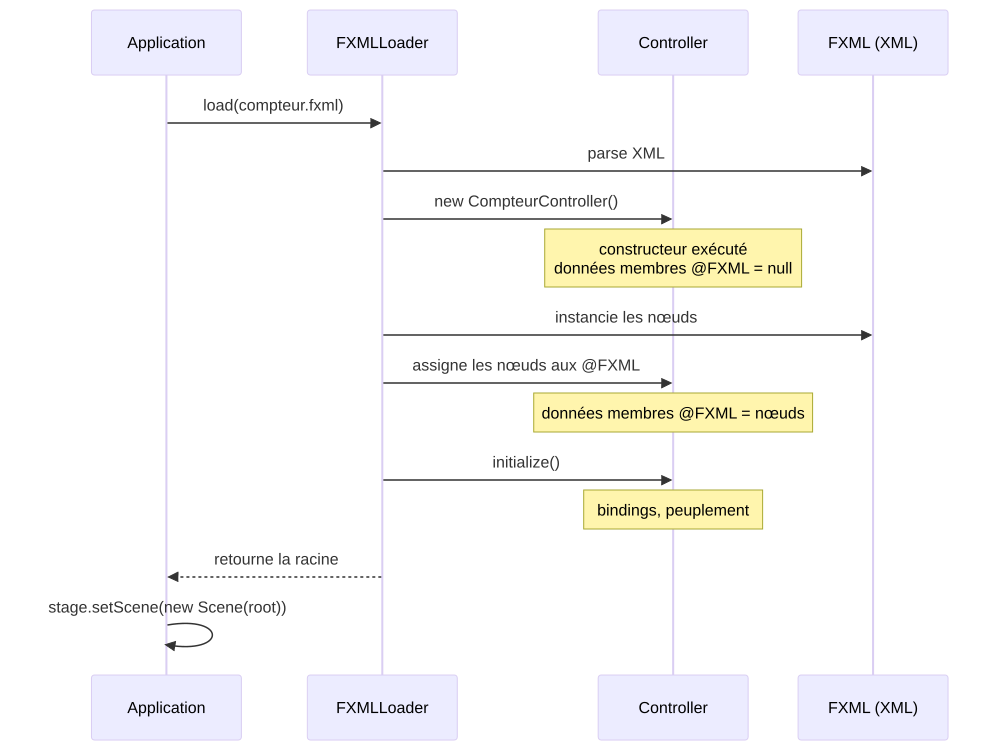

<!-- _class: lead -->
<!-- _paginate: false -->

<style scoped>
section {
  background-image: url('assets/logo-amu.png');
  background-repeat: no-repeat;
  background-position: bottom 40px center;
  background-size: 380px;
}
</style>

# Architecture des IHM et FXML

**R2.02 - Développement d'applications avec IHM**

---

## Où en sommes-nous ?

<div style="display: flex; gap: 0.8rem; margin-top: 0.5rem; margin-bottom: 0.5rem; text-align: center; font-size: 2.5rem; line-height: 1;">
<div style="flex: 1;">&nbsp;</div>
<div style="flex: 1;">&nbsp;</div>
<div style="flex: 1;">👇</div>
<div style="flex: 1;">&nbsp;</div>
</div>

<div style="display: flex; gap: 0.8rem;">
<div style="background: #4a90d9; color: white; padding: 1.2rem; border-radius: 12px 12px 0 0; flex: 1; text-align: center;">
<div style="font-size: 1.8rem; font-weight: bold;">CM1 ✅</div>
<div style="margin-top: 0.3rem;">Fondations IHM + JavaFX</div>
</div>
<div style="background: #e8a838; color: white; padding: 1.2rem; border-radius: 12px 12px 0 0; flex: 1; text-align: center;">
<div style="font-size: 1.8rem; font-weight: bold;">CM2 ✅</div>
<div style="margin-top: 0.3rem;">Propriétés et bindings</div>
</div>
<div style="background: #27ae60; color: white; padding: 1.2rem; border-radius: 12px 12px 0 0; flex: 1; text-align: center; box-shadow: 0 4px 12px rgba(39,174,96,0.4);">
<div style="font-size: 1.8rem; font-weight: bold;">CM3</div>
<div style="margin-top: 0.3rem;">Architecture et FXML</div>
</div>
<div style="background: #8e44ad; color: white; padding: 1.2rem; border-radius: 12px 12px 0 0; flex: 1; text-align: center;">
<div style="font-size: 1.8rem; font-weight: bold;">CM4</div>
<div style="margin-top: 0.3rem;">MVVM + persistance</div>
</div>
</div>

<div style="display: flex; gap: 0.8rem; text-align: center; font-size: 1.5rem; color: #999;">
<div style="flex: 1;">↓</div>
<div style="flex: 1;">↓</div>
<div style="flex: 1;">↓</div>
<div style="flex: 1;">↓</div>
</div>

<div style="display: flex; gap: 0.8rem;">
<div style="background: #d0e2f3; color: #2c5f8a; padding: 0.8rem; border-radius: 0 0 12px 12px; flex: 1; text-align: center; font-weight: bold;">
TP1 ✅
</div>
<div style="background: #fae5c0; color: #8a6a1f; padding: 0.8rem; border-radius: 0 0 12px 12px; flex: 1; text-align: center; font-weight: bold;">
TP2 ✅
</div>
<div style="background: #c8e6c9; color: #1b5e20; padding: 0.8rem; border-radius: 0 0 12px 12px; flex: 1; text-align: center; font-weight: bold;">
TP3
</div>
<div style="background: #e1bee7; color: #5c2473; padding: 0.8rem; border-radius: 0 0 12px 12px; flex: 1; text-align: center; font-weight: bold;">
TP4 + TP5
</div>
</div>

<div style="display: flex; gap: 0.8rem; margin-top: 0.5rem; text-align: center; font-size: 2.5rem; line-height: 1;">
<div style="flex: 1;">&nbsp;</div>
<div style="flex: 1;">&nbsp;</div>
<div style="flex: 1;">👆</div>
<div style="flex: 1;">&nbsp;</div>
</div>

---

## Rappel CM2 - Ce que vous savez déjà

<div style="display: grid; grid-template-columns: 1fr 1fr 1fr; gap: 1.2rem; margin-top: 1.5rem;">
<div style="background: #1a5276; color: white; padding: 1.2rem; border-radius: 10px;">
<div style="font-size: 1.8rem; margin-bottom: 0.5rem; font-weight: bold;">🏗️ Réactivité</div>
<div style="margin-top: 0.5rem; font-size: 1.5rem; opacity: 0.9;">
Les <b>propriétés observables</b> et les <b>bindings</b> propagent automatiquement les changements de valeur.

<em>Aujourd'hui : déclarer ces flux <b>en même temps</b> que la structure de l'interface.</em>
</div>
</div>
<div style="background: #27ae60; color: white; padding: 1.2rem; border-radius: 10px;">
<div style="font-size: 1.8rem; margin-bottom: 0.5rem; font-weight: bold;">🧠 Affordance</div>
<div style="margin-top: 0.5rem; font-size: 1.5rem; opacity: 0.9;">
La <b>mise à jour automatique de l'apparence</b> de l'IHM rend l'interface <b>auto-explicative</b> en rendant visible ce qui est possible et ce qui ne l'est pas.
</div>
</div>
<div style="background: #e8a838; color: white; padding: 1.2rem; border-radius: 10px;">
<div style="font-size: 1.8rem; margin-bottom: 0.5rem; font-weight: bold;">⚡ Événements</div>
<div style="margin-top: 0.5rem; font-size: 1.5rem; opacity: 0.9;">
Propagation <b>capture/bubbling</b>, <b>EventFilter</b> vs <b>EventHandler</b>, <code>consume()</code> pour arrêter la propagation.
</div>
</div>
</div>

<div style="background: #2c3e50; color: white; padding: 1.2rem 2rem; border-radius: 10px; margin-top: 1.5rem; font-size: 1.5rem; text-align: center;">
Aujourd'hui : <b>séparer</b> ce que l'interface affiche de ce qu'elle fait, et écrire la vue dans un fichier dédié.
</div>

---

## À la fin de ce CM, vous saurez...

<div style="display: grid; grid-template-columns: 1fr 1fr 1fr; gap: 1.2rem; margin-top: 1rem;">

<div style="background: #1a5276; color: white; padding: 1.2rem; border-radius: 12px; box-shadow: 0 4px 10px rgba(0,0,0,0.15);">
<div style="font-size: 1.8rem; font-weight: bold; margin-bottom: 0.5rem;">🏗️ Concevoir</div>
<div style="font-size: 1.5rem; line-height: 1.5;">Une architecture <b>MVC</b> où la vue est écrite en <b>FXML</b>, le contrôleur reste mince, et les composants se réutilisent (<code>fx:root</code>, <code>fx:include</code>).</div>
<div style="background: rgba(0,0,0,0.25); padding: 0.3rem 0.7rem; border-radius: 6px; font-size: 1rem; margin-top: 0.7rem; display: inline-block;">Parties 2 + 3 + 4</div>
</div>

<div style="background: #e8a838; color: white; padding: 1.2rem; border-radius: 12px; box-shadow: 0 4px 10px rgba(0,0,0,0.15);">
<div style="font-size: 1.8rem; font-weight: bold; margin-bottom: 0.5rem;">⚡ Câbler</div>
<div style="font-size: 1.5rem; line-height: 1.5;">Les interactions de la vue au contrôleur de manière déclarative : <code>@FXML</code>, <code>onAction="#méthode"</code>, hook <code>initialize()</code>.</div>
<div style="background: rgba(0,0,0,0.25); padding: 0.3rem 0.7rem; border-radius: 6px; font-size: 1rem; margin-top: 0.7rem; display: inline-block;">Partie 3</div>
</div>

<div style="background: #27ae60; color: white; padding: 1.2rem; border-radius: 12px; box-shadow: 0 4px 10px rgba(0,0,0,0.15);">
<div style="font-size: 1.8rem; font-weight: bold; margin-bottom: 0.5rem;">🧠 Garantir</div>
<div style="font-size: 1.5rem; line-height: 1.5;">La <b>cohérence et le respect des standards</b> (Nielsen #4) en mutualisant FXML et CSS.</div>
<div style="background: rgba(0,0,0,0.25); padding: 0.3rem 0.7rem; border-radius: 6px; font-size: 1rem; margin-top: 0.7rem; display: inline-block;">Partie 5</div>
</div>

</div>

<div style="background: #2c3e50; color: white; padding: 0.9rem 1.2rem; border-radius: 10px; margin-top: 1rem; font-size: 1.5rem; text-align: center;">
<em>Niveau Bloom : Analyser</em> - Le TP3 vous fait choisir <b>quoi</b> mettre en FXML et <b>quoi</b> garder en Java.
</div>

---

<!-- _class: lead -->
<!-- _header: "" -->
<!-- _footer: "" -->

# Partie 1 - 🤔 Le problème

**Les limites du tout-en-Java**

---

## TP1 + TP2 : tout est en Java

<style scoped>
section pre { font-size: 0.5rem !important; line-height: 1.35 !important; }
</style>

<p style="font-size: 1.5rem; margin: -0.5rem 0 0.6rem 0;">Jusqu'à présent, layout, styles, comportement et événements cohabitent dans la même classe Java.</p>

```java
public class CompteurApp extends Application {
  @Override
  public void start(Stage primaryStage) {
    Label label = new Label("0");
    label.setStyle("-fx-font-size: 32px; -fx-text-fill: blue;");

    Button bouton = new Button("Incrémenter");
    bouton.setOnAction(e -> {
      int valeur = Integer.parseInt(label.getText()) + 1;
      label.setText(String.valueOf(valeur));
    });

    VBox root = new VBox(10, label, bouton);
    root.setAlignment(Pos.CENTER);
    root.setPadding(new Insets(20));

    primaryStage.setScene(new Scene(root, 300, 200));
    primaryStage.show();
  }
}
```

<div style="background: #2c3e50; color: white; padding: 0.7rem 1.2rem; border-radius: 8px; margin-top: 0.5rem; font-size: 1.5rem; text-align: center;">
Tout fonctionne, mais une <b>seule classe</b> mélange déjà 4 préoccupations différentes.
</div>

---

## Quatre préoccupations dans le même fichier

<p style="font-size: 1.5rem; margin: -0.5rem 0 0.6rem 0;">Ce compteur de 20 lignes mélange déjà quatre préoccupations distinctes qui devraient pouvoir évoluer indépendamment.</p>

<div style="display: grid; grid-template-columns: 1fr 1fr; gap: 0.9rem; margin-top: 0.5rem;">

<div style="background: #e8a838; color: white; padding: 1rem 1.2rem; border-radius: 10px;">
<div style="font-size: 1.8rem; font-weight: bold; margin-bottom: 0.3rem;">📦 Structure</div>
<div style="font-size: 1.5rem;">Les conteneurs et leur disposition : <code>VBox</code>, <code>setAlignment</code>, <code>setPadding</code>...</div>
</div>

<div style="background: #c0392b; color: white; padding: 1rem 1.2rem; border-radius: 10px;">
<div style="font-size: 1.8rem; font-weight: bold; margin-bottom: 0.3rem;">🎨 Style</div>
<div style="font-size: 1.5rem;">Les couleurs, les tailles, les bordures : <code>setStyle("-fx-...")</code>.</div>
</div>

<div style="background: #1a5276; color: white; padding: 1rem 1.2rem; border-radius: 10px;">
<div style="font-size: 1.8rem; font-weight: bold; margin-bottom: 0.3rem;">⚙️ Comportement</div>
<div style="font-size: 1.5rem;">La logique métier : incrémenter, parser, mettre à jour.</div>
</div>

<div style="background: #27ae60; color: white; padding: 1rem 1.2rem; border-radius: 10px;">
<div style="font-size: 1.8rem; font-weight: bold; margin-bottom: 0.3rem;">⚡ Événements</div>
<div style="font-size: 1.5rem;">Le câblage : qui réagit à quoi via <code>setOnAction(...)</code>.</div>
</div>

</div>

<div style="background: #2c3e50; color: white; padding: 0.85rem 1.2rem; border-radius: 10px; margin-top: 0.9rem; font-size: 1.5rem; text-align: center;">
💡 Quand l'application grandit, ces 4 préoccupations s'<b>entremêlent</b>. Une modification esthétique mineure demande de relire toute la logique.
</div>

---

## Symptômes au-delà de 100 lignes

<p style="font-size: 1.5rem; margin: -0.5rem 0 0.6rem 0;">Une fois ces préoccupations entremêlées, voici les douleurs concrètes qui apparaissent dès quelques centaines de lignes.</p>

<div style="display: grid; grid-template-columns: 1fr 1fr; gap: 0.9rem; margin-top: 0.7rem;">

<div style="background: #6e1a1a; color: white; padding: 1.1rem 1.3rem; border-radius: 10px;">
<div style="font-size: 1.4rem; font-weight: bold; margin-bottom: 0.4rem;">😵 Lisibilité qui s'effondre</div>
<div style="font-size: 1.2rem; line-height: 1.45;">Un fichier de 500 lignes où tout est mélangé devient illisible. Trouver « où le bouton OK est défini » prend 5 minutes.</div>
</div>

<div style="background: #d35400; color: white; padding: 1.1rem 1.3rem; border-radius: 10px;">
<div style="font-size: 1.4rem; font-weight: bold; margin-bottom: 0.4rem;">🎨 Outils designer impossibles</div>
<div style="font-size: 1.2rem; line-height: 1.45;">Aucun outil graphique ne peut éditer du Java. Le designer doit devenir développeur — ou le développeur, designer.</div>
</div>

<div style="background: #b03020; color: white; padding: 1.1rem 1.3rem; border-radius: 10px;">
<div style="font-size: 1.4rem; font-weight: bold; margin-bottom: 0.4rem;">🧪 Tests difficiles</div>
<div style="font-size: 1.2rem; line-height: 1.45;">Tester la logique métier impose de monter une <code>Application</code> JavaFX entière. Pas de test unitaire pur.</div>
</div>

<div style="background: #e67e22; color: white; padding: 1.1rem 1.3rem; border-radius: 10px;">
<div style="font-size: 1.4rem; font-weight: bold; margin-bottom: 0.4rem;">🔁 Réutilisation zéro</div>
<div style="font-size: 1.2rem; line-height: 1.45;">Pour réutiliser une barre d'outils dans 3 fenêtres, copier-coller. Toute évolution doit être propagée à la main.</div>
</div>

</div>

<div style="background: #2c3e50; color: white; padding: 0.85rem 1.2rem; border-radius: 10px; margin-top: 0.9rem; font-size: 1.5rem; text-align: center;">
💡 Ces 4 symptômes partagent une seule cause : tout vit dans un seul fichier Java.
</div>

---

## Le coût caché : la duplication

<style scoped>
section pre { font-size: 0.55rem !important; line-height: 1.35 !important; }
</style>

<p style="font-size: 1.5rem; margin: -0.5rem 0 0.5rem 0;">Sans séparation, la même structure se réécrit dans chaque fenêtre. Imaginez une app à 12 écrans avec une barre de boutons commune.</p>

```java
// FenetreA.java
HBox barre = new HBox(10);
Button annuler = new Button("Annuler");
annuler.setStyle("-fx-background-color: #ccc;");
Button ok = new Button("OK");
ok.setStyle("-fx-background-color: #3498db; -fx-text-fill: white;");
barre.getChildren().addAll(annuler, ok);

// FenetreB.java   ← copier-coller, légèrement modifié
HBox barre = new HBox(8);            // ← oups, espacement différent
Button cancel = new Button("Cancel"); // ← oups, libellé différent
cancel.setStyle("-fx-background-color: #d3d3d3;");
Button ok = new Button("Ok");        // ← oups, capitalisation différente
ok.setStyle("-fx-background-color: #2980b9;");
barre.getChildren().addAll(ok, cancel); // ← oups, ordre inversé
```

<div style="background: #c0392b; color: white; padding: 0.7rem 1.2rem; border-radius: 8px; margin-top: 0.3rem; font-size: 1.5rem; text-align: center;">
À chaque copier-coller, des micro-divergences s'installent. <b>L'utilisateur</b> les remarque : « <em>tiens, ça ne marche pas pareil ici</em> ».
</div>

---

## Trois acteurs, trois compétences

<p style="font-size: 1.5rem; margin: -0.5rem 0 0.5rem 0;">La séparation reflète aussi la <b>division du travail</b> dans une vraie équipe produit.</p>

<div style="display: grid; grid-template-columns: 1fr 1fr 1fr; gap: 0.8rem; margin: 2.4rem 0;">

<div style="background: #4a90d9; color: white; padding: 1rem 1.1rem; border-radius: 10px;">
<div style="font-size: 1.7rem; font-weight: bold; margin-bottom: 0.4rem;">🎨 UX/UI Designer</div>
<div style="font-size: 1.5rem; line-height: 1.5;">Édite la maquette des vues dans Figma, livre du <b>FXML</b> et une feuille de style <b>CSS</b>. Ne touche pas au code Java.</div>
</div>

<div style="background: #e67e22; color: white; padding: 1rem 1.1rem; border-radius: 10px;">
<div style="font-size: 1.7rem; font-weight: bold; margin-bottom: 0.4rem;">⚙️ Dev backend</div>
<div style="font-size: 1.5rem; line-height: 1.5;">Implémente le <b>modèle</b> métier en Java pur. Il ne sait rien de JavaFX et fait des tests JUnit standard.</div>
</div>

<div style="background: #27ae60; color: white; padding: 1rem 1.1rem; border-radius: 10px;">
<div style="font-size: 1.7rem; font-weight: bold; margin-bottom: 0.4rem;">🔌 Dev Frontend</div>
<div style="font-size: 1.5rem; line-height: 1.5;">Branche les <b>contrôleurs</b> sur le modèle, écrit les bindings, gère le routage entre vues. C'est lui qui écrit les tests graphiques avec <b>TestFX</b>.</div>
</div>

</div>

<div style="background: #2c3e50; color: white; padding: 0.85rem 1.2rem; border-radius: 10px; margin-top: 0.8rem; font-size: 1.5rem; text-align: center;">
💡 Sans séparation, il faut <b>une seule personne</b> qui maîtrise tout. Avec MVC, chacun travaille dans son fichier, en parallèle.
</div>

---

## La solution : séparer les préoccupations

<style scoped>
section { hyphens: auto; -webkit-hyphens: auto; }
</style>

<p style="font-size: 1.5rem; margin: -0.5rem 0 0.6rem 0;">Le principe de <b>séparation des préoccupations</b> (Edsger Dijkstra, 1974) : chaque fichier ne traite que d'<b>un</b> sujet.</p>

<div style="display: grid; grid-template-columns: 1fr 1fr 1fr; gap: 1rem; margin: 2.5rem 0;">

<div style="background: #4a90d9; color: white; padding: 1.2rem 1.3rem; border-radius: 12px;">
<div style="font-size: 1.7rem; font-weight: bold; margin-bottom: 0.4rem;">📄 Vue → FXML</div>
<div style="font-size: 1.5rem; line-height: 1.5;">Le fichier <code>.fxml</code> décrit la <b>structure</b> de la vue : les composants, les conteneurs, le layout.</div>
</div>

<div style="background: #e67e22; color: white; padding: 1.2rem 1.3rem; border-radius: 12px;">
<div style="font-size: 1.7rem; font-weight: bold; margin-bottom: 0.4rem;">🎨 Style → CSS</div>
<div style="font-size: 1.5rem; line-height: 1.5;">Le fichier <code>.css</code> décrit l'<b>apparence</b> esthétique de chaque élément visible : les couleurs, les polices, les espacements.</div>
</div>

<div style="background: #1a5276; color: white; padding: 1.2rem 1.3rem; border-radius: 12px;">
<div style="font-size: 1.7rem; font-weight: bold; margin-bottom: 0.4rem;">⚙️ Logique → Java</div>
<div style="font-size: 1.5rem; line-height: 1.5;">Le <b>contrôleur</b> Java décrit le <b>comportement</b> de la vue : les interactions, les calculs, les validations.</div>
</div>

</div>

<div style="background: #27ae60; color: white; padding: 1rem 1.5rem; border-radius: 10px; margin-top: 1.2rem; font-size: 1.5rem; text-align: center; line-height: 1.55;">
✨ Trois fichiers, trois responsabilités, trois acteurs qui peuvent travailler en parallèle.
</div>

---

## Procédural ↔ déclaratif

<style scoped>
section pre { font-size: 0.65rem !important; line-height: 1.35 !important; margin: 0.4rem 0 !important; }
</style>

<p style="font-size: 1.5rem; margin: -0.5rem 0 0.6rem 0;">Le passage à FXML, c'est aussi le passage d'un style impératif à un style déclaratif.</p>

<div style="display: grid; grid-template-columns: 1fr 1fr; gap: 1rem; margin: 0.4rem 0 0.8rem 0;">

<div style="background: #c0392b; color: white; padding: 1rem 1.2rem; border-radius: 10px;">
<div style="font-size: 1.6rem; font-weight: bold; margin-bottom: 0.4rem;">⚙️ Procédural - comment</div>
<div style="font-size: 1.4rem; line-height: 1.5;">« <em>Créer un VBox, lui mettre un padding, ajouter un Label dedans...</em> »<br/>L'ordre des instructions compte, on décrit chaque étape.</div>
</div>

<div style="background: #27ae60; color: white; padding: 1rem 1.2rem; border-radius: 10px;">
<div style="font-size: 1.6rem; font-weight: bold; margin-bottom: 0.4rem;">📄 Déclaratif - quoi</div>
<div style="font-size: 1.4rem; line-height: 1.5;">« <em>Voici un VBox qui contient un Label et un bouton dont le texte est "Incrémenter".</em> »<br/>On décrit le résultat final, le moteur s'occupe de l'instancier.</div>
</div>

</div>

```xml
<!-- FXML : on déclare la structure -->
<VBox>
  <Label fx:id="label" text="0" styleClass="compteur"/>
  <Button text="Incrémenter" onAction="#incrementer"/>
</VBox>
```

<div style="background: #2c3e50; color: white; padding: 0.7rem 1.2rem; border-radius: 8px; margin-top: 0.5rem; font-size: 1.5rem; text-align: center;">
Le FXML est à la fois plus court, plus visuel, et comme c'est un document, un outil graphique comme <em>SceneBuilder</em> peut le modifier et l'afficher.
</div>

---

## Démo : avant/après sur le compteur

<style scoped>
section pre { font-size: 0.6rem !important; line-height: 1.3 !important; border-radius: 0 0 6px 6px !important; margin: 0 !important; }
section code { font-size: 0.6rem !important; }
</style>

<div style="display: grid; grid-template-columns: 1fr 1fr; gap: 0.6rem; margin-top: 0.3rem;">

<div>
<div style="background: #c0392b; color: white; padding: 0.4rem 0.8rem; border-radius: 6px 6px 0 0; font-weight: bold; font-size: 1.1rem;">Avant : tout en Java (~25 lignes)</div>

```java
public class CompteurApp extends Application {
  public void start(Stage stage) {
    Label label = new Label("0");
    label.setStyle("-fx-font-size: 32px;");

    Button bt = new Button("Incrémenter");
    bt.setOnAction(e -> {
      int v = Integer.parseInt(label.getText());
      label.setText(String.valueOf(v + 1));
    });

    VBox root = new VBox(10, label, bt);

    stage.setScene(new Scene(root, 300, 200));
    stage.show();
  }
}
```

</div>

<div style="display: flex; flex-direction: column; justify-content: space-between; height: 100%;">

<div>
<div style="background: #27ae60; color: white; padding: 0.4rem 0.8rem; border-radius: 6px 6px 0 0; font-weight: bold; font-size: 1.1rem;">Après - compteur.fxml (~10 lignes)</div>

```xml
<VBox fx:controller="CompteurController"
      xmlns:fx="http://javafx.com/fxml">
  <Label fx:id="label" text="0" styleClass="compteur"/>
  <Button text="Incrémenter" onAction="#incrementer"/>
</VBox>
```

</div>

<div>
<div style="background: #27ae60; color: white; padding: 0.4rem 0.8rem; border-radius: 6px 6px 0 0; font-weight: bold; font-size: 1.1rem;">Après - CompteurController.java (~6 lignes)</div>

```java
public class CompteurController {
  @FXML private Label label;
  @FXML void incrementer() {
    int v = Integer.parseInt(label.getText());
    label.setText(String.valueOf(v + 1));
  }
}
```

</div>

</div>

</div>

<div style="background: #2c3e50; color: white; padding: 0.5rem 1rem; border-radius: 8px; margin-top: 0.4rem; font-size: 1.5rem; text-align: center;">
La <b>structure</b> est dans le FXML. Le <b>comportement</b> reste en Java.
</div>

---

<!-- _class: lead -->
<!-- _header: "" -->
<!-- _footer: "" -->

# Partie 2 - 🏗️ MVC

**Modèle, Vue, Contrôleur**

---

## 🏗️ Une histoire vieille de 50 ans

<p style="font-size: 1.5rem; margin: -0.5rem 0 0.6rem 0;">MVC est l'un des plus anciens patterns architecturaux encore en usage actif.</p>

<div style="display: grid; grid-template-columns: 1fr 3fr; gap: 0.3rem 0.7rem; margin-top: 0.4rem; font-size: 1.5rem;">

<div style="background: #1a5276; color: white; padding: 0.4rem 0.8rem; border-radius: 8px; font-weight: bold; display: flex; align-items: center; justify-content: center;">1978</div>
<div style="background: rgba(26,82,118,0.12); padding: 0.4rem 0.9rem; border-radius: 8px;"><b>Trygve Reenskaug</b> formalise MVC chez Xerox PARC pour <b>Smalltalk-80</b>. Isoler la logique métier des effets visuels.</div>

<div style="background: #1a5276; color: white; padding: 0.4rem 0.8rem; border-radius: 8px; font-weight: bold; display: flex; align-items: center; justify-content: center;">1996</div>
<div style="background: rgba(26,82,118,0.12); padding: 0.4rem 0.9rem; border-radius: 8px;"><b>Java Swing</b> adopte une variante (model-delegate). MVC devient mainstream.</div>

<div style="background: #1a5276; color: white; padding: 0.4rem 0.8rem; border-radius: 8px; font-weight: bold; display: flex; align-items: center; justify-content: center;">2004</div>
<div style="background: rgba(26,82,118,0.12); padding: 0.4rem 0.9rem; border-radius: 8px;"><b>Ruby on Rails</b> popularise MVC pour le web. <b>ASP.NET MVC</b>, <b>Spring MVC</b> suivent.</div>

<div style="background: #1a5276; color: white; padding: 0.4rem 0.8rem; border-radius: 8px; font-weight: bold; display: flex; align-items: center; justify-content: center;">2008</div>
<div style="background: rgba(26,82,118,0.12); padding: 0.4rem 0.9rem; border-radius: 8px;"><b>JavaFX 1.0</b> sort. <b>FXML</b> arrive en 2011 et porte MVC dans l'écosystème JavaFX.</div>

<div style="background: #27ae60; color: white; padding: 0.4rem 0.8rem; border-radius: 8px; font-weight: bold; display: flex; align-items: center; justify-content: center;">2026</div>
<div style="background: rgba(39,174,96,0.15); padding: 0.4rem 0.9rem; border-radius: 8px;"><b>Aujourd'hui</b> : MVC reste la base ; <b>MVP</b> et <b>MVVM</b> dominent dans React, Angular, Vue, JavaFX moderne...</div>

</div>

<div style="background: #2c3e50; color: white; padding: 0.6rem 1.2rem; border-radius: 8px; margin-top: 0.5rem; font-size: 1.5rem; text-align: center;">
Un pattern qui résiste 50 ans à toutes les modes <b>répond à un besoin fondamental</b>.
</div>

---

## 🏗️ Le pattern Modèle-Vue-Contrôleur

<p style="font-size: 1.5rem; margin: -0.5rem 0 0.6rem 0;">MVC organise l'application en trois rôles bien distincts. Chacun a son fichier, son langage, sa testabilité.</p>

<div style="display: grid; grid-template-columns: 1fr 1fr 1fr; gap: 1rem; margin-top: 0.5rem;">

<div style="background: #1a5276; color: white; padding: 1.2rem 1.3rem; border-radius: 12px;">
<div style="font-size: 1.7rem; font-weight: bold; margin-bottom: 0.4rem;">📊 Modèle</div>
<div style="font-size: 1.5rem; line-height: 1.5;">Les <b>données</b> et la <b>logique métier</b>. <b>Aucune référence à JavaFX</b> : du Java pur, testable en JUnit standard.<br/><em>Un compteur, un client, un capteur de chauve-souris...</em></div>
</div>

<div style="background: #4a90d9; color: white; padding: 1.2rem 1.3rem; border-radius: 12px;">
<div style="font-size: 1.7rem; font-weight: bold; margin-bottom: 0.4rem;">🖼️ Vue</div>
<div style="font-size: 1.5rem; line-height: 1.5;">Ce que l'utilisateur <b>voit et touche</b>. Décrit structure et apparence, <b>aucune logique métier</b>. Modifiable dans <b>SceneBuilder</b>.<br/><em>Le FXML, les CSS, les composants JavaFX.</em></div>
</div>

<div style="background: #27ae60; color: white; padding: 1.2rem 1.3rem; border-radius: 12px;">
<div style="font-size: 1.7rem; font-weight: bold; margin-bottom: 0.4rem;">🎮 Contrôleur</div>
<div style="font-size: 1.5rem; line-height: 1.5;">Le <b>chef d'orchestre</b> : reçoit les actions, délègue au modèle, met à jour la vue via bindings. Reste <b>mince</b>.<br/><em>La classe annotée <code>@FXML</code>.</em></div>
</div>

</div>

<div style="background: #2c3e50; color: white; padding: 0.85rem 1.2rem; border-radius: 10px; margin-top: 1rem; font-size: 1.5rem; text-align: center;">
💡 Trois rôles, trois fichiers, trois testabilités indépendantes.
</div>

---

## Qui parle à qui ?

<p style="font-size: 1.5rem; margin: -0.5rem 0 0.6rem 0;">Suivons l'information : du clic utilisateur jusqu'à la mise à jour automatique de la vue.</p>

<svg viewBox="5 80 900 260" xmlns="http://www.w3.org/2000/svg" preserveAspectRatio="xMidYMid meet" style="width: 100%; display: block; margin: 0 auto;">
  <defs>
    <marker id="arrow-mvc" viewBox="0 0 10 10" refX="9" refY="5" markerUnits="userSpaceOnUse" markerWidth="12" markerHeight="12" orient="auto">
      <path d="M 0 0 L 10 5 L 0 10 z" fill="#2c3e50"/>
    </marker>
  </defs>
  <rect x="20" y="110" width="160" height="100" rx="14" fill="#7f8c8d"/>
  <text x="100" y="155" text-anchor="middle" fill="white" font-family="sans-serif" font-size="22" font-weight="bold">👤</text>
  <text x="100" y="185" text-anchor="middle" fill="white" font-family="sans-serif" font-size="18" font-weight="bold">Utilisateur</text>
  <rect x="250" y="110" width="180" height="100" rx="14" fill="#4a90d9"/>
  <text x="340" y="148" text-anchor="middle" fill="white" font-family="sans-serif" font-size="18" font-weight="bold">🖼️ Vue</text>
  <text x="340" y="180" text-anchor="middle" fill="white" font-family="sans-serif" font-size="14">FXML + composants</text>
  <rect x="500" y="110" width="180" height="100" rx="14" fill="#27ae60"/>
  <text x="590" y="148" text-anchor="middle" fill="white" font-family="sans-serif" font-size="18" font-weight="bold">🎮 Contrôleur</text>
  <text x="590" y="180" text-anchor="middle" fill="white" font-family="sans-serif" font-size="14">handler @FXML</text>
  <rect x="750" y="110" width="140" height="100" rx="14" fill="#1a5276"/>
  <text x="820" y="148" text-anchor="middle" fill="white" font-family="sans-serif" font-size="18" font-weight="bold">📊 Modèle</text>
  <text x="820" y="180" text-anchor="middle" fill="white" font-family="sans-serif" font-size="14">données + logique</text>
  <line x1="180" y1="160" x2="250" y2="160" stroke="#2c3e50" stroke-width="3" marker-end="url(#arrow-mvc)"/>
  <text x="215" y="98" text-anchor="middle" font-family="sans-serif" font-size="14" font-weight="bold" fill="#2c3e50">① clic / saisie</text>
  <line x1="430" y1="160" x2="500" y2="160" stroke="#2c3e50" stroke-width="3" marker-end="url(#arrow-mvc)"/>
  <text x="465" y="98" text-anchor="middle" font-family="sans-serif" font-size="14" font-weight="bold" fill="#2c3e50">② événement</text>
  <line x1="680" y1="160" x2="750" y2="160" stroke="#2c3e50" stroke-width="3" marker-end="url(#arrow-mvc)"/>
  <text x="715" y="98" text-anchor="middle" font-family="sans-serif" font-size="14" font-weight="bold" fill="#2c3e50">③ appel métier</text>
  <path d="M 820 210 C 820 330, 340 330, 340 210" stroke="#2c3e50" stroke-width="3" fill="none" stroke-dasharray="6,4" marker-end="url(#arrow-mvc)"/>
  <text x="580" y="248" text-anchor="middle" font-family="sans-serif" font-size="14" font-weight="bold" fill="#2c3e50">④ propriétés observables → bindings (auto)</text>
</svg>

<div style="background: #2c3e50; color: white; padding: 0.85rem 1.2rem; border-radius: 10px; margin-top: 0.9rem; font-size: 1.5rem; line-height: 1.55;">
<b>Boucle classique :</b> l'utilisateur agit sur la vue → le contrôleur traduit l'action en appel métier → le modèle change → la vue se met à jour automatiquement (via les <b>bindings</b> vus au CM2).
</div>

---

## Le compteur en MVC : trois fichiers

<p style="font-size: 1.5rem; margin: -0.5rem 0 0.6rem 0;">Reprenons le compteur du CM2 et répartissons-le selon les trois rôles : un fichier par responsabilité.</p>

<style scoped>
section pre { font-size: 0.7rem !important; line-height: 1.3 !important; margin: 0 !important; flex: 1; }
.mvc-col { display: flex; flex-direction: column; }
</style>

<div style="display: grid; grid-template-columns: 1fr 1fr 1fr; gap: 0.5rem; margin-top: 0.3rem; align-items: stretch;">

<div class="mvc-col">
<div style="background: #1a5276; color: white; padding: 0.4rem 0.7rem; border-radius: 6px 6px 0 0; font-weight: bold; font-size: 1rem;">📊 Modèle (Compteur.java)</div>

```java
public class Compteur {
  private final IntegerProperty
    valeur = new SimpleIntegerProperty(0);

  public IntegerProperty valeurProperty() {
    return valeur;
  }

  public int getValeur() {
    return valeur.get();
  }

  public void incrementer() {
    valeur.set(valeur.get() + 1);
  }
}
```

</div>

<div class="mvc-col">
<div style="background: #4a90d9; color: white; padding: 0.4rem 0.7rem; border-radius: 6px 6px 0 0; font-weight: bold; font-size: 1rem;">🖼️ Vue (compteur.fxml)</div>

```xml
<VBox 
  xmlns:fx="http://javafx.com/fxml"
  fx:controller="CompteurController">
  <Label fx:id="message"
         styleClass="valeur"/>
  <Button text="Incrémenter"
          onAction="#incrementer"/>
</VBox>
```

</div>

<div class="mvc-col">
<div style="background: #27ae60; color: white; padding: 0.4rem 0.7rem; border-radius: 6px 6px 0 0; font-weight: bold; font-size: 1rem;">🎮 Controller</div>

```java
public class CompteurController {
  Compteur compteur = new Compteur();

  @FXML private Label message;

  @FXML void initialize() {
    message.textProperty().bind(
      compteur.valeurProperty()
      .asString());
  }

  @FXML void incrementer() {
    compteur.incrementer();
  }
}
```

</div>

</div>

<div style="background: #2c3e50; color: white; padding: 0.55rem 1.1rem; border-radius: 8px; margin-top: 0.4rem; font-size: 1.5rem; text-align: center;">
Aucun des trois fichiers ne « connaît » les détails des autres : ils communiquent par <b>contrats</b> (interface property, fx:id, méthode @FXML).
</div>

---

## Qui crée qui ?

<p style="font-size: 1.5rem; margin: -0.5rem 0 0.5rem 0;">Le <code>FXMLLoader</code> est le grand chef d'orchestre : il instancie tout le monde au démarrage.</p>

<svg viewBox="0 0 1100 380" xmlns="http://www.w3.org/2000/svg" preserveAspectRatio="xMidYMid meet" style="width: 100%; display: block; margin: 0 auto;">
  <defs>
    <marker id="arrow-creation" viewBox="0 0 10 10" refX="9" refY="5" markerUnits="userSpaceOnUse" markerWidth="10" markerHeight="10" orient="auto">
      <path d="M 0 0 L 10 5 L 0 10 z" fill="#2c3e50"/>
    </marker>
  </defs>
  <rect x="430" y="5" width="240" height="65" rx="14" fill="#7f8c8d"/>
  <text x="550" y="35" text-anchor="middle" fill="white" font-family="sans-serif" font-size="19" font-weight="bold">🚀 Application</text>
  <text x="550" y="58" text-anchor="middle" fill="white" font-family="sans-serif" font-size="14">start(Stage)</text>
  <rect x="445" y="125" width="210" height="50" rx="14" fill="#1a5276"/>
  <text x="550" y="157" text-anchor="middle" fill="white" font-family="sans-serif" font-size="19" font-weight="bold">🔧 FXMLLoader</text>
  <rect x="80" y="240" width="320" height="55" rx="14" fill="#27ae60"/>
  <text x="240" y="275" text-anchor="middle" fill="white" font-family="sans-serif" font-size="18" font-weight="bold">🎮 CompteurController</text>
  <rect x="700" y="230" width="350" height="70" rx="14" fill="#4a90d9"/>
  <text x="875" y="262" text-anchor="middle" fill="white" font-family="sans-serif" font-size="18" font-weight="bold">🖼️ Graphe de scène</text>
  <text x="875" y="285" text-anchor="middle" fill="white" font-family="sans-serif" font-size="14">(VBox + Label + Button)</text>
  <line x1="520" y1="70" x2="520" y2="125" stroke="#2c3e50" stroke-width="2.5" marker-end="url(#arrow-creation)"/>
  <line x1="580" y1="70" x2="580" y2="125" stroke="#2c3e50" stroke-width="2.5" marker-end="url(#arrow-creation)"/>
  <rect x="488" y="84" width="64" height="22" rx="4" fill="#ecf0f1" stroke="#bdc3c7"/>
  <text x="520" y="100" text-anchor="middle" font-family="sans-serif" font-size="13" fill="#2c3e50">new()</text>
  <rect x="551" y="84" width="58" height="22" rx="4" fill="#ecf0f1" stroke="#bdc3c7"/>
  <text x="580" y="100" text-anchor="middle" font-family="sans-serif" font-size="13" fill="#2c3e50">load()</text>
  <line x1="490" y1="175" x2="320" y2="240" stroke="#2c3e50" stroke-width="2.5" marker-end="url(#arrow-creation)"/>
  <rect x="240" y="184" width="220" height="48" rx="4" fill="#ecf0f1" stroke="#bdc3c7"/>
  <text x="350" y="202" text-anchor="middle" font-family="sans-serif" font-size="13" fill="#2c3e50">new() (via fx:controller)</text>
  <text x="350" y="219" text-anchor="middle" font-family="sans-serif" font-size="13" fill="#2c3e50">injection @FXML + initialize()</text>
  <line x1="630" y1="175" x2="780" y2="230" stroke="#2c3e50" stroke-width="2.5" marker-end="url(#arrow-creation)"/>
  <rect x="640" y="184" width="200" height="22" rx="4" fill="#ecf0f1" stroke="#bdc3c7"/>
  <text x="740" y="200" text-anchor="middle" font-family="sans-serif" font-size="13" fill="#2c3e50">new() (parsing FXML)</text>
  <rect x="450" y="320" width="240" height="55" rx="14" fill="#1a5276"/>
  <text x="570" y="355" text-anchor="middle" fill="white" font-family="sans-serif" font-size="18" font-weight="bold">📊 Compteur (Modèle)</text>
  <polyline points="240,295 240,347 450,347" fill="none" stroke="#2c3e50" stroke-width="2.5" marker-end="url(#arrow-creation)"/>
  <rect x="180" y="336" width="190" height="22" rx="4" fill="#ecf0f1" stroke="#bdc3c7"/>
  <text x="275" y="352" text-anchor="middle" font-family="sans-serif" font-size="13" fill="#2c3e50">new() + bind sur properties</text>
</svg>

<div style="background: #2c3e50; color: white; padding: 0.7rem 1.2rem; border-radius: 8px; margin-top: 0.4rem; font-size: 1.4rem; text-align: center;">
La <b>chaîne de création</b> : l'<code>Application</code> demande au <code>FXMLLoader</code>, qui instancie le contrôleur et la vue. Seul le contrôleur connaît le modèle.
</div>

---

## Le flux d'une interaction

<p style="font-size: 1.5rem; margin: -0.5rem 0 0.5rem 0;">Suivons un clic utilisateur sur le bouton « Incrémenter ». Quatre étapes, aucune ne court-circuite les autres.</p>

<style scoped>
.flux-row { display: flex; align-items: stretch; border-radius: 8px; overflow: hidden; margin-bottom: 0.3rem; }
.flux-num { color: white; font-weight: bold; font-size: 1rem; display: flex; align-items: center; justify-content: center; min-width: 2.8rem; padding: 0.3rem 0.7rem; }
.flux-body { flex: 1; padding: 0.4rem 1rem; display: flex; align-items: center; font-size: 0.9rem; }
</style>

<div style="margin-top: 0.4rem;">

<div class="flux-row">
<div class="flux-num" style="background: #c0392b;">1</div>
<div class="flux-body" style="background: rgba(192,57,43,0.12);"><span><b>L'utilisateur clique</b> sur le bouton dans la vue.</span></div>
</div>

<div class="flux-row">
<div class="flux-num" style="background: #4a90d9;">2</div>
<div class="flux-body" style="background: rgba(74,144,217,0.12);"><span><b>JavaFX route l'événement</b> vers la méthode <code>incrementer()</code> du contrôleur (lue dans <code>onAction="#incrementer"</code>).</span></div>
</div>

<div class="flux-row">
<div class="flux-num" style="background: #27ae60;">3</div>
<div class="flux-body" style="background: rgba(39,174,96,0.12);"><span><b>Le contrôleur délègue</b> au modèle : <code>compteur.incrementer()</code>. Pas de manipulation UI ici.</span></div>
</div>

<div class="flux-row">
<div class="flux-num" style="background: #1a5276;">4</div>
<div class="flux-body" style="background: rgba(26,82,118,0.12);"><span><b>Le modèle change</b>. La <code>IntegerProperty</code> notifie ses observateurs. Le binding du <code>Label</code> met le texte à jour <em>(magie du CM2)</em>.</span></div>
</div>

</div>

<div style="background: #2c3e50; color: white; padding: 0.7rem 1.2rem; border-radius: 8px; margin-top: 0.5rem; font-size: 1.5rem; text-align: center;">
Le contrôleur ne touche <b>jamais</b> au <code>Label</code>. C'est le binding qui s'en charge.
</div>

---

## Pourquoi cette séparation paie

<p style="font-size: 1.5rem; margin: -0.5rem 0 0.6rem 0;">Quatre bénéfices concrets dès que l'application grandit : tests, équipe, évolution.</p>

<div style="display: grid; grid-template-columns: 1fr 1fr; gap: 0.7rem; margin-top: 0.4rem;">

<div style="background: #1a5276; color: white; padding: 0.9rem 1.1rem; border-radius: 10px;">
<div style="font-size: 1.7rem; font-weight: bold; margin-bottom: 0.35rem;">🧪 Modèle testable seul</div>
<div style="font-size: 1.5rem; line-height: 1.4;">Un test JUnit pur : pas besoin de monter <code>Application</code>, pas besoin d'<code>xvfb</code>.<br/><code style="background: rgba(0,0,0,0.25); padding: 1px 5px;">new Compteur().incrementer()</code></div>
</div>

<div style="background: #4a90d9; color: white; padding: 0.9rem 1.1rem; border-radius: 10px;">
<div style="font-size: 1.7rem; font-weight: bold; margin-bottom: 0.35rem;">🔁 Vue interchangeable</div>
<div style="font-size: 1.5rem; line-height: 1.4;">Deux vues différentes (mobile / desktop) peuvent partager le même modèle et le même contrôleur.</div>
</div>

<div style="background: #27ae60; color: white; padding: 0.9rem 1.1rem; border-radius: 10px;">
<div style="font-size: 1.7rem; font-weight: bold; margin-bottom: 0.35rem;">👥 Travail en parallèle</div>
<div style="font-size: 1.5rem; line-height: 1.4;">Le designer édite le FXML/CSS, le développeur écrit le contrôleur, les conflits Git sont rares.</div>
</div>

<div style="background: #8e44ad; color: white; padding: 0.9rem 1.1rem; border-radius: 10px;">
<div style="font-size: 1.7rem; font-weight: bold; margin-bottom: 0.35rem;">📐 Single Responsibility</div>
<div style="font-size: 1.5rem; line-height: 1.4;">Chaque fichier a <b>une</b> raison de changer. Le code reste compréhensible quand l'application grandit.</div>
</div>

</div>

<div style="background: #2c3e50; color: white; padding: 0.7rem 1.2rem; border-radius: 8px; margin-top: 0.6rem; font-size: 1.5rem; text-align: center;">
30 minutes à séparer aujourd'hui = des heures de bugs et de conflits Git évités demain.
</div>

---

## Anti-pattern : le « fat controller »

<p style="font-size: 1.5rem; margin: -0.5rem 0 0.6rem 0;">Quand le contrôleur grossit jusqu'à devenir une décharge, c'est qu'on n'a pas vraiment de modèle.</p>

<style scoped>
section pre { font-size: 0.78rem !important; line-height: 1.35 !important; margin: 0 !important; border-radius: 0 0 6px 6px !important; flex: 1; }
.fat-col { display: flex; flex-direction: column; }
</style>

<div style="display: grid; grid-template-columns: 1fr 1fr; gap: 0.7rem; margin: 2rem 0; align-items: stretch;">

<div class="fat-col">
<div style="background: #c0392b; color: white; padding: 0.5rem 0.9rem; border-radius: 6px 6px 0 0; font-weight: bold; font-size: 1.3rem;">✗ Anti-pattern</div>

```java
public class FormulaireController {
  @FXML void valider() {
    // 80 lignes de logique métier ici
    String email = champEmail.getText();
    if (email.contains("@") && ...) {
      double prix = ...;
      if (clientFidele && prix > 500) prix *= 0.95;
      // ...
    }
  }
}
```

</div>

<div class="fat-col">
<div style="background: #27ae60; color: white; padding: 0.5rem 0.9rem; border-radius: 6px 6px 0 0; font-weight: bold; font-size: 1.3rem;">✓ Avec un modèle</div>

```java
public class FormulaireController {
  private Commande commande = new Commande();

  @FXML void valider() {
    commande.valider();
  }
}
// Toute la logique part dans
// la classe Commande, testable
// sans JavaFX.
```

</div>

</div>

<div style="background: #2c3e50; color: white; padding: 0.7rem 1.2rem; border-radius: 8px; margin-top: 0.6rem; font-size: 1.5rem; text-align: center;">
Si vous trouvez un <code>if</code> dans un <code>@FXML void ...()</code>, demandez-vous : <b>est-ce que ça appartient vraiment au contrôleur ?</b>
</div>

---

## Le contrôleur reste mince

<p style="font-size: 1.5rem; margin: -0.5rem 0 0.6rem 0;">Sa mission : <b>traduire</b> les événements UI en appels au modèle, et <b>connecter</b> le modèle à la vue.</p>

<style scoped>
section pre { font-size: 0.55rem !important; line-height: 1.4 !important; margin: 0 !important; border-radius: 0 0 6px 6px !important; }
</style>

<div style="background: #27ae60; color: white; padding: 0.5rem 0.9rem; border-radius: 6px 6px 0 0; font-weight: bold; font-size: 1.3rem;">🎮 CompteurController.java</div>

```java
public class CompteurController {
  // Référence au modèle, injectée par le code qui charge le FXML
  private final Compteur compteur = new Compteur();

  @FXML private Label label;

  @FXML void initialize() {
    // Connexion vue ↔ modèle via binding (CM2)
    label.textProperty().bind(compteur.valeurProperty().asString());
  }

  @FXML void incrementer() {
    compteur.incrementer();   // délégation pure au modèle
  }
}
```

<div style="background: #2c3e50; color: white; padding: 0.7rem 1.2rem; border-radius: 8px; margin-top: 0.6rem; font-size: 1.5rem; text-align: center;">
Le contrôleur n'a pas de <code>if</code>, pas de calcul. Juste : <em>« j'écoute, je délègue »</em>.
</div>

---

## Lien avec le CM1 — le pattern Observer

<p style="font-size: 1.5rem; margin: -0.5rem 0 0.6rem 0;">MVC s'appuie sur le <b>pattern Observer</b> que vous connaissez déjà : la vue observe le modèle.</p>

<div style="display: grid; grid-template-columns: 1fr 1fr 1fr; gap: 0.7rem; margin-top: 0.4rem; align-items: stretch;">

<div style="background: #4a90d9; color: white; padding: 0.9rem 1.1rem; border-radius: 10px;">
<div style="font-size: 1.5rem; font-weight: bold; margin-bottom: 0.35rem;">⚡ CM1 - Observer naïf</div>
<div style="font-size: 1.7rem; line-height: 1.4;">Un bouton, un <code>EventHandler</code>, un appel manuel à <code>label.setText(...)</code> dans le handler.</div>
</div>

<div style="background: #1a5276; color: white; padding: 0.9rem 1.1rem; border-radius: 10px;">
<div style="font-size: 1.5rem; font-weight: bold; margin-bottom: 0.35rem;">🔗 CM2 - Bindings</div>
<div style="font-size: 1.7rem; line-height: 1.4;">Une <code>IntegerProperty</code> dans le modèle, un <code>label.textProperty().bind(...)</code> dans la vue. Plus de handler manuel.</div>
</div>

<div style="background: #27ae60; color: white; padding: 0.9rem 1.1rem; border-radius: 10px;">
<div style="font-size: 1.5rem; font-weight: bold; margin-bottom: 0.35rem;">🎯 CM3 - MVC</div>
<div style="font-size: 1.7rem; line-height: 1.4;">Propriétés déclarées dans le modèle, observées dans le contrôleur, vue connectée par bindings.</div>
</div>

</div>

<div style="background: #2c3e50; color: white; padding: 0.7rem 1.2rem; border-radius: 8px; margin-top: 0.6rem; font-size: 1.5rem; text-align: center;">
À chaque CM, l'intéret du pattern Observer s'enrichit : du handler manuel jusqu'à la séparation MVC complète.
</div>

---

## Encapsulation du modèle

<p style="font-size: 1.5rem; margin: -0.5rem 0 0.5rem 0;">Pour que le modèle reste indépendant de la vue, il expose une <b>API publique contrôlée</b> : lectures observables et méthodes métier, pas de setter générique.</p>

<style scoped>
section pre { font-size: 0.55rem !important; line-height: 1.35 !important; margin: 0 !important; border-radius: 0 0 6px 6px !important; }
</style>

<div style="background: #1a5276; color: white; padding: 0.5rem 0.9rem; border-radius: 6px 6px 0 0; font-weight: bold; font-size: 1.3rem;">📊 Compteur.java</div>

```java
public class Compteur {
  // ✓ Propriété observable, lecture publique, écriture contrôlée
  private IntegerProperty valeur = new SimpleIntegerProperty(0);

  public ReadOnlyIntegerProperty valeurProperty() { return valeur;}
  // ← le contrôleur peut bind dessus, pas modifier
  public int getValeur() { return valeur.get();}
  
  public void incrementer() { valeur.set(valeur.get() + 1);}
  // ← API métier, pas un setter générique
  public void reset() { valeur.set(0);}
}
```

<div style="background: #2c3e50; color: white; padding: 0.7rem 1.2rem; border-radius: 8px; margin-top: 0.5rem; font-size: 1.5rem; text-align: center;">
Le contrôleur appelle <code>incrementer()</code>, pas <code>setValeur(getValeur()+1)</code>. La <b>logique métier reste dans le modèle</b>.
</div>

---

## Variantes de MVC

<p style="font-size: 1.5rem; margin: -0.5rem 0 0.6rem 0;">MVC a engendré de nombreuses variantes selon le degré de découplage souhaité.</p>

<div style="display: grid; grid-template-columns: 1fr 1fr 1fr; gap: 0.7rem; margin: 2.4rem 0; align-items: stretch;">

<div style="background: #1a5276; color: white; padding: 0.9rem 1.1rem; border-radius: 10px;">
<div style="font-size: 1.5rem; font-weight: bold; margin-bottom: 0.4rem;">🎯 MVC classique</div>
<div style="font-size: 1.25rem; line-height: 1.45;">
Vue et contrôleur référencent <b>directement</b> le modèle.<br/>
Le contrôleur orchestre, le modèle notifie ses observateurs.<br/>
Adopté par <b>JavaFX/FXML</b>, Spring MVC, Ruby on Rails.<br/>
<em>👈 Aujourd'hui</em>
</div>
</div>

<div style="background: #7f8c8d; color: white; padding: 0.9rem 1.1rem; border-radius: 10px;">
<div style="font-size: 1.5rem; font-weight: bold; margin-bottom: 0.4rem;">🎤 MVP - Presenter</div>
<div style="font-size: 1.25rem; line-height: 1.45;">
Le <b>Presenter</b> remplace le contrôleur, plus strict.<br/>
La vue ne référence plus le modèle : elle expose une interface que le presenter pilote.<br/>
Historique : Swing, Android pré-Jetpack.
</div>
</div>

<div style="background: #8e44ad; color: white; padding: 0.9rem 1.1rem; border-radius: 10px;">
<div style="font-size: 1.5rem; font-weight: bold; margin-bottom: 0.4rem;">🔮 MVVM - ViewModel</div>
<div style="font-size: 1.25rem; line-height: 1.45;">
Un <b>ViewModel</b> intermédiaire expose des propriétés observables.<br/>
La vue s'y bind, plus de code de synchronisation manuel.<br/>
Né dans WPF, popularisé par Vue.js, Android Jetpack.<br/>
<em>CM4 👉</em>
</div>
</div>

</div>

<div style="background: #2c3e50; color: white; padding: 0.7rem 1.2rem; border-radius: 8px; margin-top: 0.6rem; font-size: 1.5rem; text-align: center;">
JavaFX + FXML implémente nativement <b>MVC</b>. Avec les bindings, on glissera naturellement vers <b>MVVM</b> au CM4.
</div>

---

<!-- _class: lead -->
<!-- _header: "" -->
<!-- _footer: "" -->

# Partie 3 - 📄 FXML

**La vue déclarative**

---

## 📄 Qu'est-ce qu'un fichier FXML ?

<p style="font-size: 1.5rem; margin: -0.5rem 0 0.6rem 0;">Un fichier FXML est un fichier XML qui décrit la structure d'une vue JavaFX.</p>

<div style="display: grid; grid-template-columns: 1fr 1fr; gap: 0.7rem; margin-top: 0.4rem;">

<div style="background: #1a5276; color: white; padding: 0.9rem 1.1rem; border-radius: 10px;">
<div style="font-size: 1.5rem; font-weight: bold; margin-bottom: 0.35rem;">📋 Le « quoi »</div>
<div style="font-size: 1.4rem; line-height: 1.4;">Un <code>VBox</code> contenant un <code>Label</code> et un <code>Button</code>, avec un padding de 20.</div>
</div>

<div style="background: #c0392b; color: white; padding: 0.9rem 1.1rem; border-radius: 10px;">
<div style="font-size: 1.5rem; font-weight: bold; margin-bottom: 0.35rem;">⚙️ Pas le « comment »</div>
<div style="font-size: 1.4rem; line-height: 1.4;">Aucune logique, aucune boucle, aucune condition. Juste la structure attendue.</div>
</div>

</div>

<style scoped>
section pre { font-size: 0.5rem !important; line-height: 1.35 !important; margin: 0 !important; border-radius: 0 0 6px 6px !important; }
</style>

<div style="background: #4a90d9; color: white; padding: 0.5rem 0.9rem; border-radius: 6px 6px 0 0; font-weight: bold; font-size: 1.3rem; margin-top: 0.5rem;">🖼️ vue.fxml</div>

```xml
<?xml version="1.0" encoding="UTF-8"?>
<?import javafx.scene.layout.VBox?>
<?import javafx.scene.control.Label?>
<?import javafx.scene.control.Button?>

<VBox xmlns:fx="http://javafx.com/fxml">
  <Label text="Bonjour"/>
  <Button text="Cliquer"/>
</VBox>
```

<div style="background: #2c3e50; color: white; padding: 0.7rem 1.2rem; border-radius: 8px; margin-top: 0.5rem; font-size: 1.5rem; text-align: center;">
À l'exécution, <code>FXMLLoader</code> instancie ces composants et reconstitue le graphe de scène.
</div>

---

## Le namespace FXML

<p style="font-size: 1.5rem; margin: -0.5rem 0 0.5rem 0;">Les déclarations en tête de fichier FXML : pas de magie, juste du XML structuré.</p>

<style scoped>
section pre { font-size: 0.65rem !important; line-height: 1.35 !important; margin: 0 !important; border-radius: 0 0 6px 6px !important; }
</style>

<div style="background: #4a90d9; color: white; padding: 0.5rem 0.9rem; border-radius: 6px 6px 0 0; font-weight: bold; font-size: 1.3rem;">📄 vue.fxml</div>

```xml
<?xml version="1.0" encoding="UTF-8"?>
<?import javafx.scene.layout.VBox?>
<?import javafx.scene.control.Label?>

<VBox xmlns="http://javafx.com/javafx"
      xmlns:fx="http://javafx.com/fxml"
      fx:controller="fr.univ_amu.iut.exemple.MonController">
  <Label fx:id="message"/>
</VBox>
```

<div style="display: grid; grid-template-columns: 1fr 1fr 1fr; gap: 0.7rem; margin-top: 0.5rem;">

<div style="background: #1a5276; color: white; padding: 0.8rem 1rem; border-radius: 10px;">
<div style="font-size: 1.4rem; font-weight: bold;">📦 Imports</div>
<div style="font-size: 1.2rem; margin-top: 0.3rem; line-height: 1.4;">Les <code>&lt;?import ...?&gt;</code> permettent d'écrire <code>&lt;Label&gt;</code> au lieu du nom complet.</div>
</div>

<div style="background: #27ae60; color: white; padding: 0.8rem 1rem; border-radius: 10px;">
<div style="font-size: 1.4rem; font-weight: bold;">🔧 xmlns:fx</div>
<div style="font-size: 1.2rem; margin-top: 0.3rem; line-height: 1.4;">Active les attributs <code>fx:id</code>, <code>fx:controller</code>, <code>fx:include</code>...</div>
</div>

<div style="background: #c0392b; color: white; padding: 0.8rem 1rem; border-radius: 10px;">
<div style="font-size: 1.4rem; font-weight: bold;">⚠️ Ne pas modifier</div>
<div style="font-size: 1.2rem; margin-top: 0.3rem; line-height: 1.4;">SceneBuilder s'appuie sur ces déclarations. Les altérer casse l'outil.</div>
</div>

</div>

---

## Ce qui doit (et ne doit pas) être en FXML

<p style="font-size: 1.5rem; margin: -0.5rem 0 0.5rem 0;">FXML est un langage de description, pas de programmation. Quelques règles simples pour ne pas dériver.</p>

<div style="display: grid; grid-template-columns: 1fr 1fr; gap: 0.7rem; margin-top: 0.4rem; align-items: stretch;">

<div style="background: #27ae60; color: white; padding: 0.9rem 1.1rem; border-radius: 10px;">
<div style="font-size: 1.7rem; font-weight: bold; margin-bottom: 0.4rem;">✓ En FXML</div>
<ul style="font-size: 1.5rem; line-height: 1.5; margin: 0; padding-left: 1.2rem;">
<li>La <b>structure</b> de l'arbre de scène</li>
<li>Les <b>propriétés statiques</b> (<code>text</code>, <code>spacing</code>, <code>alignment</code>)</li>
<li>Les <b>identifiants</b> (<code>fx:id</code>, <code>id</code>, <code>styleClass</code>)</li>
<li>Le <b>câblage</b> handler/contrôleur (<code>onAction</code>)</li>
<li>Les <b>imports</b> et <b>ressources</b> (<code>stylesheets</code>, <code>%clé</code>)</li>
</ul>
</div>

<div style="background: #c0392b; color: white; padding: 0.9rem 1.1rem; border-radius: 10px;">
<div style="font-size: 1.7rem; font-weight: bold; margin-bottom: 0.4rem;">✗ Hors de FXML</div>
<ul style="font-size: 1.5rem; line-height: 1.5; margin: 0; padding-left: 1.2rem;">
<li>Toute <b>logique métier</b> (calculs, conditions)</li>
<li>L'<b>état dynamique</b> (texte qui change au runtime)</li>
<li>Les <b>boucles</b> et constructions répétitives</li>
<li>Les <b>accès à des services</b> (DB, réseau)</li>
<li>Les <b>scripts JavaScript</b> embarqués <em>(possible mais déconseillé)</em></li>
</ul>
</div>

</div>

<div style="background: #2c3e50; color: white; padding: 0.7rem 1.2rem; border-radius: 8px; margin-top: 0.5rem; font-size: 1.5rem; text-align: center;">
Si vous hésitez, posez-vous la question : <em>« est-ce que ça change pendant l'exécution ? »</em> Si oui → contrôleur, sinon → FXML.
</div>

---

## L'arbre de scène généré

<p style="font-size: 1.5rem; margin: -0.5rem 0 0.5rem 0;">Le FXML produit un graphe de scène <b>identique</b> à celui qu'on aurait obtenu en code procédural.</p>

<style scoped>
section pre { font-size: 0.8rem !important; line-height: 1.4 !important; margin: 0 !important; border-radius: 0 0 6px 6px !important; flex: 1; }
.tree-col { display: flex; flex-direction: column; }
.tree-ascii { background: #f5f5f5 !important; color: #2c3e50 !important; padding: 0.7rem 0.9rem !important; }
</style>

<div style="display: grid; grid-template-columns: 1fr 1fr; gap: 0.7rem; margin-top: 0.4rem; align-items: stretch;">

<div class="tree-col">
<div style="background: #4a90d9; color: white; padding: 0.5rem 0.9rem; border-radius: 6px 6px 0 0; font-weight: bold; font-size: 1.3rem;">📄 FXML source</div>

```xml
<VBox>
  <Label fx:id="titre"
         text="Compteur"/>
  <HBox>
    <Button text="Décrémenter"/>
    <Label fx:id="valeur"
           text="0"/>
    <Button text="Incrémenter"/>
  </HBox>
</VBox>
```

</div>

<div class="tree-col">
<div style="background: #1a5276; color: white; padding: 0.5rem 0.9rem; border-radius: 6px 6px 0 0; font-weight: bold; font-size: 1.3rem;">🌳 Graphe résultant</div>

<pre class="tree-ascii">VBox (root)
├── Label "Compteur"     ← fx:id="titre"
└── HBox
    ├── Button "Décrémenter"
    ├── Label "0"        ← fx:id="valeur"
    └── Button "Incrémenter"</pre>

</div>

</div>

<div style="background: #2c3e50; color: white; padding: 0.7rem 1.2rem; border-radius: 8px; margin-top: 0.5rem; font-size: 1.5rem; text-align: center;">
Une fois chargé, ce graphe est <b>indistinguable</b> d'un graphe créé par <code>new VBox(...)</code>. JavaFX ne sait pas d'où il vient.
</div>

---

## Le mapping est mécanique

<p style="font-size: 1.5rem; margin: -0.5rem 0 0.5rem 0;">Quatre règles de traduction qui couvrent tous les cas de figure du FXML.</p>

<div style="display: grid; grid-template-columns: 1fr 1fr; gap: 0.7rem; margin-top: 0.4rem; align-items: stretch;">

<div style="background: #1a5276; color: white; padding: 0.9rem 1.1rem; border-radius: 10px;">
<div style="font-size: 1.7rem; font-weight: bold; margin-bottom: 0.35rem;">🌳 Élément racine</div>
<div style="font-size: 1.5rem; line-height: 1.45;">Une classe avec un constructeur par défaut : <code>VBox</code>, <code>BorderPane</code>, <code>AnchorPane</code>.</div>
</div>

<div style="background: #27ae60; color: white; padding: 0.9rem 1.1rem; border-radius: 10px;">
<div style="font-size: 1.7rem; font-weight: bold; margin-bottom: 0.35rem;">⚙️ Attribut sur l'élément</div>
<div style="font-size: 1.5rem; line-height: 1.45;">Un setter standard : <code>text="X"</code> → <code>setText("X")</code>, <code>spacing="10"</code> → <code>setSpacing(10)</code>.</div>
</div>

<div style="background: #e8a838; color: white; padding: 0.9rem 1.1rem; border-radius: 10px;">
<div style="font-size: 1.7rem; font-weight: bold; margin-bottom: 0.35rem;">📦 Élément enfant d'un conteneur</div>
<div style="font-size: 1.5rem; line-height: 1.45;">Une balise placée à l'intérieur d'un conteneur (<code>VBox</code>, <code>HBox</code>, <code>Pane</code>...) est ajoutée à ses enfants : <code>&lt;Label&gt;</code> dans <code>&lt;VBox&gt;</code> → <code>vbox.getChildren().add(label)</code>.</div>
</div>

<div style="background: #8e44ad; color: white; padding: 0.9rem 1.1rem; border-radius: 10px;">
<div style="font-size: 1.7rem; font-weight: bold; margin-bottom: 0.35rem;">🏷️ Zone nommée d'un conteneur</div>
<div style="font-size: 1.5rem; line-height: 1.45;">Quand un conteneur a plusieurs zones distinctes (par exemple <code>BorderPane</code>), on entoure l'enfant d'une balise au nom de la zone : <code>&lt;top&gt;</code> → <code>setTop(...)</code>.</div>
</div>

</div>

<div style="background: #2c3e50; color: white; padding: 0.7rem 1.2rem; border-radius: 8px; margin-top: 0.6rem; font-size: 1.5rem; text-align: center;">
👉 Si vous savez écrire le code Java équivalent, vous savez écrire le FXML.
</div>

---

## XML → Java : la traduction

<p style="font-size: 1.5rem; margin: -0.5rem 0 0.5rem 0;">Le <code>FXMLLoader</code> traduit chaque balise en appel constructeur, chaque attribut en appel à un setter.</p>

<style scoped>
section pre { font-size: 0.85rem !important; line-height: 1.35 !important; margin: 0 !important; border-radius: 0 0 6px 6px !important; flex: 1; }
.tr-col { display: flex; flex-direction: column; }
</style>

<div style="display: grid; grid-template-columns: 1fr 1fr; gap: 0.7rem; margin-top: 0.4rem; align-items: stretch;">

<div class="tr-col">
<div style="background: #4a90d9; color: white; padding: 0.5rem 0.9rem; border-radius: 6px 6px 0 0; font-weight: bold; font-size: 1.3rem;">📄 FXML</div>

```xml
<BorderPane prefHeight="80" prefWidth="250">
  <top>
    <Label text="Titre"
           textFill="#0022cc"/>
  </top>
  <center>
    <Button fx:id="btn"
            text="OK"
            onAction="#valider"/>
  </center>
</BorderPane>
```

</div>

<div class="tr-col">
<div style="background: #1a5276; color: white; padding: 0.5rem 0.9rem; border-radius: 6px 6px 0 0; font-weight: bold; font-size: 1.3rem;">☕ Java équivalent</div>

```java
BorderPane root = new BorderPane();
root.setPrefHeight(80);
root.setPrefWidth(250);

Label titre = new Label("Titre");
titre.setTextFill(Color.web("#0022cc"));
root.setTop(titre);

Button btn = new Button("OK");
btn.setOnAction(this::valider);
root.setCenter(btn);
```

</div>

</div>

<div style="background: #2c3e50; color: white; padding: 0.7rem 1.2rem; border-radius: 8px; margin-top: 0.5rem; font-size: 1.5rem; text-align: center;">
Chaque <b>élément XML</b> = un appel <code>new ClasseJavaFX()</code>. Chaque <b>attribut</b> = un appel à un <code>setXxx(...)</code>.
</div>

---

## Charger un FXML depuis Java

<p style="font-size: 1.5rem; margin: -0.5rem 0 0.5rem 0;">Trois lignes dans <code>start()</code> suffisent à transformer un FXML en fenêtre affichée.</p>

<style scoped>
section pre { font-size: 0.65rem !important; line-height: 1.35 !important; margin: 0 !important; border-radius: 0 0 6px 6px !important; }
</style>

<div style="background: #7f8c8d; color: white; padding: 0.5rem 0.9rem; border-radius: 6px 6px 0 0; font-weight: bold; font-size: 1.3rem;">🚀 CompteurApp.java</div>

```java
public class CompteurApp extends Application {
  @Override
  public void start(Stage stage) throws IOException {
    URL fxml = getClass().getResource("/fxml/compteur.fxml");
    Parent root = FXMLLoader.load(fxml);

    stage.setScene(new Scene(root, 300, 200));
    stage.setTitle("Compteur");
    stage.show();
  }
}
```

<div style="display: grid; grid-template-columns: 1fr 1fr 1fr; gap: 0.7rem; margin-top: 0.5rem;">

<div style="background: #1a5276; color: white; padding: 0.8rem 1rem; border-radius: 10px;">
<div style="font-size: 1.5rem; font-weight: bold;">📂 Localisation</div>
<div style="font-size: 1.3rem; margin-top: 0.3rem; line-height: 1.4;"><code>getResource()</code> cherche dans <code>src/main/resources</code> par défaut.</div>
</div>

<div style="background: #27ae60; color: white; padding: 0.8rem 1rem; border-radius: 10px;">
<div style="font-size: 1.5rem; font-weight: bold;">🔧 Chargement</div>
<div style="font-size: 1.3rem; margin-top: 0.3rem; line-height: 1.4;"><code>FXMLLoader.load()</code> retourne la racine du graphe.</div>
</div>

<div style="background: #8e44ad; color: white; padding: 0.8rem 1rem; border-radius: 10px;">
<div style="font-size: 1.5rem; font-weight: bold;">🎬 Affichage</div>
<div style="font-size: 1.3rem; margin-top: 0.3rem; line-height: 1.4;">On met la racine dans une <code>Scene</code>, on l'attache au <code>Stage</code>.</div>
</div>

</div>

---

## Déclarer le contrôleur (fx:controller)

<p style="font-size: 1.5rem; margin: -0.5rem 0 0.5rem 0;">L'attribut <code>fx:controller</code> sur l'élément racine désigne la classe Java qui pilote cette vue (celle qui reçoit les nœuds FXML dans ses données membres annotées avec <code>@FXML</code>).</p>

<style scoped>
section pre { font-size: 0.65rem !important; line-height: 1.4 !important; margin: 0 !important; border-radius: 0 0 6px 6px !important; }
</style>

<div style="background: #4a90d9; color: white; padding: 0.5rem 0.9rem; border-radius: 6px 6px 0 0; font-weight: bold; font-size: 1.3rem;">📄 vue.fxml</div>

```xml
<VBox xmlns:fx="http://javafx.com/fxml"
      fx:controller="fr.univ_amu.iut.exercice2.CompteurController">
  <!-- ... -->
</VBox>
```

<div style="display: grid; grid-template-columns: 1fr 1fr; gap: 0.7rem; margin-top: 0.5rem; align-items: stretch;">

<div style="background: #1a5276; color: white; padding: 0.9rem 1.1rem; border-radius: 10px;">
<div style="font-size: 1.6rem; font-weight: bold; margin-bottom: 0.35rem;">📦 Nom complet</div>
<div style="font-size: 1.4rem; line-height: 1.45;">Toujours le <b>nom pleinement qualifié</b> de la classe (avec le package).</div>
</div>

<div style="background: #27ae60; color: white; padding: 0.9rem 1.1rem; border-radius: 10px;">
<div style="font-size: 1.6rem; font-weight: bold; margin-bottom: 0.35rem;">⚙️ Constructeur sans args</div>
<div style="font-size: 1.4rem; line-height: 1.45;"><code>FXMLLoader</code> instancie le contrôleur en appelant son constructeur par défaut.</div>
</div>

</div>

<div style="background: #2c3e50; color: white; padding: 0.7rem 1.2rem; border-radius: 8px; margin-top: 0.5rem; font-size: 1.5rem; text-align: center;">
Sans <code>fx:controller</code>, le FXML décrit une vue mais ne peut rien connecter au code Java.
</div>

---

## Nommer un nœud (fx:id)

<p style="font-size: 1.5rem; margin: -0.5rem 0 1.5rem 0;">L'attribut <code>fx:id</code> donne un nom unique à un nœud du FXML pour pouvoir le manipuler depuis Java.</p>

<style scoped>
section pre { font-size: 0.9rem !important; line-height: 1.4 !important; margin: 0 !important; border-radius: 0 0 6px 6px !important; }
</style>

<div style="background: #4a90d9; color: white; padding: 0.5rem 0.9rem; border-radius: 6px 6px 0 0; font-weight: bold; font-size: 1.3rem;">📄 vue.fxml</div>

```xml
<VBox xmlns:fx="http://javafx.com/fxml">
  <Label fx:id="message" text="0"/>
  <Button fx:id="boutonOk" text="OK"/>
</VBox>
```

<div style="display: grid; grid-template-columns: 1fr 1fr; gap: 0.7rem; margin-top: 1.5rem; align-items: stretch;">

<div style="background: #e8a838; color: white; padding: 0.9rem 1.1rem; border-radius: 10px;">
<div style="font-size: 1.7rem; font-weight: bold; margin-bottom: 0.35rem;">🎯 Pas tous les nœuds</div>
<div style="font-size: 1.5rem; line-height: 1.45;">Inutile de nommer le <code>VBox</code> racine si vous ne le manipulez pas. Nommez seulement ce que le contrôleur doit toucher.</div>
</div>

<div style="background: #c0392b; color: white; padding: 0.9rem 1.1rem; border-radius: 10px;">
<div style="font-size: 1.7rem; font-weight: bold; margin-bottom: 0.35rem;">⚠️ Ne pas confondre avec id</div>
<div style="font-size: 1.5rem; line-height: 1.45;"><code>fx:id</code> = nom Java pour <code>@FXML</code>.<br/><code>id</code> = sélecteur CSS pour styliser. <em>Détails plus loin.</em></div>
</div>

</div>

---

## Récupération automatique dans le contrôleur

<p style="font-size: 1.5rem; margin: -0.5rem 0 0.5rem 0;">Quand on annote une donnée membre avec <code>@FXML</code>, <code>FXMLLoader</code> cherche le nœud dont l'<code>fx:id</code> correspond au nom la donnée membre et l'<b>assigne</b>.</p>

<style scoped>
section pre { font-size: 0.55rem !important; line-height: 1.35 !important; margin: 0 !important; border-radius: 0 0 6px 6px !important; flex: 1; }
.inj-col { display: flex; flex-direction: column; }
</style>

<div style="display: grid; grid-template-columns: 1fr 1fr; gap: 0.7rem; margin: 1.4rem 0; align-items: stretch;">

<div class="inj-col">
<div style="background: #4a90d9; color: white; padding: 0.5rem 0.9rem; border-radius: 6px 6px 0 0; font-weight: bold; font-size: 1.3rem;">📄 compteur.fxml</div>

```xml
<VBox xmlns:fx="http://javafx.com/fxml"
      fx:controller="CompteurController">

  <Label fx:id="message"/>

  <Button fx:id="bouton" text="OK"/>

</VBox>
```

</div>

<div class="inj-col">
<div style="background: #27ae60; color: white; padding: 0.5rem 0.9rem; border-radius: 6px 6px 0 0; font-weight: bold; font-size: 1.3rem;">🎮 CompteurController.java</div>

```java
public class CompteurController {

  @FXML private Label message;

  @FXML private Button bouton;

  // Les objets FXML sont "injectés" automatiquement
  // au moment de l'appel à FXMLLoader.load
}
```

</div>

</div>

<div style="background: #2c3e50; color: white; padding: 0.7rem 1.2rem; border-radius: 8px; margin-top: 0.5rem; font-size: 1.5rem; text-align: center;">
La règle : <b>même nom dans le FXML et dans le Java</b>. <code>FXMLLoader</code> fait la correspondance automatiquement, vous n'avez rien à câbler à la main.
</div>

---

## Câbler un événement (onAction)

<p style="font-size: 1.5rem; margin: -0.5rem 0 0.5rem 0;">L'attribut <code>onAction="#méthode"</code> dit à JavaFX : « <em>quand ce bouton est cliqué, appelle <code>méthode()</code> du contrôleur</em> ».</p>

<style scoped>
section pre { font-size: 0.7rem !important; line-height: 1.4 !important; margin: 0 !important; border-radius: 0 0 6px 6px !important; flex: 1; }
section code { font-size: 1em !important; }
.act-col { display: flex; flex-direction: column; }
</style>

<div style="display: grid; grid-template-columns: 1fr 1fr; gap: 0.7rem; margin: 2.4rem 0; align-items: stretch;">

<div class="act-col">
<div style="background: #4a90d9; color: white; padding: 0.5rem 0.9rem; border-radius: 6px 6px 0 0; font-weight: bold; font-size: 1.3rem;">📄 FXML</div>

```xml
<Button text="Incrémenter"
        onAction="#incrementer"/>
```

</div>

<div class="act-col">
<div style="background: #27ae60; color: white; padding: 0.5rem 0.9rem; border-radius: 6px 6px 0 0; font-weight: bold; font-size: 1.3rem;">🎮 Controller</div>

```java
public class CompteurController {
  @FXML void incrementer() { /* ... */ }
}
```

</div>

</div>

<div style="display: grid; grid-template-columns: 1fr 1fr 1fr; gap: 0.7rem; margin-top: 0.5rem;">

<div style="background: #1a5276; color: white; padding: 0.8rem 1rem; border-radius: 10px;">
<div style="font-size: 1.6rem; font-weight: bold;">🔖 Annotation @FXML</div>
<div style="font-size: 1.4rem; margin-top: 0.3rem; line-height: 1.4;">Obligatoire si la méthode n'est pas <code>public</code>.</div>
</div>

<div style="background: #27ae60; color: white; padding: 0.8rem 1rem; border-radius: 10px;">
<div style="font-size: 1.6rem; font-weight: bold;">📨 Signature</div>
<div style="font-size: 1.4rem; margin-top: 0.3rem; line-height: 1.4;"><code>void m()</code> ou <code>void m(ActionEvent)</code>, au choix.</div>
</div>

<div style="background: #8e44ad; color: white; padding: 0.8rem 1rem; border-radius: 10px;">
<div style="font-size: 1.6rem; font-weight: bold;">⚡ Autres événements</div>
<div style="font-size: 1.4rem; margin-top: 0.3rem; line-height: 1.4;">Même mécanisme pour <code>onMouseClicked</code>, <code>onKeyPressed</code>...</div>
</div>

</div>

---

## Configurer la vue (initialize())

<p style="font-size: 1.5rem; margin: -0.5rem 0 0.5rem 0;">Après que <code>FXMLLoader</code> a rempli les données membres <code>@FXML</code>, il cherche une méthode <code>initialize()</code> dans le contrôleur et l'appelle.</p>

<style scoped>
section pre { font-size: 0.55rem !important; line-height: 1.35 !important; margin: 0 !important; border-radius: 0 0 6px 6px !important; }
</style>

<div style="background: #27ae60; color: white; padding: 0.5rem 0.9rem; border-radius: 6px 6px 0 0; font-weight: bold; font-size: 1.3rem;">🎮 CompteurController.java</div>

```java
public class CompteurController {
  @FXML private Label message;
  @FXML private ComboBox<String> langues;
  private final Compteur compteur = new Compteur();

  @FXML void initialize() {
    // À ce stade, message et langues sont assignés.
    // C'est le bon moment pour binder, peupler, configurer.
    message.textProperty().bind(compteur.valeurProperty().asString());
    langues.getItems().addAll("fr", "en", "es");
    langues.setValue("fr");
  }
}
```

<div style="background: #2c3e50; color: white; padding: 0.7rem 1.2rem; border-radius: 8px; margin-top: 0.5rem; font-size: 1.5rem; text-align: center;">
<b>Ne mettez rien dans le constructeur</b> qui touche à une donnée membre <code>@FXML</code> : elles sont encore <code>null</code> à ce stade.
</div>

---

## Bindings inline avec `${}`

<p style="font-size: 1.5rem; margin: -0.5rem 0 0.5rem 0;">FXML supporte une syntaxe d'expression <code>${...}</code> pour binder directement dans le XML, sans passer par la méthode <code>initialize()</code> du contrôleur.</p>

<style scoped>
section pre { font-size: 0.65rem !important; line-height: 1.35 !important; margin: 0 !important; border-radius: 0 0 6px 6px !important; }
</style>

<div style="background: #4a90d9; color: white; padding: 0.5rem 0.9rem; border-radius: 6px 6px 0 0; font-weight: bold; font-size: 1.3rem;">📄 vue.fxml</div>

```xml
<VBox xmlns:fx="http://javafx.com/fxml" fx:controller="MaController">
  <!-- bind unidirectionnel sur la longueur du champ -->
  <Label text="${'Caractères saisis : ' + champ.length}"/>
  <TextField fx:id="champ"/>
  <!-- disable le bouton si le champ est vide -->
  <Button text="Valider" disable="${champ.text.isEmpty()}"/>

</VBox>
```

<div style="display: grid; grid-template-columns: 1fr 1fr; gap: 0.7rem; margin-top: 0.5rem; align-items: stretch;">

<div style="background: #27ae60; color: white; padding: 0.9rem 1.1rem; border-radius: 10px;">
<div style="font-size: 1.5rem; font-weight: bold; margin-bottom: 0.35rem;">✓ Bien pour le simple</div>
<div style="font-size: 1.3rem; line-height: 1.45;">Bindings UI ↔ UI sans logique métier.</div>
</div>

<div style="background: #c0392b; color: white; padding: 0.9rem 1.1rem; border-radius: 10px;">
<div style="font-size: 1.5rem; font-weight: bold; margin-bottom: 0.35rem;">⚠️ Pas pour le complexe</div>
<div style="font-size: 1.3rem; line-height: 1.45;">Pour des bindings sophistiqués <em>(Bindings.when, calculs)</em>, garder l'<code>initialize()</code>.</div>
</div>

</div>

---

## Cycle de vie complet

<p style="font-size: 1.5rem; margin: -0.5rem 0 0.5rem 0;">De l'appel <code>FXMLLoader.load()</code> à l'affichage : qui crée quoi, et dans quel ordre.</p>

<style scoped>
section img[alt^="Cycle de vie"] { width: 100%; max-height: 480px; height: auto; display: block; margin: 0.2rem auto; }
</style>



<div style="background: #2c3e50; color: white; padding: 0.7rem 1.2rem; border-radius: 8px; margin-top: 0.5rem; font-size: 1.5rem; text-align: center;">
Le constructeur s'exécute <b>avant</b> que les <code>@FXML</code> ne soient injectés ; <code>initialize()</code> juste <b>après</b>.
</div>

---

## Brancher une feuille CSS

<p style="font-size: 1.5rem; margin: -0.5rem 0 0.5rem 0;">L'attribut <code>stylesheets</code> sur l'élément racine du FXML applique une feuille de style à tout le sous-arbre.</p>

<style scoped>
section pre { font-size: 0.85rem !important; line-height: 1.35 !important; margin: 0 !important; border-radius: 0 0 6px 6px !important; flex: 1; }
.css-col { display: flex; flex-direction: column; }
</style>

<div style="display: grid; grid-template-columns: 1fr 1fr; gap: 0.7rem; margin-top: 0.4rem; align-items: stretch;">

<div class="css-col">
<div style="background: #4a90d9; color: white; padding: 0.5rem 0.9rem; border-radius: 6px 6px 0 0; font-weight: bold; font-size: 1.3rem;">📄 compteur.fxml</div>

```xml
<VBox stylesheets="@compteur.css"
      xmlns:fx=
        "http://javafx.com/fxml">
  <Label id="titre"
         text="Compteur"/>
  <Label fx:id="message"
         styleClass="valeur"/>
  <Button text="+1"
          onAction="#incrementer"/>
</VBox>
```

</div>

<div class="css-col">
<div style="background: #e8a838; color: white; padding: 0.5rem 0.9rem; border-radius: 6px 6px 0 0; font-weight: bold; font-size: 1.3rem;">🎨 compteur.css</div>

```css
#titre {
  -fx-font-size: 14px;
  -fx-text-fill: gray;
}

.valeur {
  -fx-font-size: 36px;
  -fx-font-weight: bold;
  -fx-text-fill: #4a90d9;
}
```

</div>

</div>

<div style="background: #2c3e50; color: white; padding: 0.7rem 1.2rem; border-radius: 8px; margin-top: 0.5rem; font-size: 1.5rem; text-align: center;">
<code>id</code> = sélecteur unique <code>#nom</code>. <code>styleClass</code> = sélecteur de classe <code>.nom</code>, réutilisable.
</div>

---

## fx:id (Java) vs id (CSS)

<p style="font-size: 1.5rem; margin: -0.5rem 0 0.5rem 0;">Deux attributs au nom voisin mais qui servent à des choses <b>complètement différentes</b>.</p>

<div style="display: grid; grid-template-columns: 1fr 1fr; gap: 0.7rem; margin-top: 0.4rem; align-items: stretch;">

<div style="background: #1a5276; color: white; padding: 0.9rem 1.1rem; border-radius: 10px;">
<div style="font-size: 1.7rem; font-weight: bold; margin-bottom: 0.35rem;">🔖 fx:id</div>
<div style="font-size: 1.4rem; line-height: 1.4; margin-bottom: 0.6rem;">Lien entre le FXML et le <b>Java</b> : nom utilisé pour récupérer le nœud côté contrôleur.</div>
<div style="font-size: 1.05rem; opacity: 0.85; margin-bottom: 0.2rem;">📄 FXML</div>
<pre style="background: rgba(0,0,0,0.35) !important; color: #fff !important; padding: 0.45rem 0.7rem !important; border-radius: 4px; font-size: 1.05rem !important; margin: 0 0 2rem 0 !important; line-height: 1.4 !important;">&lt;Label fx:id="message"/&gt;</pre>
<div style="font-size: 1.05rem; opacity: 0.85; margin-bottom: 0.2rem;">🎮 Controller</div>
<pre style="background: rgba(0,0,0,0.35) !important; color: #fff !important; padding: 0.45rem 0.7rem !important; border-radius: 4px; font-size: 1.05rem !important; margin: 0 !important; line-height: 1.4 !important;">@FXML private Label message;</pre>
</div>

<div style="background: #e8a838; color: white; padding: 0.9rem 1.1rem; border-radius: 10px;">
<div style="font-size: 1.7rem; font-weight: bold; margin-bottom: 0.35rem;">🎨 id</div>
<div style="font-size: 1.4rem; line-height: 1.4; margin-bottom: 0.6rem;">Lien entre le FXML et le <b>CSS</b> : sélecteur unique pour appliquer un style.</div>
<div style="font-size: 1.05rem; opacity: 0.9; margin-bottom: 0.2rem;">📄 FXML</div>
<pre style="background: rgba(0,0,0,0.35) !important; color: #fff !important; padding: 0.45rem 0.7rem !important; border-radius: 4px; font-size: 1.05rem !important; margin: 0 0 2rem 0 !important; line-height: 1.4 !important;">&lt;Label id="message"/&gt;</pre>
<div style="font-size: 1.05rem; opacity: 0.9; margin-bottom: 0.2rem;">🎨 CSS</div>
<pre style="background: rgba(0,0,0,0.35) !important; color: #fff !important; padding: 0.45rem 0.7rem !important; border-radius: 4px; font-size: 1.05rem !important; margin: 0 !important; line-height: 1.4 !important;">#message { -fx-font-size: 24px; }</pre>
</div>

</div>

<div style="background: #2c3e50; color: white; padding: 0.7rem 1.2rem; border-radius: 8px; margin-top: 0.5rem; font-size: 1.5rem; text-align: center;">
On peut mettre les deux attributs avec la même valeur : <code>&lt;Label fx:id="message" id="message"/&gt;</code>. C'est parfois utile à la lisibilité quand le nom Java sert aussi de sélecteur CSS.
</div>

---

## L'impact du CSS sur l'interface

<p style="font-size: 1.5rem; margin: -0.5rem 0 0.5rem 0;">Le même FXML rendu sans et avec la feuille de style. Le code Java ne change pas, seul l'aspect évolue.</p>

<div style="display: grid; grid-template-columns: 1fr 1fr; gap: 0.7rem; margin-top: 0.4rem; align-items: stretch;">

<div style="background: #ecf0f1; color: #2c3e50; border: 2px solid #bdc3c7; border-radius: 10px; padding: 0.9rem 1.1rem;">
<div style="font-size: 1.5rem; font-weight: bold; margin-bottom: 0.6rem; color: #7f8c8d;">🔘 Sans CSS <span style="font-size: 1.1rem; font-weight: normal;">(style par défaut Modena)</span></div>
<div style="background: white; border: 1px solid #d0d0d0; border-radius: 6px; padding: 1.5rem 1.2rem; display: flex; flex-direction: column; align-items: center; gap: 0.7rem; min-height: 180px; justify-content: center;">
  <div style="font-family: 'Segoe UI', sans-serif; font-size: 1.1rem; color: #2c3e50;">Compteur</div>
  <div style="font-family: 'Segoe UI', sans-serif; font-size: 1.1rem; color: #2c3e50;">0</div>
  <button style="font-family: 'Segoe UI', sans-serif; font-size: 0.95rem; padding: 0.3rem 0.8rem; background: linear-gradient(#fafafa, #e0e0e0); border: 1px solid #b0b0b0; border-radius: 3px; color: #2c3e50; cursor: pointer;">+1</button>
</div>
</div>

<div style="background: #1a5276; color: white; border-radius: 10px; padding: 0.9rem 1.1rem;">
<div style="font-size: 1.5rem; font-weight: bold; margin-bottom: 0.6rem;">🎨 Avec compteur.css</div>
<div style="background: white; border: 1px solid #d0d0d0; border-radius: 6px; padding: 1.5rem 1.2rem; display: flex; flex-direction: column; align-items: center; gap: 0.7rem; min-height: 180px; justify-content: center;">
  <div style="font-family: 'Segoe UI', sans-serif; font-size: 0.95rem; color: gray;">Compteur</div>
  <div style="font-family: 'Segoe UI', sans-serif; font-size: 2.6rem; font-weight: bold; color: #4a90d9; line-height: 1;">0</div>
  <button style="font-family: 'Segoe UI', sans-serif; font-size: 0.95rem; padding: 0.3rem 0.8rem; background: linear-gradient(#fafafa, #e0e0e0); border: 1px solid #b0b0b0; border-radius: 3px; color: #2c3e50; cursor: pointer;">+1</button>
</div>
</div>

</div>

<div style="background: #2c3e50; color: white; padding: 0.7rem 1.2rem; border-radius: 8px; margin-top: 0.5rem; font-size: 1.5rem; text-align: center;">
La <b>structure</b> reste dans le FXML, la <b>présentation</b> dans le CSS. Le contrôleur n'est concerné par <b>aucun</b> des deux.
</div>

---

## Internationalisation avec ResourceBundle

<p style="font-size: 1.5rem; margin: -0.5rem 0 0.5rem 0;">FXML supporte l'i18n nativement via les <code>ResourceBundle</code> et la syntaxe <code>%clé</code>.</p>

<style scoped>
section pre { font-size: 0.65rem !important; line-height: 1.35 !important; margin: 0 !important; border-radius: 0 0 6px 6px !important; flex: 1; }
.i18n-col { display: flex; flex-direction: column; }
</style>

<div style="display: grid; grid-template-columns: 2fr 3fr; gap: 0.7rem; margin-top: 0.4rem; align-items: stretch;">

<div class="i18n-col">
<div style="background: #e8a838; color: white; padding: 0.5rem 0.9rem; border-radius: 6px 6px 0 0; font-weight: bold; font-size: 1.3rem;">🇫🇷 messages_fr.properties</div>

```properties
btn.ok=Valider
btn.cancel=Annuler
title=Connexion
```

<div style="background: #e8a838; color: white; padding: 0.5rem 0.9rem; border-radius: 6px 6px 0 0; font-weight: bold; font-size: 1.3rem; margin-top: 0.4rem;">🇬🇧 messages_en.properties</div>

```properties
btn.ok=OK
btn.cancel=Cancel
title=Login
```

</div>

<div class="i18n-col">
<div style="background: #4a90d9; color: white; padding: 0.5rem 0.9rem; border-radius: 6px 6px 0 0; font-weight: bold; font-size: 1.3rem;">📄 login.fxml</div>

```xml
<VBox xmlns:fx="...">
  <Label text="%title"/>
  <HBox>
    <Button text="%btn.cancel"/>
    <Button text="%btn.ok"/>
  </HBox>
</VBox>
```

<div style="background: #7f8c8d; color: white; padding: 0.5rem 0.9rem; border-radius: 6px 6px 0 0; font-weight: bold; font-size: 1.3rem; margin-top: 0.4rem;">🚀 App.java</div>

```java
ResourceBundle bundle = ResourceBundle
    .getBundle("messages", Locale.FRENCH);
loader.setResources(bundle);
```

</div>

</div>

<div style="background: rgba(74,144,217,0.15); padding: 0.5rem 1rem; border-radius: 6px; margin-top: 0.4rem; font-size: 1.2rem; text-align: center; color: #2c3e50;">
🔍 <code>Locale.FRENCH</code> → Java cherche <code>messages_fr.properties</code> <span style="opacity: 0.75;">(convention : <code>baseName_langue.properties</code>, fallback sur <code>messages.properties</code>)</span>.
</div>

<div style="background: #2c3e50; color: white; padding: 0.7rem 1.2rem; border-radius: 8px; margin-top: 0.4rem; font-size: 1.5rem; text-align: center;">
Aucune ligne Java à modifier pour traduire l'app. Le FXML reste neutre, le bundle change selon la <code>Locale</code>.
</div>

---

## Accéder au contrôleur depuis Java

<p style="font-size: 1.5rem; margin: -0.5rem 0 0.5rem 0;">Pour passer un modèle au contrôleur, on l'instancie soi-même au lieu d'utiliser <code>FXMLLoader.load()</code> statique.</p>

<style scoped>
section pre { font-size: 0.85rem !important; line-height: 1.35 !important; margin: 0 !important; border-radius: 0 0 6px 6px !important; }
</style>

<div style="background: #7f8c8d; color: white; padding: 0.5rem 0.9rem; border-radius: 6px 6px 0 0; font-weight: bold; font-size: 1.3rem;">🚀 App.java</div>

```java
public void start(Stage stage) throws IOException {
  // 1. Instancier un loader (méthode d'instance, pas statique)
  FXMLLoader loader = new FXMLLoader(getClass().getResource("/fxml/compteur.fxml"));

  // 2. Charger le FXML
  Parent root = loader.load();

  // 3. Récupérer l'instance du contrôleur créée par FXMLLoader
  CompteurController controller = loader.getController();

  // 4. Lui passer ce qu'il faut (modèle, services...)
  controller.setCompteur(monCompteur);

  stage.setScene(new Scene(root));
  stage.show();
}
```

<div style="background: #2c3e50; color: white; padding: 0.7rem 1.2rem; border-radius: 8px; margin-top: 0.5rem; font-size: 1.5rem; text-align: center;">
Le contrôleur déclaré dans <code>fx:controller</code> est instancié <b>automatiquement</b>. <code>getController()</code> permet de le récupérer.
</div>

---

## Variante : injecter un contrôleur custom

<p style="font-size: 1.5rem; margin: -0.5rem 0 0.5rem 0;">Si le contrôleur n'a pas de constructeur sans argument, on l'instancie avant le chargement avec <code>setController()</code>.</p>

<style scoped>
section pre { font-size: 0.85rem !important; line-height: 1.35 !important; margin: 0 !important; border-radius: 0 0 6px 6px !important; }
</style>

<div style="background: #7f8c8d; color: white; padding: 0.5rem 0.9rem; border-radius: 6px 6px 0 0; font-weight: bold; font-size: 1.3rem;">🚀 App.java</div>

```java
public void start(Stage stage) throws IOException {
  FXMLLoader loader = new FXMLLoader(getClass().getResource("/fxml/compteur.fxml"));

  // Le contrôleur est créé ici, avec ses dépendances
  loader.setController(new CompteurController(monCompteur));

  Parent root = loader.load();
  stage.setScene(new Scene(root));
  stage.show();
}
```

<div style="background: #c0392b; color: white; padding: 0.85rem 1.2rem; border-radius: 10px; margin-top: 0.5rem; font-size: 1.5rem;">
⚠️ Si vous appelez <code>setController()</code>, <b>retirer l'attribut <code>fx:controller</code></b> du FXML (sinon erreur d'initialisation).
</div>

<div style="background: #2c3e50; color: white; padding: 0.7rem 1.2rem; border-radius: 8px; margin-top: 0.5rem; font-size: 1.5rem; text-align: center;">
Au CM4, on verra un mécanisme plus propre via injection de dépendances <em>(Guice)</em>.
</div>

---

## Erreurs courantes et messages

<p style="font-size: 1.5rem; margin: -0.5rem 0 0.5rem 0;">Quatre erreurs récurrentes au début, et le message d'erreur qui les caractérise.</p>

<style scoped>
section table { font-size: 1rem !important; width: 100%; border-collapse: collapse; }
section th { background: #c0392b !important; color: white !important; padding: 0.45rem 0.8rem !important; text-align: left !important; font-size: 1.15rem !important; }
section td { padding: 0.4rem 0.8rem !important; border-bottom: 1px solid #e0e0e0 !important; vertical-align: top; }
section tr:nth-child(even) td { background: #f4f6f8 !important; }
section table code { font-size: 0.92rem !important; }
</style>

| Symptôme | Cause | Diagnostic |
|---|---|---|
| `LoadException: Class not found` | Faute de frappe dans `fx:controller`, ou package oublié. | Le nom doit être pleinement qualifié : `fr.iut.MonController`. |
| `NullPointerException` sur un champ `@FXML` | Manipuler le champ dans le **constructeur** au lieu de `initialize()`. | Les `@FXML` ne sont injectés qu'<em>après</em> le constructeur. |
| `LoadException: Method not found` | La méthode citée dans `onAction="#m"` n'existe pas, n'est pas `@FXML`, ou a une mauvaise signature. | Doit être `void m()` ou `void m(ActionEvent)`. |
| `LoadException: ID is already defined` | Deux nœuds avec le même `fx:id` dans le même FXML. | Renommer pour garantir l'unicité. |

<div style="background: #2c3e50; color: white; padding: 0.7rem 1.2rem; border-radius: 8px; margin-top: 0.5rem; font-size: 1.5rem; text-align: center;">
Lisez attentivement la <b>première ligne</b> de la stack trace : le numéro de ligne dans le FXML est en général précis.
</div>

---

## Exemple complet : FormulaireConnexion (TP3 ex3)

<style scoped>
section pre { font-size: 0.65rem !important; line-height: 1.3 !important; margin: 0 !important; border-radius: 0 0 6px 6px !important; flex: 1; }
.fc-col { display: flex; flex-direction: column; }
</style>

<div style="display: grid; grid-template-columns: 1fr 1fr; gap: 0.5rem; margin-top: 0.3rem; align-items: stretch;">

<div class="fc-col">
<div style="background: #4a90d9; color: white; padding: 0.5rem 0.9rem; border-radius: 6px 6px 0 0; font-weight: bold; font-size: 1.2rem;">📄 formulaire.fxml</div>

```xml
<GridPane hgap="10" vgap="10"
   fx:controller=
     "FormulaireConnexionController"
   stylesheets="@formulaire.css"
   xmlns:fx="http://javafx.com/fxml">

  <Label text="Email"
    GridPane.rowIndex="0"
    GridPane.columnIndex="0"/>
  <TextField fx:id="email"
    GridPane.rowIndex="0"
    GridPane.columnIndex="1"/>

  <Label text="Mot de passe"
    GridPane.rowIndex="1"
    GridPane.columnIndex="0"/>
  <PasswordField fx:id="motDePasse"
    GridPane.rowIndex="1"
    GridPane.columnIndex="1"/>

  <Button fx:id="valider" text="Valider"
    onAction="#valider"
    GridPane.rowIndex="2"
    GridPane.columnIndex="1"/>

</GridPane>
```

</div>

<div class="fc-col">
<div style="background: #27ae60; color: white; padding: 0.5rem 0.9rem; border-radius: 6px 6px 0 0; font-weight: bold; font-size: 1.2rem;">🎮 FormulaireConnexionController.java</div>

```java
public class FormulaireConnexionController {

  @FXML private TextField email;
  @FXML private PasswordField motDePasse;
  @FXML private Button valider;

  @FXML
  void initialize() {
    // Affordance : bouton désactivé tant que
    // les champs ne sont pas remplis (CM2)
    valider.disableProperty().bind(
      email.textProperty().isEmpty()
        .or(motDePasse.textProperty().isEmpty())
    );
  }

  @FXML
  void valider() {
    System.out.println(
      "Connexion : " + email.getText());
  }
}
```

</div>

</div>

<div style="background: #2c3e50; color: white; padding: 0.7rem 1.2rem; border-radius: 8px; margin-top: 0.4rem; font-size: 1.5rem; text-align: center;">
👉 Layout en FXML (déclaratif), affordance via binding (CM2), comportement en Java (testable).
</div>

---

## 🧪 Bénéfice concret : la testabilité

<p style="font-size: 1.5rem; margin: -0.5rem 0 0.5rem 0;">Avec MVC + FXML, on peut tester chaque couche isolément.</p>

<style scoped>
section pre { font-size: 0.85rem !important; line-height: 1.35 !important; margin: 0 !important; border-radius: 6px !important; }
</style>

<div style="display: grid; grid-template-columns: 1fr 1fr; gap: 0.7rem; margin-top: 0.4rem; align-items: stretch;">

<div style="background: #1a5276; color: white; padding: 0.9rem 1.1rem; border-radius: 10px;">
<div style="font-size: 1.5rem; font-weight: bold; margin-bottom: 0.4rem;">📊 Test du modèle</div>

```java
@Test
void incrementeAjouteUn() {
  Compteur c = new Compteur();
  c.incrementer();
  assertEquals(1, c.getValeur());
}
```

<div style="font-size: 1.3rem; line-height: 1.4; margin-top: 0.5rem;">Pas de JavaFX, pas de TestFX. JUnit pur.</div>
</div>

<div style="background: #27ae60; color: white; padding: 0.9rem 1.1rem; border-radius: 10px;">
<div style="font-size: 1.5rem; font-weight: bold; margin-bottom: 0.4rem;">🖼️ Test de la vue (TestFX)</div>

```java
@Test
void clicIncremente(FxRobot robot) {
  robot.clickOn("#bouton");
  Label l = robot.lookup("#message")
                 .queryAs(Label.class);
  assertEquals("1", l.getText());
}
```

<div style="font-size: 1.3rem; line-height: 1.4; margin-top: 0.5rem;">Test fonctionnel via interactions UI.</div>
</div>

</div>

<div style="background: #2c3e50; color: white; padding: 0.7rem 1.2rem; border-radius: 8px; margin-top: 0.5rem; font-size: 1.5rem; text-align: center;">
Plus la frontière modèle/contrôleur est nette, plus le test du modèle couvre la logique <b>sans toucher à JavaFX</b>.
</div>

---

<!-- _class: lead -->
<!-- _header: "" -->
<!-- _footer: "" -->

# Partie 4 - 🎨 Tooling et composants

**SceneBuilder, fx:root, fx:include**

---

## 🎨 SceneBuilder — l'éditeur graphique

<p style="font-size: 1.5rem; margin: -0.5rem 0 0.5rem 0;">SceneBuilder est un outil WYSIWYG qui édite des fichiers FXML par glisser-déposer.</p>

<div style="display: grid; grid-template-columns: 1fr 1fr; gap: 0.7rem; margin-top: 0.4rem; align-items: stretch;">

<div style="background: #1a5276; color: white; padding: 0.9rem 1.1rem; border-radius: 10px;">
<div style="font-size: 1.5rem; font-weight: bold; margin-bottom: 0.35rem;">🖱️ Drag & drop</div>
<div style="font-size: 1.3rem; line-height: 1.4;">Une palette de composants à gauche, la vue à dessiner au centre, un inspecteur de propriétés à droite.</div>
</div>

<div style="background: #27ae60; color: white; padding: 0.9rem 1.1rem; border-radius: 10px;">
<div style="font-size: 1.5rem; font-weight: bold; margin-bottom: 0.35rem;">📄 Sortie FXML pure</div>
<div style="font-size: 1.3rem; line-height: 1.4;">Le fichier produit est lisible, modifiable à la main, versionnable. Pas de format propriétaire.</div>
</div>

<div style="background: #8e44ad; color: white; padding: 0.9rem 1.1rem; border-radius: 10px;">
<div style="font-size: 1.5rem; font-weight: bold; margin-bottom: 0.35rem;">📦 Téléchargement séparé</div>
<div style="font-size: 1.3rem; line-height: 1.4;">N'est pas inclus dans le JDK. Distribution Gluon : <a href="https://gluonhq.com/products/scene-builder/" style="color: #f5d97a;">gluonhq.com/products/scene-builder</a></div>
</div>

<div style="background: #c0392b; color: white; padding: 0.9rem 1.1rem; border-radius: 10px;">
<div style="font-size: 1.5rem; font-weight: bold; margin-bottom: 0.35rem;">⚠️ Pas de magie</div>
<div style="font-size: 1.3rem; line-height: 1.4;">Connaître les composants reste indispensable : SceneBuilder ne fait qu'écrire le XML que vous auriez tapé.</div>
</div>

</div>

---

## SceneBuilder — l'écran type

<svg viewBox="0 0 700 350" xmlns="http://www.w3.org/2000/svg" style="width: 100%; max-width: 720px; display: block; margin: 0.4rem auto;">
  <!-- Fond fenêtre -->
  <rect x="0" y="0" width="700" height="350" fill="#ecf0f1" rx="8"/>

  <!-- Barre de menu -->
  <rect x="0" y="0" width="700" height="22" fill="#34495e" rx="8"/>
  <text x="10" y="15" font-family="sans-serif" font-size="10" fill="white">File  Edit  View  Insert  Modify  Arrange  Preview  Window  Help</text>

  <!-- Panneau gauche : palette + hierarchy -->
  <rect x="8" y="30" width="160" height="312" fill="white" stroke="#bdc3c7" rx="4"/>
  <text x="14" y="45" font-family="sans-serif" font-size="11" font-weight="bold" fill="#2c3e50">Library</text>
  <text x="14" y="62" font-family="sans-serif" font-size="9" fill="#7f8c8d">▸ Containers</text>
  <text x="14" y="76" font-family="sans-serif" font-size="9" fill="#7f8c8d">▾ Controls</text>
  <text x="22" y="89" font-family="sans-serif" font-size="9" fill="#34495e">  Button</text>
  <text x="22" y="101" font-family="sans-serif" font-size="9" fill="#34495e">  Label</text>
  <text x="22" y="113" font-family="sans-serif" font-size="9" fill="#34495e">  TextField</text>
  <text x="22" y="125" font-family="sans-serif" font-size="9" fill="#34495e">  CheckBox</text>
  <text x="22" y="137" font-family="sans-serif" font-size="9" fill="#34495e">  ComboBox</text>
  <text x="14" y="155" font-family="sans-serif" font-size="9" fill="#7f8c8d">▸ Menus</text>
  <text x="14" y="169" font-family="sans-serif" font-size="9" fill="#7f8c8d">▸ Misc</text>

  <line x1="8" y1="195" x2="168" y2="195" stroke="#bdc3c7"/>
  <text x="14" y="210" font-family="sans-serif" font-size="11" font-weight="bold" fill="#2c3e50">Hierarchy</text>
  <text x="14" y="227" font-family="sans-serif" font-size="9" fill="#34495e">▾ VBox</text>
  <text x="22" y="240" font-family="sans-serif" font-size="9" fill="#34495e">  Label "Compteur"</text>
  <text x="22" y="252" font-family="sans-serif" font-size="9" fill="#34495e">  Button "OK"</text>

  <!-- Zone centrale : preview -->
  <rect x="178" y="30" width="320" height="312" fill="#fafafa" stroke="#bdc3c7" rx="4"/>
  <text x="185" y="45" font-family="sans-serif" font-size="11" font-weight="bold" fill="#2c3e50">Content</text>
  <!-- VBox preview -->
  <rect x="248" y="100" width="180" height="160" fill="white" stroke="#27ae60" stroke-width="2" stroke-dasharray="4,2"/>
  <text x="255" y="120" font-family="sans-serif" font-size="14" fill="#2c3e50">Compteur</text>
  <rect x="285" y="170" width="100" height="32" fill="#3498db" rx="4"/>
  <text x="318" y="190" font-family="sans-serif" font-size="12" fill="white">OK</text>

  <!-- Panneau droit : inspector -->
  <rect x="510" y="30" width="180" height="312" fill="white" stroke="#bdc3c7" rx="4"/>
  <text x="516" y="45" font-family="sans-serif" font-size="11" font-weight="bold" fill="#2c3e50">Inspector</text>
  <text x="516" y="62" font-family="sans-serif" font-size="9" fill="#7f8c8d">▾ Properties</text>
  <text x="524" y="76" font-family="sans-serif" font-size="9" fill="#34495e">Text:</text>
  <rect x="555" y="68" width="125" height="14" fill="#fafafa" stroke="#bdc3c7"/>
  <text x="558" y="78" font-family="sans-serif" font-size="9" fill="#34495e">OK</text>
  <text x="524" y="96" font-family="sans-serif" font-size="9" fill="#34495e">Font Size:</text>
  <rect x="569" y="88" width="111" height="14" fill="#fafafa" stroke="#bdc3c7"/>
  <text x="572" y="98" font-family="sans-serif" font-size="9" fill="#34495e">14</text>
  <text x="516" y="120" font-family="sans-serif" font-size="9" fill="#7f8c8d">▾ Layout</text>
  <text x="516" y="148" font-family="sans-serif" font-size="9" fill="#7f8c8d">▾ Code</text>
  <text x="524" y="162" font-family="sans-serif" font-size="9" fill="#34495e">fx:id:</text>
  <rect x="556" y="154" width="124" height="14" fill="#fafafa" stroke="#bdc3c7"/>
  <text x="559" y="164" font-family="sans-serif" font-size="9" fill="#34495e">boutonOk</text>
  <text x="524" y="182" font-family="sans-serif" font-size="9" fill="#34495e">On Action:</text>
  <rect x="582" y="174" width="98" height="14" fill="#fafafa" stroke="#bdc3c7"/>
  <text x="585" y="184" font-family="sans-serif" font-size="9" fill="#34495e">#valider</text>
</svg>

<div style="background: #2c3e50; color: white; padding: 0.7rem 1.2rem; border-radius: 8px; margin-top: 0.4rem; font-size: 1.5rem; text-align: center;">
Library (composants disponibles), Hierarchy (structure de l'arbre), Content (rendu), Inspector (propriétés du nœud sélectionné).
</div>

---

## Workflow SceneBuilder ↔ IDE

<p style="font-size: 1.5rem; margin: -0.5rem 0 0.5rem 0;">SceneBuilder n'est pas un IDE complet : on l'utilise <b>en aller-retour</b> avec son éditeur de code habituel.</p>



<div style="display: grid; grid-template-columns: 1fr 1fr; gap: 0.7rem; margin-top: 0.4rem; align-items: stretch;">

<div style="background: #1a5276; color: white; padding: 0.9rem 1.1rem; border-radius: 10px;">
<div style="font-size: 1.5rem; font-weight: bold; margin-bottom: 0.35rem;">🔄 Aller-retour fluide</div>
<div style="font-size: 1.3rem; line-height: 1.4;">Modifier un FXML à la main, le rouvrir dans SceneBuilder : tout est préservé.</div>
</div>

<div style="background: #27ae60; color: white; padding: 0.9rem 1.1rem; border-radius: 10px;">
<div style="font-size: 1.5rem; font-weight: bold; margin-bottom: 0.35rem;">🎯 Skip View</div>
<div style="font-size: 1.3rem; line-height: 1.4;">SceneBuilder peut générer le squelette du contrôleur via <em>View → Show Sample Controller Skeleton</em>.</div>
</div>

</div>

---

## 🏗️ Composants réutilisables avec fx:root

<p style="font-size: 1.5rem; margin: -0.5rem 0 0.5rem 0;">Pour créer un composant <b>autonome</b> (ex: une barre de statut), on utilise <code>fx:root</code> au lieu d'un type concret.</p>

<style scoped>
section pre { font-size: 0.85rem !important; line-height: 1.35 !important; margin: 0 !important; border-radius: 0 0 6px 6px !important; }
</style>

<div style="background: #4a90d9; color: white; padding: 0.5rem 0.9rem; border-radius: 6px 6px 0 0; font-weight: bold; font-size: 1.3rem;">📄 BarreStatut.fxml</div>

```xml
<?import javafx.scene.layout.HBox?>
<?import javafx.scene.control.Label?>

<fx:root type="javafx.scene.layout.HBox" xmlns:fx="http://javafx.com/fxml">
  <Label fx:id="texteStatut"/>
  <Label fx:id="dateMaj"/>
</fx:root>
```

<div style="display: grid; grid-template-columns: 1fr 1fr 1fr; gap: 0.7rem; margin-top: 0.5rem;">

<div style="background: #1a5276; color: white; padding: 0.8rem 1rem; border-radius: 10px;">
<div style="font-size: 1.4rem; font-weight: bold;">🔧 fx:root</div>
<div style="font-size: 1.2rem; margin-top: 0.3rem; line-height: 1.4;">Désigne la racine sans la créer. Attendu en injection.</div>
</div>

<div style="background: #27ae60; color: white; padding: 0.8rem 1rem; border-radius: 10px;">
<div style="font-size: 1.4rem; font-weight: bold;">📍 type</div>
<div style="font-size: 1.2rem; margin-top: 0.3rem; line-height: 1.4;">Le type de la racine pour la validation et l'auto-complétion.</div>
</div>

<div style="background: #8e44ad; color: white; padding: 0.8rem 1rem; border-radius: 10px;">
<div style="font-size: 1.4rem; font-weight: bold;">⚙️ Pas de fx:controller</div>
<div style="font-size: 1.2rem; margin-top: 0.3rem; line-height: 1.4;">Le contrôleur ET la racine sont injectés depuis Java.</div>
</div>

</div>

---

## La classe associée (fx:root)

<p style="font-size: 1.5rem; margin: -0.5rem 0 0.5rem 0;">Le composant est sa propre classe : il se charge lui-même son FXML dans son constructeur.</p>

<style scoped>
section pre { font-size: 0.8rem !important; line-height: 1.35 !important; margin: 0 !important; border-radius: 0 0 6px 6px !important; }
</style>

<div style="background: #27ae60; color: white; padding: 0.5rem 0.9rem; border-radius: 6px 6px 0 0; font-weight: bold; font-size: 1.3rem;">🎮 BarreStatut.java</div>

```java
public class BarreStatut extends HBox {

  @FXML private Label texteStatut;
  @FXML private Label dateMaj;

  public BarreStatut() {
    FXMLLoader loader = new FXMLLoader(
        getClass().getResource("BarreStatut.fxml"));
    loader.setRoot(this);     // ← THIS est la racine
    loader.setController(this); // ← THIS est aussi le contrôleur
    try {
      loader.load();
    } catch (IOException e) {
      throw new RuntimeException(e);
    }
  }

  public void setStatut(String texte) {
    texteStatut.setText(texte);
    dateMaj.setText(LocalTime.now().toString());
  }
}
```

<div style="background: #2c3e50; color: white; padding: 0.7rem 1.2rem; border-radius: 8px; margin-top: 0.5rem; font-size: 1.5rem; text-align: center;">
La classe <b>EST</b> le composant : <code>new BarreStatut()</code> donne directement un <code>HBox</code> prêt à l'emploi.
</div>

---

## Utiliser le composant comme n'importe quel autre

<p style="font-size: 1.5rem; margin: -0.5rem 0 0.5rem 0;">Une fois la classe <code>BarreStatut</code> écrite, elle s'instancie comme n'importe quel composant JavaFX.</p>

<style scoped>
section pre { font-size: 0.85rem !important; line-height: 1.35 !important; margin: 0 !important; border-radius: 0 0 6px 6px !important; flex: 1; }
.uc-col { display: flex; flex-direction: column; }
</style>

<div style="display: grid; grid-template-columns: 1fr 1fr; gap: 0.7rem; margin-top: 0.4rem; align-items: stretch;">

<div class="uc-col">
<div style="background: #1a5276; color: white; padding: 0.5rem 0.9rem; border-radius: 6px 6px 0 0; font-weight: bold; font-size: 1.3rem;">☕ En Java</div>

```java
BarreStatut statut = new BarreStatut();
statut.setStatut("Prêt");

VBox root = new VBox(
    monContenu,
    statut
);
```

</div>

<div class="uc-col">
<div style="background: #4a90d9; color: white; padding: 0.5rem 0.9rem; border-radius: 6px 6px 0 0; font-weight: bold; font-size: 1.3rem;">📄 En FXML</div>

```xml
<?import fr.iut.composants.BarreStatut?>

<VBox xmlns:fx="http://javafx.com/fxml">
  <!-- contenu principal -->

  <BarreStatut fx:id="statut"/>
</VBox>
```

</div>

</div>

<div style="background: #2c3e50; color: white; padding: 0.7rem 1.2rem; border-radius: 8px; margin-top: 0.5rem; font-size: 1.5rem; text-align: center;">
👉 C'est le pattern de l'<b>exercice 5 du TP3</b> (<code>BarreStatut</code>) : un composant qu'on peut poser n'importe où.
</div>

---

## fx:root vs fx:include — quand utiliser quoi ?

<p style="font-size: 1.5rem; margin: -0.5rem 0 0.5rem 0;">Deux mécanismes de composition différents, pour deux usages différents.</p>

<div style="display: grid; grid-template-columns: 1fr 1fr; gap: 0.7rem; margin-top: 0.4rem; align-items: stretch;">

<div style="background: #1a5276; color: white; padding: 0.9rem 1.1rem; border-radius: 10px;">
<div style="font-size: 1.7rem; font-weight: bold; margin-bottom: 0.4rem;">🧱 fx:root</div>
<div style="font-size: 1.4rem; line-height: 1.4; margin-bottom: 0.5rem;"><b>Composant unitaire réutilisable</b> : on définit une <b>nouvelle classe</b> qu'on utilise comme un composant JavaFX.</div>
<div style="background: rgba(0,0,0,0.25); padding: 0.5rem 0.7rem; border-radius: 5px; font-size: 1.15rem; line-height: 1.5;">
✓ <code>BarreStatut</code>, <code>SelecteurDate</code>, <code>EditeurMontant</code>...<br/>
✓ Utilisable depuis FXML <em>ou</em> depuis Java.<br/>
✓ Encapsulation forte.
</div>
</div>

<div style="background: #27ae60; color: white; padding: 0.9rem 1.1rem; border-radius: 10px;">
<div style="font-size: 1.7rem; font-weight: bold; margin-bottom: 0.4rem;">🧩 fx:include</div>
<div style="font-size: 1.4rem; line-height: 1.4; margin-bottom: 0.5rem;"><b>Assemblage de vues complètes</b> : on découpe une grande vue en plusieurs FXML qu'on recolle.</div>
<div style="background: rgba(0,0,0,0.25); padding: 0.5rem 0.7rem; border-radius: 5px; font-size: 1.15rem; line-height: 1.5;">
✓ <code>entete.fxml</code> + <code>contenu.fxml</code> + <code>pied.fxml</code>...<br/>
✓ Découpage par zone fonctionnelle.<br/>
✓ Communication via le contrôleur parent.
</div>
</div>

</div>

<div style="background: #2c3e50; color: white; padding: 0.7rem 1.2rem; border-radius: 8px; margin-top: 0.5rem; font-size: 1.5rem; text-align: center;">
Règle simple : <b>fx:root</b> si le composant a vocation à être instancié plusieurs fois. <b>fx:include</b> si c'est un morceau d'une vue spécifique.
</div>

---

## Composer des vues (fx:include)

<p style="font-size: 1.5rem; margin: -0.5rem 0 0.5rem 0;">Pour assembler une grande vue à partir de plus petites, on utilise <code>fx:include</code>.</p>

<style scoped>
section pre { font-size: 0.85rem !important; line-height: 1.35 !important; margin: 0 !important; border-radius: 0 0 6px 6px !important; }
</style>

<div style="background: #4a90d9; color: white; padding: 0.5rem 0.9rem; border-radius: 6px 6px 0 0; font-weight: bold; font-size: 1.3rem;">📄 app.fxml</div>

```xml
<?import javafx.scene.layout.BorderPane?>

<BorderPane xmlns:fx="http://javafx.com/fxml"
            fx:controller="fr.iut.AppController">

  <top>
    <fx:include source="entete.fxml" fx:id="entete"/>
  </top>

  <center>
    <fx:include source="contenu.fxml" fx:id="contenu"/>
  </center>

  <bottom>
    <fx:include source="pied.fxml" fx:id="pied"/>
  </bottom>

</BorderPane>
```

<div style="background: #2c3e50; color: white; padding: 0.7rem 1.2rem; border-radius: 8px; margin-top: 0.5rem; font-size: 1.5rem; text-align: center;">
Trois fichiers FXML, trois contrôleurs, une vue assemblée. Chaque sous-vue est testable et réutilisable.
</div>

---

## Communiquer entre contrôleurs inclus

<p style="font-size: 1.5rem; margin: -0.5rem 0 0.5rem 0;">Avec <code>fx:include fx:id="entete"</code>, FXML injecte un champ <code>enteteController</code> dans le contrôleur parent.</p>

<style scoped>
section pre { font-size: 0.85rem !important; line-height: 1.35 !important; margin: 0 !important; border-radius: 0 0 6px 6px !important; }
</style>

<div style="background: #27ae60; color: white; padding: 0.5rem 0.9rem; border-radius: 6px 6px 0 0; font-weight: bold; font-size: 1.3rem;">🎮 AppController.java</div>

```java
public class AppController {

  // Convention : <fxId>Controller pour accéder au sous-controller
  @FXML private EnteteController enteteController;
  @FXML private ContenuController contenuController;

  @FXML
  void initialize() {
    // Le parent peut orchestrer ses enfants
    enteteController.setUtilisateur(monUtilisateur);

    // Ou les abonner les uns aux autres via leurs propriétés
    contenuController.titreProperty()
        .bind(enteteController.titreCourantProperty());
  }
}
```

<div style="background: #2c3e50; color: white; padding: 0.7rem 1.2rem; border-radius: 8px; margin-top: 0.5rem; font-size: 1.5rem; text-align: center;">
Le contrôleur parent <b>orchestre</b>. Les enfants ne se connaissent pas - ils communiquent <em>via</em> leur parent (loose coupling).
</div>

---

## Exemple d'application composée (TP3 ex6)

<style scoped>
section pre { font-size: 0.7rem !important; line-height: 1.3 !important; margin: 0 !important; border-radius: 0 0 6px 6px !important; flex: 1; }
.app-col { display: flex; flex-direction: column; }
</style>

<div style="display: grid; grid-template-columns: 1fr 1fr; gap: 0.5rem; margin-top: 0.3rem; align-items: stretch;">

<div class="app-col">
<div style="background: #4a90d9; color: white; padding: 0.5rem 0.9rem; border-radius: 6px 6px 0 0; font-weight: bold; font-size: 1.2rem;">📄 app.fxml - la coquille</div>

```xml
<BorderPane
   fx:controller="AppController"
   xmlns:fx="http://javafx.com/fxml">

  <top>
    <fx:include
      source="entete.fxml"
      fx:id="entete"/>
  </top>

  <center>
    <fx:include
      source="liste.fxml"
      fx:id="liste"/>
  </center>

  <bottom>
    <BarreStatut fx:id="statut"/>
  </bottom>

</BorderPane>
```

</div>

<div class="app-col">
<div style="background: #27ae60; color: white; padding: 0.5rem 0.9rem; border-radius: 6px 6px 0 0; font-weight: bold; font-size: 1.2rem;">🎮 AppController.java</div>

```java
public class AppController {
  // Sous-controllers via convention
  // <fxId>Controller
  @FXML private EnteteController
                   enteteController;
  @FXML private ListeController
                   listeController;

  // Composant fx:root réutilisable
  @FXML private BarreStatut statut;

  @FXML void initialize() {
    // Le parent oriente :
    listeController.itemSelectedProperty()
       .addListener((obs, ancien, nouveau)
          -> statut.setStatut(
              "Sélection : " + nouveau));
  }
}
```

</div>

</div>

<div style="background: #2c3e50; color: white; padding: 0.7rem 1.2rem; border-radius: 8px; margin-top: 0.4rem; font-size: 1.5rem; text-align: center;">
👉 Trois sous-vues, un contrôleur orchestrateur, un composant <code>fx:root</code>. C'est le pattern complet du <b>TP3 exercice 6</b>.
</div>

---

## Aperçu en direct dans SceneBuilder

<p style="font-size: 1.5rem; margin: -0.5rem 0 0.5rem 0;">SceneBuilder propose un mode <b>Preview</b> qui rend la vue à l'identique de l'exécution.</p>

<div style="display: grid; grid-template-columns: 1fr 1fr; gap: 0.7rem; margin-top: 0.4rem; align-items: stretch;">

<div style="background: #1a5276; color: white; padding: 0.9rem 1.1rem; border-radius: 10px;">
<div style="font-size: 1.5rem; font-weight: bold; margin-bottom: 0.35rem;">👁️ View → Preview in Window</div>
<div style="font-size: 1.3rem; line-height: 1.4;">Lance une fenêtre simulant le rendu réel : layout, taille, redimensionnement à la souris.</div>
</div>

<div style="background: #27ae60; color: white; padding: 0.9rem 1.1rem; border-radius: 10px;">
<div style="font-size: 1.5rem; font-weight: bold; margin-bottom: 0.35rem;">🎨 Preview → Scene Style</div>
<div style="font-size: 1.3rem; line-height: 1.4;">Bascule entre le thème <em>Modena</em> (par défaut), <em>Caspian</em> (héritage) et le CSS personnalisé attaché.</div>
</div>

<div style="background: #8e44ad; color: white; padding: 0.9rem 1.1rem; border-radius: 10px;">
<div style="font-size: 1.5rem; font-weight: bold; margin-bottom: 0.35rem;">🌐 Preview → Internationalization</div>
<div style="font-size: 1.3rem; line-height: 1.4;">Charge un <code>ResourceBundle</code> et affiche immédiatement la vue traduite, sans relancer.</div>
</div>

<div style="background: #c0392b; color: white; padding: 0.9rem 1.1rem; border-radius: 10px;">
<div style="font-size: 1.5rem; font-weight: bold; margin-bottom: 0.35rem;">⚠️ Preview ≠ exécution</div>
<div style="font-size: 1.3rem; line-height: 1.4;">Les bindings et handlers ne sont <b>pas</b> exécutés. Pour tester le comportement, lancer la vraie app.</div>
</div>

</div>

---

## Récapitulatif des outils FXML

<p style="font-size: 1.5rem; margin: -0.5rem 0 0.5rem 0;">Tous les mécanismes FXML vus dans cette partie, en une seule planche de référence.</p>

<style scoped>
section table { font-size: 1rem !important; width: 100%; border-collapse: collapse; }
section th { background: #1a5276 !important; color: white !important; padding: 0.45rem 0.8rem !important; text-align: left !important; font-size: 1.15rem !important; }
section td { padding: 0.4rem 0.8rem !important; border-bottom: 1px solid #e0e0e0 !important; }
section tr:nth-child(even) td { background: #f4f6f8 !important; }
section table code { font-size: 0.92rem !important; }
</style>

| Mécanisme | Rôle | Exemple |
|---|---|---|
| `fx:id` | Nommer un nœud pour injection Java | `<Label fx:id="message"/>` |
| `id` | Sélecteur CSS unique | `<Label id="titre"/>` |
| `styleClass` | Sélecteur CSS de classe | `<Label styleClass="valeur"/>` |
| `@FXML` | Marquer un champ ou méthode injectable | `@FXML private Label message;` |
| `fx:controller` | Désigner le contrôleur de la vue | `<VBox fx:controller="fr.iut.MonController">` |
| `onAction="#méthode"` | Câbler une action sur une méthode | `<Button onAction="#valider"/>` |
| `initialize()` | Code après injection | `@FXML void initialize()` |
| `fx:root` | Racine externe (composant réutilisable) | `<fx:root type="javafx.scene.layout.HBox">` |
| `fx:include` | Inclure un autre FXML | `<fx:include source="entete.fxml" fx:id="entete"/>` |
| `loader.getController()` | Accéder au contrôleur | `controller.setModele(...)` |

---

<!-- _class: lead -->
<!-- _header: "" -->
<!-- _footer: "" -->

# Partie 5 - 🧠 Cohérence et standards

**Heuristique de Nielsen #4**

---

## 🧠 Heuristique #4 — Consistency and standards

<div style="background: #27ae60; color: white; padding: 1.2rem 1.6rem; border-radius: 10px; margin-top: 0.6rem; font-size: 1.5rem; line-height: 1.5; text-align: center;">
« <em>Users should not have to wonder whether different words, situations, or actions mean the same thing. Follow platform and industry conventions.</em> »
<div style="margin-top: 0.5rem; font-size: 1.2rem; opacity: 0.9;">- Jakob Nielsen, 1994</div>
</div>

<div style="display: grid; grid-template-columns: 1fr 1fr; gap: 0.7rem; margin-top: 0.6rem; align-items: stretch;">

<div style="background: #1a5276; color: white; padding: 0.9rem 1.1rem; border-radius: 10px;">
<div style="font-size: 1.7rem; font-weight: bold; margin-bottom: 0.35rem;">✓ Cohérence interne</div>
<div style="font-size: 1.4rem; line-height: 1.4;">Le bouton « Annuler » a la même position, la même couleur, le même comportement partout dans l'application.</div>
</div>

<div style="background: #27ae60; color: white; padding: 0.9rem 1.1rem; border-radius: 10px;">
<div style="font-size: 1.7rem; font-weight: bold; margin-bottom: 0.35rem;">✓ Standards externes</div>
<div style="font-size: 1.4rem; line-height: 1.4;"><kbd>Ctrl+S</kbd> sauvegarde, <kbd>Ctrl+Z</kbd> annule. Une croix en haut à droite ferme. On respecte les conventions de la plateforme.</div>
</div>

</div>

---

## Anti-pattern : la disparate

<p style="font-size: 1.5rem; margin: -0.5rem 0 0.5rem 0;">Trois écrans, trois variations du même bouton : l'utilisateur doit deviner à chaque fois.</p>

<div style="display: grid; grid-template-columns: 1fr 1fr; gap: 0.7rem; margin-top: 0.4rem; align-items: stretch;">

<div style="background: #c0392b; color: white; padding: 0.9rem 1.1rem; border-radius: 10px;">
<div style="font-size: 1.7rem; font-weight: bold; margin-bottom: 0.35rem;">✗ Sur 3 écrans</div>
<div style="font-size: 1.4rem; line-height: 1.5;">
• Écran A : <code>[ Annuler ]</code> à gauche, gris<br/>
• Écran B : <code>[ Cancel ]</code> à droite, rouge<br/>
• Écran C : <code>[ × Fermer ]</code> en haut, bleu
</div>
</div>

<div style="background: #27ae60; color: white; padding: 0.9rem 1.1rem; border-radius: 10px;">
<div style="font-size: 1.7rem; font-weight: bold; margin-bottom: 0.35rem;">✓ Sur 3 écrans</div>
<div style="font-size: 1.4rem; line-height: 1.5;">
• Toujours <code>[ Annuler ]</code><br/>
• Toujours en bas à droite<br/>
• Toujours la même couleur
</div>
</div>

</div>

<div style="background: #2c3e50; color: white; padding: 0.7rem 1.2rem; border-radius: 8px; margin-top: 0.5rem; font-size: 1.5rem; text-align: center;">
💡 La disparate force l'utilisateur à <b>réapprendre</b> à chaque écran. La cohérence le laisse se concentrer sur sa tâche.
</div>

---

## FXML + CSS : la cohérence à grande échelle

<p style="font-size: 1.5rem; margin: -0.5rem 0 0.5rem 0;">Mutualiser les styles et les composants empêche mécaniquement la disparate.</p>

<div style="display: grid; grid-template-columns: 1fr 1fr; gap: 0.7rem; margin-top: 0.4rem; align-items: stretch;">

<div style="background: #1a5276; color: white; padding: 0.9rem 1.1rem; border-radius: 10px;">
<div style="font-size: 1.5rem; font-weight: bold; margin-bottom: 0.35rem;">🎨 CSS centralisé</div>
<div style="font-size: 1.3rem; line-height: 1.4;">Un seul <code>theme.css</code> pour toute l'app. Changer la couleur primaire = une ligne, un déploiement.</div>
</div>

<div style="background: #27ae60; color: white; padding: 0.9rem 1.1rem; border-radius: 10px;">
<div style="font-size: 1.5rem; font-weight: bold; margin-bottom: 0.35rem;">🧱 Composants réutilisables</div>
<div style="font-size: 1.3rem; line-height: 1.4;">Une <code>BarreBoutonsForm</code> avec <code>[Annuler] [OK]</code> dans l'ordre standard, utilisée partout via <code>&lt;BarreBoutonsForm/&gt;</code>.</div>
</div>

<div style="background: #8e44ad; color: white; padding: 0.9rem 1.1rem; border-radius: 10px;">
<div style="font-size: 1.5rem; font-weight: bold; margin-bottom: 0.35rem;">📄 Vues stéréotypées</div>
<div style="font-size: 1.3rem; line-height: 1.4;">Tous les formulaires partagent le même squelette FXML : titre, champs, barre de boutons, statut.</div>
</div>

<div style="background: #e8a838; color: white; padding: 0.9rem 1.1rem; border-radius: 10px;">
<div style="font-size: 1.5rem; font-weight: bold; margin-bottom: 0.35rem;">🔍 Revue facile</div>
<div style="font-size: 1.3rem; line-height: 1.4;">Un nouveau composant qui s'éloigne du standard est immédiatement repérable dans les FXML - il « jure ».</div>
</div>

</div>

---

## Le concept de Design System

<p style="font-size: 1.5rem; margin: -0.5rem 0 0.5rem 0;">Un <b>design system</b> est une bibliothèque vivante de composants, de couleurs, de typographies et de règles d'usage, partagée par toute une organisation.</p>

<div style="display: grid; grid-template-columns: 1fr 1fr; gap: 0.7rem; margin-top: 0.4rem; align-items: stretch;">

<div style="background: #1a5276; color: white; padding: 0.9rem 1.1rem; border-radius: 10px;">
<div style="font-size: 1.5rem; font-weight: bold; margin-bottom: 0.35rem;">🎨 Couche visuelle</div>
<div style="font-size: 1.3rem; line-height: 1.4;">Palette de couleurs (primaire, secondaire, alertes), tailles de typographie, grille d'espacements, icônes.</div>
</div>

<div style="background: #27ae60; color: white; padding: 0.9rem 1.1rem; border-radius: 10px;">
<div style="font-size: 1.5rem; font-weight: bold; margin-bottom: 0.35rem;">🧱 Composants atomiques</div>
<div style="font-size: 1.3rem; line-height: 1.4;">Boutons, champs, sélecteurs, dialogues... Chacun avec ses variantes (primaire, secondaire, danger).</div>
</div>

<div style="background: #8e44ad; color: white; padding: 0.9rem 1.1rem; border-radius: 10px;">
<div style="font-size: 1.5rem; font-weight: bold; margin-bottom: 0.35rem;">📐 Patterns d'usage</div>
<div style="font-size: 1.3rem; line-height: 1.4;">Quand utiliser quel composant, dans quel contexte. <em>« Pour confirmer une action destructrice : bouton rouge à droite. »</em></div>
</div>

<div style="background: #e8a838; color: white; padding: 0.9rem 1.1rem; border-radius: 10px;">
<div style="font-size: 1.5rem; font-weight: bold; margin-bottom: 0.35rem;">📚 Documentation</div>
<div style="font-size: 1.3rem; line-height: 1.4;">Guide vivant : exemples, code source, anti-patterns. Souvent un site web dédié à l'équipe produit.</div>
</div>

</div>

<div style="background: #2c3e50; color: white; padding: 0.7rem 1.2rem; border-radius: 8px; margin-top: 0.5rem; font-size: 1.5rem; text-align: center;">
Heuristique #4 « <em>cohérence et standards</em> » à l'échelle d'une organisation entière.
</div>

---

## Quelques design systems célèbres

<p style="font-size: 1.5rem; margin: -0.5rem 0 0.5rem 0;">Quatre exemples emblématiques pour situer le concept dans le paysage industriel.</p>

<div style="display: grid; grid-template-columns: 1fr 1fr; gap: 0.7rem; margin-top: 0.4rem; align-items: stretch;">

<div style="background: #4285f4; color: white; padding: 0.9rem 1.1rem; border-radius: 10px;">
<div style="font-size: 1.5rem; font-weight: bold; margin-bottom: 0.35rem;">🟦 Material Design (Google)</div>
<div style="font-size: 1.3rem; line-height: 1.4;">Lancé en 2014 pour Android. Métaphore du papier et de l'encre. Largement adopté hors Google.<br/><a href="https://m3.material.io/" style="color: #d0e0ff;">m3.material.io</a></div>
</div>

<div style="background: #1d1d1f; color: white; padding: 0.9rem 1.1rem; border-radius: 10px;">
<div style="font-size: 1.5rem; font-weight: bold; margin-bottom: 0.35rem;">⚪ Apple HIG</div>
<div style="font-size: 1.3rem; line-height: 1.4;"><em>Human Interface Guidelines</em>, depuis 1987. Référence pour macOS, iOS, watchOS, visionOS.<br/><a href="https://developer.apple.com/design/human-interface-guidelines/" style="color: #d0e0ff;">developer.apple.com/design</a></div>
</div>

<div style="background: #2557a7; color: white; padding: 0.9rem 1.1rem; border-radius: 10px;">
<div style="font-size: 1.5rem; font-weight: bold; margin-bottom: 0.35rem;">🟦 Fluent (Microsoft)</div>
<div style="font-size: 1.3rem; line-height: 1.4;">Successeur de Metro. Cohérence Windows, Office, Teams, Xbox.<br/><a href="https://fluent2.microsoft.design/" style="color: #d0e0ff;">fluent2.microsoft.design</a></div>
</div>

<div style="background: #0079bf; color: white; padding: 0.9rem 1.1rem; border-radius: 10px;">
<div style="font-size: 1.5rem; font-weight: bold; margin-bottom: 0.35rem;">🇫🇷 DSFR (État français)</div>
<div style="font-size: 1.3rem; line-height: 1.4;"><em>Design System de l'État français</em>. Tous les sites <code>.gouv.fr</code> partagent les mêmes composants.<br/><a href="https://www.systeme-de-design.gouv.fr/" style="color: #d0e0ff;">systeme-de-design.gouv.fr</a></div>
</div>

</div>

<div style="background: #2c3e50; color: white; padding: 0.7rem 1.2rem; border-radius: 8px; margin-top: 0.5rem; font-size: 1.5rem; text-align: center;">
Tous matérialisent leurs règles dans du <b>code réutilisable</b> (CSS, composants React, fichiers Figma...).
</div>

---

## Mutualiser via styleClass

<p style="font-size: 1.5rem; margin: -0.5rem 0 0.5rem 0;">En JavaFX, le mécanisme central pour appliquer un design system est l'attribut <code>styleClass</code> couplé à un CSS d'app.</p>

<style scoped>
section pre { font-size: 0.85rem !important; line-height: 1.35 !important; margin: 0 !important; border-radius: 0 0 6px 6px !important; flex: 1; }
.sc-col { display: flex; flex-direction: column; }
</style>

<div style="display: grid; grid-template-columns: 1fr 1fr; gap: 0.7rem; margin-top: 0.4rem; align-items: stretch;">

<div class="sc-col">
<div style="background: #e8a838; color: white; padding: 0.5rem 0.9rem; border-radius: 6px 6px 0 0; font-weight: bold; font-size: 1.3rem;">🎨 theme.css (un seul fichier d'app)</div>

```css
.btn-primaire {
  -fx-background-color: #4a90d9;
  -fx-text-fill: white;
  -fx-padding: 8 16;
}
.btn-secondaire {
  -fx-background-color: transparent;
  -fx-border-color: #4a90d9;
  -fx-text-fill: #4a90d9;
}
.btn-danger {
  -fx-background-color: #c0392b;
  -fx-text-fill: white;
}
```

</div>

<div class="sc-col">
<div style="background: #4a90d9; color: white; padding: 0.5rem 0.9rem; border-radius: 6px 6px 0 0; font-weight: bold; font-size: 1.3rem;">📄 N'importe quel FXML</div>

```xml
<HBox spacing="10">
  <Button text="Annuler"
          styleClass="btn-secondaire"/>
  <Button text="Valider"
          styleClass="btn-primaire"/>
</HBox>

<!-- Ailleurs, action destructive -->
<Button text="Supprimer le compte"
        styleClass="btn-danger"/>
```

</div>

</div>

<div style="background: #2c3e50; color: white; padding: 0.7rem 1.2rem; border-radius: 8px; margin-top: 0.5rem; font-size: 1.5rem; text-align: center;">
Le développeur ne <b>choisit pas une couleur</b> : il choisit un <b>rôle sémantique</b> (primaire, danger). Le design system résout en couleur.
</div>

---

## Une feuille CSS, plusieurs vues

<p style="font-size: 1.5rem; margin: -0.5rem 0 0.5rem 0;">L'attribut <code>stylesheets</code> peut aussi se poser au niveau de la <code>Scene</code>, pour appliquer un thème <b>global</b>.</p>

<style scoped>
section pre { font-size: 0.85rem !important; line-height: 1.35 !important; margin: 0 !important; border-radius: 0 0 6px 6px !important; }
</style>

<div style="background: #7f8c8d; color: white; padding: 0.5rem 0.9rem; border-radius: 6px 6px 0 0; font-weight: bold; font-size: 1.3rem;">🚀 App.java</div>

```java
public void start(Stage stage) throws IOException {
  Parent root = FXMLLoader.load(getClass().getResource("/fxml/main.fxml"));

  Scene scene = new Scene(root);
  // Toutes les vues sous root héritent de ces feuilles
  scene.getStylesheets().addAll(
      getClass().getResource("/css/theme.css").toExternalForm(),
      getClass().getResource("/css/composants.css").toExternalForm()
  );

  stage.setScene(scene);
  stage.show();
}
```

<div style="display: grid; grid-template-columns: 1fr 1fr; gap: 0.7rem; margin-top: 0.5rem; align-items: stretch;">

<div style="background: #1a5276; color: white; padding: 0.9rem 1.1rem; border-radius: 10px;">
<div style="font-size: 1.5rem; font-weight: bold; margin-bottom: 0.35rem;">🎨 Niveau Scene</div>
<div style="font-size: 1.3rem; line-height: 1.4;">Une seule fois, applique à toute l'application.</div>
</div>

<div style="background: #27ae60; color: white; padding: 0.9rem 1.1rem; border-radius: 10px;">
<div style="font-size: 1.5rem; font-weight: bold; margin-bottom: 0.35rem;">🧩 Niveau FXML</div>
<div style="font-size: 1.3rem; line-height: 1.4;">Pour des styles spécifiques à un sous-arbre.</div>
</div>

</div>

<div style="background: #2c3e50; color: white; padding: 0.7rem 1.2rem; border-radius: 8px; margin-top: 0.5rem; font-size: 1.5rem; text-align: center;">
Idéal pour un <b>theme switcher</b> (clair/sombre) : on remplace la feuille au niveau <code>Scene</code> sans toucher aux FXML.
</div>

---

## Standards JavaFX qu'il faut respecter

<p style="font-size: 1.5rem; margin: -0.5rem 0 0.5rem 0;">Six conventions de plateforme à internaliser dès le TP3 : elles font partie du contrat utilisateur.</p>

<style scoped>
section table { font-size: 1.1rem !important; width: 100%; border-collapse: collapse; }
section th { background: #27ae60 !important; color: white !important; padding: 0.5rem 0.9rem !important; text-align: left !important; font-size: 1.2rem !important; }
section td { padding: 0.45rem 0.9rem !important; border-bottom: 1px solid #e0e0e0 !important; }
section tr:nth-child(even) td { background: #f4f6f8 !important; }
section table code { font-size: 1rem !important; }
</style>

| Convention | Pratique attendue |
|---|---|
| 🔘 Position des boutons | `[ Annuler ]   [ OK ]` (Annuler à gauche, OK à droite - convention macOS/Windows moderne). |
| ⌨️ Raccourcis | <kbd>Enter</kbd> = bouton primaire (OK), <kbd>Esc</kbd> = bouton secondaire (Annuler). |
| 🏷️ Labels | Toujours à gauche du champ associé, alignés à droite dans un `GridPane`. |
| ⚠️ Messages d'erreur | Sous le champ concerné, en rouge, avec une icône claire. |
| ⏳ Action longue | Disable du bouton + indicateur de progression visible. |
| 🎯 Affordance | Un bouton est toujours `disable` quand son action est invalide *(CM2)*. |

<div style="background: #2c3e50; color: white; padding: 0.7rem 1.2rem; border-radius: 8px; margin-top: 0.5rem; font-size: 1.5rem; text-align: center;">
Ces conventions sont gravées dans la mémoire musculaire de vos utilisateurs. Les casser, c'est les ralentir.
</div>

---

## La cohérence, garde-fou architectural

<p style="font-size: 1.5rem; margin: -0.5rem 0 0.5rem 0;">L'architecture MVC + FXML rend la cohérence <b>plus facile à respecter qu'à enfreindre</b>.</p>

<div style="display: grid; grid-template-columns: 1fr 1fr 1fr; gap: 0.7rem; margin-top: 0.4rem; align-items: stretch;">

<div style="background: #1a5276; color: white; padding: 0.9rem 1.1rem; border-radius: 10px;">
<div style="font-size: 1.5rem; font-weight: bold; margin-bottom: 0.35rem;">🧱 Hub central</div>
<div style="font-size: 1.3rem; line-height: 1.4;">Un seul composant <code>BarreBoutonsForm</code> = un seul endroit où l'ordre est défini.</div>
</div>

<div style="background: #27ae60; color: white; padding: 0.9rem 1.1rem; border-radius: 10px;">
<div style="font-size: 1.5rem; font-weight: bold; margin-bottom: 0.35rem;">🔁 Modification globale</div>
<div style="font-size: 1.3rem; line-height: 1.4;">Changer une convention = une PR sur un fichier. Pas 30 PR sur 30 vues.</div>
</div>

<div style="background: #8e44ad; color: white; padding: 0.9rem 1.1rem; border-radius: 10px;">
<div style="font-size: 1.5rem; font-weight: bold; margin-bottom: 0.35rem;">📚 Doc vivante</div>
<div style="font-size: 1.3rem; line-height: 1.4;">Le code des composants <em>est</em> la documentation des standards. Pas de drift.</div>
</div>

</div>

<div style="background: #2c3e50; color: white; padding: 0.7rem 1.2rem; border-radius: 8px; margin-top: 0.5rem; font-size: 1.5rem; text-align: center;">
💡 Un dev qui veut faire « son » bouton Annuler doit consciemment <b>contourner</b> le composant standard. Ça limite les dérives.
</div>

---

<!-- _class: lead -->
<!-- _header: "" -->
<!-- _footer: "" -->

# Synthèse

---

## Les 3 piliers revisités

<p style="font-size: 1.5rem; margin: -0.5rem 0 0.8rem 0;">Le CM3 a enrichi les trois piliers du module avec une <b>nouvelle dimension architecturale</b>.</p>

<div style="display: grid; grid-template-columns: 1fr 1fr 1fr; gap: 1.2rem; margin: 3.8rem 0;">

<div style="background: #1a5276; color: white; padding: 1.4rem 1.2rem; border-radius: 12px; text-align: center; box-shadow: 0 4px 10px rgba(0,0,0,0.15);">
<div style="font-size: 2.5rem; margin-bottom: 0.4rem;">🏗️</div>
<div style="font-weight: bold; font-size: 1.4rem; margin-bottom: 0.5rem;">Architecture</div>
<div style="font-size: 1.3rem; line-height: 1.5; opacity: 0.95;">Pattern <strong>MVC</strong>, vue déclarative <strong>FXML</strong>, composants réutilisables (<code style="background: rgba(0,0,0,0.2); padding: 1px 5px; border-radius: 3px;">fx:root</code>, <code style="background: rgba(0,0,0,0.2); padding: 1px 5px; border-radius: 3px;">fx:include</code>).</div>
</div>

<div style="background: #e8a838; color: white; padding: 1.4rem 1.2rem; border-radius: 12px; text-align: center; box-shadow: 0 4px 10px rgba(0,0,0,0.15);">
<div style="font-size: 2.5rem; margin-bottom: 0.4rem;">⚡</div>
<div style="font-weight: bold; font-size: 1.4rem; margin-bottom: 0.5rem;">Événements</div>
<div style="font-size: 1.3rem; line-height: 1.5; opacity: 0.95;">Câblage déclaratif via <code style="background: rgba(0,0,0,0.2); padding: 1px 5px; border-radius: 3px;">onAction="#méthode"</code>, hook <code style="background: rgba(0,0,0,0.2); padding: 1px 5px; border-radius: 3px;">initialize()</code> après chargement.</div>
</div>

<div style="background: #27ae60; color: white; padding: 1.4rem 1.2rem; border-radius: 12px; text-align: center; box-shadow: 0 4px 10px rgba(0,0,0,0.15);">
<div style="font-size: 2.5rem; margin-bottom: 0.4rem;">🧠</div>
<div style="font-weight: bold; font-size: 1.4rem; margin-bottom: 0.5rem;">Ergonomie</div>
<div style="font-size: 1.3rem; line-height: 1.5; opacity: 0.95;">Heuristique #4 de Nielsen : cohérence et standards renforcés par mutualisation FXML + CSS.</div>
</div>

</div>

<div style="background: #2c3e50; color: white; padding: 0.9rem 1.2rem; border-radius: 10px; margin-top: 1rem; font-size: 1.5rem; line-height: 1.55; text-align: center;">
💡 Un FXML est à la fois un outil d'<strong>architecture</strong> (séparation), un <strong>câblage événementiel</strong> et un mécanisme d'<strong>ergonomie</strong> (cohérence par construction).
</div>

---

## Lien avec le TP3 - tableau exercices et concepts

<p style="font-size: 1.5rem; margin: -0.5rem 0 0.4rem 0;">Chaque exercice du TP3 met en pratique des concepts introduits dans ce CM.</p>

<style scoped>
section table { font-size: 1rem !important; width: 100%; border-collapse: collapse; }
section th { background: #1a5276 !important; color: white !important; padding: 0.45rem 0.8rem !important; text-align: left !important; font-size: 1.15rem !important; }
section td { padding: 0.4rem 0.8rem !important; border-bottom: 1px solid #e0e0e0 !important; font-size: 1rem !important; }
section tr:nth-child(even) td { background: #f4f6f8 !important; }
section table code { font-size: 0.92rem !important; padding: 1px 4px !important; }
</style>

| Exercice | Classe | Concepts |
|---|---|---|
| 1 | `PremiereVueFXML` | Premier chargement FXML, `FXMLLoader.load()` sans contrôleur |
| 2 | `CompteurFXML` + `CompteurController` | `@FXML`, `fx:id`, `fx:controller`, `onAction` |
| 3 | `FormulaireConnexionFXML` | Form FXML + CSS + GridPane + validation (pont CM2 affordance) |
| 4 | `MiseEnPageFXML` | Layout complet en FXML (pont TP1 mise en page procédurale) |
| 5 | `BarreStatut` | Composant réutilisable via `fx:root` + `setRoot/setController` |
| 6 | `ApplicationComposee` | `fx:include`, communication via `<fxId>Controller` |
| 7 | `OthelloController` | Capstone MVC : modèle métier + vue FXML + contrôleur |

---

## Teaser CM4 - MVVM, persistance et synthèse

<p style="font-size: 1.5rem; margin: -0.5rem 0 0.8rem 0;">Dans le <strong>CM4</strong>, on combine <strong>MVC</strong> (CM3) et <strong>bindings</strong> (CM2) pour aboutir à <strong>MVVM</strong>.</p>

<div style="display: grid; grid-template-columns: 1fr 1fr; gap: 1.2rem; margin-top: 0.6rem;">

<div style="background: #c0392b; color: white; padding: 1.2rem 1.3rem; border-radius: 12px; box-shadow: 0 4px 10px rgba(0,0,0,0.15);">
<div style="font-size: 1.4rem; font-weight: bold; margin-bottom: 0.5rem;">📍 Aujourd'hui (CM3)</div>
<div style="font-size: 1.2rem; line-height: 1.45; margin-bottom: 0.7rem;">Le contrôleur <strong>connaît</strong> la vue (champs <code>@FXML</code>) et le modèle (référence directe).</div>
<div style="background: rgba(0,0,0,0.25); padding: 0.55rem 0.75rem; border-radius: 6px; font-family: monospace; font-size: 0.92rem; line-height: 1.5;">@FXML Label message;<br/>Compteur compteur;<br/><br/>void initialize() {<br/>&nbsp;&nbsp;message.textProperty().bind(<br/>&nbsp;&nbsp;&nbsp;&nbsp;compteur.valeurProperty()...);<br/>}</div>
</div>

<div style="background: #8e44ad; color: white; padding: 1.2rem 1.3rem; border-radius: 12px; box-shadow: 0 4px 10px rgba(0,0,0,0.15);">
<div style="font-size: 1.4rem; font-weight: bold; margin-bottom: 0.5rem;">🎯 CM4 : MVVM</div>
<div style="font-size: 1.2rem; line-height: 1.45; margin-bottom: 0.7rem;">Un <strong>ViewModel</strong> intermédiaire expose des propriétés. La vue s'y bind, le contrôleur disparaît presque.</div>
<div style="background: rgba(0,0,0,0.25); padding: 0.55rem 0.75rem; border-radius: 6px; font-family: monospace; font-size: 0.92rem; line-height: 1.5;">&lt;Label text="${vm.message}"/&gt;<br/>&lt;Button onAction="#vm.action"/&gt;<br/><br/>// le ViewModel orchestre<br/>// modèle ↔ propriétés UI</div>
</div>

</div>

<div style="display: flex; justify-content: space-between; gap: 0.5rem; flex-wrap: wrap; margin-top: 0.9rem;">
<div style="background: #1a5276; color: white; padding: 0.35rem 0.9rem; border-radius: 20px; font-size: 1rem; font-weight: bold;">🏗️ MVVM</div>
<div style="background: #1a5276; color: white; padding: 0.35rem 0.9rem; border-radius: 20px; font-size: 1rem; font-weight: bold;">💉 Injection (Guice)</div>
<div style="background: #1a5276; color: white; padding: 0.35rem 0.9rem; border-radius: 20px; font-size: 1rem; font-weight: bold;">💾 JDBC / JPA</div>
<div style="background: #1a5276; color: white; padding: 0.35rem 0.9rem; border-radius: 20px; font-size: 1rem; font-weight: bold;">🐳 Docker</div>
<div style="background: #1a5276; color: white; padding: 0.35rem 0.9rem; border-radius: 20px; font-size: 1rem; font-weight: bold;">🎓 Synthèse</div>
</div>

<div style="background: #2c3e50; color: white; padding: 0.85rem 1.2rem; border-radius: 10px; margin-top: 0.9rem; font-size: 1.5rem; line-height: 1.55; text-align: center;">
💡 Le <strong>MVVM</strong> = MVC + bindings systématiques. Il rend la vue et le ViewModel <strong>indépendants</strong>, donc testables séparément sans toucher à JavaFX.
</div>

---

## Pour aller plus loin

<p style="font-size: 1.5rem; margin: -0.5rem 0 0.6rem 0;">Quelques pistes pour approfondir FXML et MVC, du tutoriel officiel à la lecture du code Eclipse.</p>

<div style="display: grid; grid-template-columns: 1fr 1fr 1fr; gap: 0.7rem; margin-top: 0.5rem; align-items: stretch;">

<div style="background: #1a5276; color: white; padding: 0.9rem 1.1rem; border-radius: 10px;">
<div style="font-size: 1.5rem; font-weight: bold; margin-bottom: 0.4rem;">📚 Documentation</div>
<div style="font-size: 1.2rem; line-height: 1.5;">
<a href="https://openjfx.io/javadoc/25/javafx.fxml/javafx/fxml/doc-files/introduction_to_fxml.html" style="color: #a0d0ff;">Introduction to FXML</a> - référence officielle<br/>
<a href="https://openjfx.io/javadoc/25/javafx.fxml/javafx/fxml/FXMLLoader.html" style="color: #a0d0ff;">FXMLLoader javadoc</a> - tous les modes de chargement<br/>
<a href="https://gluonhq.com/products/scene-builder/" style="color: #a0d0ff;">SceneBuilder par Gluon</a> - téléchargement officiel<br/>
🎬 <a href="https://www.youtube.com/playlist?list=PL4h6ypqTi3RR_bhBk6PtLfD83YkaJXXxw" style="color: #a0d0ff;">JavaFX Software (AlmasB)</a> - vidéos d'architecture
</div>
</div>

<div style="background: #8e44ad; color: white; padding: 0.9rem 1.1rem; border-radius: 10px;">
<div style="font-size: 1.5rem; font-weight: bold; margin-bottom: 0.4rem;">🧵 Concepts connexes</div>
<div style="font-size: 1.2rem; line-height: 1.5;">
<a href="https://en.wikipedia.org/wiki/Model%E2%80%93view%E2%80%93controller" style="color: #f3d5ff;">MVC</a> chez Smalltalk-80, <a href="https://en.wikipedia.org/wiki/Model%E2%80%93view%E2%80%93presenter" style="color: #f3d5ff;">MVP</a>, <a href="https://en.wikipedia.org/wiki/Model%E2%80%93view%E2%80%93viewmodel" style="color: #f3d5ff;">MVVM</a><br/>
<a href="https://www.nngroup.com/articles/ten-usability-heuristics/" style="color: #f3d5ff;">10 heuristiques de Nielsen</a><br/>
<a href="https://martinfowler.com/eaaDev/uiArchs.html" style="color: #f3d5ff;">UI Architectures (Fowler)</a> <em>(CM4)</em>
</div>
</div>

<div style="background: #e67e22; color: white; padding: 0.9rem 1.1rem; border-radius: 10px;">
<div style="font-size: 1.5rem; font-weight: bold; margin-bottom: 0.4rem;">🔍 Pour les curieux</div>
<div style="font-size: 1.2rem; line-height: 1.5;">
Source OpenJFX de <a href="https://github.com/openjdk/jfx/blob/master/modules/javafx.fxml/src/main/java/javafx/fxml/FXMLLoader.java" style="color: #ffe0c0;"><code style="background: rgba(0,0,0,0.2); padding: 1px 5px; border-radius: 3px; color: #ffe0c0;">FXMLLoader</code></a> : observez la logique de réflexion qui injecte les <code style="background: rgba(0,0,0,0.2); padding: 1px 5px; border-radius: 3px;">@FXML</code> et appelle <code style="background: rgba(0,0,0,0.2); padding: 1px 5px; border-radius: 3px;">initialize()</code>.
</div>
</div>

</div>

---

<!-- _class: lead -->
<!-- _paginate: false -->

<style scoped>
section { text-align: center; }
h2 { text-align: center; }
</style>

# 🎯 À vous de jouer !

<div style="background: linear-gradient(135deg, #1a5276 0%, #27ae60 100%); color: white; padding: 2.5rem 2rem; border-radius: 16px; margin: 1.5rem auto 0 auto; max-width: 900px; box-shadow: 0 8px 24px rgba(0,0,0,0.2);">

<div style="font-size: 2.2rem; font-weight: bold; margin-bottom: 0.4rem;">TP3 - FXML</div>
<div style="font-size: 1.3rem; opacity: 0.9; margin-bottom: 1.8rem;">7 exercices progressifs + bonus SceneBuilder</div>

<div style="display: flex; justify-content: center; align-items: center; gap: 1rem; margin-bottom: 1.8rem;">
<div style="background: rgba(255,255,255,0.18); padding: 0.8rem 1.1rem; border-radius: 10px; text-align: center; font-size: 1rem; min-width: 200px;">
<div style="opacity: 0.8; font-size: 0.9rem;">Exercice 1</div>
<div style="font-weight: bold; font-family: monospace;">PremiereVueFXML</div>
</div>
<div style="font-size: 1.8rem;">→</div>
<div style="background: rgba(255,255,255,0.18); padding: 0.8rem 1.1rem; border-radius: 10px; text-align: center; font-size: 1rem; min-width: 200px;">
<div style="opacity: 0.8; font-size: 0.9rem;">Exercice 7</div>
<div style="font-weight: bold; font-family: monospace;">Othello (capstone MVC)</div>
</div>
</div>

<code style="background: rgba(0,0,0,0.35); color: #2ecc71; padding: 0.8rem 1.6rem; border-radius: 8px; font-size: 1.3rem; font-weight: bold; font-family: monospace; display: inline-block;">./mvnw javafx:run</code>

<div style="margin-top: 1.8rem; font-size: 1.25rem; line-height: 1.5;">
💡 Activez les tests un par un.<br/>
<strong>Chaque vue FXML = un découpage MVC à concevoir.</strong>
</div>

</div>

---

<!-- _class: lead -->

# Des questions ?

**Sébastien Nedjar**
IUT d'Aix-Marseille - Département Informatique

<div style="margin-top: 2rem; font-size: 1.1rem;">

🌐 [github.com/IUTInfoAix-R202](https://github.com/IUTInfoAix-R202)

📧 sebastien.nedjar@univ-amu.fr

</div>

<div style="margin-top: 2rem; background: #2c3e50; color: white; padding: 1rem 2rem; border-radius: 12px; font-size: 1.5rem;">
🎯 Prochain rendez-vous : <strong>CM4 - MVVM, persistance et synthèse</strong>
</div>
