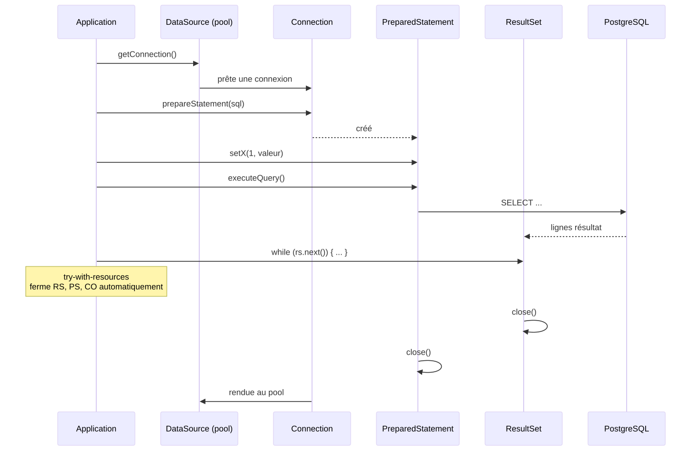

<!-- _class: lead -->
<!-- _paginate: false -->

<style scoped>
section {
  background-image: url('assets/logo-amu.png');
  background-repeat: no-repeat;
  background-position: bottom 40px center;
  background-size: 380px;
}
</style>

# MVVM, persistance et synthèse

**R2.02 - Développement d'applications avec IHM**

---

## Où en sommes-nous ?

<div style="display: flex; gap: 0.8rem; margin-top: 0.5rem; margin-bottom: 0.5rem; text-align: center; font-size: 2.5rem; line-height: 1;">
<div style="flex: 1;">&nbsp;</div>
<div style="flex: 1;">&nbsp;</div>
<div style="flex: 1;">&nbsp;</div>
<div style="flex: 1;">👇</div>
</div>

<div style="display: flex; gap: 0.8rem;">
<div style="background: #4a90d9; color: white; padding: 1.2rem; border-radius: 12px 12px 0 0; flex: 1; text-align: center;">
<div style="font-size: 1.8rem; font-weight: bold;">CM1 ✓</div>
<div style="margin-top: 0.3rem;">Fondations IHM + JavaFX</div>
</div>
<div style="background: #e8a838; color: white; padding: 1.2rem; border-radius: 12px 12px 0 0; flex: 1; text-align: center;">
<div style="font-size: 1.8rem; font-weight: bold;">CM2 ✓</div>
<div style="margin-top: 0.3rem;">Propriétés et bindings</div>
</div>
<div style="background: #27ae60; color: white; padding: 1.2rem; border-radius: 12px 12px 0 0; flex: 1; text-align: center;">
<div style="font-size: 1.8rem; font-weight: bold;">CM3 ✓</div>
<div style="margin-top: 0.3rem;">Architecture et FXML</div>
</div>
<div style="background: #8e44ad; color: white; padding: 1.2rem; border-radius: 12px 12px 0 0; flex: 1; text-align: center; box-shadow: 0 4px 12px rgba(142,68,173,0.4);">
<div style="font-size: 1.8rem; font-weight: bold;">CM4</div>
<div style="margin-top: 0.3rem;">MVVM + persistance</div>
</div>
</div>

<div style="display: flex; gap: 0.8rem; text-align: center; font-size: 1.5rem; color: #999;">
<div style="flex: 1;">↓</div>
<div style="flex: 1;">↓</div>
<div style="flex: 1;">↓</div>
<div style="flex: 1;">↓</div>
</div>

<div style="display: flex; gap: 0.8rem;">
<div style="background: #d0e2f3; color: #2c5f8a; padding: 0.8rem; border-radius: 0 0 12px 12px; flex: 1; text-align: center; font-weight: bold;">
TP1 ✓
</div>
<div style="background: #fae5c0; color: #8a6a1f; padding: 0.8rem; border-radius: 0 0 12px 12px; flex: 1; text-align: center; font-weight: bold;">
TP2 ✓
</div>
<div style="background: #c8e6c9; color: #1b5e20; padding: 0.8rem; border-radius: 0 0 12px 12px; flex: 1; text-align: center; font-weight: bold;">
TP3 ✓
</div>
<div style="background: #e1bee7; color: #5c2473; padding: 0.8rem; border-radius: 0 0 12px 12px; flex: 1; text-align: center; font-weight: bold;">
TP4 + TP5
</div>
</div>

<div style="display: flex; gap: 0.8rem; margin-top: 0.5rem; text-align: center; font-size: 2.5rem; line-height: 1;">
<div style="flex: 1;">&nbsp;</div>
<div style="flex: 1;">&nbsp;</div>
<div style="flex: 1;">&nbsp;</div>
<div style="flex: 1;">👆</div>
</div>

---

## Rappel CM3 - Ce que vous savez déjà

<div style="display: grid; grid-template-columns: 1fr 1fr 1fr; gap: 1.2rem; margin-top: 1.5rem;">
<div style="background: #1a5276; color: white; padding: 1.2rem; border-radius: 10px;">
<div style="font-size: 1.7rem; margin-bottom: 0.5rem; font-weight: bold;">🏗️ MVC</div>
<div style="margin-top: 0.5rem; font-size: 1.5rem; opacity: 0.9;">
<b>Modèle</b> métier, <b>Vue</b> en FXML, <b>Contrôleur</b> qui orchestre. Trois fichiers, trois responsabilités.
</div>
</div>
<div style="background: #1a5276; color: white; padding: 1.2rem; border-radius: 10px;">
<div style="font-size: 1.7rem; margin-bottom: 0.5rem; font-weight: bold;">📄 FXML</div>
<div style="margin-top: 0.5rem; font-size: 1.5rem; opacity: 0.9;">
La vue déclarative, <code>@FXML</code>, <code>fx:controller</code>, <code>onAction</code>, <code>fx:include</code>. Édition possible via SceneBuilder.
</div>
</div>
<div style="background: #27ae60; color: white; padding: 1.2rem; border-radius: 10px;">
<div style="font-size: 1.7rem; margin-bottom: 0.5rem; font-weight: bold;">🧠 Cohérence</div>
<div style="margin-top: 0.5rem; font-size: 1.5rem; opacity: 0.9;">
Heuristique #4 de Nielsen. Mutualiser FXML+CSS, créer un <b>design system</b>, prévenir l'incohérence.
</div>
</div>
</div>

<div style="background: #2c3e50; color: white; padding: 1.2rem 2rem; border-radius: 10px; margin-top: 1.5rem; font-size: 1.5rem; text-align: center;">
Aujourd'hui : combiner <b>MVC + bindings</b> pour aller vers <b>MVVM</b>, ajouter la <b>persistance</b>, et faire la <b>synthèse</b> du module.
</div>

---

## À la fin de ce CM, vous saurez...

<div style="display: grid; grid-template-columns: 1fr 1fr; gap: 1.2rem; margin-top: 1rem;">

<div style="background: #1a5276; color: white; padding: 1.2rem; border-radius: 12px; box-shadow: 0 4px 10px rgba(0,0,0,0.15);">
<div style="font-size: 1.8rem; font-weight: bold; margin-bottom: 0.5rem;">🏗️ Concevoir</div>
<div style="font-size: 1.3rem; line-height: 1.5;">Une architecture <b>MVVM</b> avec un <b>ViewModel</b> qui expose des propriétés observables et reste testable sans JavaFX.</div>
<div style="background: rgba(0,0,0,0.25); padding: 0.3rem 0.7rem; border-radius: 6px; font-size: 1rem; margin-top: 0.7rem; display: inline-block;">Partie 2</div>
</div>

<div style="background: #1a5276; color: white; padding: 1.2rem; border-radius: 12px; box-shadow: 0 4px 10px rgba(0,0,0,0.15);">
<div style="font-size: 1.8rem; font-weight: bold; margin-bottom: 0.5rem;">💉 Injecter</div>
<div style="font-size: 1.3rem; line-height: 1.5;">Les dépendances avec <b>Guice 7</b> : <code>@Inject</code>, <code>Module</code>, scopes, alternative au <code>new</code> en cascade.</div>
<div style="background: rgba(0,0,0,0.25); padding: 0.3rem 0.7rem; border-radius: 6px; font-size: 1rem; margin-top: 0.7rem; display: inline-block;">Partie 3</div>
</div>

<div style="background: #1a5276; color: white; padding: 1.2rem; border-radius: 12px; box-shadow: 0 4px 10px rgba(0,0,0,0.15);">
<div style="font-size: 1.8rem; font-weight: bold; margin-bottom: 0.5rem;">💾 Persister</div>
<div style="font-size: 1.3rem; line-height: 1.5;">Un modèle métier en base relationnelle avec <b>JDBC</b> (Connection, PreparedStatement, ResultSet, transactions), et lancer la BDD localement avec <b>SQLite</b>.</div>
<div style="background: rgba(0,0,0,0.25); padding: 0.3rem 0.7rem; border-radius: 6px; font-size: 1rem; margin-top: 0.7rem; display: inline-block;">Partie 4</div>
</div>

<div style="background: #27ae60; color: white; padding: 1.2rem; border-radius: 12px; box-shadow: 0 4px 10px rgba(0,0,0,0.15);">
<div style="font-size: 1.8rem; font-weight: bold; margin-bottom: 0.5rem;">🧠 Prévenir</div>
<div style="font-size: 1.3rem; line-height: 1.5;">Les erreurs utilisateur (Nielsen #5) et permettre de bien <b>récupérer</b> quand elles surviennent (Nielsen #9), avec des interfaces tolérantes.</div>
<div style="background: rgba(0,0,0,0.25); padding: 0.3rem 0.7rem; border-radius: 6px; font-size: 1rem; margin-top: 0.7rem; display: inline-block;">Partie 5</div>
</div>

</div>

<div style="background: #2c3e50; color: white; padding: 0.9rem 1.2rem; border-radius: 10px; margin-top: 1rem; font-size: 1.5rem; text-align: center;">
<em>Niveau Bloom : Créer / Évaluer</em> - TP4 et TP5 vous demandent d'<b>assembler</b> et de <b>juger</b> les choix d'architecture.
</div>

---

<!-- _class: lead -->
<!-- _header: "" -->
<!-- _footer: "" -->

# Partie 1 - 🤔 Le problème

---

## MVC en pratique : le contrôleur reste la zone grise

<p style="font-size: 1.5rem; margin: -0.5rem 0 0.6rem 0;">Au CM3, on a découpé en M, V, C. Mais le <b>contrôleur</b> finit par mélanger plusieurs responsabilités quand l'écran se complexifie.</p>

```java
public class FormulaireController {
  @FXML private TextField email;
  @FXML private PasswordField motDePasse;
  @FXML private Button valider;
  @FXML private Label statut;

  private final ServiceAuth auth = new ServiceAuthImpl();   // ❌ couplage dur
  private final HistoriqueConnexion historique = new HistoriqueConnexionDB(); // ❌ idem

  @FXML void initialize() {
    valider.disableProperty().bind(email.textProperty().isEmpty());
  }

  @FXML void valider() {
    statut.setText("Connexion en cours...");           // ❌ état UI dans le contrôleur
    boolean ok = auth.connecter(email.getText(), motDePasse.getText()); // ❌ logique
    if (ok) {
      historique.enregistrer(email.getText(), LocalDateTime.now());     // ❌ effet de bord
      statut.setText("Bienvenue " + email.getText().split("@")[0]);     // ❌ UI + logique
    } else {
      statut.setText("Échec : email ou mot de passe incorrect.");
    }
  }
}
```

---

## Trois douleurs concrètes

<div style="display: grid; grid-template-columns: 1fr 1fr 1fr; gap: 0.9rem; margin-top: 0.5rem;">

<div style="background: #c0392b; color: white; padding: 1.1rem 1.2rem; border-radius: 10px;">
<div style="font-size: 1.35rem; font-weight: bold; margin-bottom: 0.4rem;">😵 Tests difficiles</div>
<div style="font-size: 1.1rem; line-height: 1.5;">Pour tester la logique de validation, il faut monter une <code>Application</code> JavaFX, charger le FXML, simuler les saisies. Lent, fragile.</div>
</div>

<div style="background: #c0392b; color: white; padding: 1.1rem 1.2rem; border-radius: 10px;">
<div style="font-size: 1.35rem; font-weight: bold; margin-bottom: 0.4rem;">🔗 Couplage fort</div>
<div style="font-size: 1.1rem; line-height: 1.5;">Le contrôleur instancie <code>ServiceAuthImpl</code> directement. Impossible de le remplacer par un mock pour tester, ou par une autre implémentation en prod.</div>
</div>

<div style="background: #c0392b; color: white; padding: 1.1rem 1.2rem; border-radius: 10px;">
<div style="font-size: 1.35rem; font-weight: bold; margin-bottom: 0.4rem;">📐 Logique éparpillée</div>
<div style="font-size: 1.1rem; line-height: 1.5;">L'état « connexion en cours », les messages, le formatage du nom : tout vit dans des branches <code>if</code> du contrôleur. Pas réutilisable.</div>
</div>

</div>

<div style="background: #2c3e50; color: white; padding: 0.85rem 1.2rem; border-radius: 10px; margin-top: 0.9rem; font-size: 1.5rem; text-align: center;">
💡 Le contrôleur est devenu un <b>fat controller</b> : il fait trop de choses, donc rien ne peut être testé ni réutilisé en isolation.
</div>

---

## La pyramide des tests

<p style="font-size: 1.5rem; margin: -0.5rem 0 0.5rem 0;">Plus un test est <b>haut</b> dans la pyramide, plus il coûte cher à écrire et à exécuter. L'objectif : maximiser la base.</p>

<div style="display: grid; grid-template-columns: 1fr 2fr; gap: 0.9rem; align-items: center; margin-top: 0.4rem;">

<div>

<svg viewBox="0 0 220 200" xmlns="http://www.w3.org/2000/svg" style="width: 100%; max-width: 220px;">
  <polygon points="110,15 200,180 20,180" fill="none" stroke="#2c3e50" stroke-width="2"/>
  <line x1="65" y1="100" x2="155" y2="100" stroke="#2c3e50" stroke-width="2"/>
  <line x1="40" y1="150" x2="180" y2="150" stroke="#2c3e50" stroke-width="2"/>

  <rect x="80" y="30" width="60" height="48" fill="#c0392b" opacity="0.85"/>
  <text x="110" y="58" font-family="sans-serif" font-size="11" fill="white" text-anchor="middle" font-weight="bold">E2E</text>

  <rect x="55" y="105" width="110" height="40" fill="#e8a838" opacity="0.85"/>
  <text x="110" y="130" font-family="sans-serif" font-size="11" fill="white" text-anchor="middle" font-weight="bold">Intégration / TestFX</text>

  <rect x="25" y="155" width="170" height="22" fill="#27ae60" opacity="0.85"/>
  <text x="110" y="170" font-family="sans-serif" font-size="11" fill="white" text-anchor="middle" font-weight="bold">Unitaires (JUnit)</text>
</svg>

</div>

<div>

<div style="background: #c0392b; color: white; padding: 0.6rem 0.9rem; border-radius: 8px; margin-bottom: 0.4rem;">
<b>E2E (rouge)</b> : lance toute l'app, simule clavier/souris. Lent (10-30 s/test), fragile.
</div>

<div style="background: #e8a838; color: white; padding: 0.6rem 0.9rem; border-radius: 8px; margin-bottom: 0.4rem;">
<b>Intégration / TestFX (orange)</b> : monte une partie de l'UI. Moyennement coûteux (1-3 s).
</div>

<div style="background: #27ae60; color: white; padding: 0.6rem 0.9rem; border-radius: 8px;">
<b>Unitaires (vert)</b> : JUnit pur sur classes Java. Ultra rapide (&lt; 50 ms), 100% fiables.
</div>

</div>

</div>

<div style="background: #2c3e50; color: white; padding: 0.7rem 1.2rem; border-radius: 8px; margin-top: 0.5rem; font-size: 1.5rem; text-align: center;">
🎯 <b>MVVM permet de basculer la logique d'affichage du haut vers la base de la pyramide.</b>
</div>

---

## L'idée de MVVM : interposer un ViewModel

<p style="font-size: 1.5rem; margin: -0.5rem 0 0.5rem 0;">On insère une couche entre la vue et le modèle : le <b>ViewModel</b>. Il porte l'<b>état UI</b> sous forme de propriétés observables.</p>

<div style="display: grid; grid-template-columns: 1fr 1fr; gap: 1rem; margin-top: 0.4rem;">

<div style="background: #c0392b; color: white; padding: 1rem 1.2rem; border-radius: 10px;">
<div style="font-size: 1.3rem; font-weight: bold; margin-bottom: 0.4rem;">📍 MVC (CM3)</div>
<div style="font-size: 1.1rem; line-height: 1.5;">Vue ↔ <b>Contrôleur</b> ↔ Modèle.<br/>Le contrôleur connaît la vue (champs <code>@FXML</code>) ET le modèle.</div>
</div>

<div style="background: #8e44ad; color: white; padding: 1rem 1.2rem; border-radius: 10px;">
<div style="font-size: 1.3rem; font-weight: bold; margin-bottom: 0.4rem;">🎯 MVVM (CM4)</div>
<div style="font-size: 1.1rem; line-height: 1.5;">Vue ↔ <b>ViewModel</b> ↔ Modèle.<br/>Le ViewModel expose des propriétés. La vue s'y bind. Personne ne « connaît » personne.</div>
</div>

</div>

<div style="background: #2c3e50; color: white; padding: 0.7rem 1.2rem; border-radius: 8px; margin-top: 0.5rem; font-size: 1.5rem; text-align: center;">
👉 Le ViewModel ne sait <b>rien</b> de JavaFX (pas de <code>Label</code>, pas de <code>Button</code>). Il manipule juste des <code>StringProperty</code>, <code>BooleanProperty</code>...
</div>

---

## Origine et adoption de MVVM

<p style="font-size: 1.5rem; margin: -0.5rem 0 0.6rem 0;">MVVM est plus jeune que MVC, et né d'une nécessité industrielle.</p>

<div style="display: grid; grid-template-columns: 1fr 3fr; gap: 0.5rem 0.9rem; align-items: center; margin-top: 0.4rem;">

<div style="background: #8e44ad; color: white; padding: 0.7rem 1rem; border-radius: 8px; text-align: center; font-weight: bold;">2005</div>
<div style="background: rgba(142,68,173,0.12); padding: 0.6rem 1rem; border-radius: 8px;">John Gossman (Microsoft) formalise <b>MVVM</b> pour <b>WPF</b>. L'idée : tirer parti du data binding XAML.</div>

<div style="background: #8e44ad; color: white; padding: 0.7rem 1rem; border-radius: 8px; text-align: center; font-weight: bold;">2010</div>
<div style="background: rgba(142,68,173,0.12); padding: 0.6rem 1rem; border-radius: 8px;"><b>Knockout.js</b> popularise MVVM côté web. Le pattern devient mainstream pour les SPA.</div>

<div style="background: #8e44ad; color: white; padding: 0.7rem 1rem; border-radius: 8px; text-align: center; font-weight: bold;">2014</div>
<div style="background: rgba(142,68,173,0.12); padding: 0.6rem 1rem; border-radius: 8px;"><b>Vue.js</b> et <b>Angular</b> intègrent MVVM par défaut. Le binding réactif devient une attente standard.</div>

<div style="background: #8e44ad; color: white; padding: 0.7rem 1rem; border-radius: 8px; text-align: center; font-weight: bold;">2018</div>
<div style="background: rgba(142,68,173,0.12); padding: 0.6rem 1rem; border-radius: 8px;"><b>React Hooks</b> apportent un équivalent fonctionnel : <code>useState</code> joue le rôle de <code>Property</code>.</div>

<div style="background: #27ae60; color: white; padding: 0.7rem 1rem; border-radius: 8px; text-align: center; font-weight: bold;">2026</div>
<div style="background: rgba(39,174,96,0.15); padding: 0.6rem 1rem; border-radius: 8px;"><b>JavaFX</b> a tous les ingrédients pour MVVM : propriétés, bindings, FXML. Il suffit d'<b>introduire le ViewModel</b>.</div>

</div>

<div style="background: #2c3e50; color: white; padding: 0.7rem 1.2rem; border-radius: 8px; margin-top: 0.6rem; font-size: 1.5rem; text-align: center;">
👉 MVVM = MVC + propriétés observables systématiques. C'est notre <b>CM2 + CM3</b> arrivés à maturité.
</div>

---

## Pourquoi maintenant et pas plus tôt ?

<div style="display: grid; grid-template-columns: 1fr 1fr; gap: 0.9rem; margin-top: 0.5rem;">

<div style="background: #4a90d9; color: white; padding: 1.1rem 1.2rem; border-radius: 10px;">
<div style="font-size: 1.35rem; font-weight: bold; margin-bottom: 0.4rem;">📚 Outils déjà acquis</div>
<div style="font-size: 1.15rem; line-height: 1.5;">Propriétés (<b>CM2</b>) + bindings (<b>CM2</b>) + FXML (<b>CM3</b>) sont les briques. MVVM les <b>oriente</b> en pattern.</div>
</div>

<div style="background: #4a90d9; color: white; padding: 1.1rem 1.2rem; border-radius: 10px;">
<div style="font-size: 1.35rem; font-weight: bold; margin-bottom: 0.4rem;">🧪 Maturité testabilité</div>
<div style="font-size: 1.15rem; line-height: 1.5;">Vous savez écrire des tests JUnit. MVVM permet de tester <b>la logique d'affichage</b> sans monter d'UI.</div>
</div>

<div style="background: #4a90d9; color: white; padding: 1.1rem 1.2rem; border-radius: 10px;">
<div style="font-size: 1.35rem; font-weight: bold; margin-bottom: 0.4rem;">🎯 Apps qui grossissent</div>
<div style="font-size: 1.15rem; line-height: 1.5;">Un compteur n'a pas besoin de MVVM. La <b>SAÉ chauve-souris</b> avec ses filtres, exports, validations : oui.</div>
</div>

<div style="background: #4a90d9; color: white; padding: 1.1rem 1.2rem; border-radius: 10px;">
<div style="font-size: 1.35rem; font-weight: bold; margin-bottom: 0.4rem;">💼 Standard industriel</div>
<div style="font-size: 1.15rem; line-height: 1.5;">Quasiment toutes les UI modernes utilisent une variante de MVVM. C'est <b>la</b> compétence d'employabilité.</div>
</div>

</div>

---

<!-- _class: lead -->
<!-- _header: "" -->
<!-- _footer: "" -->

# Partie 2 - 🏗️ MVVM

**Modèle, Vue, ViewModel**

---

## 🏗️ Le pattern Modèle-Vue-ViewModel

<p style="font-size: 1.5rem; margin: -0.5rem 0 0.6rem 0;">Trois rôles, dont deux que vous connaissez et un nouveau venu.</p>

<div style="display: grid; grid-template-columns: 1fr 1fr 1fr; gap: 1rem; margin-top: 0.5rem;">

<div style="background: #1a5276; color: white; padding: 1.2rem 1.3rem; border-radius: 12px;">
<div style="font-size: 1.5rem; font-weight: bold; margin-bottom: 0.4rem;">📊 Modèle</div>
<div style="font-size: 1.15rem; line-height: 1.5;">Données et logique métier <b>pure</b>. Aucune référence à JavaFX ni à l'UI. <em>Comme en MVC.</em></div>
</div>

<div style="background: #8e44ad; color: white; padding: 1.2rem 1.3rem; border-radius: 12px;">
<div style="font-size: 1.5rem; font-weight: bold; margin-bottom: 0.4rem;">🎯 ViewModel</div>
<div style="font-size: 1.15rem; line-height: 1.5;">État UI sous forme de <b>propriétés observables</b>. Logique de présentation. Ne connaît pas la vue.</div>
</div>

<div style="background: #4a90d9; color: white; padding: 1.2rem 1.3rem; border-radius: 12px;">
<div style="font-size: 1.5rem; font-weight: bold; margin-bottom: 0.4rem;">🖼️ Vue</div>
<div style="font-size: 1.15rem; line-height: 1.5;">FXML + un contrôleur très <b>mince</b> qui se contente de bind la vue au ViewModel.</div>
</div>

</div>

<div style="background: #2c3e50; color: white; padding: 0.85rem 1.2rem; border-radius: 10px; margin-top: 1rem; font-size: 1.5rem; text-align: center;">
💡 Le ViewModel est <b>la couche testable</b> qui contient toute la logique de l'écran <b>sans avoir besoin de fenêtre</b>.
</div>

---

## Qui parle à qui ?


<div style="background: #2c3e50; color: white; padding: 0.85rem 1.2rem; border-radius: 10px; margin-top: 0.9rem; font-size: 1.5rem; line-height: 1.55;">
<b>Direction des flèches :</b> la <b>Vue</b> se bind au <b>ViewModel</b> (read-only à l'affichage, bidirectionnel sur les saisies). Le <b>ViewModel</b> appelle le <b>Modèle</b> et observe ses changements via propriétés.
</div>

---

## MVC vs MVVM : la différence en une slide

<style scoped>
section pre { font-size: 0.7rem !important; line-height: 1.3 !important; }
section code { font-size: 1em !important; }
</style>

<div style="display: grid; grid-template-columns: 1fr 1fr; gap: 0.6rem; margin-top: 0.3rem;">

<div>
<div style="background: #c0392b; color: white; padding: 0.4rem 0.8rem; border-radius: 6px 6px 0 0; font-weight: bold; font-size: 1.5rem;">MVC : le controller manipule la vue</div>

```java
public class CompteurController {
  private final Compteur compteur = new Compteur();
  @FXML private Label message;

  @FXML void initialize() {
    message.textProperty().bind(
      compteur.valeurProperty().asString());
  }

  @FXML void incrementer() {
    compteur.incrementer();
  }
}
```

</div>

<div>
<div style="background: #27ae60; color: white; padding: 0.4rem 0.8rem; border-radius: 6px 6px 0 0; font-weight: bold; font-size: 1.5rem;">MVVM : le controller bind, le VM porte l'état</div>

```java
public class CompteurController {
  @Inject CompteurViewModel vm;
  @FXML private Label message;

  @FXML void initialize() {
    message.textProperty().bind(vm.messageProperty());
  }

  @FXML void incrementer() {
    vm.incrementerCommand();
  }
}
// CompteurViewModel : StringProperty messageProperty,
// méthode incrementerCommand() => testable sans UI.
```

</div>

</div>

<div style="background: #2c3e50; color: white; padding: 0.6rem 1.2rem; border-radius: 8px; margin-top: 0.4rem; font-size: 1.5rem; text-align: center;">
Le contrôleur MVVM est une <b>colle</b> : 80% des lignes deviennent des bindings vers le VM.
</div>

---

## Le ViewModel : une classe Java pure

```java
public class CompteurViewModel {

  private final Compteur compteur;

  // Propriété UI exposée à la vue
  private final StringProperty message = new SimpleStringProperty("Compteur à 0");

  public CompteurViewModel(Compteur compteur) {
    this.compteur = compteur;
    // bind interne : la propriété UI dépend de la propriété métier
    message.bind(Bindings.concat("Compteur à ", compteur.valeurProperty()));
  }

  public StringProperty messageProperty() {
    return message;
  }

  public void incrementerCommand() {
    compteur.incrementer();
  }
}
```

<div style="background: #2c3e50; color: white; padding: 0.7rem 1.2rem; border-radius: 8px; margin-top: 0.4rem; font-size: 1.5rem; text-align: center;">
Aucun import JavaFX UI (pas de <code>Label</code>, pas de <code>Button</code>). Juste <code>javafx.beans.property</code> et <code>javafx.beans.binding</code>.
</div>

---

## Test du ViewModel : zéro UI, zéro mock

```java
@Test
void messageRefleteLaValeurDuCompteur() {
  Compteur compteur = new Compteur();
  CompteurViewModel vm = new CompteurViewModel(compteur);

  assertEquals("Compteur à 0", vm.messageProperty().get());

  vm.incrementerCommand();
  assertEquals("Compteur à 1", vm.messageProperty().get());

  vm.incrementerCommand();
  vm.incrementerCommand();
  assertEquals("Compteur à 3", vm.messageProperty().get());
}
```

<div style="background: #27ae60; color: white; padding: 0.85rem 1.2rem; border-radius: 10px; margin-top: 0.5rem; font-size: 1.5rem; text-align: center;">
✨ Pas de TestFX, pas de <code>Application.launch()</code>, pas de mock framework. Du JUnit pur, instantané.
</div>

<div style="background: #2c3e50; color: white; padding: 0.7rem 1.2rem; border-radius: 8px; margin-top: 0.6rem; font-size: 1.5rem; text-align: center;">
👉 C'est <b>le</b> bénéfice qui vend MVVM : la logique d'affichage devient <b>testable comme du code métier</b>.
</div>

---

## Anatomie d'un projet MVVM

```
src/main/java/fr/iut/exempleapp/
├── App.java                      # bootstrap JavaFX + injection
├── compteur/
│   ├── model/
│   │   └── Compteur.java         # logique métier pure (testable JUnit)
│   ├── viewmodel/
│   │   └── CompteurViewModel.java # propriétés UI + commandes (testable JUnit)
│   ├── view/
│   │   ├── compteur.fxml         # structure visuelle (édité avec SceneBuilder)
│   │   ├── compteur.css          # apparence
│   │   └── CompteurController.java # @FXML + bindings vers le VM
│   └── di/
│       └── CompteurModule.java   # configuration Guice (CM4 partie 3)
└── ...
```

<div style="background: #2c3e50; color: white; padding: 0.7rem 1.2rem; border-radius: 8px; margin-top: 0.5rem; font-size: 1.5rem; text-align: center;">
Quatre dossiers, quatre responsabilités. Chaque test cible un dossier précis sans toucher aux autres.
</div>

---

## Exemple concret : MessageView (TP4 ex1)

<style scoped>
section pre { font-size: 0.7rem !important; line-height: 1.3 !important; }
section code { font-size: 1em !important; }
</style>

<div style="display: grid; grid-template-columns: 1fr 1fr; gap: 0.5rem; margin-top: 0.3rem;">

<div>
<div style="background: #1a5276; color: white; padding: 0.4rem 0.7rem; border-radius: 6px 6px 0 0; font-weight: bold; font-size: 1rem;">📊 Message (Modèle)</div>

```java
public class Message {
  private String texte = "";

  public String getTexte() {
    return texte;
  }

  public void setTexte(String t) {
    this.texte = t;
  }
}
```

<div style="background: #8e44ad; color: white; padding: 0.4rem 0.7rem; border-radius: 6px 6px 0 0; font-weight: bold; font-size: 1rem; margin-top: 0.4rem;">🎯 MessageViewModel</div>

```java
public class MessageViewModel {
  private final Message message;
  private final StringProperty texte
    = new SimpleStringProperty();

  public MessageViewModel(Message m) {
    this.message = m;
    texte.set(m.getTexte());
    texte.addListener((o, a, n)
        -> m.setTexte(n));
  }

  public StringProperty texteProperty() {
    return texte;
  }
}
```

</div>

<div>
<div style="background: #4a90d9; color: white; padding: 0.4rem 0.7rem; border-radius: 6px 6px 0 0; font-weight: bold; font-size: 1rem;">🖼️ MessageView (Controller)</div>

```java
public class MessageController {
  @Inject MessageViewModel vm;

  @FXML private TextField champ;
  @FXML private Label affichage;

  @FXML void initialize() {
    // Bidirectionnel : saisie sync vers VM
    champ.textProperty()
         .bindBidirectional(vm.texteProperty());
    // Lecture seule : affichage suit VM
    affichage.textProperty()
             .bind(vm.texteProperty());
  }
}
```

<div style="background: #4a90d9; color: white; padding: 0.4rem 0.7rem; border-radius: 6px 6px 0 0; font-weight: bold; font-size: 1rem; margin-top: 0.4rem;">📄 message.fxml</div>

```xml
<VBox fx:controller=
   "fr.iut.MessageController"
   xmlns:fx="http://javafx.com/fxml">
  <TextField fx:id="champ"/>
  <Label fx:id="affichage"/>
</VBox>
```

</div>

</div>

<div style="background: #2c3e50; color: white; padding: 0.55rem 1.1rem; border-radius: 8px; margin-top: 0.3rem; font-size: 1.5rem; text-align: center;">
Tape dans le champ → le VM met à jour le modèle → l'affichage suit. Trois fichiers Java, un FXML.
</div>

---

## Listes : ObservableList et data binding

<p style="font-size: 1.5rem; margin: -0.5rem 0 0.5rem 0;">Pour exposer une <b>collection</b> qui se met à jour automatiquement dans une <code>TableView</code> ou <code>ListView</code>, on utilise une <code>ObservableList</code>.</p>

<div style="display: grid; grid-template-columns: 1fr 1fr; gap: 0.7rem; margin-top: 0.3rem;">

<div>
<div style="background: #8e44ad; color: white; padding: 0.4rem 0.7rem; border-radius: 6px 6px 0 0; font-weight: bold; font-size: 1rem;">PokemonViewModel</div>

```java
private final ObservableList<Pokemon>
    pokemons = FXCollections
                 .observableArrayList();

public PokemonViewModel(PokemonService s) {
  pokemons.setAll(s.tousLesPokemons());
}

public ObservableList<Pokemon>
    pokemonsProperty() {
  return pokemons;
}

public void capturer(Pokemon p) {
  pokemons.add(p);
  // la TableView se met à jour seule
}
```

</div>

<div>
<div style="background: #4a90d9; color: white; padding: 0.4rem 0.7rem; border-radius: 6px 6px 0 0; font-weight: bold; font-size: 1rem;">Controller</div>

```java
@Inject PokemonViewModel vm;

@FXML private TableView<Pokemon> table;

@FXML void initialize() {
  table.setItems(vm.pokemonsProperty());
  // toute modif de la liste côté VM
  // se reflète automatiquement
  // dans la TableView
}
```

</div>

</div>

<div style="background: #2c3e50; color: white; padding: 0.6rem 1.2rem; border-radius: 8px; margin-top: 0.4rem; font-size: 1.5rem; text-align: center;">
👉 <code>ObservableList</code> est à <code>List</code> ce que <code>StringProperty</code> est à <code>String</code> : une version observable qui notifie ses changements.
</div>

---

## Plusieurs vues, un seul ViewModel

<p style="font-size: 1.5rem; margin: -0.5rem 0 0.5rem 0;">Bénéfice clé : un même ViewModel peut alimenter <b>plusieurs vues</b> simultanément.</p>

```java
// Une vue formulaire pour saisir
champ.textProperty().bindBidirectional(vm.texteProperty());

// Une autre vue, en bas de l'écran, pour afficher en temps réel
preview.textProperty().bind(vm.texteProperty());

// Un compteur de caractères, ailleurs
compteur.textProperty().bind(
    Bindings.concat(vm.texteProperty().length(), " caractères"));
```

<div style="display: grid; grid-template-columns: 1fr 1fr; gap: 0.7rem; margin-top: 0.5rem;">

<div style="background: #8e44ad; color: white; padding: 0.85rem 1.1rem; border-radius: 10px;">
<div style="font-size: 1.25rem; font-weight: bold;">🔁 Réactivité naturelle</div>
<div style="font-size: 1.05rem; margin-top: 0.2rem;">Une modif côté formulaire propage instantanément vers preview ET compteur.</div>
</div>

<div style="background: #8e44ad; color: white; padding: 0.85rem 1.1rem; border-radius: 10px;">
<div style="font-size: 1.25rem; font-weight: bold;">🧪 Test unique</div>
<div style="font-size: 1.05rem; margin-top: 0.2rem;">Un seul test sur le VM couvre les 3 vues. Pas de duplication.</div>
</div>

</div>

---

## Commandes : modéliser les actions

<p style="font-size: 1.5rem; margin: -0.5rem 0 0.5rem 0;">Pour les actions (boutons), on expose des <b>méthodes</b> sur le VM. Pattern « Command ».</p>

```java
public class FormulaireConnexionViewModel {

  private final ServiceAuth auth;

  // Propriétés UI : champs et état
  private final StringProperty email = new SimpleStringProperty("");
  private final StringProperty motDePasse = new SimpleStringProperty("");
  private final StringProperty statut = new SimpleStringProperty("");
  private final BooleanProperty validable = new SimpleBooleanProperty(false);

  public FormulaireConnexionViewModel(ServiceAuth auth) {
    this.auth = auth;
    validable.bind(email.isNotEmpty().and(motDePasse.isNotEmpty()));
  }

  // Commande : action déclenchée par la vue
  public void connecterCommand() {
    statut.set("Connexion en cours...");
    boolean ok = auth.connecter(email.get(), motDePasse.get());
    statut.set(ok ? "Bienvenue !" : "Échec : vérifiez vos identifiants.");
  }

  public StringProperty emailProperty() { return email; }
  // ...
}
```

---

## Le contrôleur côté MVVM : un câblage

```java
public class FormulaireConnexionController {

  @Inject FormulaireConnexionViewModel vm;

  @FXML private TextField email;
  @FXML private PasswordField motDePasse;
  @FXML private Button valider;
  @FXML private Label statut;

  @FXML
  void initialize() {
    email.textProperty().bindBidirectional(vm.emailProperty());
    motDePasse.textProperty().bindBidirectional(vm.motDePasseProperty());
    statut.textProperty().bind(vm.statutProperty());
    valider.disableProperty().bind(vm.validableProperty().not());
  }

  @FXML
  void valider() {
    vm.connecterCommand();
  }
}
```

<div style="background: #2c3e50; color: white; padding: 0.7rem 1.2rem; border-radius: 8px; margin-top: 0.5rem; font-size: 1.5rem; text-align: center;">
Plus aucun <code>if</code>, plus aucune logique. Juste : <em>« je connecte les fils ».</em>
</div>

---

## Validation côté ViewModel

<p style="font-size: 1.5rem; margin: -0.5rem 0 0.5rem 0;">Le VM est l'endroit naturel pour valider les saisies : il a accès aux propriétés et expose des indicateurs d'erreur.</p>

```java
public class FormulaireViewModel {
  private final StringProperty email = new SimpleStringProperty("");
  private final StringProperty erreurEmail = new SimpleStringProperty("");
  private final BooleanBinding emailValide;

  public FormulaireViewModel() {
    // Règle de validation reactive
    emailValide = Bindings.createBooleanBinding(
        () -> email.get().matches("^[^@]+@[^@]+\\.[a-z]{2,}$"),
        email
    );
    // Message d'erreur dérivé
    erreurEmail.bind(Bindings.when(emailValide.or(email.isEmpty()))
        .then("")
        .otherwise("Format invalide. Exemple : prenom.nom@univ-amu.fr"));
  }

  public ReadOnlyStringProperty erreurEmailProperty() { return erreurEmail; }
  public BooleanBinding emailValide() { return emailValide; }
}
```

<div style="background: #2c3e50; color: white; padding: 0.6rem 1.2rem; border-radius: 8px; margin-top: 0.4rem; font-size: 1.5rem; text-align: center;">
👉 La vue se contente de <code>label.textProperty().bind(vm.erreurEmailProperty())</code>. Aucun <code>if</code> côté UI.
</div>

---

## Variantes : MVP et le reste de la famille

<style scoped>
section table { font-size: 0.92rem !important; width: 100%; border-collapse: collapse; }
section th { background: #1a5276 !important; color: white !important; padding: 0.35rem 0.7rem !important; text-align: left !important; }
section td { padding: 0.3rem 0.7rem !important; border-bottom: 1px solid #e0e0e0 !important; vertical-align: top; }
section tr:nth-child(even) td { background: #f4f6f8 !important; }
</style>

| Pattern | Découplage Vue↔Modèle | Mécanisme | Cas d'usage |
|---|---|---|---|
| **MVC classique** | Faible (Vue connaît Modèle) | Vue observe Modèle | Petites apps, prototypes |
| **MVP** (Presenter) | Fort | Vue ↔ Presenter ↔ Modèle, Presenter manipule Vue via interface | Apps Java Swing, GWT |
| **MVVM** | Très fort | Vue se bind à ViewModel, ViewModel ne connaît pas Vue | JavaFX, WPF, Vue, Knockout |
| **Flux / Redux** | Total | État central immuable, dispatch d'actions, vue pure | React, Vuex |
| **MVVM-C** (Coordinator) | Fort + navigation découplée | Coordinator pilote la composition de VM | Grosses apps iOS / mobiles |

<div style="background: #2c3e50; color: white; padding: 0.7rem 1.2rem; border-radius: 8px; margin-top: 0.5rem; font-size: 1.5rem; text-align: center;">
Ces patterns partagent tous la même intention : <b>séparer la logique d'affichage de la logique métier</b>. MVVM est le plus naturel pour JavaFX.
</div>

---

## Gérer les erreurs dans une commande

<p style="font-size: 1.5rem; margin: -0.5rem 0 0.5rem 0;">Une commande VM peut échouer (réseau, BDD, validation). On expose l'état via une propriété, jamais via une exception qui remonte à l'UI.</p>

```java
public class FormulaireConnexionViewModel {
  private final ServiceAuth auth;
  private final StringProperty statut = new SimpleStringProperty("");
  private final BooleanProperty enCours = new SimpleBooleanProperty(false);

  public void connecterCommand() {
    enCours.set(true);
    statut.set("Connexion en cours...");
    try {
      boolean ok = auth.connecter(email.get(), motDePasse.get());
      statut.set(ok ? "Bienvenue !" : "Identifiants incorrects.");
    } catch (ServiceIndisponibleException e) {
      statut.set("Le serveur ne répond pas. Réessayez dans quelques secondes.");
    } finally {
      enCours.set(false);
    }
  }
}
```

<div style="background: #2c3e50; color: white; padding: 0.6rem 1.2rem; border-radius: 8px; margin-top: 0.4rem; font-size: 1.5rem; text-align: center;">
La vue se contente de bind <code>statut</code> dans un Label et <code>enCours</code> sur un spinner. Aucun <code>try/catch</code> côté UI.
</div>

---

## Anti-patterns MVVM à éviter

<div style="display: grid; grid-template-columns: 1fr 1fr; gap: 0.9rem; margin-top: 0.5rem;">

<div style="background: #c0392b; color: white; padding: 1rem 1.2rem; border-radius: 10px;">
<div style="font-size: 1.3rem; font-weight: bold; margin-bottom: 0.4rem;">✗ ViewModel qui importe javafx.scene</div>
<div style="font-size: 1.1rem; line-height: 1.45;">Si vous voyez <code>import javafx.scene.control.Alert;</code> dans un VM, vous avez fui la séparation. Les alerts sont un détail de la vue.</div>
</div>

<div style="background: #c0392b; color: white; padding: 1rem 1.2rem; border-radius: 10px;">
<div style="font-size: 1.3rem; font-weight: bold; margin-bottom: 0.4rem;">✗ Controller qui contient de la logique</div>
<div style="font-size: 1.1rem; line-height: 1.45;">Si <code>@FXML void valider()</code> contient autre chose que <code>vm.valider()</code>, c'est une fuite. Déplacer vers le VM.</div>
</div>

<div style="background: #c0392b; color: white; padding: 1rem 1.2rem; border-radius: 10px;">
<div style="font-size: 1.3rem; font-weight: bold; margin-bottom: 0.4rem;">✗ ViewModel qui hérite de Property</div>
<div style="font-size: 1.1rem; line-height: 1.45;">Le VM <em>contient</em> des propriétés, il n'<em>est</em> pas une propriété. Composition, pas héritage.</div>
</div>

<div style="background: #c0392b; color: white; padding: 1rem 1.2rem; border-radius: 10px;">
<div style="font-size: 1.3rem; font-weight: bold; margin-bottom: 0.4rem;">✗ Modèle anémique</div>
<div style="font-size: 1.1rem; line-height: 1.45;">Si le modèle n'est qu'un POJO sans logique, c'est que la logique a fui dans le VM. Réagencer.</div>
</div>

</div>

---

## Bilan MVVM en une slide

<div style="display: grid; grid-template-columns: 1fr 1fr; gap: 0.9rem; margin-top: 0.4rem;">

<div style="background: #27ae60; color: white; padding: 1rem 1.2rem; border-radius: 10px;">
<div style="font-size: 1.3rem; font-weight: bold; margin-bottom: 0.4rem;">✓ Ce qu'on gagne</div>
<ul style="font-size: 1.1rem; line-height: 1.5; margin: 0; padding-left: 1.2rem;">
<li>Tests JUnit pur sur la logique d'affichage</li>
<li>Plusieurs vues sur un même VM</li>
<li>Bindings comme colle, pas de <code>if</code> manuel</li>
<li>Travail en parallèle vue/logique</li>
<li>Compatible avec mocks et DI</li>
</ul>
</div>

<div style="background: #c0392b; color: white; padding: 1rem 1.2rem; border-radius: 10px;">
<div style="font-size: 1.3rem; font-weight: bold; margin-bottom: 0.4rem;">⚠️ Ce que ça coûte</div>
<ul style="font-size: 1.1rem; line-height: 1.5; margin: 0; padding-left: 1.2rem;">
<li>Une couche de plus à comprendre</li>
<li>Plus verbose pour un compteur trivial</li>
<li>Bindings parfois subtils (lifecycle, weak refs)</li>
<li>Nécessite de la discipline pour ne pas tricher</li>
</ul>
</div>

</div>

<div style="background: #2c3e50; color: white; padding: 0.85rem 1.2rem; border-radius: 10px; margin-top: 0.6rem; font-size: 1.5rem; text-align: center;">
👉 Règle : si l'écran a <b>plus de 3-4 champs interactifs</b>, MVVM gagne. En dessous, MVC suffit.
</div>

---

<!-- _class: lead -->
<!-- _header: "" -->
<!-- _footer: "" -->

# Partie 3 - 💉 Injection de dépendances

**Guice 7**

---

## Pourquoi la DI, et pourquoi maintenant ?

<p style="font-size: 1.5rem; margin: -0.5rem 0 0.5rem 0;">Vous avez déjà croisé <code>@Inject</code> en Partie 2. Vous le retrouverez en Partie 4. C'est le <b>même pattern</b> qui ressurgit : celui qui rend chaque couche testable.</p>

<div style="display: grid; grid-template-columns: 1fr 1fr; gap: 0.8rem; margin-top: 0.5rem; align-items: stretch;">

<div style="background: #1a5276; color: white; padding: 0.9rem 1.1rem; border-radius: 10px;">
<div style="font-size: 1.5rem; font-weight: bold; margin-bottom: 0.4rem;">🏗️ Côté MVVM (Partie 2)</div>
<div style="font-size: 1.3rem; line-height: 1.5;">
Le <b>contrôleur</b> <code>@Inject</code>e son <b>ViewModel</b>.<br/>
Le <b>ViewModel</b> <code>@Inject</code>e ses <b>services</b>.<br/>
<em>→ chaque ViewModel se teste avec des services mockés, sans monter JavaFX.</em>
</div>
</div>

<div style="background: #27ae60; color: white; padding: 0.9rem 1.1rem; border-radius: 10px;">
<div style="font-size: 1.5rem; font-weight: bold; margin-bottom: 0.4rem;">💾 Côté Persistance (Partie 4)</div>
<div style="font-size: 1.3rem; line-height: 1.5;">
Le <b>ViewModel</b> <code>@Inject</code>e ses <b>DAO</b>.<br/>
Le <b>DAO</b> <code>@Inject</code>e son <b>DataSource</b>.<br/>
<em>→ chaque DAO se teste avec une BDD en mémoire, sans toucher la prod.</em>
</div>
</div>

</div>

<div style="background: #2c3e50; color: white; padding: 0.7rem 1.2rem; border-radius: 8px; margin-top: 0.5rem; font-size: 1.5rem; text-align: center;">
La DI est le <b>ciment</b> qui rend chaque couche testable <b>indépendamment</b> des autres. C'est ce qu'on va outiller avec <b>Guice</b>.
</div>

---

## 💉 Le problème : `new` partout

<p style="font-size: 1.5rem; margin: -0.5rem 0 0.5rem 0;">Au CM3, le contrôleur instancie son modèle avec <code>new</code>. C'est simple, mais ça crée un graphe d'objets fragiles.</p>

```java
public class FormulaireConnexionController {

  // Couplage dur : impossible de remplacer ServiceAuthImpl
  private final ServiceAuth auth = new ServiceAuthImpl();

  // Couplage en cascade : ServiceAuthImpl construit lui-même son client réseau,
  // qui ouvre une vraie socket vers le serveur d'authentification...
  // même pendant les tests unitaires.
}
```

<div style="background: #c0392b; color: white; padding: 0.85rem 1.2rem; border-radius: 10px; margin-top: 0.5rem; font-size: 1.5rem;">
🔥 Pour <b>tester</b> ce contrôleur sans appeler le vrai serveur, il faudrait modifier <code>ServiceAuthImpl</code> ou faire des hacks de réflexion. Trop tard, le couplage est gravé.
</div>

---

## L'inversion de contrôle (IoC)

<p style="font-size: 1.5rem; margin: -0.5rem 0 0.5rem 0;">Idée fondatrice : un objet ne doit pas <b>créer</b> ses dépendances. Il doit les <b>recevoir</b>.</p>

<div style="display: grid; grid-template-columns: 1fr 1fr; gap: 0.9rem; margin-top: 0.4rem;">

<div style="background: #c0392b; color: white; padding: 1rem 1.2rem; border-radius: 10px;">
<div style="font-size: 1.3rem; font-weight: bold; margin-bottom: 0.4rem;">✗ Ancien réflexe</div>

```java
class A {
  B b = new B();
  // A décide quel B utiliser
}
```

<div style="font-size: 1.1rem; line-height: 1.45; margin-top: 0.4rem;">A est <b>responsable</b> de la création de B. Couplage à l'implémentation.</div>
</div>

<div style="background: #27ae60; color: white; padding: 1rem 1.2rem; border-radius: 10px;">
<div style="font-size: 1.3rem; font-weight: bold; margin-bottom: 0.4rem;">✓ Avec IoC</div>

```java
class A {
  final B b;
  A(B b) { this.b = b; }
  // A reçoit son B en cadeau
}
```

<div style="font-size: 1.1rem; line-height: 1.45; margin-top: 0.4rem;">A déclare ce dont il a <b>besoin</b>. Quelqu'un d'autre choisit l'implémentation.</div>
</div>

</div>

<div style="background: #2c3e50; color: white; padding: 0.7rem 1.2rem; border-radius: 8px; margin-top: 0.6rem; font-size: 1.5rem; text-align: center;">
Le terme « inversion » : c'est le <b>responsable de la composition</b> qui change de bord, pas la classe consommatrice.
</div>

---

## Composition root : qui assemble tout ?

<p style="font-size: 1.5rem; margin: -0.5rem 0 0.5rem 0;">Sans framework, on instancie « à la main » au démarrage de l'app.</p>

```java
public class App extends Application {
  @Override
  public void start(Stage stage) throws IOException {
    // Composition root : un endroit unique qui crée tout le graphe
    HttpClient http = HttpClient.newHttpClient();
    ServiceAuth auth = new ServiceAuthImpl(http);
    HistoriqueConnexion historique = new HistoriqueConnexionEnMemoire();
    FormulaireConnexionViewModel vm = new FormulaireConnexionViewModel(auth, historique);

    FXMLLoader loader = new FXMLLoader(getClass().getResource("/fxml/login.fxml"));
    loader.setController(new FormulaireConnexionController(vm));
    Parent root = loader.load();

    stage.setScene(new Scene(root));
    stage.show();
  }
}
```

<div style="background: #c0392b; color: white; padding: 0.7rem 1.2rem; border-radius: 8px; margin-top: 0.4rem; font-size: 1.5rem;">
⚠️ Quand l'app a 30 contrôleurs et 50 services, ce <code>start()</code> devient un cauchemar de 200 lignes.
</div>

---

## Guice : un container DI léger

<p style="font-size: 1.5rem; margin: -0.5rem 0 0.5rem 0;"><b>Google Guice</b> automatise la composition. On déclare les dépendances avec <code>@Inject</code> et un <b>Module</b> qui dit comment les résoudre.</p>

<div style="display: grid; grid-template-columns: 1fr 1fr; gap: 0.7rem; margin-top: 0.4rem;">

<div>
<div style="background: #8e44ad; color: white; padding: 0.4rem 0.8rem; border-radius: 6px 6px 0 0; font-weight: bold; font-size: 1.05rem;">Le consommateur</div>

```java
public class FormulaireController {

  @Inject
  private FormulaireViewModel vm;

  @FXML
  void initialize() {
    // ... bindings ...
  }
}
```

</div>

<div>
<div style="background: #8e44ad; color: white; padding: 0.4rem 0.8rem; border-radius: 6px 6px 0 0; font-weight: bold; font-size: 1.05rem;">Le module Guice</div>

```java
public class AppModule extends AbstractModule {
  @Override
  protected void configure() {
    bind(ServiceAuth.class)
        .to(ServiceAuthImpl.class);
    bind(FormulaireViewModel.class);
  }
}
```

</div>

</div>

<div style="background: #27ae60; color: white; padding: 0.85rem 1.2rem; border-radius: 10px; margin-top: 0.5rem; font-size: 1.5rem; text-align: center;">
✨ Au démarrage : <code>Injector inj = Guice.createInjector(new AppModule());</code> et tout est câblé.
</div>

---

## Les trois styles d'injection

<style scoped>
section pre { font-size: 0.78rem !important; line-height: 1.35 !important; }
section code { font-size: 1em !important; }
</style>

<div style="display: grid; grid-template-columns: 1fr 1fr 1fr; gap: 0.6rem; margin-top: 0.3rem;">

<div>
<div style="background: #1a5276; color: white; padding: 0.4rem 0.7rem; border-radius: 6px 6px 0 0; font-weight: bold; font-size: 1rem;">Constructeur (recommandé)</div>

```java
public class A {
  private final B b;

  @Inject
  public A(B b) {
    this.b = b;
  }
}
```

<div style="font-size: 0.95rem; margin-top: 0.3rem; opacity: 0.85;">Champs <code>final</code>, classe immutable.</div>

</div>

<div>
<div style="background: #1a5276; color: white; padding: 0.4rem 0.7rem; border-radius: 6px 6px 0 0; font-weight: bold; font-size: 1rem;">Champ (FXML, frameworks)</div>

```java
public class A {

  @Inject
  private B b;

  // utilisé par les contrôleurs
  // FXML qui ont un constructeur
  // sans args
}
```

<div style="font-size: 0.95rem; margin-top: 0.3rem; opacity: 0.85;">Pratique avec FXMLLoader.</div>

</div>

<div>
<div style="background: #1a5276; color: white; padding: 0.4rem 0.7rem; border-radius: 6px 6px 0 0; font-weight: bold; font-size: 1rem;">Méthode (rare)</div>

```java
public class A {
  private B b;

  @Inject
  public void setB(B b) {
    this.b = b;
  }
}
```

<div style="font-size: 0.95rem; margin-top: 0.3rem; opacity: 0.85;">Cas particuliers, déconseillé.</div>

</div>

</div>

<div style="background: #2c3e50; color: white; padding: 0.6rem 1.2rem; border-radius: 8px; margin-top: 0.4rem; font-size: 1.5rem; text-align: center;">
👉 Préférer l'injection par <b>constructeur</b>. Pas le choix avec FXML : injection par <b>champ</b>.
</div>

---

## Le module : configuration centralisée

```java
public class AppModule extends AbstractModule {

  @Override
  protected void configure() {
    // Lier une interface à une implémentation
    bind(ServiceAuth.class).to(ServiceAuthImpl.class);

    // Lier un type à une instance déjà construite
    bind(HttpClient.class).toInstance(HttpClient.newHttpClient());

    // Avec scope explicite : une seule instance partagée
    bind(HistoriqueConnexion.class).in(Singleton.class);
  }

  // Provider pour les cas où la création nécessite du code
  @Provides
  @Singleton
  Configuration configuration() {
    return Configuration.lireDepuis("application.properties");
  }
}
```

<div style="background: #2c3e50; color: white; padding: 0.7rem 1.2rem; border-radius: 8px; margin-top: 0.4rem; font-size: 1.5rem; text-align: center;">
Toute la composition de l'app est dans <b>un fichier</b>. Y compris pour le test, où on bascule sur un module dédié.
</div>

---

## Tests : un module qui injecte des mocks

```java
class FormulaireViewModelTest {

  @Test
  void connecterAffecteLeStatut() {
    Injector test = Guice.createInjector(new AbstractModule() {
      @Override
      protected void configure() {
        // En test, on injecte un faux ServiceAuth qui répond toujours OK
        bind(ServiceAuth.class).toInstance((email, mdp) -> true);
      }
    });

    FormulaireViewModel vm = test.getInstance(FormulaireViewModel.class);
    vm.emailProperty().set("test@univ-amu.fr");
    vm.motDePasseProperty().set("xyz");
    vm.connecterCommand();

    assertEquals("Bienvenue !", vm.statutProperty().get());
  }
}
```

<div style="background: #27ae60; color: white; padding: 0.85rem 1.2rem; border-radius: 10px; margin-top: 0.4rem; font-size: 1.5rem; text-align: center;">
✨ Le VM ne sait <b>pas</b> qu'il est testé. Il reçoit son <code>ServiceAuth</code>, point.
</div>

---

## Guice et JavaFX : intégration FXMLLoader

<p style="font-size: 1.5rem; margin: -0.5rem 0 0.5rem 0;">Pour que les contrôleurs FXML soient instanciés <b>par Guice</b>, on configure un <code>controllerFactory</code>.</p>

```java
public void start(Stage stage) throws IOException {
  Injector injector = Guice.createInjector(new AppModule());

  FXMLLoader loader = new FXMLLoader(getClass().getResource("/fxml/login.fxml"));
  // Tous les contrôleurs déclarés via fx:controller passent par Guice
  loader.setControllerFactory(injector::getInstance);

  Parent root = loader.load();
  stage.setScene(new Scene(root));
  stage.show();
}
```

<div style="background: #2c3e50; color: white; padding: 0.7rem 1.2rem; border-radius: 8px; margin-top: 0.5rem; font-size: 1.5rem; text-align: center;">
👉 Une seule ligne (<code>setControllerFactory</code>) et tous les contrôleurs FXML reçoivent leurs <code>@Inject</code>.
</div>

---

## Les scopes Guice

<style scoped>
section table { font-size: 0.92rem !important; width: 100%; border-collapse: collapse; }
section th { background: #8e44ad !important; color: white !important; padding: 0.35rem 0.7rem !important; text-align: left !important; }
section td { padding: 0.3rem 0.7rem !important; border-bottom: 1px solid #e0e0e0 !important; }
section tr:nth-child(even) td { background: #f4f6f8 !important; }
</style>

| Scope | Effet | Cas d'usage |
|---|---|---|
| **Default (per-injection)** | Nouvelle instance à chaque `@Inject` | Contrôleurs FXML, ViewModels par fenêtre |
| **`@Singleton`** | Une instance pour toute la JVM | Services applicatifs, configuration, client HTTP |
| **Scope custom** | Définissez votre propre cycle de vie | Sessions utilisateur, contextes de transaction |

```java
// Au point de bind
bind(ServiceAuth.class).to(ServiceAuthImpl.class).in(Singleton.class);

// Ou via annotation sur la classe
@Singleton
public class ServiceAuthImpl implements ServiceAuth { ... }
```

<div style="background: #2c3e50; color: white; padding: 0.7rem 1.2rem; border-radius: 8px; margin-top: 0.4rem; font-size: 1.5rem; text-align: center;">
🎯 Règle simple : <b>singleton</b> pour les services, <b>default</b> pour les états (VM, controller).
</div>

---

## Provider : injection paresseuse

<p style="font-size: 1.5rem; margin: -0.5rem 0 0.5rem 0;">Pour différer la création d'une dépendance (ou en créer plusieurs instances à la demande), on injecte un <code>Provider&lt;T&gt;</code>.</p>

```java
public class GestionnaireFenetres {

  // Pas l'instance, mais une fabrique : on en crée une nouvelle à chaque fois
  @Inject Provider<FenetreEdition> fabriqueFenetreEdition;

  public void ouvrirNouvelleEdition() {
    FenetreEdition nouvelleFenetre = fabriqueFenetreEdition.get();
    nouvelleFenetre.show();
  }
}
```

<div style="display: grid; grid-template-columns: 1fr 1fr; gap: 0.7rem; margin-top: 0.4rem;">

<div style="background: #1a5276; color: white; padding: 0.85rem 1.1rem; border-radius: 10px;">
<div style="font-size: 1.25rem; font-weight: bold;">🐢 Lazy</div>
<div style="font-size: 1.05rem; margin-top: 0.2rem;">L'objet n'est créé qu'au premier <code>get()</code>. Utile pour des services coûteux.</div>
</div>

<div style="background: #1a5276; color: white; padding: 0.85rem 1.1rem; border-radius: 10px;">
<div style="font-size: 1.25rem; font-weight: bold;">🔄 Multi-instance</div>
<div style="font-size: 1.05rem; margin-top: 0.2rem;">Sans scope <code>@Singleton</code>, chaque <code>get()</code> renvoie une nouvelle instance.</div>
</div>

</div>

---

## @Named : résoudre les ambiguïtés

<p style="font-size: 1.5rem; margin: -0.5rem 0 0.5rem 0;">Quand plusieurs implémentations d'une même interface coexistent, on les distingue par un nom.</p>

```java
public class AppModule extends AbstractModule {
  @Override
  protected void configure() {
    bind(Notifieur.class).annotatedWith(Names.named("email"))
        .to(NotifieurEmail.class);
    bind(Notifieur.class).annotatedWith(Names.named("sms"))
        .to(NotifieurSms.class);
  }
}

public class CompteController {
  @Inject @Named("email") Notifieur notifEmail;
  @Inject @Named("sms")   Notifieur notifSms;

  void alerter(String msg) {
    notifEmail.envoyer(msg);
    notifSms.envoyer(msg);
  }
}
```

<div style="background: #2c3e50; color: white; padding: 0.6rem 1.2rem; border-radius: 8px; margin-top: 0.3rem; font-size: 1.5rem; text-align: center;">
Alternative : annotations custom (<code>@EmailNotifier</code>) pour plus de type-safety.
</div>

---

## Avantages concrets de l'injection

<div style="display: grid; grid-template-columns: 1fr 1fr; gap: 0.9rem; margin-top: 0.5rem;">

<div style="background: #1a5276; color: white; padding: 1rem 1.2rem; border-radius: 10px;">
<div style="font-size: 1.35rem; font-weight: bold; margin-bottom: 0.4rem;">🧪 Mocks faciles</div>
<div style="font-size: 1.1rem; line-height: 1.45;">Un module de test bind les interfaces sur des mocks Mockito ou des fakes. Aucun code applicatif modifié.</div>
</div>

<div style="background: #1a5276; color: white; padding: 1rem 1.2rem; border-radius: 10px;">
<div style="font-size: 1.35rem; font-weight: bold; margin-bottom: 0.4rem;">🔄 Implémentations interchangeables</div>
<div style="font-size: 1.1rem; line-height: 1.45;">Bind vers <code>ServiceAuthLDAP</code> ou <code>ServiceAuthMock</code> selon l'environnement. Une ligne dans le module.</div>
</div>

<div style="background: #1a5276; color: white; padding: 1rem 1.2rem; border-radius: 10px;">
<div style="font-size: 1.35rem; font-weight: bold; margin-bottom: 0.4rem;">📐 Cycle de vie maîtrisé</div>
<div style="font-size: 1.1rem; line-height: 1.45;">Singleton géré par Guice. Pas de double instanciation accidentelle.</div>
</div>

<div style="background: #1a5276; color: white; padding: 1rem 1.2rem; border-radius: 10px;">
<div style="font-size: 1.35rem; font-weight: bold; margin-bottom: 0.4rem;">📦 Composition lisible</div>
<div style="font-size: 1.1rem; line-height: 1.45;">Le module devient <b>la documentation</b> de l'architecture : on lit le câblage en un fichier.</div>
</div>

</div>

---

## Quand utiliser DI (et quand ne pas)

<div style="display: grid; grid-template-columns: 1fr 1fr; gap: 0.9rem; margin-top: 0.5rem;">

<div style="background: #27ae60; color: white; padding: 1rem 1.2rem; border-radius: 10px;">
<div style="font-size: 1.35rem; font-weight: bold; margin-bottom: 0.4rem;">✓ DI gagne quand</div>
<ul style="font-size: 1.1rem; line-height: 1.5; margin: 0; padding-left: 1.2rem;">
<li>Tu as plus de 5 services différents</li>
<li>Tu veux tester sans BDD ni réseau</li>
<li>Tu as plusieurs implémentations d'une même interface</li>
<li>Le cycle de vie est complexe</li>
</ul>
</div>

<div style="background: #c0392b; color: white; padding: 1rem 1.2rem; border-radius: 10px;">
<div style="font-size: 1.35rem; font-weight: bold; margin-bottom: 0.4rem;">⚠️ DI est superflu quand</div>
<ul style="font-size: 1.1rem; line-height: 1.5; margin: 0; padding-left: 1.2rem;">
<li>Tu fais un POC ou un prototype</li>
<li>2 classes, pas de I/O</li>
<li>Tu n'as <em>aucune</em> intention de tester</li>
<li>L'apprentissage du framework dépasse le bénéfice</li>
</ul>
</div>

</div>

<div style="background: #2c3e50; color: white; padding: 0.85rem 1.2rem; border-radius: 10px; margin-top: 0.6rem; font-size: 1.5rem; text-align: center;">
👉 Pour la <b>SAÉ chauve-souris</b> : DI <b>obligatoire</b>. Plusieurs sources de données, tests requis, équipe de plusieurs développeurs.
</div>

---

<!-- _class: lead -->
<!-- _header: "" -->
<!-- _footer: "" -->

# Partie 4 - 💾 Persistance

**JDBC, SQLite**

---

## 💾 Pourquoi persister ?

<p style="font-size: 1.5rem; margin: -0.5rem 0 0.5rem 0;">Jusqu'à présent, l'état de votre app meurt avec le processus. La <b>persistance</b> = stocker l'état au-delà du process Java.</p>

<div style="display: grid; grid-template-columns: 1fr 1fr 1fr; gap: 0.8rem; margin-top: 0.4rem;">

<div style="background: #1a5276; color: white; padding: 1rem 1.1rem; border-radius: 10px;">
<div style="font-size: 1.5rem; font-weight: bold; margin-bottom: 0.4rem;">📁 Fichiers</div>
<div style="font-size: 1.3rem; line-height: 1.5;">CSV, JSON, XML. Simple, pas de serveur. Mauvaise pour la concurrence et les requêtes.</div>
</div>

<div style="background: #1a5276; color: white; padding: 1rem 1.1rem; border-radius: 10px;">
<div style="font-size: 1.5rem; font-weight: bold; margin-bottom: 0.4rem;">🗄️ BDD relationnelle</div>
<div style="font-size: 1.3rem; line-height: 1.5;">PostgreSQL, MySQL, SQLite. Standard, requêtes SQL, transactions, intégrité.</div>
</div>

<div style="background: #1a5276; color: white; padding: 1rem 1.1rem; border-radius: 10px;">
<div style="font-size: 1.5rem; font-weight: bold; margin-bottom: 0.4rem;">📊 NoSQL / clés-valeurs</div>
<div style="font-size: 1.3rem; line-height: 1.5;">MongoDB, Redis, Elasticsearch. Pour des cas spécifiques (cache, plein texte, gros volumes).</div>
</div>

</div>

<div style="background: #2c3e50; color: white; padding: 0.7rem 1.2rem; border-radius: 8px; margin-top: 0.6rem; font-size: 1.5rem; text-align: center;">
👉 Pour la SAÉ et le TP5 : <b>BDD relationnelle</b> embarquée (SQLite).
</div>

---

## Trois niveaux d'abstraction Java

<p style="font-size: 1.5rem; margin: -0.5rem 0 0.5rem 0;">Java propose plusieurs paliers entre votre code et le SQL brut.</p>

<div style="display: grid; grid-template-columns: 1fr 1fr 1fr; gap: 0.8rem; margin-top: 0.4rem; align-items: stretch;">

<div style="background: #c0392b; color: white; padding: 1rem 1.1rem; border-radius: 10px; box-shadow: 0 4px 12px rgba(192,57,43,0.4);">
<div style="font-size: 1.5rem; font-weight: bold; margin-bottom: 0.4rem;">⚙️ JDBC</div>
<div style="font-size: 1.3rem; line-height: 1.5;"><b>Bas niveau</b>. Vous écrivez le SQL, vous gérez les connexions.<br/><em>Le focus du TP5.</em></div>
</div>

<div style="background: #7f8c8d; color: white; padding: 1rem 1.1rem; border-radius: 10px;">
<div style="font-size: 1.5rem; font-weight: bold; margin-bottom: 0.4rem;">🔧 Helpers</div>
<div style="font-size: 1.3rem; line-height: 1.5;"><b>Intermédiaire</b>. Vous gardez le SQL, le mapping résultat → objet est automatisé.</div>
</div>

<div style="background: #7f8c8d; color: white; padding: 1rem 1.1rem; border-radius: 10px;">
<div style="font-size: 1.5rem; font-weight: bold; margin-bottom: 0.4rem;">📐 ORM</div>
<div style="font-size: 1.3rem; line-height: 1.5;"><b>Haut niveau</b>. Le SQL est invisible, vous manipulez des objets annotés.</div>
</div>

</div>

<div style="background: #2c3e50; color: white; padding: 0.7rem 1.2rem; border-radius: 8px; margin-top: 0.6rem; font-size: 1.5rem; text-align: center;">
👉 Au TP5 on reste sur <b>JDBC</b> : la fondation que toutes les couches au-dessus utilisent en interne. Les outils concrets sont listés en fin de partie.
</div>

---

## Le cycle de vie d'une connexion JDBC



<div style="background: #2c3e50; color: white; padding: 0.7rem 1.2rem; border-radius: 8px; margin-top: 0.4rem; font-size: 1.5rem; text-align: center;">
Trois ressources à fermer : <code>Connection</code>, <code>PreparedStatement</code>, <code>ResultSet</code>. Le <b>try-with-resources</b> les ferme dans l'ordre inverse, automatiquement.
</div>

---

## JDBC : le canon de base

```java
String sql = "SELECT id, nom FROM utilisateur WHERE actif = ?";
String url = "jdbc:sqlite:chauves_souris.db";

try (Connection conn = DriverManager.getConnection(url);
     PreparedStatement ps = conn.prepareStatement(sql)) {

  ps.setBoolean(1, true);

  try (ResultSet rs = ps.executeQuery()) {
    List<Utilisateur> liste = new ArrayList<>();
    while (rs.next()) {
      Utilisateur u = new Utilisateur(
          rs.getInt("id"),
          rs.getString("nom")
      );
      liste.add(u);
    }
    return liste;
  }
}
```

<div style="background: #2c3e50; color: white; padding: 0.7rem 1.2rem; border-radius: 8px; margin-top: 0.4rem; font-size: 1.5rem; text-align: center;">
<b>Try-with-resources</b> : <code>Connection</code>, <code>PreparedStatement</code>, <code>ResultSet</code> sont fermés automatiquement (même en cas d'exception).
</div>

---

## PreparedStatement : sécurité avant tout

<div style="display: grid; grid-template-columns: 1fr 1fr; gap: 0.7rem; margin-top: 0.3rem;">

<div>
<div style="background: #c0392b; color: white; padding: 0.4rem 0.8rem; border-radius: 6px 6px 0 0; font-weight: bold; font-size: 1.5rem;">✗ Concaténation : injection SQL</div>

```java
String sql = "SELECT * FROM users "
   + "WHERE login = '" + login + "'";

// Si login = "' OR '1'='1"
// → renvoie TOUS les utilisateurs.
// → faille de sécurité critique.
```

</div>

<div>
<div style="background: #27ae60; color: white; padding: 0.4rem 0.8rem; border-radius: 6px 6px 0 0; font-weight: bold; font-size: 1.5rem;">✓ PreparedStatement : sécurisé</div>

```java
String sql = "SELECT * FROM users "
           + "WHERE login = ?";
PreparedStatement ps =
    conn.prepareStatement(sql);
ps.setString(1, login);
// Le driver échappe correctement.
```

</div>

</div>

<div style="background: #2c3e50; color: white; padding: 0.85rem 1.2rem; border-radius: 10px; margin-top: 0.6rem; font-size: 1.5rem; text-align: center;">
🔒 <b>Règle absolue</b> : ne JAMAIS concaténer de paramètres dans une requête SQL. Toujours <code>PreparedStatement</code>.
</div>

---

## Le pattern DAO (Data Access Object)

<p style="font-size: 1.5rem; margin: -0.5rem 0 0.5rem 0;">On encapsule l'accès aux données dans une <b>classe dédiée</b> par entité.</p>

```java
public class UtilisateurDao {

  private final DataSource ds;

  @Inject
  public UtilisateurDao(DataSource ds) {
    this.ds = ds;
  }

  public List<Utilisateur> findActifs() { /* SQL */ }
  public Optional<Utilisateur> findById(int id) { /* SQL */ }
  public void save(Utilisateur u) { /* INSERT ou UPDATE */ }
  public void delete(int id) { /* DELETE */ }
}
```

<div style="background: #2c3e50; color: white; padding: 0.7rem 1.2rem; border-radius: 8px; margin-top: 0.4rem; font-size: 1.5rem; text-align: center;">
Le ViewModel n'écrit jamais de SQL. Il délègue à un DAO injecté. <b>Substituable</b> en test.
</div>

---

## Lecture : SELECT et ResultSet

```java
public List<Utilisateur> findActifs() throws SQLException {
  String sql = "SELECT id, nom, email FROM utilisateur WHERE actif = ?";

  try (Connection conn = ds.getConnection();
       PreparedStatement ps = conn.prepareStatement(sql)) {

    ps.setBoolean(1, true);

    try (ResultSet rs = ps.executeQuery()) {
      List<Utilisateur> liste = new ArrayList<>();
      while (rs.next()) {
        liste.add(new Utilisateur(
            rs.getLong("id"),
            rs.getString("nom"),
            rs.getString("email")
        ));
      }
      return liste;
    }
  }
}
```

<div style="background: #2c3e50; color: white; padding: 0.7rem 1.2rem; border-radius: 8px; margin-top: 0.4rem; font-size: 1.5rem; text-align: center;">
<code>executeQuery()</code> renvoie un <b>curseur</b> (<code>ResultSet</code>) qu'on parcourt avec <code>rs.next()</code>. Mapping ligne → objet à la main.
</div>

---

## Modification : INSERT, UPDATE, DELETE

```java
public void save(Utilisateur u) throws SQLException {
  String sql = "INSERT INTO utilisateur (nom, email, actif) VALUES (?, ?, ?)";

  try (Connection conn = ds.getConnection();
       PreparedStatement ps = conn.prepareStatement(sql, Statement.RETURN_GENERATED_KEYS)) {

    ps.setString(1, u.getNom());
    ps.setString(2, u.getEmail());
    ps.setBoolean(3, u.isActif());

    int lignesAffectees = ps.executeUpdate();   // ← pas executeQuery !

    // Récupérer l'id auto-généré
    try (ResultSet keys = ps.getGeneratedKeys()) {
      if (keys.next()) {
        u.setId(keys.getLong(1));
      }
    }
  }
}
```

<div style="background: #2c3e50; color: white; padding: 0.7rem 1.2rem; border-radius: 8px; margin-top: 0.4rem; font-size: 1.5rem; text-align: center;">
<code>executeUpdate()</code> renvoie le <b>nombre de lignes</b> affectées. Combiné avec <code>RETURN_GENERATED_KEYS</code> pour récupérer l'id.
</div>

---

## Transactions : commit ou rollback

<p style="font-size: 1.5rem; margin: -0.5rem 0 0.5rem 0;">Une transaction = plusieurs ordres SQL qui réussissent <b>ensemble</b> ou <b>échouent ensemble</b>. Atomicité indispensable pour les opérations critiques.</p>

```java
public void transferer(long depuis, long vers, BigDecimal montant) throws SQLException {
  try (Connection conn = ds.getConnection()) {
    conn.setAutoCommit(false);   // ← démarrage d'une transaction
    try {
      debiter(conn, depuis, montant);
      crediter(conn, vers, montant);
      conn.commit();             // ← tout réussit, on persiste
    } catch (SQLException e) {
      conn.rollback();           // ← une étape échoue, on annule TOUT
      throw e;
    }
  }
}
```

<div style="background: #c0392b; color: white; padding: 0.85rem 1.2rem; border-radius: 10px; margin-top: 0.5rem; font-size: 1.5rem; text-align: center;">
🔥 Sans transaction : un crash entre <code>débit</code> et <code>crédit</code> = de l'argent perdu. <b>Inacceptable.</b>
</div>

---

## Connection pool : ne pas ouvrir/fermer 1000 fois

<p style="font-size: 1.5rem; margin: -0.5rem 0 0.5rem 0;">Ouvrir une connexion JDBC coûte ~50-200 ms. Pour une app interactive : on en garde un <b>pool</b> prêt à l'emploi.</p>

```java
// HikariCP : le standard de fait, ultra rapide
HikariConfig config = new HikariConfig();
config.setJdbcUrl("jdbc:sqlite:chauves_souris.db");
config.setMaximumPoolSize(10);
// (PostgreSQL/MySQL : setUsername + setPassword en plus.
//  SQLite est sans auth, le fichier suffit.)

DataSource ds = new HikariDataSource(config);

// Les DAOs reçoivent ds via Guice
// ds.getConnection() = prendre une connexion du pool (instantané)
// connection.close() = la rendre au pool (pas de vraie fermeture)
```

<div style="background: #2c3e50; color: white; padding: 0.7rem 1.2rem; border-radius: 8px; margin-top: 0.5rem; font-size: 1.5rem; text-align: center;">
👉 Toujours travailler avec une <code>DataSource</code>, jamais avec un <code>DriverManager.getConnection()</code> direct en production.
</div>

---

## Au-delà de JDBC : ouvertures

<p style="font-size: 1.5rem; margin: -0.5rem 0 0.5rem 0;">JDBC est la fondation. Quand vos applications grandissent, des couches supplémentaires deviennent utiles.</p>

<div style="display: grid; grid-template-columns: 1fr 1fr; gap: 0.9rem; margin-top: 0.4rem;">

<div style="background: #1a5276; color: white; padding: 1rem 1.2rem; border-radius: 10px;">
<div style="font-size: 1.5rem; font-weight: bold; margin-bottom: 0.4rem;">🔧 Helpers (jOOQ, JDBI, MyBatis)</div>
<div style="font-size: 1.3rem; line-height: 1.45;">Vous gardez le SQL, mais le mapping ResultSet → objet est automatisé. Compromis pragmatique.</div>
</div>

<div style="background: #1a5276; color: white; padding: 1rem 1.2rem; border-radius: 10px;">
<div style="font-size: 1.5rem; font-weight: bold; margin-bottom: 0.4rem;">📐 ORM (Hibernate / JPA)</div>
<div style="font-size: 1.3rem; line-height: 1.45;">Annotations sur les classes, le SQL devient invisible. Apprentissage long, traité dans la suite du BUT.</div>
</div>

<div style="background: #1a5276; color: white; padding: 1rem 1.2rem; border-radius: 10px;">
<div style="font-size: 1.5rem; font-weight: bold; margin-bottom: 0.4rem;">🌐 NoSQL (MongoDB, Redis)</div>
<div style="font-size: 1.3rem; line-height: 1.45;">Pour des modèles non-relationnels, du cache rapide ou du gros volume. Spécifique à certains besoins.</div>
</div>

<div style="background: #1a5276; color: white; padding: 1rem 1.2rem; border-radius: 10px;">
<div style="font-size: 1.5rem; font-weight: bold; margin-bottom: 0.4rem;">🚀 Frameworks complets</div>
<div style="font-size: 1.3rem; line-height: 1.45;"><b>Spring Data</b>, <b>Quarkus</b>, <b>Micronaut</b>... combinent DI + persistance + REST. Standard du backend Java moderne.</div>
</div>

</div>

<div style="background: #2c3e50; color: white; padding: 0.7rem 1.2rem; border-radius: 8px; margin-top: 0.6rem; font-size: 1.5rem; text-align: center;">
Côté relationnel, tous ces outils s'appuient au final sur <b>JDBC</b>. Le NoSQL emprunte un chemin parallèle (drivers dédiés).
</div>

---

## 🗄️ SQLite pour la BDD locale

<p style="font-size: 1.5rem; margin: -0.5rem 0 0.5rem 0;">Pas de serveur à installer, pas de configuration. Un fichier <code>.db</code> sur le disque suffit.</p>

```xml
<!-- pom.xml : le driver JDBC SQLite -->
<dependency>
  <groupId>org.xerial</groupId>
  <artifactId>sqlite-jdbc</artifactId>
  <version>3.46.1.0</version>
</dependency>
```

```java
// URL JDBC : le chemin du fichier (créé à la première connexion si absent)
String url = "jdbc:sqlite:chauves_souris.db";

// Ou en mémoire pour les tests :
String urlTest = "jdbc:sqlite::memory:";

try (Connection conn = DriverManager.getConnection(url)) {
    // ...
}
```

---

## Pourquoi SQLite pour la BDD

<div style="display: grid; grid-template-columns: 1fr 1fr; gap: 0.9rem; margin-top: 0.5rem;">

<div style="background: #1a5276; color: white; padding: 1rem 1.2rem; border-radius: 10px;">
<div style="font-size: 1.5rem; font-weight: bold; margin-bottom: 0.4rem;">🚀 Zéro installation</div>
<div style="font-size: 1.5rem; line-height: 1.5;">Une dépendance Maven et c'est fini. Pas de service à lancer, pas de port à ouvrir.</div>
</div>

<div style="background: #1a5276; color: white; padding: 1rem 1.2rem; border-radius: 10px;">
<div style="font-size: 1.5rem; font-weight: bold; margin-bottom: 0.4rem;">📦 Embarqué dans l'app</div>
<div style="font-size: 1.5rem; line-height: 1.5;">Le moteur SQL vit dans la JVM. La BDD = un fichier portable que vous pouvez copier, versionner, archiver.</div>
</div>

<div style="background: #1a5276; color: white; padding: 1rem 1.2rem; border-radius: 10px;">
<div style="font-size: 1.5rem; font-weight: bold; margin-bottom: 0.4rem;">🧪 Tests gratuits</div>
<div style="font-size: 1.5rem; line-height: 1.5;">Mode <code>:memory:</code> : BDD jetable créée à chaque test, isolée, rapide. Idéal pour la pyramide de tests.</div>
</div>

<div style="background: #1a5276; color: white; padding: 1rem 1.2rem; border-radius: 10px;">
<div style="font-size: 1.5rem; font-weight: bold; margin-bottom: 0.4rem;">🎯 Parfait pour la SAÉ</div>
<div style="font-size: 1.5rem; line-height: 1.5;">Mono-utilisateur, capteurs locaux, BDD embarquée : SQLite couvre tout le besoin de la SAÉ et du TP5.</div>
</div>

</div>

---

## L'architecture complète



<div style="background: #2c3e50; color: white; padding: 0.7rem 1.2rem; border-radius: 8px; margin-top: 0.4rem; font-size: 1.5rem; text-align: center;">
Six couches, six responsabilités, six niveaux de testabilité. C'est l'architecture cible de la SAÉ chauve-souris.
</div>

---

<!-- _class: lead -->
<!-- _header: "" -->
<!-- _footer: "" -->

# Partie 5 - 🧠 Prévention des erreurs

**Heuristique de Nielsen #5**

---

## 🧠 Heuristique #5 - Error prevention

<div style="background: #27ae60; color: white; padding: 1.5rem 2rem; border-radius: 12px; margin-top: 1rem; font-size: 1.5rem; line-height: 1.5; text-align: center;">
« <em>Even better than good error messages is a careful design which prevents a problem from occurring in the first place.</em> »
<div style="margin-top: 0.6rem; font-size: 1.1rem; opacity: 0.9;"> -  Jakob Nielsen, 1994</div>
</div>

<div style="display: grid; grid-template-columns: 1fr 1fr; gap: 0.9rem; margin-top: 0.9rem;">

<div style="background: #1a5276; color: white; padding: 1rem 1.2rem; border-radius: 10px;">
<div style="font-size: 1.3rem; font-weight: bold; margin-bottom: 0.4rem;">🛡️ Constraint by design</div>
<div style="font-size: 1.1rem; line-height: 1.45;">Empêcher l'erreur d'arriver plutôt que la traiter après coup. Désactiver, restreindre, valider à la saisie.</div>
</div>

<div style="background: #1a5276; color: white; padding: 1rem 1.2rem; border-radius: 10px;">
<div style="font-size: 1.3rem; font-weight: bold; margin-bottom: 0.4rem;">⚠️ Confirm before destruction</div>
<div style="font-size: 1.1rem; line-height: 1.45;">Pour les actions destructrices (supprimer, écraser), demander confirmation explicite avec <em>« Êtes-vous sûr ? »</em>.</div>
</div>

</div>

---

## En pratique avec les outils du module

<div style="display: grid; grid-template-columns: 1fr 1fr; gap: 0.9rem; margin-top: 0.5rem;">

<div style="background: #4a90d9; color: white; padding: 1rem 1.2rem; border-radius: 10px;">
<div style="font-size: 1.3rem; font-weight: bold; margin-bottom: 0.4rem;">🎯 Affordance (CM2)</div>
<div style="font-size: 1.1rem; line-height: 1.5;"><code>btn.disableProperty().bind(...)</code> - l'utilisateur ne <b>peut pas</b> cliquer sur un bouton dont l'action serait invalide.</div>
</div>

<div style="background: #4a90d9; color: white; padding: 1rem 1.2rem; border-radius: 10px;">
<div style="font-size: 1.3rem; font-weight: bold; margin-bottom: 0.4rem;">📝 Validation à la saisie</div>
<div style="font-size: 1.1rem; line-height: 1.5;"><code>TextFormatter</code> + masque numérique : impossible de taper des lettres dans un champ « âge ».</div>
</div>

<div style="background: #4a90d9; color: white; padding: 1rem 1.2rem; border-radius: 10px;">
<div style="font-size: 1.3rem; font-weight: bold; margin-bottom: 0.4rem;">📋 Listes restreintes</div>
<div style="font-size: 1.1rem; line-height: 1.5;"><code>ComboBox</code> avec valeurs prédéfinies plutôt que <code>TextField</code> libre. L'utilisateur ne peut pas se tromper.</div>
</div>

<div style="background: #4a90d9; color: white; padding: 1rem 1.2rem; border-radius: 10px;">
<div style="font-size: 1.3rem; font-weight: bold; margin-bottom: 0.4rem;">⏱️ Confirmations explicites</div>
<div style="font-size: 1.1rem; line-height: 1.5;"><code>Alert.AlertType.CONFIRMATION</code> avant tout <code>DELETE</code>. Bouton « Annuler » par défaut.</div>
</div>

</div>

---

## Heuristique #9 - Récupérer après l'erreur

<p style="font-size: 1.5rem; margin: -0.5rem 0 0.5rem 0;">Quand l'erreur arrive malgré tout, l'utilisateur doit pouvoir <b>comprendre</b> et <b>réparer</b>.</p>

<div style="display: grid; grid-template-columns: 1fr 1fr; gap: 0.9rem; margin-top: 0.4rem;">

<div style="background: #c0392b; color: white; padding: 1rem 1.2rem; border-radius: 10px;">
<div style="font-size: 1.3rem; font-weight: bold; margin-bottom: 0.4rem;">✗ Mauvais message</div>
<div style="font-size: 1.1rem; line-height: 1.5;"><em>« Erreur 0x4F-A2 »</em><br/><em>« java.sql.SQLException: ORA-00942 »</em><br/><em>« Une erreur s'est produite »</em></div>
</div>

<div style="background: #27ae60; color: white; padding: 1rem 1.2rem; border-radius: 10px;">
<div style="font-size: 1.3rem; font-weight: bold; margin-bottom: 0.4rem;">✓ Bon message</div>
<div style="font-size: 1.1rem; line-height: 1.5;"><em>« Le serveur de la base de données ne répond pas. Vérifiez votre connexion ou réessayez dans quelques secondes. »</em></div>
</div>

</div>

<div style="background: #2c3e50; color: white; padding: 0.85rem 1.2rem; border-radius: 10px; margin-top: 0.6rem; font-size: 1.5rem; line-height: 1.55; text-align: center;">
👉 Trois critères : <b>en langage humain</b>, <b>identifie le problème</b>, <b>suggère une solution</b>.
</div>

---

## Validation à plusieurs niveaux

<p style="font-size: 1.5rem; margin: -0.5rem 0 0.5rem 0;">La défense contre les erreurs se joue à <b>chaque couche</b> de l'architecture. Plus tôt on attrape, mieux c'est.</p>

<div style="display: grid; grid-template-columns: auto 1fr; gap: 0.4rem 0.9rem; align-items: center; margin-top: 0.4rem;">

<div style="background: #4a90d9; color: white; padding: 0.5rem 0.8rem; border-radius: 6px; font-weight: bold; font-size: 1rem; text-align: center;">UI</div>
<div style="background: rgba(74,144,217,0.1); padding: 0.5rem 0.9rem; border-radius: 6px; font-size: 1.05rem;"><code>TextFormatter</code>, <code>ComboBox</code>, validation côté champ. Empêche les saisies absurdes.</div>

<div style="background: #8e44ad; color: white; padding: 0.5rem 0.8rem; border-radius: 6px; font-weight: bold; font-size: 1rem; text-align: center;">VM</div>
<div style="background: rgba(142,68,173,0.1); padding: 0.5rem 0.9rem; border-radius: 6px; font-size: 1.05rem;">Validation métier : email valide, dates cohérentes, montants positifs. Messages utilisateur.</div>

<div style="background: #1a5276; color: white; padding: 0.5rem 0.8rem; border-radius: 6px; font-weight: bold; font-size: 1rem; text-align: center;">Modèle</div>
<div style="background: rgba(26,82,118,0.1); padding: 0.5rem 0.9rem; border-radius: 6px; font-size: 1.05rem;">Invariants au constructeur : interdit de créer un objet en état illégal. Lève des exceptions.</div>

<div style="background: #c0392b; color: white; padding: 0.5rem 0.8rem; border-radius: 6px; font-weight: bold; font-size: 1rem; text-align: center;">DAO</div>
<div style="background: rgba(192,57,43,0.1); padding: 0.5rem 0.9rem; border-radius: 6px; font-size: 1.05rem;">Vérifications avant écriture : unicité, références. Limite l'aller-retour avec la BDD.</div>

<div style="background: #27ae60; color: white; padding: 0.5rem 0.8rem; border-radius: 6px; font-weight: bold; font-size: 1rem; text-align: center;">BDD</div>
<div style="background: rgba(39,174,96,0.1); padding: 0.5rem 0.9rem; border-radius: 6px; font-size: 1.05rem;">Contraintes <code>NOT NULL</code>, <code>CHECK</code>, <code>UNIQUE</code>, clés étrangères. Garde-fou ultime.</div>

</div>

<div style="background: #2c3e50; color: white; padding: 0.7rem 1.2rem; border-radius: 8px; margin-top: 0.5rem; font-size: 1.5rem; text-align: center;">
👉 Toujours mettre une contrainte BDD <b>en plus</b> de la validation côté code. La BDD ne se laissera jamais avoir.
</div>

---

## Annuler : la sortie de secours

<p style="font-size: 1.5rem; margin: -0.5rem 0 0.5rem 0;">Heuristique #3 (<em>User control and freedom</em>) : l'utilisateur fait une erreur, il doit pouvoir <b>revenir en arrière</b>.</p>

<div style="display: grid; grid-template-columns: 1fr 1fr; gap: 0.9rem; margin-top: 0.4rem;">

<div style="background: #1a5276; color: white; padding: 1rem 1.2rem; border-radius: 10px;">
<div style="font-size: 1.3rem; font-weight: bold; margin-bottom: 0.4rem;">↩️ Undo / Redo</div>
<div style="font-size: 1.1rem; line-height: 1.5;">Pattern Memento ou Command stack. Tout VM a une <code>undoStack</code>. <kbd>Ctrl+Z</kbd> standard.</div>
</div>

<div style="background: #1a5276; color: white; padding: 1rem 1.2rem; border-radius: 10px;">
<div style="font-size: 1.3rem; font-weight: bold; margin-bottom: 0.4rem;">🚪 Bouton Cancel</div>
<div style="font-size: 1.1rem; line-height: 1.5;">Toute boîte de dialogue a un bouton « Annuler ». <kbd>Esc</kbd> le déclenche.</div>
</div>

<div style="background: #1a5276; color: white; padding: 1rem 1.2rem; border-radius: 10px;">
<div style="font-size: 1.3rem; font-weight: bold; margin-bottom: 0.4rem;">💾 Brouillons sauvegardés</div>
<div style="font-size: 1.1rem; line-height: 1.5;">Si l'app crashe, l'utilisateur retrouve sa saisie au redémarrage. JPA + autosave dans VM.</div>
</div>

<div style="background: #1a5276; color: white; padding: 1rem 1.2rem; border-radius: 10px;">
<div style="font-size: 1.3rem; font-weight: bold; margin-bottom: 0.4rem;">🗑️ Corbeille au lieu de delete</div>
<div style="font-size: 1.1rem; line-height: 1.5;">Suppression « molle » (flag <code>actif=false</code>) plutôt que <code>DELETE</code>. Récupération possible.</div>
</div>

</div>

---

## L'architecture aide à prévenir

<p style="font-size: 1.5rem; margin: -0.5rem 0 0.5rem 0;">MVVM + DI + persistance n'est pas qu'un confort développeur : c'est aussi un garde-fou contre les bugs visibles par l'utilisateur.</p>

<div style="display: grid; grid-template-columns: 1fr 1fr; gap: 0.9rem; margin-top: 0.4rem;">

<div style="background: #27ae60; color: white; padding: 1rem 1.2rem; border-radius: 10px;">
<div style="font-size: 1.3rem; font-weight: bold; margin-bottom: 0.4rem;">🧪 Tests = bugs prévenus</div>
<div style="font-size: 1.1rem; line-height: 1.5;">Le ViewModel testable JUnit attrape 90% des bugs de logique <b>avant</b> qu'ils touchent l'utilisateur.</div>
</div>

<div style="background: #27ae60; color: white; padding: 1rem 1.2rem; border-radius: 10px;">
<div style="font-size: 1.3rem; font-weight: bold; margin-bottom: 0.4rem;">🔌 DI = remplacements faciles</div>
<div style="font-size: 1.1rem; line-height: 1.5;">Mode dégradé en cas de panne BDD : on bascule sur un cache local via une autre liaison Guice.</div>
</div>

<div style="background: #27ae60; color: white; padding: 1rem 1.2rem; border-radius: 10px;">
<div style="font-size: 1.3rem; font-weight: bold; margin-bottom: 0.4rem;">📊 Modèle solide</div>
<div style="font-size: 1.1rem; line-height: 1.5;">Logique métier dans le modèle, contraintes en BDD : impossible de créer un état illégal.</div>
</div>

<div style="background: #27ae60; color: white; padding: 1rem 1.2rem; border-radius: 10px;">
<div style="font-size: 1.3rem; font-weight: bold; margin-bottom: 0.4rem;">🔄 Transactions = atomicité</div>
<div style="font-size: 1.1rem; line-height: 1.5;">Une opération réussit complètement ou est annulée. Pas d'état corrompu en cas d'échec partiel.</div>
</div>

</div>

---

<!-- _class: lead -->
<!-- _header: "" -->
<!-- _footer: "" -->

# Synthèse du module

---

## Ce que vous avez appris en 4 CM

<style scoped>
section table { font-size: 0.85rem !important; width: 100%; border-collapse: collapse; }
section th { background: #1a5276 !important; color: white !important; padding: 0.35rem 0.7rem !important; text-align: left !important; }
section td { padding: 0.3rem 0.7rem !important; border-bottom: 1px solid #e0e0e0 !important; vertical-align: top; }
section tr:nth-child(even) td { background: #f4f6f8 !important; }
</style>

| CM | Architecture | Événements | Ergonomie |
|---|---|---|---|
| **CM1** | Graphe de scène, conteneurs | 3 styles de handler, pattern Observer | Heuristiques de Nielsen, Gestalt |
| **CM2** | Propriétés, bindings, source unique | Propagation, Filter/Handler, consume() | Affordance (Don Norman, #1 feedback) |
| **CM3** | MVC, FXML déclaratif, composants | onAction déclaratif, initialize() | Cohérence et standards (#4) |
| **CM4** | MVVM, DI, persistance | Commandes ViewModel | Prévention (#5) et récupération (#9) des erreurs |

<div style="background: #2c3e50; color: white; padding: 0.7rem 1.2rem; border-radius: 8px; margin-top: 0.5rem; font-size: 1.5rem; text-align: center;">
Chaque CM construit sur le précédent. Un compteur en CM4 utilise tout : Stage, propriétés, FXML, MVVM, DI, persistance.
</div>

---

## Évolution du même compteur en 4 CM

<style scoped>
section pre { font-size: 0.65rem !important; line-height: 1.3 !important; }
section code { font-size: 1em !important; }
</style>

<div style="display: grid; grid-template-columns: 1fr 1fr; gap: 0.6rem; margin-top: 0.3rem;">

<div>
<div style="background: #4a90d9; color: white; padding: 0.4rem 0.7rem; border-radius: 6px 6px 0 0; font-weight: bold; font-size: 1rem;">CM1 : tout en Java</div>

```java
Label l = new Label("0");
Button b = new Button("+1");
b.setOnAction(e -> l.setText(
   String.valueOf(
     parseInt(l.getText())+1)));
```

<div style="background: #1a5276; color: white; padding: 0.4rem 0.7rem; border-radius: 6px 6px 0 0; font-weight: bold; font-size: 1rem; margin-top: 0.4rem;">CM2 : avec propriétés</div>

```java
Compteur c = new Compteur();
Label l = new Label();
l.textProperty().bind(
  c.valeurProperty().asString());
Button b = new Button("+1");
b.setOnAction(e -> c.incrementer());
```

</div>

<div>
<div style="background: #27ae60; color: white; padding: 0.4rem 0.7rem; border-radius: 6px 6px 0 0; font-weight: bold; font-size: 1rem;">CM3 : MVC + FXML</div>

```xml
<Label fx:id="l"/>
<Button onAction="#inc"/>
```

```java
class Ctrl {
  Compteur c = new Compteur();
  @FXML Label l;
  @FXML void initialize() {
    l.textProperty().bind(...); }
  @FXML void inc() { c.incrementer(); }
}
```

<div style="background: #8e44ad; color: white; padding: 0.4rem 0.7rem; border-radius: 6px 6px 0 0; font-weight: bold; font-size: 1rem; margin-top: 0.4rem;">CM4 : MVVM + DI + JPA</div>

```java
class Ctrl {
  @Inject CompteurVM vm;
  @FXML Label l;
  @FXML void initialize() {
    l.textProperty().bind(vm.messageProperty());
  }
  @FXML void inc() { vm.incrementer(); }
}
// vm appelle Service qui appelle DAO
// → Compteur sauvegardé en BDD.
```

</div>

</div>

<div style="background: #2c3e50; color: white; padding: 0.55rem 1.1rem; border-radius: 8px; margin-top: 0.3rem; font-size: 1.5rem; text-align: center;">
Le code applicatif <b>raccourcit</b>. Le code d'<b>infrastructure</b> grandit, mais devient générique et réutilisable.
</div>

---

## Les 3 piliers consolidés

<p style="font-size: 1.5rem; margin: -0.5rem 0 0.8rem 0;">Au terme du module, les trois piliers sont chacun appuyés sur un corpus solide.</p>

<div style="display: grid; grid-template-columns: 1fr 1fr 1fr; gap: 1.2rem; margin: 3.8rem 0;">

<div style="background: #1a5276; color: white; padding: 1.4rem 1.2rem; border-radius: 12px; text-align: center; box-shadow: 0 4px 10px rgba(0,0,0,0.15);">
<div style="font-size: 2.5rem; margin-bottom: 0.4rem;">🏗️</div>
<div style="font-weight: bold; font-size: 1.4rem; margin-bottom: 0.5rem;">Architecture</div>
<div style="font-size: 1.3rem; line-height: 1.5; opacity: 0.95;">Du monolithique → MVC → MVVM. <strong>DI</strong> pour la composition, <strong>persistance</strong> pour la durabilité.</div>
</div>

<div style="background: #e8a838; color: white; padding: 1.4rem 1.2rem; border-radius: 12px; text-align: center; box-shadow: 0 4px 10px rgba(0,0,0,0.15);">
<div style="font-size: 2.5rem; margin-bottom: 0.4rem;">⚡</div>
<div style="font-weight: bold; font-size: 1.4rem; margin-bottom: 0.5rem;">Événements</div>
<div style="font-size: 1.3rem; line-height: 1.5; opacity: 0.95;">Handler procédural → propagation → bindings réactifs → <strong>commandes</strong> ViewModel.</div>
</div>

<div style="background: #27ae60; color: white; padding: 1.4rem 1.2rem; border-radius: 12px; text-align: center; box-shadow: 0 4px 10px rgba(0,0,0,0.15);">
<div style="font-size: 2.5rem; margin-bottom: 0.4rem;">🧠</div>
<div style="font-weight: bold; font-size: 1.4rem; margin-bottom: 0.5rem;">Ergonomie</div>
<div style="font-size: 1.3rem; line-height: 1.5; opacity: 0.95;">Heuristiques #1, #4, #5, #9 de Nielsen, affordance, design systems, <strong>prévention par design</strong>.</div>
</div>

</div>

<div style="background: #2c3e50; color: white; padding: 0.9rem 1.2rem; border-radius: 10px; margin-top: 1rem; font-size: 1.5rem; line-height: 1.55; text-align: center;">
💡 Ce sont les <b>trois axes du métier</b> de développeur d'IHM. Chacun est un domaine entier dans la suite de votre formation.
</div>

---

## Lien avec le TP4 - exercices et concepts

<style scoped>
section table { font-size: 0.9rem !important; width: 100%; border-collapse: collapse; }
section th { background: #1a5276 !important; color: white !important; padding: 0.4rem 0.8rem !important; text-align: left !important; font-size: 0.95rem !important; }
section td { padding: 0.35rem 0.8rem !important; border-bottom: 1px solid #e0e0e0 !important; font-size: 0.9rem !important; }
section tr:nth-child(even) td { background: #f4f6f8 !important; }
section table code { font-size: 0.85rem !important; padding: 1px 4px !important; }
</style>

| Exercice | Classe | Concepts |
|---|---|---|
| 1 | `MessageView` + `MessageViewModel` | Premier MVVM, bindBidirectional sur StringProperty |
| 2 | `Pokemon` + `PokemonViewModel` + `PokemonService` | DI Guice, Service injecté, ListProperty |
| 3 | `MemeGenerator` (capstone) | MVVM complet, plusieurs vues sur un VM, gestion d'images |

---

## Lien avec le TP5 - exercices et concepts

<style scoped>
section table { font-size: 0.9rem !important; width: 100%; border-collapse: collapse; }
section th { background: #1a5276 !important; color: white !important; padding: 0.4rem 0.8rem !important; text-align: left !important; font-size: 0.95rem !important; }
section td { padding: 0.35rem 0.8rem !important; border-bottom: 1px solid #e0e0e0 !important; font-size: 0.9rem !important; }
section tr:nth-child(even) td { background: #f4f6f8 !important; }
section table code { font-size: 0.85rem !important; padding: 1px 4px !important; }
</style>

| Exercice | Concepts |
|---|---|
| 1 | Première connexion JDBC à une BDD SQLite locale |
| 2 | `PreparedStatement`, `ResultSet`, mapping manuel objet ↔ ligne |
| 3 | Pattern DAO : `UtilisateurDao` injecté dans le ViewModel |
| 4 | Transactions : `setAutoCommit(false)`, `commit()`, `rollback()` |
| 5 | Capstone : application MVVM + Guice + JDBC + DataSource pool complète |

---

## Le workflow professionnel acquis

<p style="font-size: 1.5rem; margin: -0.5rem 0 0.5rem 0;">Au-delà de JavaFX, ce module vous a fait pratiquer un <b>flux de travail</b> standard de l'industrie.</p>

<div style="display: grid; grid-template-columns: 1fr 1fr; gap: 0.9rem; margin-top: 0.4rem;">

<div style="background: #1a5276; color: white; padding: 1rem 1.2rem; border-radius: 10px;">
<div style="font-size: 1.35rem; font-weight: bold; margin-bottom: 0.4rem;">🌳 Branches Git</div>
<div style="font-size: 1.15rem; line-height: 1.5;">Une branche par fonctionnalité (<code>git checkout -b exerciceN</code>). Pas de commit direct sur <code>main</code>.</div>
</div>

<div style="background: #1a5276; color: white; padding: 1rem 1.2rem; border-radius: 10px;">
<div style="font-size: 1.35rem; font-weight: bold; margin-bottom: 0.4rem;">🔀 Pull Requests</div>
<div style="font-size: 1.15rem; line-height: 1.5;">Chaque feature passe par une PR avec description claire. Discussion, review, validation.</div>
</div>

<div style="background: #1a5276; color: white; padding: 1rem 1.2rem; border-radius: 10px;">
<div style="font-size: 1.35rem; font-weight: bold; margin-bottom: 0.4rem;">🤖 Review automatisée</div>
<div style="font-size: 1.15rem; line-height: 1.5;">Copilot suggère, GitHub Actions valide les tests, l'autograding note. Feedback en quelques secondes.</div>
</div>

<div style="background: #1a5276; color: white; padding: 1rem 1.2rem; border-radius: 10px;">
<div style="font-size: 1.35rem; font-weight: bold; margin-bottom: 0.4rem;">🧪 TDD baby steps</div>
<div style="font-size: 1.15rem; line-height: 1.5;">Activer un test, le voir échouer, écrire le code, le voir passer. Le rythme du dev pro.</div>
</div>

</div>

<div style="background: #2c3e50; color: white; padding: 0.7rem 1.2rem; border-radius: 8px; margin-top: 0.5rem; font-size: 1.5rem; text-align: center;">
👉 Ce workflow est <b>évalué formellement en R2.03</b> (Qualité de développement), mais vous l'avez déjà internalisé via les TPs.
</div>

---

## Vers la SAÉ chauve-souris

<p style="font-size: 1.5rem; margin: -0.5rem 0 0.5rem 0;">Tout ce que vous avez appris s'applique directement à la SAÉ 2.01.</p>

<div style="display: grid; grid-template-columns: 1fr 1fr; gap: 0.9rem; margin-top: 0.4rem;">

<div style="background: #1a5276; color: white; padding: 1rem 1.2rem; border-radius: 10px;">
<div style="font-size: 1.35rem; font-weight: bold; margin-bottom: 0.4rem;">📊 Modèle</div>
<div style="font-size: 1.15rem; line-height: 1.5;">Espèce, capteur, observation, identification. Tables persistées en SQLite via JDBC.</div>
</div>

<div style="background: #1a5276; color: white; padding: 1rem 1.2rem; border-radius: 10px;">
<div style="font-size: 1.35rem; font-weight: bold; margin-bottom: 0.4rem;">🎯 ViewModels</div>
<div style="font-size: 1.15rem; line-height: 1.5;">Filtres dynamiques, exports CSV, statistiques. Testables sans UI.</div>
</div>

<div style="background: #1a5276; color: white; padding: 1rem 1.2rem; border-radius: 10px;">
<div style="font-size: 1.35rem; font-weight: bold; margin-bottom: 0.4rem;">🖼️ Vues FXML</div>
<div style="font-size: 1.15rem; line-height: 1.5;">Tableau d'observations, formulaires, dashboards. SceneBuilder pour le design.</div>
</div>

<div style="background: #1a5276; color: white; padding: 1rem 1.2rem; border-radius: 10px;">
<div style="font-size: 1.35rem; font-weight: bold; margin-bottom: 0.4rem;">💉 Module Guice</div>
<div style="font-size: 1.15rem; line-height: 1.5;">Composition root unique, modules de test pour la CI, BDD SQLite jetable (mode :memory: pour les tests).</div>
</div>

</div>

<div style="background: #27ae60; color: white; padding: 0.85rem 1.2rem; border-radius: 10px; margin-top: 0.6rem; font-size: 1.5rem; text-align: center;">
🎯 Vous avez désormais <b>tous les outils</b> pour livrer une application professionnelle.
</div>

---

## Les design patterns rencontrés en 4 CM

<style scoped>
section table { font-size: 0.92rem !important; width: 100%; border-collapse: collapse; }
section th { background: #1a5276 !important; color: white !important; padding: 0.35rem 0.7rem !important; text-align: left !important; }
section td { padding: 0.3rem 0.7rem !important; border-bottom: 1px solid #e0e0e0 !important; }
section tr:nth-child(even) td { background: #f4f6f8 !important; }
</style>

| Pattern | Vu en | Forme JavaFX |
|---|---|---|
| **Observer** | CM1 | `EventHandler`, `addListener()` |
| **Composite** | CM1 | Graphe de scène (Node/Parent récursif) |
| **Property / Observable** | CM2 | `IntegerProperty`, `bind()` |
| **Strategy** | CM2 | `Bindings.when().then().otherwise()` |
| **MVC** | CM3 | `@FXML`, `fx:controller` |
| **Composite View** | CM3 | `fx:include`, `fx:root` |
| **MVVM** | CM4 | ViewModel + propriétés |
| **Dependency Injection** | CM4 | Guice `@Inject`, `Module` |
| **DAO** | CM4 | `UtilisateurDao` injecté |
| **Composition Root** | CM4 | `start()` + `Guice.createInjector(...)` |

<div style="background: #2c3e50; color: white; padding: 0.7rem 1.2rem; border-radius: 8px; margin-top: 0.4rem; font-size: 1.5rem; text-align: center;">
🎓 Vocabulaire transférable à n'importe quel framework UI moderne.
</div>

---

## Et après ce module ?

<p style="font-size: 1.5rem; margin: -0.5rem 0 0.5rem 0;">R2.02 ouvre la voie vers la suite du BUT et au-delà.</p>

<div style="display: grid; grid-template-columns: 1fr 1fr; gap: 0.9rem; margin-top: 0.4rem;">

<div style="background: #1a5276; color: white; padding: 1rem 1.2rem; border-radius: 10px;">
<div style="font-size: 1.35rem; font-weight: bold; margin-bottom: 0.4rem;">📅 Semestre 3 - R3.01</div>
<div style="font-size: 1.1rem; line-height: 1.45;"><b>Architecture logicielle</b> : approfondissement DDD, micro-services, événementiel.</div>
</div>

<div style="background: #1a5276; color: white; padding: 1rem 1.2rem; border-radius: 10px;">
<div style="font-size: 1.35rem; font-weight: bold; margin-bottom: 0.4rem;">📅 Semestre 3 - R3.02</div>
<div style="font-size: 1.1rem; line-height: 1.45;"><b>Développement web</b> : transposez MVC + MVVM côté HTTP avec Spring/React.</div>
</div>

<div style="background: #1a5276; color: white; padding: 1rem 1.2rem; border-radius: 10px;">
<div style="font-size: 1.35rem; font-weight: bold; margin-bottom: 0.4rem;">📅 Semestre 4 - SAÉ 4.01</div>
<div style="font-size: 1.1rem; line-height: 1.45;"><b>App professionnelle</b> avec contraintes de qualité industrielles : CI/CD, déploiement, monitoring.</div>
</div>

<div style="background: #27ae60; color: white; padding: 1rem 1.2rem; border-radius: 10px;">
<div style="font-size: 1.35rem; font-weight: bold; margin-bottom: 0.4rem;">🚀 Stages, alternance, métier</div>
<div style="font-size: 1.1rem; line-height: 1.45;">Les patterns appris ici sont la <b>base de toutes les apps modernes</b>. Web, mobile, desktop : même architecture.</div>
</div>

</div>

---

## Pour aller plus loin

<p style="font-size: 1.5rem; margin: -0.5rem 0 0.6rem 0;">Quatre directions pour approfondir au-delà du module.</p>

<div style="display: grid; grid-template-columns: 1fr 1fr; gap: 1rem; margin-top: 0.6rem;">

<div style="background: #1a5276; color: white; padding: 1.1rem 1.2rem; border-radius: 12px;">
<div style="font-size: 1.35rem; font-weight: bold; margin-bottom: 0.5rem;">📚 Livres</div>
<div style="font-size: 1rem; line-height: 1.55;">
<b>Patterns of Enterprise Application Architecture</b> - Martin Fowler<br/>
<b>Clean Architecture</b> - Robert C. Martin<br/>
<b>Domain-Driven Design</b> - Eric Evans
</div>
</div>

<div style="background: #8e44ad; color: white; padding: 1.1rem 1.2rem; border-radius: 12px;">
<div style="font-size: 1.35rem; font-weight: bold; margin-bottom: 0.5rem;">🛠️ Frameworks alternatifs</div>
<div style="font-size: 1rem; line-height: 1.55;">
<a href="https://github.com/AdamBien/afterburner.fx" style="color: #f3d5ff;">afterburner.fx</a> - DI minimal pour JavaFX<br/>
<a href="https://www.jfoenix.com/" style="color: #f3d5ff;">JFoenix</a> - composants Material Design<br/>
<a href="https://gluonhq.com/products/javafx/" style="color: #f3d5ff;">Gluon Mobile</a> - JavaFX sur iOS/Android
</div>
</div>

<div style="background: #27ae60; color: white; padding: 1.1rem 1.2rem; border-radius: 12px;">
<div style="font-size: 1.35rem; font-weight: bold; margin-bottom: 0.5rem;">🎬 Vidéos</div>
<div style="font-size: 1rem; line-height: 1.55;">
<a href="https://www.youtube.com/playlist?list=PL4h6ypqTi3RR_bhBk6PtLfD83YkaJXXxw" style="color: #c0e8c0;">JavaFX Software</a> par Almas Baim<br/>
<a href="https://devoxx.com/" style="color: #c0e8c0;">Devoxx France</a> - talks JavaFX et architecture<br/>
<a href="https://www.youtube.com/@CleanCoders" style="color: #c0e8c0;">Clean Coders</a> - Robert Martin
</div>
</div>

<div style="background: #e67e22; color: white; padding: 1.1rem 1.2rem; border-radius: 12px;">
<div style="font-size: 1.35rem; font-weight: bold; margin-bottom: 0.5rem;">🌐 Communautés</div>
<div style="font-size: 1rem; line-height: 1.55;">
<a href="https://foojay.io/" style="color: #ffe0c0;">foojay.io</a> - actu Java<br/>
<a href="https://discord.gg/javafx" style="color: #ffe0c0;">Discord JavaFX</a> - entraide<br/>
<a href="https://stackoverflow.com/questions/tagged/javafx" style="color: #ffe0c0;">StackOverflow</a> - tag JavaFX
</div>
</div>

</div>

---

<!-- _class: lead -->
<!-- _paginate: false -->

<style scoped>
section { text-align: center; }
h2 { text-align: center; }
</style>

# 🎯 À vous de jouer !

<div style="background: linear-gradient(135deg, #1a5276 0%, #8e44ad 100%); color: white; padding: 2.5rem 2rem; border-radius: 16px; margin: 1.5rem auto 0 auto; max-width: 900px; box-shadow: 0 8px 24px rgba(0,0,0,0.2);">

<div style="font-size: 2.2rem; font-weight: bold; margin-bottom: 0.4rem;">TP4 - MVVM &nbsp; + &nbsp; TP5 - Persistance</div>
<div style="font-size: 1.3rem; opacity: 0.9; margin-bottom: 1.8rem;">Synthèse du module : MVVM + Guice + JDBC + SQLite</div>

<div style="display: flex; justify-content: center; align-items: center; gap: 1rem; margin-bottom: 1.8rem;">
<div style="background: rgba(255,255,255,0.18); padding: 0.8rem 1.1rem; border-radius: 10px; text-align: center; font-size: 1rem; min-width: 200px;">
<div style="opacity: 0.8; font-size: 0.9rem;">TP4</div>
<div style="font-weight: bold; font-family: monospace;">MessageView → MemeGenerator</div>
</div>
<div style="font-size: 1.8rem;">→</div>
<div style="background: rgba(255,255,255,0.18); padding: 0.8rem 1.1rem; border-radius: 10px; text-align: center; font-size: 1rem; min-width: 200px;">
<div style="opacity: 0.8; font-size: 0.9rem;">TP5</div>
<div style="font-weight: bold; font-family: monospace;">JDBC → JPA → app complète</div>
</div>
</div>

<code style="background: rgba(0,0,0,0.35); color: #2ecc71; padding: 0.8rem 1.6rem; border-radius: 8px; font-size: 1.3rem; font-weight: bold; font-family: monospace; display: inline-block;">./mvnw javafx:run</code>

<div style="margin-top: 1.8rem; font-size: 1.25rem; line-height: 1.5;">
💡 Activez les tests un par un.<br/>
<strong>Chaque test vert = un assemblage qui marche.</strong>
</div>

</div>

---

<!-- _class: lead -->

# Des questions ?

**Sébastien Nedjar**
IUT d'Aix-Marseille - Département Informatique

<div style="margin-top: 2rem; font-size: 1.1rem;">

🌐 [github.com/IUTInfoAix-R202](https://github.com/IUTInfoAix-R202)

📧 sebastien.nedjar@univ-amu.fr

</div>

<div style="margin-top: 2rem; background: #2c3e50; color: white; padding: 1rem 2rem; border-radius: 12px; font-size: 1.5rem;">
🎓 Fin du module R2.02 : <strong>Bon Qourage pour l'examen final</strong>, et bonne continuation pour la <strong>SAÉ 2.01</strong> !
</div>
