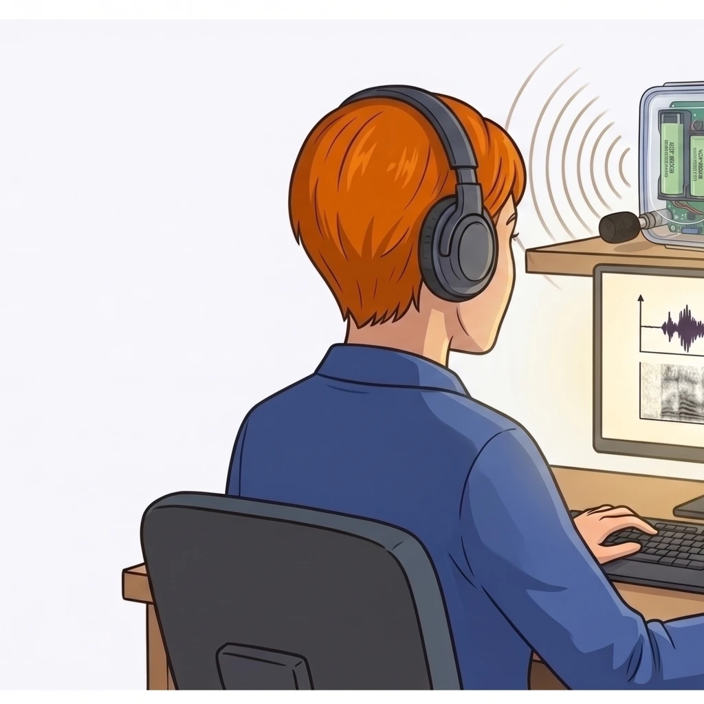

<!-- _class: lead -->
<!-- _paginate: false -->
<!-- _header: "" -->
<!-- _footer: "" -->

# 🦇 Présentation de la SAÉ 2.01

## **VigieChiro PR Companion**

**SAÉ commune R2.02 + R2.03 - Printemps 2026**

Avant d'attaquer le CM4, faisons connaissance avec le projet qui va vous mobiliser tout le mois de juin.

---

## 🦇 VigieChiro Point Fixe - le contexte

<a href="https://www.vigienature.fr/fr/chauves-souris">VigieChiro</a> est un programme de <b>sciences participatives</b> porté par le <b>Muséum National d'Histoire Naturelle</b> (MNHN). Des écologues/bénévoles posent des enregistreurs ultrasons sur le terrain pour suivre les populations de chauves-souris dans toute la France avec un protocole rigoureux.

🎤 Le Passive Recorder

Boîtier <b>open-hardware</b> basé sur la carte Teensy, posé seul sur un point d'écoute toute la nuit. Bande <b>8-120 kHz</b>, 384 kHz d'échantillonnage.

💾 Enregistrements

<b>Plusieurs milliers de fichiers sonores</b>, un journal technique, un journal climat. Jusqu'à <b>40 Go</b> par enregistreur.

🧪 Tadarida

Un classificateur du MNHN identifie de manière asynchrone les <b>espèces</b> (<em>Pipistrellus pipistrellus</em>, <em>Nyctalus leisleri</em>…) à partir des fichiers sons transformés.

Le possesseur du PR doit <b>vérifier la qualité</b>, <b>renommer</b>, <b>transformer</b>, <b>déposer</b> sur Vigie-Chiro, puis <b>valider</b> les classifications Tadarida.

---

## 😩 La chaîne actuelle : 4 outils, beaucoup de friction

Aujourd'hui, le possesseur du PR enchaîne <b>4 outils différents</b> par nuit traitée. Une demi-journée de manipulations répétitives par carte SD.

📁

Explorateur

Copier depuis la SD

✏️

LupasRename

Renommer les WAV

🎵

Kaléidoscope

Découper + ralentir ×10

🌐

Vigie-Chiro web

Déposer + valider

🎯 Votre mission : <b>fusionner tout cela dans une seule application JavaFX</b> qui tient sur un poste hors ligne.

---

## 📥 Le projet : *VigieChiro PR Companion*

Une application <b>JavaFX</b>, locale, qui enchaîne toute la chaîne nocturne dans un outil unique (depuis la carte SD jusqu'au dépôt sur Vigie-Chiro).

🎯

Cible MVP (MUST)

La <b>chaîne fil rouge</b> : déclarer un site, importer une nuit, vérifier l'enregistrement par échantillonnage, préparer un lot prêt à déposer.

🎁

Filet de sécurité (SHOULD)

<b>Valider les résultats Tadarida</b> : écouter chaque observation avec sonogramme + spectrogramme, valider ou corriger la classification automatique.

L'application doit <b>fonctionner hors-ligne</b>, être <b>portable</b> Windows / Linux / macOS, et respecter les normes d'<b>accessibilité</b> (contraste, taille, raccourcis clavier).

---

## 👨‍🔬 Le client réel : Samuel Busson (CEREMA)

Doctorant écologue, CEREMA Aix

Samuel travaille au <b><a href="https://www.cerema.fr/">CEREMA</a></b>. Sa thèse porte sur l'<b>effet de l'éclairage public LED</b> sur l'activité acoustique des chiroptères.

Sa précédente campagne a généré <b>plus de 560 000 contacts</b> chiroptères, pré-traités avec des scripts R/Bash maison <em>impossibles à transmettre</em>. Pour ses prochaines campagnes, il bascule sur le <b>PR Teensy</b> et a besoin d'un outil propre que la communauté pourra reprendre.

🎯 Samuel est votre client. Vous devez <b>comprendre son besoin</b> avant de commencer à travailler.

---

<!-- _class: lead -->
<!-- _header: "" -->
<!-- _footer: "" -->

# 🎤 La parole à Samuel

Samuel vient en personne nous présenter son <b>contexte de recherche</b>, le terrain qu'il observe, et ce qu'il attend de vous.

🎧 À vous de l'écouter, prendre des notes, et lui poser vos questions.

---

## 👥 Trois personas - trois profils utilisateur

Pour incarner les utilisateurs cibles, le brief définit <b>3 personas</b>. Ils diffèrent par leur volume de travail, leurs compétences techniques et leurs attentes. <b>Votre IHM doit servir les trois.</b>

Marie, 58 ans

Naturaliste retraitée bénévole, Lozère

Bénévole et amateur, elle fait 2-3 carrés/saison. Traite ses nuits le matin avec un café. <b>Veut un outil simple</b>, libellés en français, rien qui se perde.

Karim, 32 ans

Chargé d'études faune, bureau d'études, Lyon

5 chantiers en parallèle, dizaines de nuits/mois. <b>Veut aller vite</b> : import groupé, tags chantier, traçabilité pour les rapports.

Samuel

Doctorant écologue, CEREMA Aix

Volumes très lourds, exigences scientifiques. <b>Veut un outil partageable</b> et durable pour la communauté des chiroptérophiles.

Personas <a href="https://iutinfoaix-s201.github.io/brief/Analyse%20et%20conception/Personas/">fichés en détail dans le brief</a> : besoins, frustrations, attentes.

---

## 🚂 La chaîne fil rouge MUST (P1 → P4)

4 parcours utilisateurs enchaînés - c'est votre <b>scénario de démo</b> en soutenance.

🌐

P1

Déclarer un site

→

📥

P2

Importer une nuit

→

🎧

P3

Vérifier par échantillon

→

📦

P4

Préparer le lot

N° carré + codes des points d'écoute.

Copie protégée + rename + transformation ×10.

Sound check + verdict OK / Douteux / À jeter.

Vérif cohérence + ouverture dossier + marquage déposé.

👉 Si vous livrez cette chaîne <b>de bout-en-bout</b>, le MVP est atteint.

---

## 📊 Périmètre projet - priorisation MoSCoW

Le <b>cahier des charges fonctionnel</b> a été arbitré selon la méthode <a href="https://fr.wikipedia.org/wiki/M%C3%A9thode_MoSCoW">MoSCoW</a> : chaque fonctionnalité reçoit une priorité explicite. Vous avez <b>13 jours ouvrés</b> de dév exclusif. Le MUST est non-négociable.

✅

MUST

Chaîne fil rouge P1→P4 + base de données. Sans cela, <b>pas de prototype livrable</b>.

🟠

SHOULD

Navigation tabulaire, diagnostic matériel, validation Tadarida (filet de sécurité), annotations météo.

⚪

COULD

Re-rattachement rétroactif, regroupement de nuits, bibliothèque de sons, stats globales.

⛔

WON'T

API Vigie-Chiro, multi-utilisateur, cloud, classification automatique, web/mobile.

🎯 Une <b>démo convaincante bout-en-bout</b> + un <b>plan d'action explicite</b> sur ce qui reste pèsent autant qu'un MUST 100 % livré sans plus.

---

## ⚙️ Stack technique imposée + composant fourni

Vous démarrez sur une base <b>déjà câblée</b> : pas de scaffolding à faire vous-même, vous vous concentrez sur la chaîne métier et votre code.

<b>Java 25</b>

<b>JavaFX 25 + FXML</b>

<b>JDBC + SQLite</b>

<b>Maven Wrapper</b>

<b>JUnit 5 + AssertJ + TestFX</b>

<b>Spotless + GitHub Actions</b>

🎁

Le dépôt Classroom n'est <b>pas vide</b> : app JavaFX qui démarre, Maven prêt, CI verte, Spotless en pre-commit, README de démarrage.

🔊

Composant audio fourni

Un composant JavaFX qui prend un WAV en entrée et affiche le <b>sonogramme</b> et le <b>spectrogramme</b> avec curseur de lecture synchronisé et zoom temps/fréquence.

Vous l'<b>intégrez</b> dans votre IHM, vous ne le réimplémentez pas (malheureusement pour les plus matheux, vous n'aurez pas de FFT à coder).

---

## 📦 Données fournies : nuit d'enregistrement du 22-23 avril 2026

PR n° <b>1925492</b>, point fixe en zone Z1 du carré 640380. Deux variantes pour deux usages.

📦

Sample versionné dans le dépôt

~518 Mo

191 WAV redécoupés et le CSV Tadarida (473 observations couvrant les principales espèces de chauves-souris). Disponibles immédiatement dans votre repo. Suffit pour la CI et les tests.

📥

Full dataset à télécharger

~4,2 Go zip / ~11 Go décompressé

1572 WAV bruts, 2109 WAV redécoupés et le CSV Tadarida (4031 observations). Indispensable pour valider les <b>objectifs de volumétrie</b>.

⚠️

Lien <b>Filesender RENATER expire le 15/06/2026</b>. Téléchargez le dataset <b>dès le début</b> de la SAE.

---

## 📅 Calendrier 2026

3 phases du 22 mai au 18 juin 2026, dont seulement <b>13 jours ouvrés</b> de travail exclusif sur la SAE.

🟡 Phase 1 - Amorçage

22/05 → 31/05

<b>22/05</b> : présentation du brief (aujourd'hui) • <b>22/05 → 31/05</b> : lecture du brief, formation des équipes par les enseignants des SAÉ 2.01 et 2.03, réception des composants du PR

🔴 Phase 2 - Travail exclusif (13 jours)

01/06 → 17/06

<b>01/06 → 09/06</b> : Sprint 1 - chaîne fil rouge MUST • <b>10/06 → 17/06</b> : Sprint 2 - finition + SHOULD opportunistes • <b>en parallèle</b> : assemblage du PR (par les équipes si possible)

🟢 Phase 3 - Livraison + soutenance

18/06/2026

<b>Avant 8h</b> : code freeze + diaporama déposé • <b>8h - 10h</b> : test individuel R2.02 / R2.03 • <b>10h - 12h et 13h - 18h</b> : soutenances + démos

👉 <b>13 jours c'est court.</b> La chaîne fil rouge est une cible <b>idéale exigeante</b>, pas une obligation absolue.

---

## 🎓 Évaluation - R2.02 + R2.03 conjoints

Deux temps d'évaluation, qui comptent <b>à la fois pour R2.02</b> (IHM, JavaFX, MVVM) <b>et pour R2.03</b> (qualité, tests, hygiène Git).

📦

Phase 1 - Code livré

Dépôt Git évalué <b>simultanément</b> pour R2.02 (IHM JavaFX, FXML, MVVM) et R2.03 (qualité, tests, hygiène Git, PR/review).

Code métier, JDBC, IHM JavaFX, tests TestFX et README clair. L'intégration continue doit être verte.

🎤

Phase 2 - Soutenance

<b>10 min</b> d'oral par équipe + diaporama + démo en direct sur le jeu de données fourni.

<b>Chacun prend la parole</b> et sera interrogé individuellement sur les apprentissages critiques.

🤖

<b>Assistant IA</b> (Copilot / Claude Code / ChatGPT Codex) <b>autorisé sous 2 conditions</b> :

① <b>Maîtriser votre code</b> - interrogation individuelle en soutenance.

② <b>Citer explicitement et exhaustivement</b> les apports de l'IA dans le README.

---

## 🚀 Vos prochaines étapes

4 actions concrètes à mener pendant la phase d'amorçage avant le démarrage exclusif du <b>01/06</b>.

📖

1. Lire le brief en entier

Présentation, contraintes techniques, expression du besoin, et surtout le <b>dossier d'analyse</b> (personas, parcours, story mapping, périmètre MVP, maquettes).

👥

2. Découvrir votre équipe

Annoncée par les enseignants. Chacun contribue <b>techniquement</b> : pas de répartition « code / rédac / présentation ». Rappelez-vous qu'il est <b>difficile de faire mentir GitHub</b>.

✅

3. Accepter le lien Classroom

Un dépôt sera créé dans <code>IUTInfoAix-S201-2026</code>. C'est dans ce dépôt <b>et nulle part ailleurs</b> que vous travaillerez en équipe en appliquant le GitHub Flow.

📥

4. Télécharger le full dataset

Lien Filesender <b>expire le 15/06/2026</b>. Récupérez l'archive ~4,2 Go <b>dès le sprint 0</b>.

📘 Brief complet en ligne : <a href="https://iutinfoaix-s201.github.io/brief/" style="color: #f1c40f;"><b>iutinfoaix-s201.github.io/brief</b></a>

